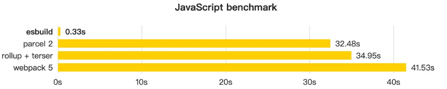
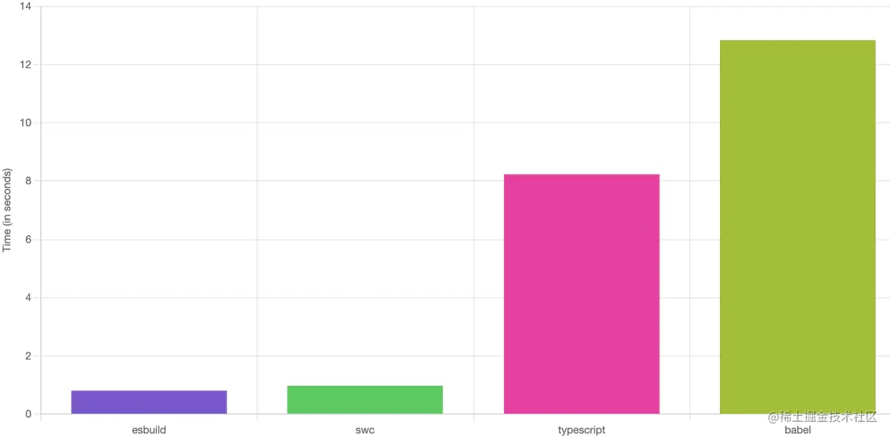

# Vite小记

## 初始Vite

为什么选择Vite——快速构建，高效的热更新等令人着迷

Vite是目前`最受瞩目的前端构建工具`

Vite相比Webpack的优点：

- 无需递归打包`整个`项目，交给浏览器处理（浏览器的原生ESM）。并且可以将其他格式的产物统一转换为ESM
- 内置对TS,JSX,Sass等高级语法的支持

### ESM模块

前端诞生了CommonJs，AMD，UMD和ES Module等模块规范

CommonJs是最早正式提出的JS模块规范，主要运用于服务端

- 其使用require进行导入模块，module.exports导出模块
- 同时Node.Js为其实现了自动加载模块的loader


ES Module是由`ECMAScript官方`提出的模块化规范，且得到现代浏览器的内置支持。

- 在HTML中加入含有`type="module"`属性的script标签，浏览器就能按照ESM规范来进行依赖加载和模块解析。（这也是Vite在开发阶段实现`无打包`的快速冷启动）
- 无打包（`no-bundle`）:利用浏览器原生 ES 模块的支持，实现开发阶段的 Dev Server，进行模块的按需加载，而不是先整体打包再进行加载。（这也是相比Webpack先打包再加载的构建更加快速的原因）


## Vite与现代CSS方案

使用sass，less，postcss，或者tailwind，Windi Css

比如使用sass

在vite.config.ts中进行配置

```ts
// vite.config.ts
import { normalizePath } from 'vite';// 如果类型报错，需要安装 @types/node: pnpm i @types/node -D
import path from 'path';
// 全局 scss 文件的路径
// 用 normalizePath 解决 window 下的路径问题
const variablePath = normalizePath(path.resolve('./src/variable.scss'));
export default defineConfig({
 // css 相关的配置 css: {
 preprocessorOptions: { scss: {
 // additionalData 的内容会在每个 scss 文件的开头自动注入 
     additionalData: `@import "${variablePath}";` 
 } 
    } 
}})
```


这样就能在每个scss文件开头自动注入

Tailwind

```code
pnpm install -D tailwindcss postcss autoprefixer
```

tailwind.config.js

```ts
export default {
 content: [
 "./index.html",
 "./src/**/*.{vue,js,ts,jsx,tsx}",
 ],
 theme: {
 extend: {},
 },
 plugins: [],
}
```

postcss.config.js

```js
export default{
    plugins: {
 		tailwindcss: {}, autoprefixer: {}, 
    },
}
```


然后在入口css，比如App.css中引入必要的模版

```css
@tailwind base;
@tailwind components;
@tailwind utilities;
```


## Vite处理静态资源

当遇见使用静态资源需要一长串路径时，可以实例alias配置给路径配置别名

vite.config.ts

```ts
import path from 'path';
{
 resolve: {
 // 别名配置 
     alias: {
 '@assets': path.join(__dirname, 'src/assets')
 }
 }
}
```

__dirname是当前文件所在的绝对路径。

这里的作用相当于是，当你使用`@assets`时，会自动替换为xxx/src/assets以方便寻找资源

如果是Svg组件，可以使用相对应的插件

- Vue3 项目中可以引入 vite-svg-loader。
- React 项目使用 vite-plugin-svgr插件。

import svgr from ‘vite-plugin-svgr’

然后放在vite.config.ts中的plugins中，plugins:[svgr()]

为了防止类型错误，在tsconfig.json中 compilerOptions.types = ["vite-plugin-svgr/client"]


## *预构建

Vite虽然是提倡`no-bundle`的构建工具，但是也并非完全不打包，`no-bundle`是针对源代码的，而对于第三方依赖vite仍然会打包，且采用Esbuild来完成

因为Vite是基于浏览器原生的ES模块规范实现的，因此，其代码必须符合ESM规范才可正常运行，类似于CommonJs格式的代码不能直接在Vite中直接运行

- 请求瀑布流问题——在使用第三方依赖时，会依赖其他工具函数，导致产生很多HTTP请求。

    对于Chrome来说，同一个域名下只能同时支持6个HTTP并发请求限制，因此会导致页面加载十分缓慢

因此Vite要进行依赖预构建，将第三方包依赖的其他工具函数打包为一个文件，以便减少请求数量


至此，预构建需要干两件事情——将其他代码格式的产物转化为ESM格式 && 打包第三方库的代码


预构建有两种开启方式

自动开启和手动开启

自动开启

- 在项目启动后，会在`node_modules/.vite`目录，且在第三方包的引用路径就被重写了，且Vite的Dev Server会设置强缓存
- 响应标头为：Cache-Control:max-age=31536000,immutable及一年


手动开启

- 在不需要使用本地缓存时，可以清除缓存，即删除`node_modules/.dist`
- 然后手动开启将`server.force`设置为true，执行npx vite --force


### 自定义配置

- 入口文件

通过设置`optimizeDeps.entries`，值为一个数组比如`["./src/main.vue"]`这里相当于main.vue为入口文件

- 添加依赖项

    通过设置`optimizeDeps.include`，值为一个数组比如`["loadsh.es"]`，这样配置就可以将loadsh-es包预构建

    include使用场景

    - 动态import，比如

        ```ts
        const importModule = m => import(`./loadsh/${m}.ts`)
        importModule('tt')
        ```

        这样就是二次预构建，但是二次预构建，不仅需要把预构建的流程重新运行一遍，还得重新刷新页面，并且需要重新请求所有的模块。性能消耗大，因此尽量避免二次预构建

    - 手动exclude，比如@loadable/component的某个依赖hoist-non-react-statics 的产物并没有提供 ESM 格式，那么`optimizeDeps.exclude`值为[“@loadable/component”]会报错，这时候就需要 `optimizeDeps.include`的值为`["@loadable/component > hoist-non-react-statics"]`


## Vite引擎

开始Vite1.x是采用的Rollup进行构建，在Vite2.x开始之后采用Esbuild进行构建，使开发时项目启动时间大大减少。

Vite后来采用了两者，Rollup和Esbuild。

- Rollup在生产环境使用
- Esbuild在开发环境使用

Vite采用了Esbuild让其在众多打包构建工具中脱颖而出

### Esbuild

其作用

- 依赖预构建，作为bundle工具
    - 
    - 其性能之恐怖，可以说是强了**百倍**
    - 但是也有一些缺点：不支持降级到ES5的代码、不支持const enum等语法、不提供打包产物的接口、不支持自定义拆包
- 单文件编译
    - 将Esbuild作为Transformer使用，Esbuild转译TS和JSX的能力通过Vite提供，这个Vite插件在开发和生产环境都能使用
    - 使用Esbuild做单文件编译的性能：
    - 
    - 虽然Esbuild能带来巨大 的性能提升，但是缺少TS类型检查的能力
- 代码压缩
    - Vite将Esbuild作为生产环境下默认的压缩工具。传统方式使用Terser进行压缩，但是涉及了大量的AST，在各种工具之间无法共享同一个AST，因此造成重复解析过程
    - 而Esbuild使用共享AST以及Golang这种原生语言编写的Minifier（JS是解释性的加上JIT的语言，压缩的工作比不上c等原生语言）


### Rollup

生产环境无法实现完全`no-bundle`，因此采用了成熟的Rollup打包。

其优点：

- CSS代码分割，将异步模块使用的CSS代码提取出来为一个单独的文件
- 自动预加载，Vite 会自动为入口 chunk 的依赖自动生成预加载标签 <linkrel="moduelpreload">
- 兼容插件，不少Rollup插件可以直接复用到Vite


## *Esbuild

Esbuild性能极高，其原因可以概括为这四点

- Golang原生语言开发，无需逻辑代码转化为字节码再转化为机器码
- 多核并行，内部打包算法充分利用多核 CPU 优势
- 从0构建，以保证极致的代码性能
- 高效内存利用，Esbuild 中从头到尾尽可能地复用一份 AST 节点数据


### Esbuild的使用

1.

```
pnpm i esbuild
```

再package.json中的script添加："build": "./node_modules/.bin/esbuild src/index.jsx --bundle --outfile=dist/out.js"

然后执行pnpm run build就可以完成打包


2.代码调用：

```js
const { build, buildSync, serve } = require("esbuild");
async function runBuild() {
 // 异步方法，返回一个 Promise 
    const result = await build({
 // ---- 如下是一些常见的配置 --- 
 // 当前项目根目录
 absWorkingDir: process.cwd(),
 // 入口文件列表，为一个数组
 entryPoints: ["./src/index.jsx"],
 // 打包产物目录 
 outdir: "dist",
 // 是否需要打包，一般设为 true
 bundle: true,
 // 模块格式，包括`esm`、`commonjs`和`iife` 
 format: "esm",
 // 需要排除打包的依赖列表 
        external: [],
 // 是否开启自动拆包 
        splitting: true,
 // 是否生成 SourceMap 文件 
        sourcemap: true,
 // 是否生成打包的元信息文件 
        metafile: true,
 // 是否进行代码压缩 
        minify: false,
 // 是否开启 watch 模式，在 watch 模式下代码变动则会触发重新打包 
        watch: false,
 // 是否将产物写入磁盘 
        write: true,
 // Esbuild 内置了一系列的 loader，包括 base64、binary、css、dataurl、file、js(x)、ts(x)、tex
 // 针对一些特殊的文件，调用不同的 loader 进行加载 
        loader: {
 '.png': 'base64',
 }
 });
 console.log(result);
}
runBuild();
```

然后执行这个js就可以得到打包的元信息

还有buildSync方法


buildSync和build用法几乎一致，但是有缺陷。

一、会阻塞当前线程，丧失并发处理

二、所有插件中都不能使用任何异步操作，给插件开发增加了限制

此外还有一个api——serve，开启serve模式之后，会在指定端口和目录上搭建一个`静态文件服务`，类似于webpack-dev-server，得到的产物直接放在内存中，通过每次请求服务来访问，每次请求到来时，都会重新构建(rebuild)，永远返回新的产物


### 单文件转译

有两个方法`transform`和`transformSync`分别是同步和异步

```js
const { transform, transformSync } = require("esbuild");
async function runTransform() {
    // 第一个参数是代码字符串，第二个参数为编译配置 
    const content = await transform(
        "const isNull = (str: string): boolean => str.length > 0;",
        {
            sourcemap: true, loader: "tsx",
        });
    console.log(content);
}
runTransform();
```

同样也不推荐transformSync的写法


### Esbuild插件开发

Esbuild插件是一个对象存在name和setup方法

```js
let envPlugin = {
    name: 'env',
    setup(build) {
        build.onResolve({ filter: /^env$/ }, args => ({
            path: args.path, namespace: 'env-ns',
        }))
        build.onLoad({ filter: /.*/, namespace: 'env-ns' }, () => ({
            contents: JSON.stringify(process.env), loader: 'json',
        }))
    },
}
require('esbuild').build({
    entryPoints: ['src/index.jsx'],
    bundle: true,
    outfile: 'out.js',
    // 应用插件
    plugins: [envPlugin],
}).catch(() => process.exit(1))
```


### 钩子函数的使用

onResolve和onLoad钩子

两者都需要传入两个参数：options和callback

options包含filter和namespace两个属性，filter为必传参数，namespace为选填参数，一般在onResolve钩子中返回namespace属性作为标识，

然后再onLoad中通过namespace 将模块过滤出来

onResolve

```ts
build.onResolve({ filter: /^env$/ }, (args: onResolveArgs): onResolveResult => {
  // 模块路径
  console.log(args.path);
  // 父模块路径
  console.log(args.importer);
  // namespace 标识
  console.log(args.namespace);
  // 基准路径
  console.log(args.resolveDir);
  // 导入方式，如 import、require console.log(args.kind)
  // 额外绑定的插件数据
  console.log(args.pluginData);

  return {
    // 错误信息 errors: [],
    // 是否需要 external external: false;
    // namespace 标识
    namespace: "env-ns",
    // 模块路径
    path: args.path,
    // 额外绑定的插件数据
    pluginData: null,
    // 插件名称
    pluginName: "xxx",
    // 设置为 false，如果模块没有被用到，模块代码将会在产物中会删除。否则不会这么做
    sideEffects: false,
    // 添加一些路径后缀，如`?xxx`
    suffix: "?xxx",
    // 警告信息
    warnings: [],
    // 仅仅在 Esbuild 开启 watch 模式下生效
    // 告诉 Esbuild 需要额外监听哪些文件/目录的变化
    watchDirs: [],
    watchFiles: [],
  };
});

```

onLoad

```ts
build.onLoad(
  { filter: /.*/, namespace: "env-ns" },
  (args: OnLoadArgs): OnLoadResult => {
    // 模块路径
    console.log(args.path);
    // namespace 标识
    console.log(args.namespace);
    // 后缀信息
    console.log(args.suffix);
    // 额外的插件数据
    console.log(args.pluginData);

    return {
      // 模块具体内容
      contents: "省略内容",
      // 错误信息 errors: [],
      // 指定 loader，如`js`、`ts`、`jsx`、`tsx`、`json`等等 loader: 'json',
      // 额外的插件数据 pluginData: null, // 插件名称
      pluginName: "xxx",
      // 基准路径
      resolveDir: "./dir",
      // 警告信息
      warnings: [],
      // 同上
      watchDirs: [],
      watchFiles: [],
    };
  }
);

```

还有onStart和onLoad钩子，分别在构建开始和结束时执行一些自定义的逻辑

onStart的执行时机是在`每次build`的时候，包括触发watch或者serve下的重新构建


Esbuild原生不支持通过HTTP从CDN服务上拉去对应的第三方依赖资源

但是可以通过Esbuild插件进行识别这样的url路径

```js
module.exports = () => ({
    name: "esbuild:http",
    setup(build) {
        let https = require("https"); let http = require("http");
        // 1. 拦截 CDN 请求
        // tip: 间接依赖同样会被自动带上 `http-url`的 namespace这里相当于是递归调用，以免调用的依赖依赖了其他依赖（间接依赖无法打包的情况）
        build.onResolve({ filter: /.*/, namespace: "http-url" }, (args) => ({
            // 重写路径
            path: new URL(args.path, args.importer).toString(), namespace: "http-url",
        }));
        // 2. 通过 fetch 请求加载 CDN 资源
        build.onLoad({ filter: /.*/, namespace: "http-url" }, async (args) => {
            let contents = await new Promise((resolve, reject) => {
                function fetch(url) {
                    console.log(`Downloading: ${url}`);
                    let lib = url.startsWith("https") ? https : http; let req = lib
                        .get(url, (res) => {
                            if ([301, 302, 307].includes(res.statusCode)) {
                                // 重定向
                                fetch(new URL(res.headers.location, url).toString()); req.abort();
                            } else if (res.statusCode === 200) {
                                // 响应成功
                                let chunks = [];
                                res.on("data", (chunk) => chunks.push(chunk)); res.on("end", () => resolve(Buffer.concat(chunks)));
                            } else {
                                reject(new Error(`GET ${url} failed: status ${res.statusCode}`));
                            }
                        })
                        .on("error", reject);
                }
                fetch(args.path);
            });
            return { contents };
        });
    },
});
```

`html-plugin.js`

根据打包的js和css自动组装生成一个HTML

```js
const fs = require("fs/promises"); const path = require("path"); const { createScript, createLink, generateHTML } = require('./util');
module.exports = () => {
    return {
        name: "esbuild:html", setup(build) {
            build.onEnd(async (buildResult) => {
                if (buildResult.errors.length) {
                    return;
                }
                const { metafile } = buildResult;
                // 1. 拿到 metafile 后获取所有的 js 和 css 产物路径 
                const scripts = []; const links = [];
                if (metafile) {
                    const { outputs } = metafile; const assets = Object.keys(outputs);
                    assets.forEach((asset) => {
                        if (asset.endsWith(".js")) {
                            scripts.push(createScript(asset));
                        } else if (asset.endsWith(".css")) {
                            links.push(createLink(asset));
                        }
                    });
                }
                // 2. 拼接 HTML 内容
                const templateContent = generateHTML(scripts, links);
                // 3. HTML 写入磁盘
                const templatePath = path.join(process.cwd(), "index.html");
                await fs.writeFile(templatePath, templateContent);
            });
        },
    };
}

// util.js
// 一些工具函数的实现
const createScript = (src) => `<script type="module" src="${src}"></script>`;
const createLink = (src) => `<link rel="stylesheet" href="${src}"></link>`;
const generateHTML = (scripts, links) => `
<!DOCTYPE html>
<html lang="en">
<head>
 <meta charset="UTF-8" />
 <meta name="viewport" content="width=device-width, initial-scale=1.0" />
 <title>Esbuild App</title>
 ${links.join("\n")}
</head>
<body>
 <div id="root"></div> ${scripts.join("\n")}</body>
</html>
`
    ;
module.exports = { createLink, createScript, generateHTML };
```


## Rollup

### 打包概念

Rollup具有天然的Tree Shaking，将未使用的模块自动擦除。


多产物配置

将rollup.config.js中的 配置文件的`output`修改为一个对象数组

```js
const buildOptions = {
    input: ["src/index.js"],
    // 将 output 改造成一个数组
    output: [{
        dir: "dist/es", format: "esm",
    }, { dir: "dist/cjs", format: "cjs", },
    ],
};
export default buildOptions;
```

比如这样子，对于不同格式的文件就能打包为不同格式的产物


多入口配置

将rollup.config.js中的配置文件的input修改为一个对象或者数组

```js
{
 input: ["src/index.js", "src/util.js"]
}
// 或者{
 input: {
 index: "src/index.js", util: "src/util.js", },
}
```

此外还可以对output自定义进行配置

比如

```js
output: {
        // 产物输出目录
        dir: path.resolve(__dirname, 'dist'),
        // 以下三个配置项都可以使用这些占位符:
        // 1. [name]: 去除文件后缀后的文件名
        // 2. [hash]: 根据文件名和文件内容生成的 hash 值
        // 3. [format]: 产物模块格式，如 es、cjs
        // 4. [extname]: 产物后缀名(带`.`)
        // 入口模块的输出文件名
        entryFileNames: `[name].js`,
        // 非入口模块(如动态 import)的输出文件名 
        chunkFileNames: 'chunk-[hash].js',
        // 静态资源文件输出文件名
        assetFileNames: 'assets/[name]-[hash][extname]',
        // 产物输出格式，包括`amd`、`cjs`、`es`、`iife`、`umd`、`system` 
        format: 'cjs',
        // 是否生成 sourcemap 文件 
        sourcemap: true,
        // 如果是打包出 iife/umd 格式，需要对外暴露出一个全局变量，通过 name 配置变量名 
        name: 'MyBundle',
        // 全局变量声明 
        globals: {
            // 项目中可以直接用`$`代替`jquery` 
            jquery: '$'
        }
    }
```


同时设置external，还可以实现不打包某些第三方包

```js
{
 external: ['react', 'react-dom']
}
```

rollup整体构建阶段

会经过input、build、output

主要是build和output阶段

build阶段主要负责创建模块依赖图，初始化各种模块的AST以及模块之间的依赖关系

真正的打包是在output阶段


### 常见Hooks

**路径解析: resolveId**

rollup.config.js

```js
import alias from '@rollup/plugin-alias';
module.exports = {
    input: 'src/index.js', output: { dir: 'output', format: 'cjs' }, plugins: [alias({
        entries: [
            // 将把 import xxx from 'module a'
            // 将把 import xxx from module-a
            // 转换为 import xxx from './module-a'
            { find: 'module-a', replacement: './module-a.js' },
        ]
    })
    ]
};
```

实际上alias的函数为

```ts
export default alias(options) {
    // 获取 entries 配置
    const entries = getEntries(options);
    return {
        // 传入三个参数，当前模块路径、引用当前模块的模块路径、其余参数 
        resolveId(importee, importer, resolveOptions) {
            // 先检查能不能匹配别名规则
            const matchedEntry = entries.find((entry) => matches(entry.find, importee));
            // 如果不能匹配替换规则，或者当前模块是入口模块，则不会继续后面的别名替换流程 
            if (!matchedEntry || !importerId) {
                // return null 后，当前的模块路径会交给下一个插件处理 
                return null;
            }
            // 正式替换路径
            const updatedId = normalizeId(importee.replace(matchedEntry.find, matchedEntry.replacement));
            // 每个插件执行时都会绑定一个上下文对象作为 this
            // 这里的 this.resolve 会执行所有插件(除当前插件外)的 resolveId 钩子 
            return this.resolve(updatedId,
                importer,
                Object.assign({ skipSelf: true }, resolveOptions)
            ).then((resolved) => {
                // 替换后的路径即 updateId 会经过别的插件进行处理
                let finalResult: PartialResolvedId | null = resolved;
                if (!finalResult) {
                    // 如果其它插件没有处理这个路径，则直接返回 
                    finalResult = { id: updatedId };
                }
                return finalResult;
            });
        }
    }
}
```

它的入参分别是 当前模块路径 、 引用当前模块的模块路径 、 解析参数 ，返回值可以是 null、string 或者一个对象


**load** 为 Async + First 类型，即异步优先的钩子，和 resolveId 类似。它的作用是通过resolveId 解析后的路径来加载模块内容。

```js
const mimeTypes = {
    '.jpg': 'image/jpeg',
    // 后面图片类型省略
};
export default function image(opts = {}) {
    const options = Object.assign({}, defaults, opts); 
    return {
        name: 'image', 
        load(id) {
            const mime = mimeTypes[extname(id)]; if (!mime) {
                // 如果不是图片类型，返回 null，交给下一个插件处理 
                return null;
            }
            // 加载图片具体内容
            const isSvg = mime === mimeTypes['.svg'];
            const format = isSvg ? 'utf-8' : 'base64';
            const source = readFileSync(id, format).replace(/[\r\n]+/gm, '');
            const dataUri = getDataUri({ format, isSvg, mime, source });
            const code = options.dom ? domTemplate({ dataUri }) : constTemplate({ dataUri });
            return code.trim();
        }
    };
}
```


load 钩子的入参是模块 id，返回值一般是 null、string 或者一个对象

如果返回值为 null，则交给下一个插件处理；
如果返回值为 string 或者对象，则终止后续插件的处理，如果是对象可以包含SourceMap、AST 等

**代码转换: transform**
transform 钩子也是非常常见的一个钩子函数，为 Async + Sequential 类型，也就是 异步串行 钩子，作用是对加载后的模块内容进行自定义的转换

其使用

```js
import replace from '@rollup/plugin-replace';
module.exports = {
    input: 'src/index.js', output: {
        dir: 'output', format: 'cjs'
    },
    plugins: [
        // 将会把代码中所有的 __TEST__ 替换为 1 
        replace({
            __TEST__: 1
        })
    ]
};
```

其实现：

```js
import MagicString from 'magic-string';
export default function replace(options = {}) {
    return {
        name: 'replace', transform(code, id) {
            // 省略一些边界情况的处理
            // 执行代码替换的逻辑，并生成最后的代码和 SourceMap 
            return executeReplacement(code, id);
        }
    }
}
function executeReplacement(code, id) {
    const magicString = new MagicString(code);
    // 通过 magicString.overwrite 方法实现字符串替换
    if (!codeHasReplacements(code, id, magicString)) {
        return null;
    }
    const result = { code: magicString.toString() };
    if (isSourceMapEnabled()) { result.map = magicString.generateMap({ hires: true }); }
    // 返回一个带有 code 和 map 属性的对象
    return result;
}
```

**Chunk 级代码修改: renderChunk**

```js
export default function replace(options = {}) {
    return {
        name: 'replace', transform(code, id) { // transform 代码省略
        },
        renderChunk(code, chunk) {
            const id = chunk.fileName;
            // 省略一些边界情况的处理
            // 拿到 chunk 的代码及文件名，执行替换逻辑 
            return executeReplacement(code, id);
        },
    }
}
```

返回值跟 transform 钩子类似，既可以返回包含 code 和map 属性的对象，也可以通过返回 null 来跳过当前钩子的处理。

**产物生成最后一步: generateBundle**

generateBundle 也是 异步串行 的钩子，你可以在这个钩子里面自定义删除一些无用的chunk 或者静态资源，或者自己添加一些文件。

```js
export default function html(opts: RollupHtmlOptions = {}): Plugin {
    // 初始化配置
    return {
        name: 'html',
        async generateBundle(output: NormalizedOutputOptions, bundle: OutputBundle) {
            // 省略一些边界情况的处理
            // 1. 获取打包后的文件
            const files = getFiles(bundle);
            // 2. 组装 HTML，插入相应 meta、link 和 script 标签
            const source = await template({ attributes, bundle, files, meta, publicPath, title });
            // 3. 通过上下文对象的 emitFile 方法，输出 html 文件 
            const htmlFile: EmittedAsset = {
                type: 'asset', source,
                name: 'Rollup HTML Asset', fileName
            };
            this.emitFile(htmlFile);
        }
    }
}
```


## 开发Vite插件

前文介绍到Vite在开发阶段使用的Rollup来进行构建，且其会调用一系列与Rollup兼容的钩子

这些钩子主要有三个阶段

- 服务器启动阶段：options和buildStart钩子会在服务启动时被调用
- 请求响应阶段：当浏览器发起请求时，vite内部一次调用`resolveId`、`load`和`transform`钩子
- 服务器关闭阶段：vite会一次执行buildEnd和closeBundle钩子


vite独有的钩子

- config钩子，可以对配置文件导出的对象进行自定义的操作
- configResolved钩子，记录最终配置
- configureServer获取Dev Server示例
- transformIndexHtml，可以拿到原始的HTMl内容然后进行任意的转化
- **热更新处理**：handleHotUpdate

vite插件的执行顺序：

- 服务启动阶段: config 、 configResolved 、 options 、 configureServer 、buildStart
- 请求响应阶段: 如果是 html 文件，仅执行 transformIndexHtml 钩子；对于非 HTML文件，则依次执行 resolveId 、 load 和 transform 钩子。相信大家学过 Rollup 的插件机制，已经对这三个钩子比较熟悉了
- 热更新阶段: 执行 handleHotUpdate 钩子。
- 服务关闭阶段: 依次执行 buildEnd 和 closeBundle 钩子。


通过apply属性决定应用场景

```js
{
 // 'serve' 表示仅用于开发环境，'build'表示仅用于生产环境 
    apply: 'serve'
}
```

```js
apply(config, { command }) {
 // 只用于非 SSR 情况下的生产环境构建
 return command === 'build' && !config.build.ssr
}
```

vite插件执行顺序：1.Alias路径相关的插件 2.带有`enforce:'pre'`的用户插件 3.vite核心插件  4.没有enforce的普通插件 5.Vite生产构建使用的插件 6.带有`enforce:'post'`的用户插件   7.Vite后置构建插件


## *热更新


代码变更后，是通过自动刷新页面实现看到实时的页面效果的——也就是Live reload的方法

但是随着开发场景越加繁琐，live reload通过页面刷新的方式实现热更新，就略显鸡肋。

因为随着页面的刷新，组件会进行销毁然后重新创建，这是一个十分消耗性能的行为。

也就是没有实现`局部更新`+`状态保存`

Vite，Webpack这些打包工具都实现了自己的HMR。

### HMR

HMR全称为：Hot Module Replacement，其作用就是直接把页面中发生变化的模块替换为新的模块

Vite的HMR是基于ESM HMR规范实现的，由同时期的Snowpack、WMR和Vite一同制定

其API的定义为

```tsx
interface ImportMeta {
    readonly hot?: {
        readonly data: any
        accept(): void
        accept(cb: (mod: any) => void): void
        accept(dep: string, cb: (mod: any) => void): void
        accept(deps: string[], cb: (mods: any[]) => void): void
        prune(cb: () => void): void
        dispose(cb: (data: any) => void): void
        decline(): void
        invalidate(): void
        on(event: string, cb: (...args: any[]) => void): void
    }
   }
```

模块更新时的逻辑hot.accept，其作用接收模块更新

接受自身模块的更新
接受某个子模块的更新
接受多个子模块的更新

比如存在模块

state.ts

```ts
export function initState() { 
    let count = 0; 
    setInterval(() => { 
        let countEle = document.getElementById('count'); 
        countEle!.innerText = ++count + ''; 
    }, 1000);
}
```

render.ts

```ts
export const render = () => { 
    const app = document.querySelector<HTMLDivElement>('#app')! 
          app.innerHTML = `
<h1>Hello Vite!</h1>
 <p target="_blank">This is hmr test.123 这是增加的文本</p> `
}
```


- 当接受自身模块的更新时，当前模块会被认为 HMR 的边界，除了当前模块，其他的模块均未受到任何影响。

- 接收依赖模块的更新，比如main 模块依赖 render 模块，也就是说， main 模块是 render父模块，那么我们也可以在 main 模块中接受 render 模块的更新，此时 HMR 边界就是 main 模块了。

- 接收多个子模块的更新，父模块可以接受多个子模块的更新，当其中任何一个子模块更新之后，父模块会成为 HMR 边界

    比如，main为父模块，state和render为子模块。然后改动state

    ```js
    //main.ts
    import { render } from './render';
    import { initState } from './state';
    render();
    initState();
    if (import.meta.hot) {
     import.meta.hot.accept(['./render.ts', './state.ts'], (modules) => {
     console.log(modules);
     })
    }
    ```

    然后拿到的modules为一个数组，因为render没有变化，且在main中第一个声明，因此modules[0]为`undefined`。

    而state发生了变化，因此modules[1]为一个Module对象

模块销毁时逻辑: hot.dispose，

比如有个模块与定时器相关（比如state），然后重复调用其初始化方法，之前的定时器并没有关闭，导致数据错乱

```ts
if (import.meta.hot) {
    import.meta.hot.accept(['./render.ts', './state.ts'], (modules) => {
        // 自定义更新
        const [renderModule, stateModule] = modules; if (renderModule) {
            renderModule.render();
        }
        if (stateModule) { stateModule.initState(); }
    })
}
//main.ts
```

比如解构后发现stateModule改变了重新调用初始化模块

因此我们需要调用模块销毁时的方法

```ts
//state.ts中新添
let timer: number | undefined;
if (import.meta.hot) { 
    import.meta.hot.dispose(() => {
        if (timer) { clearInterval(timer); 
     }
 })
}
```

但是这样会存在一些问题，当进行热更新时，相对应的变量并没有保存下来

因此可以使用共享属性：hot.data

重构一下state.ts

```ts
let timer: number | undefined;
if (import.meta.hot) {
    // 初始化 count，新增的
    if (!import.meta.hot.data.count) {
        import.meta.hot.data.count = 0;
    } import.meta.hot.dispose(() => {
        if (timer) {
            clearInterval(timer);
        }
    })
}
export function initState() {
    const getAndIncCount = () => {
        const data = import.meta.hot?.data || {
            count: 0
        };
    	//使用hot.data进行保存数据
        data.count = data.count + 1;
        return data.count;
    }; timer = setInterval(() => {
        let countEle = document.getElementById('count');
        countEle!.innerText = getAndIncCount() + '';
    }, 1000);
}
```


还支持其他事件，比如自定义事件：import.meta.hot.on

自动触发事件：

vite:beforeUpdate 当模块更新时触发；
vite:beforeFullReload 当即将重新刷新页面时触发；
vite:beforePrune 当不再需要的模块即将被剔除时触发；

vite:error 当发生错误时（例如，语法错误）触发。


## 拆包

Vite默认分包策略与底层所使用的Rollup拆包API——manualChunks

Rollup的自定义拆包经常遇见——循环引用的问题


对于传统单Chunk模式下，无法实现按需加载而且线上缓存复用率低的情况

JS代码可以分为两个部分InitialChunk和 Async Chunk，第一个是当前页面首屏所需要的Js代码，第二个是当前页面并不一定需要的JS代码

路由组件 ，与当前路由无关的组件并不用加载。而项目被打包成单 bundle 之后，无论是 Initial Chunk 还是 Async Chunk ，都会打包进同一个产物，也就是说，浏览器加载产物代码的时候，会将两者一起加载，导致许多冗余的加载过程，从而影响页面性能

线上的 缓存命中率 是一个重要的性能衡量标准，服务端一般在响应资源时加上一些 HTTP 响应头，最常见的响应头之一就是 `cache-control`也就是强缓存

当使用了cache-control，表示使用强缓存，在缓存过期之前访问相同资源的url，就直接利用本地的缓存

由于构建工具一般会根据文件内容生成hash值，一旦内容变化，hash值也发生变化，进而导致强缓存失效

但是进行code splitting后，代码的改动只会影响部分chunk，让浏览器复用本地强缓存


Vite实现了自动css代码分割

此外Vite基于rollup的manualChunks实现了应用拆包

```js
//vite.config.js
{
    build: {
        rollupOptions: {
            output: {
                // manualChunks 配置 
                manualChunks: {
                    // 将 React 相关库打包成单独的 chunk 中 
                    'react-vendor': ['react', 'react-dom'], // 将 Lodash 库的代码单独打包 
                    'lodash': ['lodash-es'],
                    // 将组件库的代码打包
                    'library': ['antd', '@arco-design/web-react'],
                },
            },
        }
    },
}
```

循环引用模块问题

比如a.js和b.js

```js
// a.js
import { funcB } from './b.js';
funcB();
export var funcA = () => { console.log('a');}
// b.js
import { funcA } from './a.js';
funcA();
export var funcB = () => { console.log('b')
}
```

可以自定义配置，还可以使用`vite-plugin-chunk-split`插件


## 语法降级和Polyfill

底层使用了多个工具

编译时工具。代表工具有 @babel/preset-env 和 @babel/plugin-transform-runtime 。

运行时基础库。代表库包括 core-js 和 regenerator-runtime 。

实际使用：

```
pnpm i @babel/cli @babel/core @babel/preset-env
```

@babel/cli : 为 babel 官方的脚手架工具，很适合我们练习用。

@babel/core : babel 核心编译库。
@babel/preset-env : babel 的预设工具集，基本为 babel 必装的库。

.babelrc.json

```json
const obj = {
    "presets": [
        [
            "@babel/preset-env",
            {
                // 指定兼容的浏览器版本 
                "targets": { "ie": "11" },
                // 基础库 core-js 的版本，一般指定为最新的大版本 
                "corejs": 3,
                // Polyfill 注入策略，后文详细介绍 
                "useBuiltIns": "usage",
                // 不将 ES 模块语法转换为其他模块语法 
                "modules": false
            }
        ]
    ]
}
```

我们可以通过 targets 参数指定要兼容的浏览器版本，

```js
{ 
 // ie 不低于 11 版本，全球超过 0.5% 使用，且还在维护更新的浏览器 
    "targets": "ie >= 11, > 0.5%, not dead"
}
```


也可以用 Browserslist 配置语法:


useBuiltIns ，它决定了添加 Polyfill 策略，默认是 false ，即不添加任何的 Polyfill。你可以手动将 useBuiltIns 配置为 entry 或者 usage ，接下来我们看看这两个配置究竟

在实际的使用当中，还是推荐大家尽量使用 useBuiltIns: "usage" ，进行按需的 Polyfill 注入。


更优的 Polyfill 注入方案: transform-runtime

>需要提前说明的是， transform-runtime 方案可以作为 @babel/preset-env 中
>useBuiltIns 配置的替代品，也就是说，一旦使用 transform-runtime 方案，你应该把 useBuiltIns 属性设为 false 。


## 预渲染

SSR服务端渲染，可以解决首屏加载速度比较慢的问题，以及对SEO友好

在SSR场景下，服务端生成完整好HTML内容

SSR的生命周期：构建时和运行时

- 构建时
    - 解决模块加载问题
    - 移除样式代码的引入。直接引入一行 css 在服务端其实是无法执行的，因为 Node.js并不能解析 CSS 的内容。
    - 依赖外部化(external)。对于某些第三方依赖我们并不需要使用构建后的版本，而是直接从 node_modules 中读取，比如 react-dom ，这样在 SSR 构建 的过程中将不会构建这些依赖，从而极大程度上加速 SSR 的构建。
- 运行时
    - 加载 SSR 入口模块。在这个阶段，我们需要确定 SSR 构建产物的入口，即组件的入口在哪里，并加载对应的模块。
    - 进行数据预取。这时候 Node 侧会通过查询数据库或者网络请求来获取应用所需的数据。
    - 渲染组件。这个阶段为 SSR 的核心，主要将第 1 步中加载的组件渲染成HTML 字符串或者 Stream 流。
    - HTML 拼接。在组件渲染完成之后，我们需要拼接完整的 HTML 字符串，并将其作为响应返回给浏览器。

Vite提供ssrLoadModule API，你可以无需打包项目，将入口文件的路径传入ssrLoadModule 即可:

```js
const xxx = await vite.ssrLoadModule('/src/entry-server.tsx')
```


还可以在package.json中加入

```js
{
 "build:ssr": "vite build --ssr 服务端入口路径"
}
```


## 复谈ESM

不只是Web端的script标签中`type="module"`在node中也在使用ESM的特性，`import maps`、package.json的`imports`和`exports`

前端社区开始逐渐向ESM过度


通过`type="module"`属性的script标签加载ES模块，路径主要有三种，绝对路径，相对路径，第三方包`bare import`

现代浏览器内置的 import map 就是为了解决上述的问题

```HTML
<!DOCTYPE html>
<html lang="en">
<head>
 <meta charset="UTF-8">
 <meta http-equiv="X-UA-Compatible" content="IE=edge">
 <meta name="viewport" content="width=device-width, initial-scale=1.0">
 <title>Document</title>
</head>
<body>
 <div id="root"></div>
 <script type="importmap">
 {
 "imports": {
 "react": "https://cdn.skypack.dev/react"
 }
 }
 </script>
 <script type="module"> import React from 'react'; console.log(React) </script>
</body>
</html>
```

在script标签中加入type=“importmap”

这样在导入react模块时，就会`自动寻址`找到对应替换的模块

`import map`相当于一个映射表，但是其兼容性较差。

有个课替代方案——es-module-shims

```html
<script type="module">
// 获取 json 对象
import json from 'https://site.com/data.json' assert { type: 'json' };// 获取 CSS Modules 对象
import sheet from 'https://site.com/sheet.css' assert { type: 'css' };
</script>
```


在Nodejs中也可以通过以下方法使用EsModule

- 文件结尾以`.mjs`
- package.json中声明`type:"module"`

NodeJs处理ESmodule

导出一个包

- main

    main设置包的入口文件即可

    ```js
    "main": "./dist/index.js"
    ```

- exports

    ```js
    {
        "name": "package-a",
        "type": "module",
        "exports": {
            // 默认导出，使用方式: import a from 'package-a' 
            ".": "./dist/index.js",
            // 子路径导出，使用方式: import d from 'package-a/dist' 
            "./dist": "./dist/index.js",
            "./dist/*": "./dist/*", // 这里可以使用 `*` 导出目录下所有的文件
            // 条件导出，区分 ESM 和 CommonJS 引入的情况 
            "./main": {
                "import": "./main.js",
                "require": "./main.cjs"
            },
        }
    }
    ```

    条件导出还有多个属性

    node : 在 Node.js 环境下适用，可以定义为嵌套条件导出，如:

    ```js
    {
        "exports": {
            ".": {
                "node": {
                    "import": "./main.js",
                    "require": "./main.cjs"
                }
            }
        },
    }
    ```

    

import : 用于 import 方式导入的情况，如 import("package-a") ;

require : 用于 require 方式导入的情况，如 require("package-a") ;
default ，兜底方案，如果前面的条件都没命中，则使用 default 导出的路径。


导入：

在package.json

```json
const obj = // package.json
{
    "imports": {
        // key 一般以 # 开头
        // 也可以直接赋值为一个字符串: "#dep": "lodash-es" 
        "#dep": {
            "node": "lodash-es",
            "default": "./dep-polyfill.js"
        },
    },
    "dependencies": {
        "lodash-es": "^4.17.21"
    }
}
```

```js
import { cloneDeep } from "#dep";
const obj = { a: 1 };
// { a: 1 }
console.log(cloneDeep(obj));
```

这样就可以进行使用


Pure ESM


npm包只提供ESM格式的产物，且只留下ESM格式的产物

Pure ESM是具有传染性的，底层的库出现了 Pure ESM 产物，那么上层的使用方也最好是 Pure ESM，否则容易出现以下问题

- 如果执行环境不支持异步，CommonJS 将无法导入 ES 模块；
- jest 中不支持导入 ES 模块，测试会比较困难；
- 在 tsc 中，对于 await import() 语法会强制编译成 require 的语法，只能靠 eval('await import()') 绕过去。


## 性能优化

常见优化有

- 网络优化。包括 HTTP2 、 DNS 预解析 、 Preload 、 Prefetch 等手段。

    - HTTP2：传统的HTTP1存在队头阻塞问题（同一个TCP管道中同一时刻只能处理一个HTTP请求），还有并发请求的数量会进行控制

        HTTP2诞生就是为了解决这些问题，其能力：

        多路复用：将数据分为多个二进制帧，多个请求和响应的数据帧在同一个 TCP 通道进行传输，

        Server Push，可以让某些资源能够提前到达浏览器

        在Vite中通过`vite-plugin-mkcert`开启

        ```ts
        // vite.config.ts
        import { defineConfig } from "vite";
        import react from "@vitejs/plugin-react";
        import mkcert from "vite-plugin-mkcert";
        export default defineConfig({
            plugins: [react(), mkcert()], server: {
                // https 选项需要开启 
                https: true,
            },
        });
        ```

        由于HTTP2 依赖TLS握手，插件会自动生成TLS证书，然后支持通过HTTPS的方式启动。Vite自动将HTTPS服务省级为HTTP2

        但是HTTP2仍然存在TCP层的队头阻塞问题，而且TCP连接的建立和TLS握手设计多次往返通信，有较高言辞

        因此推出HTTP3，HTTP3通过QUIC协议改进拥塞控制算法，而且QUIC将TLS加密集成到传输层，每个新的QUIC流都会使用一个新的加密密钥。此外HTTP3支持客户端IP或端口变化时的无缝连接迁移，这对于移动设备或者无线网络环境下的用户尤其重要

    - DNS预解析，通过dns-prefetch降低DNS解析的延迟时间，常和preconnect搭配使用

        ```html
        <link rel="preconnect" href="https://fonts.gstatic.com/" crossorigin>
        <link rel="dns-prefetch" href="https://fonts.gstatic.com/">
        ```

    - Preload和Prefetch

        对重要的资源可以通过Preload进行预加载

        ```html
        <link rel="preload" href="style.css" as="style">
        <link rel="preload" href="main.js" as="script">
        ```

        一般要声明href金额as属性，分别代表资源地址和资源类型

        prefetch的兼容性不太够

- 资源优化。包括 构建产物分析 、 资源压缩 、 产物拆包 、 按需加载 等优化方式。

    - 产物分析报告，可以使用`rollup-plugin-visualizer`插件进行产物分析

        ```js
        visualizer({
         // 打包完成后自动打开浏览器，显示产物体积报告 
            open: true, 
        }),
            
        ```

    - 资源压缩，Vite生产环境的构建过程中js产物代码会自动进行压缩

        通过build中的target参数，Vite默认参数时`module`：['es2019', 'edge88', 'firefox78', 'chrome87', 'safari13.1']，通过目标环境转化为更高级的语法，来进行压缩代码体积。Vite默认的target无法覆盖所有支持原生ESM的浏览器，通过指定target为`es2015`或者`es6`来解决

    - CSS代码压缩，默认情况下 Vite 会使用 Esbuild 对 CSS 代码进行压缩，一般不需要我们对 cssTarget 进行配置。

- 预渲染优化，本文主要介绍 服务端渲染 (SSR)和 静态站点生成 (SSG)两种手段。


## 依赖预构建

Vite再每次与构建之后都将一些关键信息写入到了`_metadata.json`文件中，第二次启动项目会通过这个文件的hash值进行缓存的判断，如果命中缓存则不会进行后续的预购缉拿流程

