# WebPack

## 基础应用

### 了解Webpack

作用域问题：早起的各种库部分是在window对象上进行挂载，不仅使window对象变 的臃肿，而且可能造成相互污染。

而且还有各种变量名的污染。

早期是使用gulp和grunt进行管理文件。使用的是立即执行函数，立即执行函数里面声明的代码外部无法访问。

这样就让文件内的代码污染减少

<hr>

懒加载：需要什么功能再进行加载，无需等全部加载完毕才执行


common.js带来了require，使得代码各个功能的拆分实现。

但是浏览器是不支持模块化的

早期是使用browserify以及requirejs等编写能在浏览器中能够运行的commonjs的模块代码

但是现在，模块已经成为ECMAscript的标准了

```html
<script type="module">
 import add from './commonjs/add.js'
</script>
```

这样就可以在浏览器里面导入外部的模块了。但是浏览器对其支持不够完善，而且迭代速度不够快。

因此选择使用webPack，帮助打包js文件，支持es的模块化以及commonjs


webpack，rollup，parcel都是打包工具。

parcel是零配置，开箱即用。构建简单应用并且快速运转起来，推荐使用

rollup使用标准化格式编写代码。构建类库，并且导入很少的第三方库

webpack，导入多个第三方库，并且拆分代码，还要使用静态资源，可以使用它。（还有vite更优，还有懒加载等）


安装webpack

一个是webpack主包还有就是webpack-cli


使用`npm init -y`初始化包管理工具配置文件

`npm i webpack webpack-cli --save-dev`在本地进行安装

在相关目录（需要src目录）下直接执行webpack就能打包


使用`webpack --stats detailed`可以查看打包细节


npx是依赖于npm，但是又有所不同。 npx是先看当前目录下有什么东西，然后返回上一级查找，如果找到顶层都没有，就会发送网络请求去下载

因此要启动本地的webpack，应该使用`npx webpack`

#### 自定义webpack

在`src`下面创建一个`webpack.config.js`

```js
const path = require('path') 

module.exports = {
    entry:'./src/index.js',
    output:{
        filename:'bundle.js',//输出文件的文件名
        path:path.resolve(__dirname,'/dist'),//绝对路径
    },

    mode:'none'
}
```

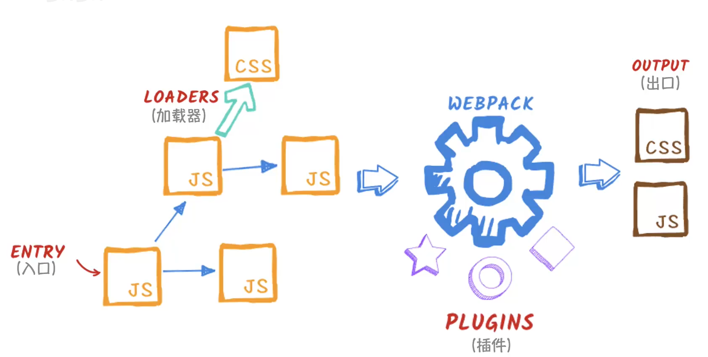

安装webpack相关插件，`npm i html-webpack-plugins -D`，-D表示在本地测试


webpack.config.js

```js
const path = require('path') 
const HtmlWebpackPlugin = require('html-webpack-plugin')
module.exports = {
    entry:'./src/index.js',
    output:{
        filename:'bundle.js',//输出文件的文件名
        path:path.resolve(__dirname,'./dist'),//绝对路径
        clean:true//清除之前的内容
    },

    mode:'none',

    plugins:[
        new HtmlWebpackPlugin({
            template:'./index.html',
            filename:'app.html',
            inject:'body'//打包后的js代码插入位置
        })
    ]
}
```

这是使用了`html-webpack-plugin`插件，也就可以打包html文件。


设置使用模式，通过`mode`配置项解决。

配制成：`mode:'development'`这样换成开发模式，打包出来的东西就可以使用 `html server`进行快速打开页面测试了


#### 使用`source map`

通过source map，当浏览器爆出错误的时候，就可以点击，直接转到报错的文件位置，而不是打包转义后的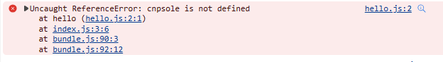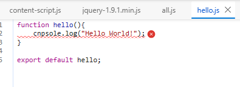

这样可以精准找到错误位置


#### 使用观察模式

打包的时候使用`npx webpack --watch`这样就可以进行监测，一旦代码进行改变就可以实时打包（类似于vue启动项目后）


#### webpack-dev-server

提供基本的web server，并且具有live loading（实时加载）功能

安装

`npm install --save-dev webpack-dev-server`

然后对webpack进行配置

```js
const path = require('path') 
const HtmlWebpackPlugin = require('html-webpack-plugin')
module.exports = {
    entry:'./src/index.js',
    output:{
        filename:'bundle.js',//输出文件的文件名
        path:path.resolve(__dirname,'./dist'),//绝对路径
        clean:true//清除之前的内容
    },

    mode:'development',

    devtool:'inline-source-map',

    plugins:[
        new HtmlWebpackPlugin({
            template:'./index.html',
            filename:'app.html',
            inject:'body'//打包后的js代码插入位置
        })
    ],

    devServer:{
        static:'./dist',//指向的路径，作为server的根目录
    }
}
```

多了一个`devServer`这是服务启动的配置项。

这样弄了之后热模块替换（**能够在不刷新整个网页的情况下更新模块**。）启动，并且实时更新

他把打包后的内容，放在内存里面的


### 资源模块

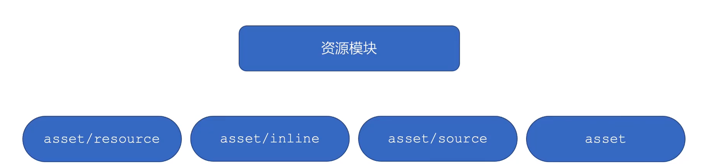


添加

`asset/resource`发送一个单独的文件并且导出一个URL

```js
	module:{
        rules:[
            {
                test:/\.png$/,  //正则表达式
                type:'asset/resource'

            }
        ]
    }
```

test：匹配的正则表示匹配 类型为png，并且包括以png为拓展名的文件

`type:'asset/resource'`应用于处理资源文件，并将其标记为Webpack的资产（asset）,可以使用该规则来处理图片文件

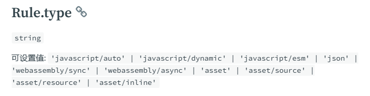

然后如果用到该资源就会将该资源打包进`./dist`文件夹中


#### 自定义文件名以及路径

可以在`output`里面新添一个配置项

这样就能控制打包的文件名以及路径了 

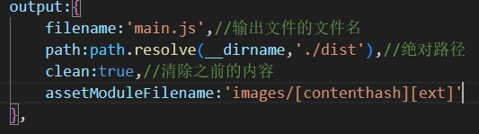这样配置`[contenthash]`是根据文件内容生成相应的文件名,`[ext]`是拓展名

或者在rules的配置里面新添一个配置项

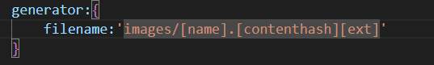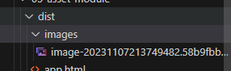

这样也可以

而且是generator优先级更高，`assetModuleFilename`相当于一个全局的，而generator里面相当于一个局部的，局部优先于全局


#### inline资源

用于导出一个资源的Data url，相当于打包的时候没有文件输出，而有一个文件的URL

```js
		{
                test:/\.svg$/,
                type:'asset/inline'
            },
```


#### source资源

导出资源的源代码，比如一个文本文件，你需要查看他的源代码（也就是文本内容）

```js
	{
                test:/\.txt$/,
                type:'asset/source'
            },
```


#### asset资源

通用资源类型。

会依照output的打包规则打包到相应地点

webpack会根据文件大小进行判定，如果文件大小超过8k，那么就会创建资源，小于8k就是inline，当然也可以通过配置项进行修改

```js
{
                test:/\.jpg$/,
                type:'asset',
                parser:{//解释器设置打包大小超过多少就打包为一个资源，否则就是inline类型的
                    dataUrlCondition:{
                        maxSize:10*1024
                    }
                }
            }
```

webpack.config.js

```js
const path = require('path') 
const HtmlWebpackPlugin = require('html-webpack-plugin')
module.exports = {
    entry:'./src/index.js',
    output:{
        filename:'main.js',//输出文件的文件名
        path:path.resolve(__dirname,'./dist'),//绝对路径
        clean:true,//清除之前的内容
        assetModuleFilename:'images/[contenthash][ext]'
    },

    mode:'development',

    devtool:'inline-source-map',

    plugins:[
        new HtmlWebpackPlugin({
            template:'./index.html',
            filename:'app.html',
            inject:'body'//打包后的js代码插入位置
        })
    ],

    devServer:{
        static:'./dist',//指向的路径，作为server的根目录
    },

    module:{
        rules:[
            {
                test:/\.png$/,  //正则表达式
                type:'asset/resource',
                generator:{
                    filename:'images/[name].[contenthash][ext]'
                }
            },
            {
                test:/\.svg$/,
                type:'asset/inline'
            },
            {
                test:/\.txt$/,
                type:'asset/source'
            },
            {
                test:/\.jpg$/,
                type:'asset',
                parser:{//解释器设置打包大小超过多少就打包为一个资源，否则就是inline类型的
                    dataUrlCondition:{
                        maxSize:10*1024
                    }
                }
            }
        ]
    }
}
```


### 管理资源

#### 使用loader加载css

先使用npm进行安装css-loader，然后在module中的rules新添加一个配置项，这个是为了使用css样式不报错

```js
{
    test:/\.css$/,
    use:'css-loader'
}
```

再加上style-loader，将css放在页面上 再次使用

```js
{
                test:/\.css$/,
                use:['style-loader','css-loader']
            },
```

顺序不能有问题，因为是先将css成功打包之后，才能去引用css相应的内容

同样也能加载less，sass这些

```js
{
                test:/\.(css|less)$/,
                use:['style-loader','css-loader','less-loader']
            },
```


#### 抽离压缩CSS

安装插件`npm install mini-css-extract-plugin`（基于webpack5）

那么需要抽离，之前的`style-loader`就没用了，因为他是将css放在head里面的。

而抽离之后就是一个新的css文件，因此需要更换，在plugins里面新添一项`new MiniCssExtractPlugin()`然后在之前`module中的rule中的{test:/.\(css|less)/,use:[MiniCssExtractPlugin.loader,'css-loader','less-loader']}`


安装压缩css插件`npm install css-minimizer-webpack-plugin -D`

将`mode`配置项改为：`mode:'production'`

然后`添加一个新的配置项`：

```js
optimization:{
    minizer:[
        new CssMinimizerPlugin()
    ]
}
```

Css加载图片资源不需要其他配置


#### 加载font字体

`在module下的rules新添一个配置项`

```js
{
                test:/\.(woff|woff2|eot|ttf|otf)$/,
                type:'asset/resource'
            }
        ]
```


#### 加载数据

JSON，NodeJS是内置的。但是要导入CSV、TSV、XML，可以使用`csv-loader`和`xml-loader`处理这些文件

安装这些插件

`npm install csv-loader xml-loader -D`

使用：

```js
{
                test:/\.(csv|tsv)$/i,
                use:['csv-loader']
            },
            {
                test:/\.xml$/i,
                use:['xml-loader']
            }
```


加载toml，yaml，json5等资源，安装`npm install toml yaml json5 -D`

json5相当于对json 的一个加强，可以有注释，而且key可以不使用引号，value也可以使用单引号了，并且还可以使用转义字符

```js
            {
                test:/\.toml$/,
                type:'json',
                parser:{
                    parse:toml.parse,
                }
            },
            {
                test:/\.yaml$/,
                type:'json',
                parser:{
                    parse:yaml.parse,
                }
            },
            {
                test:/\.json5$/,
                type:'json',
                parser:{
                    parse:json5.parse,
                }
            }
```


### babel

将高版本的js代码转化为低版本的js代码

一般情况下转为es5就行了

使用babel-loader

`npm install -D babel-loader @babel/core @babel/preset-env`

babel-loader是webpack里面应用babel解析es6的桥梁

@babel/core:babel的核心模块

@babel/preset-env是babel的预设，一组babel插件的集合

使用：在module.rules下面的新添配置项

```js
{
                test:/\.js$/,
                exclude:/node_modules/,//排除node_modules中的js代码
                use:{
                    loader:'babel-loader',//加载loader
                    options:{
                        presets:['@babel/preset-env']//加载预设
                    }
                }
            }
```


### 代码分离

将代码分离在不同的打包出来的文件中，然后将文件按需加载，或者并行加载，可以控制加载资源的优先级

常用方法：

使用entry配置入口节点（如果是多个入口，那么多个入口共享的文件，会分别在每个打包出来的文件中重复打包）

为了防止重复，可以使用Entry dependencies或者SplitChunkPlugin去重和分离代码

动态导入：通过模块的内联函数调用用来分离代码


#### 修改入口节点：

比如有多个文件，多了一个`another-modules.js`

```js
import _ from 'lodash'

console.log(_.join(['a', 'b', 'c'], '-'))
```


然后修改配置`webpack.config.js`

```js
module.exports = {
    entry:{
        index:'./src/index.js',
        another:'./src/another-modules.js'
    },
    output:{
        filename:'[name].bundle.js',//输出文件的文件名
        path:path.resolve(__dirname,'./dist'),//绝对路径
        clean:true,//清除之前的内容
        assetModuleFilename:'images/[contenthash][ext]'
    },
}
```

将entry改为一个对象，然后配置多个不同的名字。

然后在出口那，重新定义文件名字，以免文件名字冲突。`[name].bundle.js`那么`[name]`使用的就是entry对象中的属性key。


#### 防止重复

配置dependOn的option选项，这样可以在多个chunk之间共享模块。 

将公共的文件抽离成单独的chunk

将`entry`的属性配置一下为对象类型

```js
module.exports = {
    entry:{
        index:{
            import:'./src/index.js',
            dependOn:'shared'
        },
        another:{
            import:'./src/another-modules.js',
            dependOn:'shared'
        },
        shared:'lodash'
    }
}
```


或者在optimization中新添一个配置项：`splitChunks`

```js
optimization:{
        minimizer:[
            new CssMinimizerPlugin(),
        ],
        splitChunks:{
            chunks:'all'
        }
    }
```


#### 动态导入

创建一个`async-module`

```js
function getComponent(){
    import('lodash')
    	.then(({default:_})=>{
        const element = document.createElement('div')
        element.innerHTML = _.join(['hello','cccc'],'----')
        return element
    })
}
getComponent().then((element)=>{
    document.body.appendChild(element)
})
```

因为动态导入是返回的一个Promise对象，因此需要调用其then方法


#### 懒加载（也叫按需加载）

 将代码逻辑断点处分离开，然后再一些代码块中完成某些操作后，立即引用或即将引用另外一些新的代码块。这样可以加快应用的初始加载速度，并且减轻他的总体积，因为某些代码块可能永远不会被加载

`math.js`

```js
export const add = (a, b) => a + b;

export const sub = (a, b) => a - b;
```

`index.js`

```js
const button = document.createElement('button')
button.innerText = 'click me'
button.addEventListener('click', () => {
    import('./math').then(({add:add})=>{
        console.log(add(1,2))
    })
})

document.body.appendChild(button)
```

添加这些内容

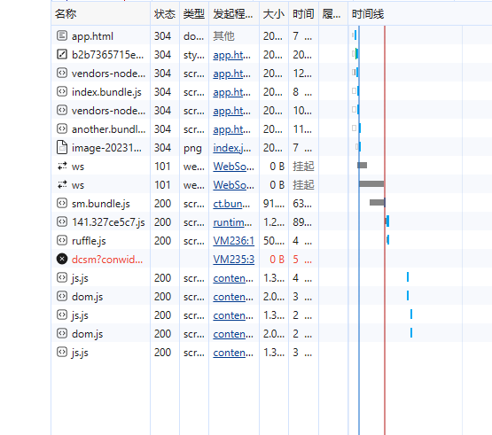点击click me之前

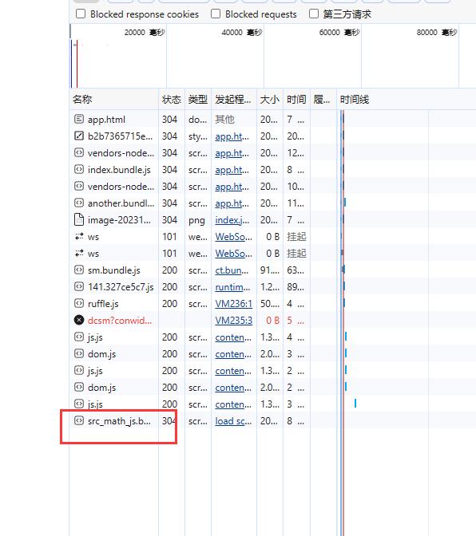点击click me之后，实现了懒加载。

只有被使用的时候才进行加载。

此外打包出来的src能修改名字的。

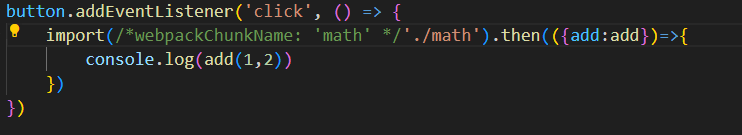

这样子就修改了打包出来的地址


#### 预获取/预加载模块

可以使用某些内置指令，让webpack输出resouce hint（资源提升）

- prefetch（预获取）：将来某些导航下可能需要的资源

- preload（预加载）：当前导航下可能需要资源

    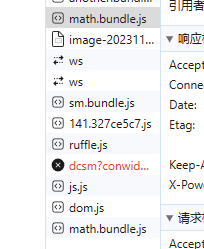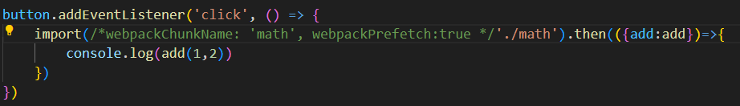

math这个文件加载了两次

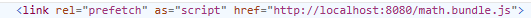添加了这一行在head标签里面

是等全部需要的资源加载之后，等待网络空闲再去加载。

Prefetch就是让浏览器在空闲时预先加载可能会被用到的资源，当用户需要时，直接使用缓存中的资源，减少加载时间。

懒加载使用非关键资源延迟加载，加快首次加载时间。

预加载：使用需要提前获取的资源，如导航栏、搜索框等


### 缓存

#### 输出文件的文件名

如果下加载了一个文件后修改了文件内容但是文件名没有改变的化，因为有缓存的情况，会认为文件没有做出变化，因此将输出文件名与输出内容关联起来

将`output`配置项里面的`filename`

```js
filename:'[name].[contenthash].js'
```

这样就不用担心浏览器缓存了


#### 缓存第三方库

将第三方库（例如lodash）单独打包缓存到浏览器内，只有自己的代码发生变化的时候，去更新，第三方代码始终可以使用浏览器缓存

将optimization中splitChunks的改为：

``` 
		splitChunks:{
            cacheGroups:{
                vendor:{
                    test:/[\\/]node_modules[\\/]/, //因为可能其前面存在一些斜线（路径）
                    name:'vendor',
                    chunks:'all'
                }
            }
        }
```

将js文件打包在一起


### 拆分开发环境和生产环境配置

#### 公共路径

使用publicPath实现，对于所有环境都适用

在output中新添一个配置项：   ` publicPath:'https://localhost:8080/'`

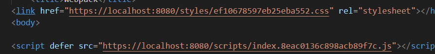

添加了之后变成这样子


##### 环境变量

使用环境变量消除`开发环境`和`生产环境`之间的差异。

在webpack命令行环境配置的`--env`参数，可以运行你传入任意数量的环境变量，例如：

`npx webpack --env goal=local --env production --progress`

将之前的module.exports赋值的对象使用函数形式进行包裹

```js
const path = require('path') 
const HtmlWebpackPlugin = require('html-webpack-plugin')
const MiniCssExtractPlugin = require('mini-css-extract-plugin')
const CssMinimizerPlugin = require('css-minimizer-webpack-plugin')
const TerserPlugin = require('terser-webpack-plugin')
const toml = require('toml')
const yaml = require('yaml')
const json5 = require('json5')

module.exports = (env)=>{
    console.log(env);
    return {
        entry:{
            // index:{
            //     import:'./src/index.js',
            //     dependOn:'shared'
            // },
            // another:{
            //     import:'./src/another-modules.js',
            //     dependOn:'shared'
            // },
            // shared:'lodash'
            index:'./src/index.js',
            another:'./src/another-modules.js',
        },
        output:{
            filename:'scripts/[name].[contenthash].js',//输出文件的文件名
            path:path.resolve(__dirname,'./dist'),//绝对路径
            clean:true,//清除之前的内容
            assetModuleFilename:'images/[contenthash][ext]',
            publicPath:'https://localhost:8080/'
        },
    
        mode:env.production ? 'production':'development',
    
        devtool:'inline-source-map',
    
        plugins:[
            new HtmlWebpackPlugin({
                template:'./index.html',
                filename:'app.html',
                inject:'body'//打包后的js代码插入位置
            }),
            new MiniCssExtractPlugin({
                filename:'styles/[contenthash].css'
            })
        ],
    
        devServer:{
            static:'./dist',//指向的路径，作为server的根目录
        },
    
        module:{
            rules:[
                {
                    test:/\.png$/,  //正则表达式
                    type:'asset/resource',
                    generator:{
                        filename:'images/[name].[contenthash][ext]'
                    }
                },
                {
                    test:/\.svg$/,
                    type:'asset/inline'
                },
                {
                    test:/\.txt$/,
                    type:'asset/source'
                },
                {
                    test:/\.jpg$/,
                    type:'asset',
                    parser:{//解释器设置打包大小超过多少就打包为一个资源，否则就是inline类型的
                        dataUrlCondition:{
                            maxSize:10*1024
                        }
                    }
                },
                {
                    test:/\.(css|less)$/,
                    use:[MiniCssExtractPlugin.loader,'css-loader','less-loader']
                },
                {
                    test:/\.(woff|woff2|eot|ttf|otf)$/,
                    type:'asset/resource'
                },
                {
                    test:/\.(csv|tsv)$/,
                    use:['csv-loader']
                },
                {
                    test:/\.xml$/,
                    use:['xml-loader']
                },
                {
                    test:/\.toml$/,
                    type:'json',
                    parser:{
                        parse:toml.parse,
                    }
                },
                {
                    test:/\.yaml$/,
                    type:'json',
                    parser:{
                        parse:yaml.parse,
                    }
                },
                {
                    test:/\.json5$/,
                    type:'json',
                    parser:{
                        parse:json5.parse,
                    }
                },
                {
                    test:/\.js$/,
                    exclude:/node_modules/,//排除node_modules中的js代码
                    use:{
                        loader:'babel-loader',//加载loader
                        options:{
                            presets:['@babel/preset-env']//加载预设
                        }
                    }
                }
            ]
        },
        optimization:{
            minimizer:[
                new CssMinimizerPlugin(),
                new TerserPlugin(),
            ],
            splitChunks:{
                cacheGroups:{
                    vendor:{
                        test:/[\\/]node_modules[\\/]/, //因为可能其前面存在一些斜线（路径）
                        name:'vendor',
                        chunks:'all'
                    }
                }
            }
        }
    }
}
```

但是代码没有压缩，可以使用webpack开箱即用的terser插件，因为配置了minimizer，那么这个terser插件也需要配置一下

使用terser插件后，在生产环境里面压缩在开发环境不进行压缩


#### 拆分配置文件

将配置拆为两部分，一部分时开发环境的配置，一部分时生产环境的配置

`./config/webpack.config.dev.js`

```js
const path = require('path') 
const HtmlWebpackPlugin = require('html-webpack-plugin')
const MiniCssExtractPlugin = require('mini-css-extract-plugin')
const toml = require('toml')
const yaml = require('yaml')
const json5 = require('json5')

module.exports = {
    entry:{
        index:'./src/index.js',
        another:'./src/another-modules.js',
    },
    output:{
        filename:'scripts/[name].js',//输出文件的文件名
        path:path.resolve(__dirname,'./dist'),//绝对路径
        clean:true,//清除之前的内容
        assetModuleFilename:'images/[contenthash][ext]',
    },

    mode:'development',

    devtool:'inline-source-map',

    plugins:[
        new HtmlWebpackPlugin({
            template:'./index.html',
            filename:'app.html',
            inject:'body'//打包后的js代码插入位置
        }),
        new MiniCssExtractPlugin({
            filename:'styles/[contenthash].css'
        })
    ],

    devServer:{
        static:'./dist',//指向的路径，作为server的根目录
    },

    module:{
        rules:[
            {
                test:/\.png$/,  //正则表达式
                type:'asset/resource',
                generator:{
                    filename:'images/[name].[contenthash][ext]'
                }
            },
            {
                test:/\.svg$/,
                type:'asset/inline'
            },
            {
                test:/\.txt$/,
                type:'asset/source'
            },
            {
                test:/\.jpg$/,
                type:'asset',
                parser:{//解释器设置打包大小超过多少就打包为一个资源，否则就是inline类型的
                    dataUrlCondition:{
                        maxSize:10*1024
                    }
                }
            },
            {
                test:/\.(css|less)$/,
                use:[MiniCssExtractPlugin.loader,'css-loader','less-loader']
            },
            {
                test:/\.(woff|woff2|eot|ttf|otf)$/,
                type:'asset/resource'
            },
            {
                test:/\.(csv|tsv)$/,
                use:['csv-loader']
            },
            {
                test:/\.xml$/,
                use:['xml-loader']
            },
            {
                test:/\.toml$/,
                type:'json',
                parser:{
                    parse:toml.parse,
                }
            },
            {
                test:/\.yaml$/,
                type:'json',
                parser:{
                    parse:yaml.parse,
                }
            },
            {
                test:/\.json5$/,
                type:'json',
                parser:{
                    parse:json5.parse,
                }
            },
            {
                test:/\.js$/,
                exclude:/node_modules/,//排除node_modules中的js代码
                use:{
                    loader:'babel-loader',//加载loader
                    options:{
                        presets:['@babel/preset-env']//加载预设
                    }
                }
            }
        ]
    },
    optimization:{
        splitChunks:{
            cacheGroups:{
                vendor:{
                    test:/[\\/]node_modules[\\/]/, //因为可能其前面存在一些斜线（路径）
                    name:'vendor',
                    chunks:'all'
                }
            }
        }
    }
} 
```


使用指定目录下的配置，`npx webpack -c ./config/webpack.config.dev.js`


#### npm 脚本

每次使用的时候就需要输入一大串，非常的不方便

可以配置npm的脚本文件（前提是，node_modules和package.json还有package-lock.json在`父目录的 当前目录下`）

```js
{
    "scripts":{
        "start":"webpack serve -c ./config/webpack.config.dev.js",
        "build":"webpack -c ./config/webpack.config.prod.js"
    }
}
```


#### 提取公共配置项

将配置项里面的公共部分提取出来，放在同一`webpcak.config.common.js `

然后其他的只保留各自特色的配置项

`webpack.config.prod.js`

```js
const CssMinimizerPlugin = require('css-minimizer-webpack-plugin')
const TerserPlugin = require('terser-webpack-plugin')

module.exports = {
    output:{
        filename:'scripts/[name].[contenthash].js',//输出文件的文件名
        publicPath:'https://localhost:8080/'
    },

    mode:'production',
    optimization:{
        minimizer:[
            new CssMinimizerPlugin(),
            new TerserPlugin(),
        ],
    },
    performance:{
        hints:false
    }
}
```

`webpack.config.dev.js`

```js
const path = require('path') 
const HtmlWebpackPlugin = require('html-webpack-plugin')
const MiniCssExtractPlugin = require('mini-css-extract-plugin')
const toml = require('toml')
const yaml = require('yaml')
const json5 = require('json5')

module.exports = {
    output:{
        filename:'scripts/[name].js',//输出文件的文件名
    },

    mode:'development',

    devtool:'inline-source-map',

    devServer:{
        static:'./dist',//指向的路径，作为server的根目录
    },
}
```


#### 合并配置项

需要深合并才行，需要安装插件`npm install package-merge -D`  

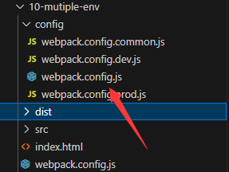这个担当了外层的webpack.config.js的重任

如何进行配置呢？使用插件进行合并

```js
const { merge } = require('webpack-merge');

const common = require('./webpack.config.common');
const production = require('./webpack.config.prod')
const development = require('./webpack.config.dev')

module.exports = (env)=>{
    switch (true){
        case env.development:
            return merge(common, development);
        case env.production:
            return merge(common, production);

        default:
            return new Error("No match configuration was found")
    }
}
```

然后再package.json里面进行修改，因为，启动和打包都在同一个配置文件下。都修改为


## 高级应用

### 提高效率，完善开发规范

#### source-map

source-map将报错位置与打包出来的位置相关联

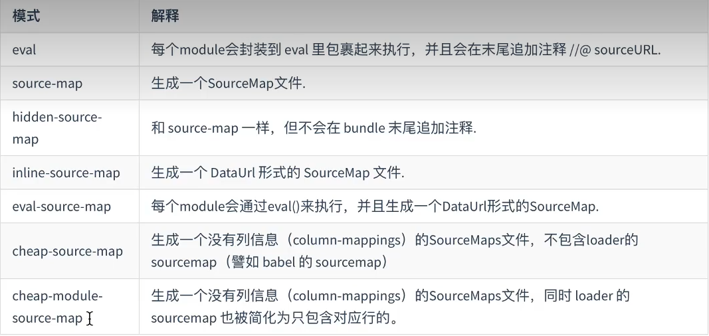

默认情况下webpack会在开发环境时给我们设置sourcemap值为eval，默认为`devtool:'eval'`

如果设置了配置项`devtool:false`那么就没有sourcemap，因此代码也无法定位

推荐使用`cheap-module-source-map`选项，帮助生成map文件，并且不记录列数

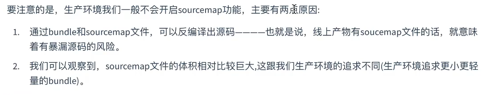


```js
const HtmlWebpackPlugin = require("html-webpack-plugin")


module.exports ={
    mode:'development',

    entry:'./app.js',
    devtool:'cheap-module-source-map',
    output:{
        clean:true
    },

    module:{
        rules:[
            {
                test:/.\js$/,
                exclude:/node_modules/,
                use:{
                    loader:'babel-loader',
                    options:{
                        presets:['@babel/preset-env']
                    }
                }
            }
        ]
    },

    plugins:[
        new HtmlWebpackPlugin(),
    ]
}
```


### devServer

webpack内置了该功能，只需要安装它即可

`npm install webpack-dev-server -D`

可以处理是否进行代码压缩（在服务端），设置端口号，还有是否开启代理（解决跨域问题），还有解决单页面刷新问题

```js
const path = require('path')
const HtmlWebpackPlugin = require('html-webpack-plugin')
module.exports = {
    mode:'development',
    entry:'./app.js',
    output:{
        filename:'bundle.js',
        path:path.resolve(__dirname,'./dist'),
        clean:true
    },
    devServer:{
        static:path.resolve(__dirname,'./dist'),
        compress:true,//配置是否在服务端进行代码压缩
        port:3000,//设置端口号

        headers:{
            'X-Access-Token':"das134wd0as0xcas534edwq00d30wq1dqwd30qw1dqd0as1d6q5"
        },//添加 响应头
        proxy:{//解决跨域问题
            '/api':'http://localhost:9000' //当有请求路径是以api开头的就跳转到后面的值（localhost:9000）上面
        },
        //https:true,//让本地的http服务变成https服务，当然这样可能不安全（因为没有签名证书）


        // http2:true,//让本地服务变为http2，并且自带签名证书
        historyApiFallback:true, //如果是history模式且请求的路径不存在会返回根页面
    
        host:'0.0.0.0' //让局域网的伙伴一起访问
    },
    plugins:[
        new HtmlWebpackPlugin()  
    ]
} 
```


### 模块热替换和热加载

模块热替换（HMR）会在应用程序运行过程中，替换、添加或删除模块，而无需重新加载整个页面

在`devServer`的配置项里面新添一个`hot:true`即可

此外还有样式文件的热替换功能

在`module`的`rules`中新添一项`{test:/.\css$/,use:['style-loader','css-loader']}`


热加载：文件更新时，自动刷新服务和页面，新版的webpack-dev-server默认开启。对应的为`devServer.liveReload`默认为true，如果要关掉它，也要同时关闭hot

```js
const HtmlWebpackPlugin = require('html-webpack-plugin');

module.exports = {
    mode:'development',

    entry:'./app.js',
    module:{
        rules:[
            {
                test:/\.css$/,
                use:['style-loader','css-loader']
            }
        ]
    },
    plugins:[
        new HtmlWebpackPlugin({
            template:'./index.html'
        })
    ],
    devServer:{
        hot:true,
    }
}
```


### eslint

代码是否符合规范的工具

安装`npm i eslint -D`

使用`npx eslint --init`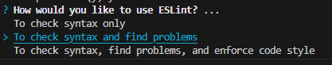

出现三个选项，一时只检查语法错误，二是检查语法错误，并且找到问题；三是，检查语法错误，发现问题还有规范代码格式

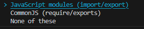项目中那种模块化的编写方式