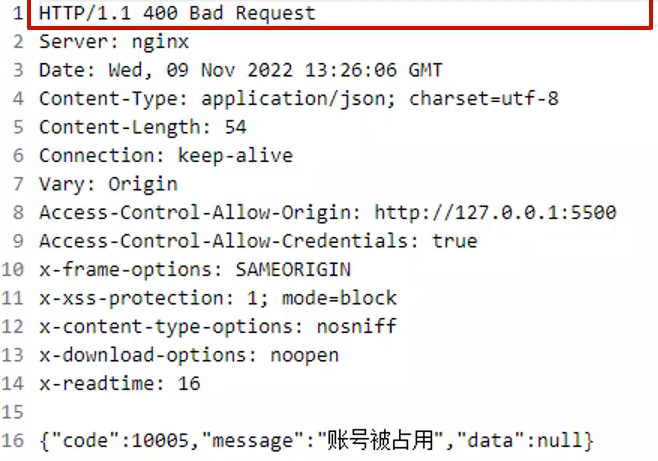
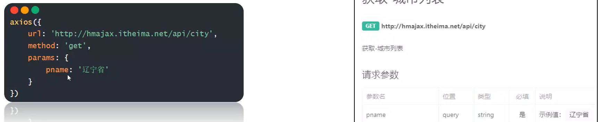
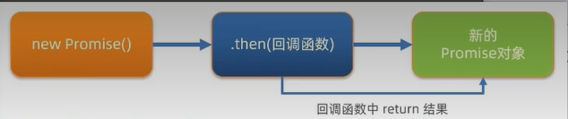
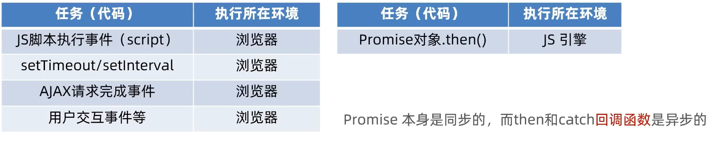
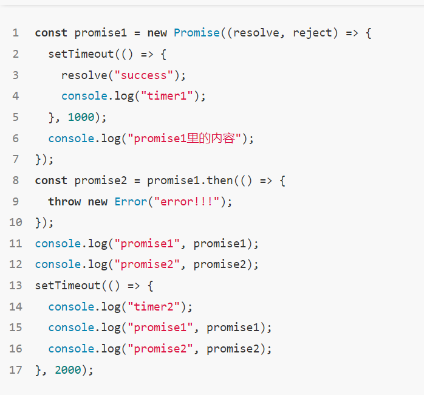

# Ajax

## Day1

Ajax定义：异步的JavaScript和XML，就是使用**XMLHttpRequest**对象和服务器通信，一般是使用`JSON`，XML，HTMl，text文本等格式接受数据

异步的特性，让他在不重新刷新页面的情况下与服务器通信，交换数据，或者更新页面

作用：动态数据交互

#### 使用Ajax

先使用**axios库**与服务器进行`数据通信`

语法：

1.引用axios.js:		https://cdn.jsdelivr.net/npm/axios/dist/axios.min.js（使用不了废除）

使用下面那个


<script src="https://cdn.bootcdn.net/ajax/libs/axios/1.3.6/axios.min.js"></script>

2.使用axios函数

```js
axios({
	url:'目标资源地址'
}).then((result)=>{
    //对服务器返回的数据做后续处理
})
```

url是获取你需要的数据的地址，然后获取数据后可以使用各种方法将其转化为展示在页面的数据


#### 认识URL

定义：统一资源定位符，简称网址	

URL由3部分构成，协议，域名，资源路径

http协议：超文本传输协议，规定浏览器和服务器之间的传输数据的格式（规定数据的格式）

还有https协议

域名：相当于是地图中的坐标，是必须的，不然无法查找到相应的网址

资源路径：标记资源在服务器下的具体位置 		


比如拿到新闻数据

```html
<script src="https://cdn.jsdelivr.net/npm/axios/dist/axios.min.js"></script>
<script>
ajax({
	url:'http://hmajax.itheima.net/api/news'
}).then(result =>{
	console.log(result.data)
})
</script>
```


#### 查询参数

URL查询参数

定义：浏览器提供给服务器的**额外信息**，让服务器返回浏览器想要的数据

语法：http://xxxx.com/xxx/xxx?参数1=值1&参数2=值2


axios查询参数

语法：使用axios提供的params选项

```js
axios({
	url:'目标资源地址',
    params:{
        参数名:值
    }
}).then(result=>{
    //处理
})
```

当属性名和变量名同名的时候可以简写

```js
axios({
        url:'http://hmajax.itheima.net/api/area',
        params:{
          pname,
          cname
        }
      }).then(result =>{
        console.log(result)
        const arr = result.data.list
        let str = ''
        for(let x of arr)
          str +=`<li>${x}</li>`
          ul.innerHTML = str
      })
    })
```


#### 常见请求方法

定义：对服务器资源操作

`GET 获取数据`			`POST	提交数据`			PUT	修改数据（全部）	DELETE	删除数据		PATCH修改数据（部分）


axios请求配置

url：请求的URL网站			method：请求的方法，GET可以省略（不区分大小写）		data：提交数据

```js
axios({
	url:'目标资源地址',
    method:'方法',
    data:{
        参数名1:值1
    }
}).then((result)=>{
    //对服务器返回的数据做后续处理
})
```


ajax错误处理

场景：再次注册相同的账号，会遇到报错信息

语法：在then方法后面通过点语法调用catch方法，传入回调函数并定义形参

```js
axios({
    //请求选项
}).then(result =>{
    //处理数据
}).catch(error =>{
    //处理错误
    //error.response.data.message    来找到错误信息	
})
```


#### HTTP协议

请求报文：浏览器按照HTTP协议的要求的格式，发送给服务器的内容

请求报文的组成成分：

​	1.请求行：请求方式，URL，协议

​	2.请求头：以键值对的格式携带的附加信息，比如：content-type

​	3.空行：分隔请求头，空行之后的是发送给服务器的资源

​	4.请求体：发送的资源

请求报文-错误排查

需求：通过请求报文排查错误原因，并修复

可以在网络中找到该次请求，然后查看信息，进行排查


##### 响应报文

定义：服务器按照HTTP协议要求的格式，返回给浏览器的内容

构成：

响应行：协议，HTTP响应状态码、状态信息
响应头：以键值对的格式携带的附加信息，比如Content-Type
空行
响应体：返回的资源




**响应状态码**：表示请求`是否成功`完成		1xx信息		2xx成功		3xx重定向信息

4xx客户端错误		5xx服务端错误	


#### 接口文档

描述接口的文档（后端工程师）

接口：使用ajax和服务器通讯时，使用的URL，请求方法，以及参数




axios里面如果data内的数据是一个对象，那么会把对象自动转化为JSON


#### form-serialize插件

作用：快速收集表单元素的值


语法：

```js
const form = document.querySelector('.example-form')
const data = serialize(form,{hash:true,empty:true})
```

需要调用form-serialize的js文件

获取过来的对象，他的属性名和input标签里面的name的值是一样的

所以name属性的值，最好和接口文档的参数名一致	

hash：设置获取的数据结构

​		true，获取为JS对象（推荐，因为一般在请求体里提交给服务器）			false，获取查询字符串

empty：设置是否获取空值

​		true允许获取空值，也就是能获取到空的字符串；

​		false不能获取空值，获取不到空的字符串（获取的都是有值的 ）


## Day2

#### BootStrap弹框

先引入相关的css和js

2、准备`弹框标签`，确定结构

3、通过` 自定义属性`，控制弹框的显示和隐藏

```html
<link href="https://cdn.jsdelivr.net/npm/bootstrap@5.2.2/dist/css/bootstrap.min.css" rel="stylesheet">

<script src="https://cdn.jsdelivr.net/npm/bootstrap@5.2.2/dist/js/bootstrap.min.js"></script>
```

通过button的自定义属性如`data-bs-toggle="modal"`（modal是BootStrap里面已经设立好的东西）还有

`data-bs-target="css选择器"`（对应控制哪个弹框，css选择器根据你所想控制的弹框来决定）

这是通过属性控制弹框


还有通过JS控制弹框，比如点击保存信息后，弹框自动消失

```js
const modalDom = document.querySelector('.name-box')
    const modal = new bootstrap.Modal(modalDom)
    document.querySelector('.edit-btn').addEventListener('click',()=>{
      modal.show()
      //显示弹框
    })
    document.querySelector('.save-btn').addEventListener('click',()=>{
      // 隐藏弹框
      modal.hide()
    })
```

上面那个hide可以，给盒子添加自定义属性`data-bs-delay="1000"`进行替换隐藏

如果是想对弹框进行取值、存值操作那么应该用JS，如果仅仅只是提示消息那么只使用属性控制即可


要绑定删除（确定删除的哪一个）可以用相应的id去删除，可以用事件委托去给所有需要添加的子元素添加事件（原理是点击子元素后，会`冒泡`到父元素身上，从而触发父元素的事件）


可以再路径上传参比如

```js
      url:`http://hmajax.itheima.net/api/books/${thid}`, 
```


当数据的属性和标签的类名一致时：可以采取遍历

取出对象的key和value，使用Object.keys(对象) 

比如图书管理

核心步骤：渲染数据

新增数据——新增，收集&提交，刷新列表

删除数据：点击绑定事件、调用删除接口，刷新

编辑数据：编辑、表单（数据回显）、保存修改&刷新页面


图书管理总结：

1.查询

主要分为获取数据和渲染数据

```js
const creator='老张'
const getBooksList = ()=>{
  axios({
    url:'http://hmajax.itheima.net/api/books',
    params:{
      creator
    }
  }).then(result=>{
    // console.log(result)
    const books=result.data.data
    // console.log(books);
    const htmler = books.map((item,index)=>{
      return `
      <tr>
          <td>${index+1}</td>
          <td>${item.bookname}</td>
          <td>${item.author}</td>
          <td>${item.publisher}</td>
          <td data-id=${item.id}>
            <span class="del">删除</span>
            <span class="edit">编辑</span>
          </td>
        </tr>`
    }).join('')
    document.querySelector('.list').innerHTML = htmler
  })
}
getBooksList()
```

2.新增数据

准备新增表单，给保存按钮绑定事件，收集信息然后上传到服务器，最后再次刷新列表

```js
const addModalDOM = document.querySelector('.add-modal')
const addMoal = new bootstrap.Modal(addModalDOM)

//保存按钮，点击，隐藏
document.querySelector('.add-btn').addEventListener('click',()=>{

  const form = document.querySelector('.add-form')
  const mydata = serialize(form,{hash:true,empty:true})
  axios({
    url:'http://hmajax.itheima.net/api/books',
    method:'post',
    data:{
      ...mydata,//展开数据
      creator
    }
  }).then(result=>{
    getBooksList()
    //重置表单
    form.reset()
    //隐藏弹框
    addMoal.hide()
  })
})

```

3.删除数据

绑定点击事件（拿到id），调用删除接口，刷新图书列表	

```js
document.querySelector('.list').addEventListener('click',e =>{
  if( e.target.classList.contains('del'))//确定点击的为删除按钮
  {
    const theId=e.target.parentNode.dataset.id
    // console.log(theId)
    axios({
      url:`http://hmajax.itheima.net/api/books/${theId}`,
      method:'DELETE'
    }).then(result=>{
      getBooksList()
    })
  }
})
```

4.编辑数据

 编辑图书表单，表单数据回显，给修改按钮绑定事件，保存修改&刷新列表

```js
const editModalDom = document.querySelector('.edit-modal')
const editModal = new bootstrap.Modal(editModalDom)

document.querySelector('.list').addEventListener('click',e =>{
  if(e.target.classList.contains('edit')){
    //获取数据回显到表单中
    const theId = e.target.parentNode.dataset.id
    axios({
      url:`http://hmajax.itheima.net/api/books/${theId}`
    }).then(result=>{
      const bookObj = result.data.data
      // document.querySelector('.edit-form .bookname').value =bookObj.bookname
      // document.querySelector('.edit-form .author').value =bookObj.author
      // document.querySelector('.edit-form .publisher').value =bookObj.publisher

      const keys = Object.keys(bookObj)
      keys.forEach(key=>{
        document.querySelector(`.edit-form .${key}`).value=bookObj[key]
      })
    })
    editModal.show()
  }
})

//修改表单，点击，保存
document.querySelector('.edit-btn').addEventListener('click',()=>{
  const editForm = document.querySelector('.edit-form')
  const {id,bookname,author,publisher} = serialize(editForm,{hash:true,empty:true})
  axios({
    url:`http://hmajax.itheima.net/api/books/${id}`,
     method:'PUT',
     data:{
      bookname,
      author,
      publisher,
      creator
     }
  }).then(()=>{
    getBooksList()
  editModal.hide()

  })
})
```


#### 图片上传

1.获取图片文件对象。

2.使用FormData携带图片文件

3.提交表单数据到服务器，使用图片url地址

```js
const fd = new FormData()
fd.append(参数名,值)
```

可以通过e.target.files拿到相应的文件

比如下面

```js
document.querySelector('.upload').addEventListener('change',e =>{
      const fd = new FormData()
      fd.append('img',e.target.files[0])
      axios({
        url:'http://hmajax.itheima.net/api/uploading',
        method:'POST',
        data:fd
      }).then(result=>{
        const imgUrl = result.data.data.url
        document.querySelector('.my-img').img=imgUrl
      })
    })
```

从而达到更换数据的形式


## Day3

Ajax原理-XMLHttpRequest

XMLHttpRequest（简称XHR）对象用于与服务器交互。XRH对象可以在不刷新页面的情况下，请求特定的URL，获取数据。

XHR可以有更多与服务器数据通信方式

关系：axios内部采用XMLHttpRequest与服务器交互

使用XHR对象

1.创建对象。2.调用Open方法，设置url和请求方法3.监听loadend事件，接收响应结果（得到的是JSON字符串） 4.发起请求

需要用JSON.parse(JSON字符串)得到对象

```js
const xhr = new XMLHttpRequest()
xhr.open('请求方法','请求url地址')
xhr.addEventListener('loadend',()=>{
    console.log(xhr.response)
})
xhr.send()
```


#### XMLHttpRequest-查询参数

定义：浏览器提供给服务器的额外信息，让服务器返回浏览器想要的数据

使用URLSearchParams对象，生成指定格式查询参数字符串

```js
const paramsobj = new URLSearchParams({
    参数名1:值1,
    参数名2:值2
})

const queryString = paramsobj.toString()
```


#### XMLHttpRequest-数据提交

需求：通过XHR提交用户名和密码，完成注册功能

核心：请求头设置Content-Type：application/json

请求体携带JSON字符串（JSON字符串，JSON.stringify(数据)）

```js
const xhr = new XMLHttpRequest()
xhr.open('请求方法','请求url地址 ')
xhr.addEventListener('loadend',() =>{
    console.log(xhr.response)
})

xhr.setRequestHeader('Content-Type','application/json')
const user = {username:'123456789',password:'123456789'}
const userStr = JSON.stringify(user)
xhr.send(userStr)
```


### Promise

定义：对象用于表示一个异步操作的最终完成（或失败）及其结果值


使用好处：1.逻辑更加清晰		2.了解axios函数内部运作机制		3.能解决回调函数的地狱问题

```js
const p = new Promise((resolve,reject)=>{
    //上面两个参数是回调函数
    //执行异步代码
    setTimeout(() =>{
        resolve('Success')
        reject(new Error('Defeate'))
    },2000)
    //成功调用resolve(值)触发then()执行
    //失败调用：reject(值)触发catch()执行
})
p.then(result =>{
    //成功的处理
})
p.catch(result =>{
    //失败的处理
})
```


#### promise的三种状态

作用了解：Promise对象如何关联的处理函数，以及代码执行顺序

状态：待定(pending)，初始状态，没有被兑现也没有被拒绝

已兑现(fulfilled),操作成功

已拒绝(rejected),操作失败

 创建p后，代码执行前是待定状态。（如果有定时器，那么在创建的时刻就已经自动计时了）


例子用Promise和XHR获取省份列表

```js
const p = new Promise((resolve,reject)=>{
      //定义xhr对象
      const xhr = new XMLHttpRequest()
      xhr.open('GET','http://hmajax.itheima.net/api/province')
      xhr.addEventListener('loadend',()=>{
        //利用响应状态码，判断请求是否成功或者失败
        //2xx开头的都是成功的响应码
        if(xhr.status>=200 && xhr.status< 300)
        {
          resolve(JSON.parse(xhr.response))
        }else{
          reject(new Error(xhr.response))
        }
      })
      xhr.send()
    })
    p.then(result=>{
      document.querySelector('.my-p').innerHTML = result.list.join('<br>')
    }).catch(error=>{
      document.querySelector('.my-p').innerHTML = error.message
    })
```


用promise和XHR封装myAxios函数（简易）

步骤：

1.定义myaxios，接收配置对象，返回Promise对象

2.发起XHR请求，默认请求方法为GET

3.调用成功或者失败的程序

```js
function myaxios(config){
      return new Promise((resolve,reject) => {
        const xhr = new XMLHttpRequest()
        xhr.open(config.method || 'GET',config.url)
        xhr.addEventListener('loadend',() =>{
          if(xhr.status>=200 && xhr.status<300){
            resolve(JSON.parse(xhr.response))
          }else{
            reject(new Error(xhr.response))
          }
        })
        xhr.send()
      })
    }
    myaxios({
      url:'http://hmajax.itheima.net/api/province'
    }).then(result =>{
      document.querySelector('.my-p').innerHTML = result.list.join('<br>')
    }).catch(error =>{
      document.querySelector('.my-p').innerHTML = error.message
    })
```


修改myaxios函数让其支持传递查询参数

要求：myaxios调用后，传入params选项

2.基于URLSearchParams转化`查询参数字符串`

```js
//可以再返回新建的Promise对象里面添加判断
new Promise((resolve,reject) => {
 	if(config.params){
        const paramsobj = new URLSearchParams(config.params)
        const queryString = paramsobj.toString()
        config.url +=`?${queryString}`
    }   
}
```


修改myaxios让其支持请求体数据，完成注册用户功能

1.myAxios函数调用后，判断`data`选项

2.转换数据类型，在send方法中发送

3.使用自己封装的myaxios函数完成注册用户功能

```js
//判断是否有data数据，将xhr.send()稍微做一做修改
if(config.data){
    //转化数据类型
    const jsonStr = JSON.stringify(config.data)
    xhr.setRequestHeader('Content-Type','application/json')
    xhr.send(jsonStr)
}else{
    xhr.send()
}
```


### 综合案例——天气预报

步骤：1.获取默认地区的天气预报值，进行展示

2.搜索城市列表，展示

3.点击城市，展示对应天气数据


## Day4

#### 同步代码和异步代码（复习）

同步代码：按照代码的声明顺序一行一行的执行，上一行完毕才会执行下一行

特点，逐行执行，需原地等待结果之后，才继续向下执行。

异步代码：执行一个耗时的任务，同时继续对其他事件，做出反应而不必等待任务完成。完成后`通过回调函数接收结果`显示结果

异步代码：调用后耗时，不阻塞代码继续执行（不必原地等待），在将来完成后触发一个回调函数

比如

```js
setTimeout(()=>{
    console(1)
},2000)
console.log(2)
```

打印的顺序是2，1。

异步代码：定时器（setTimeout/setInterval），事件（比如点击事件），AJAX


#### 回调函数地狱

概念：在回调函数中`嵌套回调函数`，一直嵌套下去就形成了回调函数地狱

其缺点：可读性差，异常无法捕获，耦合性严重，牵动一发引动全身

```js
// 获取默认第一个省份的名字
    axios({ url: 'http://hmajax.itheima.net/api/province' }).then(result => {
      const pname = result.data.list[0]
      document.querySelector('.province').innerHTML = pname
      //获取默认第一个城市的名字
      axios({ url: 'http://hmajax.itheima.net/api/city', params: { pname } }).then(result => {
        const cname = result.data.list[0]
        document.querySelector('.city').innerHTML = cname
        axios({url:'http://hmajax.itheima.net/api/area',params:{pname,cname}}).then(result =>{
          const areaName = result.data.list[0]
          document.querySelector('.area').innerHTML = areaName
        })
      })
    }).catch(error =>{
      console.dir(error)//出现错误无法捕获
    })
```

如果出现错误，错误会直接抛给浏览器没办法捕获


#### Promise-链式调用

`解决`回调函数地狱问题

依靠then()方法会返回一个新生成的Promise对象特性，继续串联下一环任务，直到结束

then()回调函数中的返回值，会影响新生成的Promise对象最终状态和结果



```js
//1.创建Promise对象
    const p = new Promise((resolve,reject) =>{
      setTimeout(()=>{
        resolve('北京市')
      },2000)
    })
    //获取省份名字
    // return Promise对象最终状态和结果，影响新的Promise对象
    const p2 = p.then(result =>{
      //  console.log(result)
      return new Promise((resolve,reject) => {
        setTimeout(() => {
          resolve(result + '--- 北京')
        },2000)
      })
    })

    //获取城市名字
    p2.then(result =>{
      console.log(result);
    })//2s后，打印了北京市，4s后打印了北京市--- 北京
    //then()原地生成了一个新的Promise对象
    console.log(p2===p)// 
```

#### 链式调用解决回调函数地狱问题

每个Promise对象中管理一个异步任务，用then返回Promise对象，串联起来 


```js
let pname = ''
    axios({ url: 'http://hmajax.itheima.net/api/province' }).then(result => {
      console.log(result);
      pname = result.data.list[0]
      document.querySelector('.province').innerHTML = pname
      //得到获取城市的Promise对象
      return axios({ url: 'http://hmajax.itheima.net/api/city', params: { pname } })
    }).then(result => { 
      console.log(result)
      const cname = result.data.list[0]
      document.querySelector('.city').innerHTML = result.data.list[0]
      return axios({url:'http://hmajax.itheima.net/api/area',params:{pname,cname}})
    }).then(result =>{
      console.log(result)
      const areaName = result.data.list[0]
      document.querySelector('.area').innerHTML = areaName
    })//链式的
```

因为是链式，各个之间的变量是没有关系的，所以要在多个then之间使用的变量`定义在全局`


### async和await

#### 简要

async是使用async关键字声明的函数。是AsyncFunction的实例，并且其中允许使用await关键字。

async和await关键字让我们可以用一种更简洁的方式写出基于Promise的异步行为，而无需刻意地链式调用promise

```js
async function getDefaultArea(){
    const pObj = await axios({ url: 'http://hmajax.itheima.net/api/province' })
    const pname = pObj.data.list[0]
    const cObj = await axios({ url: 'http://hmajax.itheima.net/api/city', params: { pname } })
    const cname = cObj.data.list[0]
    const aObj = await axios({url:'http://hmajax.itheima.net/api/area',params:{pname,cname}})
    const areaName = aObj.data.list[0]
    document.querySelector('.province').innerHTML = pname
    document.querySelector('.city').innerHTML = cname
    document.querySelector('.area').innerHTML = areaName
}
```

await 取代then函数，等待获取Promise对象成功状态的结果值

相当于是获取的then里面传入的result


#### 捕获错误

使用try——catch

```js
try{

}catch(error){
    //error接收的是错误信息，try里代码有错误会直接跳转到这里执行
}
```


#### 事件循环（EventLoop）

执行和收集异步代码的模型，调用栈空闲的时候，反复调用任务队列里回调函数执行机制

事件循环可以，减少JS引擎的阻塞

```js
console.log(1)
setTimeout(()=>{
    console.log(2)
},2000)
console.log(3)
//打印顺序 1 3 2

console.log(1)
setTimeout(()=>{
    console.log(2)
},0)
console.log(3)

//打印顺序还是1 3 2
```

上面两个例子，是先执行同步（全部执行完毕，即调用栈执行完毕），再执行异步，耗时的代码会进入宿主环境（浏览器），时间到了就推入`任务队列`，事件循环反复检测任务队列时候存在待执行的代码，如果有就推入到调用栈中执行

1 5 3 2 4 点击后6


#### 宏任务与微任务

ES6之后引入了Promise对象，让JS引擎也可以发起异步任务

异步任务分为，宏任务与微任务。

宏任务：由`浏览器`环境执行的异步代码

微任务：由`JS引擎`环境执行的代码



从任务队列调用时，会`优先`调用`微任务队列`，微任务队列`清空后`才会执行宏队列

经典面试题

```js
console.log(1)
setTimeout(()=>{
    console.log(2)
    const p = new Promise(resolve => resolve(3))
    p.then(result => console.log(result))
},0)
const p = new Promise(resolve =>{
    setTimeout(()=>{
        console.log(4)
    },0)
    resolve(5)
})
p.then(result => console.log(result))

const p2 = new Promise(resolve => console.log(6))
p2.then(result => console.log(result))
console.log(7)
//打印顺序1 7 5 6 2 3 4
```

一旦有微任务加入队列，那么会优先执行它，因为每一次循环后都是把循环过的抹去，然后再开始执行事件循环。

 异步中：`微队列`>`交互队列`>`延时队列`



>执行顺序：1.将整个脚本当作一个宏任务加入到队列中，然后开始执行同步任务和立即执行任务。
>
>new Promise是立即执行的，但是他的resolve和reject是异步的。
>
>然后将第一个定时器加入到宏队列中，执行console.log(‘promise1里的内容’)。
>
>第8行，相当于声明promise1成功后的回调函数。
>
>继续到11,12行，进行打印。Promise1和Promise2
>
>再将定时器2加入到宏队列中。
>
>最大的宏任务执行完毕，需要完成微队列，但是此时没有，故直接执行下一个宏任务，及第一个定时器
>
>因为resolve是异步的，且是加入微任务队列，因此执行打印timer1。
>
>该宏任务结束，然后执行微队列中的抛出错误。
>
>继续执行下一个宏任务，宏任务中有同步任务，执行完毕即结束。
>
>因此打印顺序是，promise1里面的内容，promise1，promise2，timer1，抛出错误，timer2，promise1，promise2


#### Promise.all静态方法

合并多个Promise对象，等待所有同时成功完成（或某一个失败），做后续逻辑

```js
const p = Promise.all([Promise对象,Promise对象,...])
p.then(result =>{
	//result 结果:[Promise对象成功结果,Promise对象成功结果,...]                       
}).catch(error =>{
    //第一个失败的Promise对象
})
```


#### token

概念：访问权限的令牌，本质上是一串字符串

创建：正确登陆后，由后端签发并返回

作用：判断是否有登录状态等，控制访问权限


axios响应拦截器

​	响应回到then/catch之前，触发的拦截函数，对
