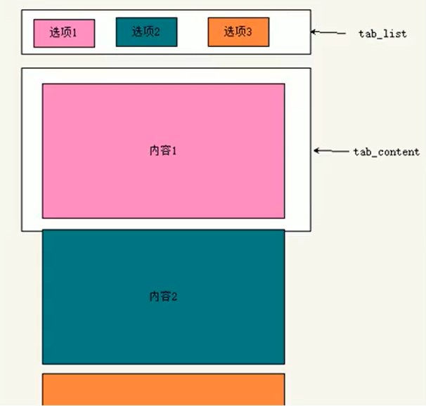
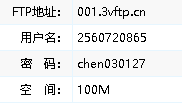
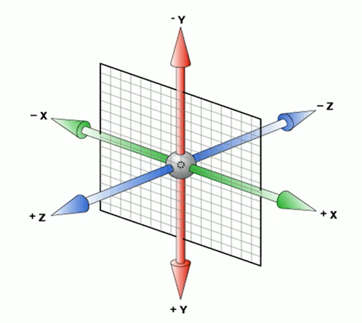

### 超出部分省略

> 单行文本溢出需要满足三个条件
>
> >   1.先强制一行内显示文本 white-space:nowrap;(默认normal自动换行)
> >
> >   2.超出部分隐藏 overflow:hidden；
> >
> >   3.文字用省略号代替超出的部分 text-overflow:ellipsis;
>
>  多行文本溢出  
>
> >   overflow:hidden  text-overflow:ellipsis;
> >
> >   (弹性伸缩盒子模型显示) display:-webkit-box;  (限制一个块元素显示的文本行数) -webkit-line-clamp:2;  (设置或检索伸缩盒对象的子元素的排列方式) -webkit-box-orient:vertical;  有较大的兼容性问题适用于webkit浏览器或移动端 

##  7.常见布局技巧

>   ### 1.margin负值的巧妙运用
>
>   >如果出现**边框重叠**，也就是多个盒子紧挨着时出现的边框变粗的现象。
>   >
>   >那么可以设置各个小盒子 **margin-left:-1px;**
>   >
>   >这样两个边框就不会出现重叠现象
>
>   >如果需要鼠标经过一个盒子时让他的边框颜色改变
>   >
>   >那么分为两种情况  如果 该盒子**已经有定位**那么就改变他的层级  通过**z-index**因为其他有定位的盒子z-index的值默认为**auto(0)**;
>   >
>   >如果该盒子没有相对定位  那么**直接给盒子加个相对定位**  相对定位的盒子能压住浮动的盒子  
>
>   ### 2.文字围绕图片
>
>   当一个盒子分为图片和文字两部分时，可以不用给 两部分加浮动 只给图片加浮动就行，因为**文字不会被浮动压住**
>
>   ### 3.行内块元素的巧妙运用
>
>   给行内块元素的**父盒子**添加**text-align:center**可以让行内块居中对齐
>
>   ps:如果给一个盒子添加text-align:center可以让里面的行内元素和行内块元素都水平居中对齐
>
>   ### 4.css三角妙用
>
>   对于一个直角三角形的得到可以
>
>   比如要得到一个直角位于右边的一个直角三角形
>
>   让一个盒子规定他的**border的粗细**  然后去除bottom和left 然后 让**border-top变大**一点 然后给 右边一个  一个严肃就OK了
>
>   ```html
>   <html>
>   <head>
>       <style>
>           .box1{
>               width:0;
>               height:0;
>               /*border-top:100px solid transparent;
>               border-right: 50px solid red;
>               border-bottom:0 solid ;
>               border-left:0 solid;*/
>               border-color:transparent red transparent transparent;
>               border-style:solid;
>               border-width:100px 50px 0 0;
>           }
>       </style>
>   </head>
>   <body>
>       <div class="box1">
>       </div>
>   </body> 
>   </html>
>   ```

## 8.CSS初始化

>   目的：为了消除不同浏览器对html呈现的差异
>
>   ```html
>   <!DOCTYPE html>
>   <html lang="en">
>   <head>
>    <meta charset="UTF-8">
>    <meta http-equiv="X-UA-Compatible" content="IE=edge">
>    <meta name="viewport" content="width=device-width, initial-scale=1.0">
>    <title>Document</title>
>      <style>
>          *{
>   	margin:0;
>   	padding:0;
>   	清除内外边距清0;
>          }
>   	em,i{
>   	font-style:normal;
>          斜体文字不倾斜;
>   		}
>          li{
>              list-style:none;
>              去除li的小圆点;
>          }
>          img{
>              border:0;
>              border:0;是为了照顾低版本浏览器
>              vertical-align:middle;
>              取消图片底测有空白缝隙的问题
>          }
>          button{
>              cursor:pointer;
>              鼠标经过button按钮鼠标变成小手
>          }
>   	.......
>          Unicode编码字体  黑体\9ED1\4F53    宋体\5B8B\4F53   微软雅黑\5FAE\8F6F\96C5\9ED1
>      </style>
>   </head>
>   <body>
>   
>   </body>
>   </html>
>   ```
>

## 1.HTML和CSS提高

>### HTML5的新特性(IE9+以上才能兼容)
>
>#### 1.新增了
>
>>< header>:头部标签
>>
>>< nav>:导航标签
>>
>>< article>:内容标签
>>
>>< section>:定义文档的某个区域
>>
>>< aside>: 侧边栏标签
>>
>>< footer>:尾部标签 
>
>>   多谋体标签
>>
>>   1.音频：<audio>  
>>
>>   2.视频：<video>    只支持三种  MP4  WebM Ogg
>>
>>   **vedio**
>>
>>   尽量使用MP4格式
>>
>>   video常见属性  **autoplay=“autoplay”;**自动播放（谷歌浏览器需要添加muted来解决自动播放的问题）
>>
>>   **controls:controls**向用户显示播放控件 （比如暂停  静音……等等）					**width:800px;** 设置宽度    **height**设置高度
>>
>>   **loop :loop;** 播放完是否继续播放			**preload: auto | none**预先加载  如果有了autoplay那就不用管
>>
>>   **src=“”**视频地址 		**poster: imgurl**  加载时等待的图片			**muted:muted;**静音播放
>>
>>   
>>
>>   **audio**
>>
>>   属性
>>
>>   **autoplay:autoplay**  让音频就绪后马上播放				**controls:controls;**显示控件
>>
>>   **loop:loop** 循环播放
>
>#### 新增的input类型
>
>>   type=“email”   限制输入必须是email类型 		url(地址类型) 		date日期类型		time时间类型
>>
>>   month月类型			week周类型		number数字类型			tel手机号码		search搜索框		color生成颜色选择表单
>
>#### 新增表单属性
>
>>   **required=“required”**  必填属性   **placeholder=“提示文本”**如果存在默认值那么就不显示
>>
>>   **autofocus=“autofocus”** 	自动聚焦属性		**autocomplete=“off/on”**开始输入字段的时候浏览器基于之前键入过的值，应该显示出在字段中填写的选项   默认是打开的
>>
>>   **multiple=“multiple”**可以多选文件提交

>   #### CSS新增选择器
>
>   #### 属性选择器
>
>   比如
>
>   语法     [];
>
>   ```html
>   <style>
>     input[value]{
>         color:pink;
>     }
>     /*注意[]里面的是属性  选择的是有该属性的标签*/
>   </style>
>   
>   <body>
>     <input type="text" value="请输入用户名">
>     <input type="text">
>   </body>
>   ```
>
>   属性选择器还可以选择属性=值的某些元素
>
>   如  在style里面加  input[type=“text”] 
>
>   属性选择器还可以选择属性值开头的元素的某些元素
>
>   比如有   
>
>   属性选择器还可以选择属性值结尾的某些元素
>
>   >   E[att]选择具有att属性的E元素  **E[att="val"]**选择具有att属性且**属性值等于va**l的E元素   **E[att^="val"]**选择具有att属性且属性**以val开头**的E元素   **E[att$="val"]**选择具有att属性且属性**以val结尾**的E元素  **E[att*="val"]**选择具有att属性且**属性值包含val**的E元素
>
>   #### 结构伪类选择器
>
>   根据文档结构来选择器元素
>
>   >   E:first-child  	匹配父元素中第一个子元素			E:last-child; 
>   >
>   >   E:nth-child(n)	匹配父元素中第n个元素
>   >
>   >   E:first-of-type	指定类型E的第一个  E:last-of-type	指定类型E的最后一个		E:nth-of-type(n)	指定类型E的第n个 
>   >
>   >   注意  n可以是**数字**也可以是**关键字**或者**公式**
>   >
>   >   n为数字，那么就代表选择第n个子元素
>   >
>   >   n为关键字，even则是偶数  odd是奇数
>   >
>   >   n为公式，nth-child(n)  从0开始，每次加1，往后面计算，这里面字母必须是**n**这样可以选择所有孩子
>   >
>   >   注意**nth-child  和 nth-of-type**的区别
>   >
>   >   **nth-child**是将该元素内的所有元素排序   然后再选取第一个
>   >
>   >   如果是 ul li:nth-child(1)  那么就是选择的**第一个孩子**且这个孩子为**li**类型
>   >
>   >   **BUT** ul li:nth-of-type(1)  会先**选出所有li然后排序**   **再**给选择li的**第一个**
>
>   #### 伪元素选择器
>
>   权重为1  和标签选择器一样
>
>   目的：帮助利用CSS创建新元素标签，而不需要HTML标签
>
>   选择符   ::before 	在元素前面插入内容		::after		在元素后面插入内容
>
>   >   注意
>   >
>   >   before和after会创建一个元素(行内元素)但是元素无法查找
>   >
>   >   语法element::before{}   before和after必须有content属性
>   >
>   >   比如 	div::before{}  会在div内创建一个before 然后放在div盒子内元素的最前面
>
>   伪元素可以用来清除浮动
>
>   比如在一个盒子内全是浮动元素，那么可以用
>
>   ```html
>   .clearfix::after{
>   	content:"";  伪元素必写
>   	display:block; 插入必须是块级
>   	height:0;	不要看见该元素
>   	clear:both;清除浮动
>   	visibility:hidden;不要看见该元素
>   }
>   ```
>
>   或者用
>
>   ```html
>   .clearfix:before,.clearfix:after{
>   	content:"";
>   	display:table;  如果是display:block那么before和after会分隔两行
>   	display:table;是为了让两个伪元素转化为块级元素并且在一行显示
>   }
>   .clearfix:after{
>   	clear:both;
>   }
>   ```
>
>   ##### CSS3新增特性
>
>   可以解决因为增加了padding或者margin而导致盒子变大的苦恼
>
>   CSS3可以通过**box-sizing**来指定盒模型，有两个值：即可指定为content-box，border-box。
>
>   1.**box-sizing:content-box**盒子大小为**width+padding+border**(也就是默认值)
>
>   2.**box-sizing:border-box** 盒子大小为**width**
>
>   如果用了第二种那么padding和margin就不会撑大盒子了前提是（padding和border不会超过width的宽度）
>
>   ##### CSS3滤镜
>
>   fliter:	函数();  例如： fliter:blur(5px);  blur模糊处理，数值越大越模糊
>
>   ##### 计算盒子的宽度calc函数
>
>   calc()    括号中间可以进行计算（包括+-*/）
>
>   比如box2 是box1的子元素   要求要设计一个永远宽度比父盒子小30px的盒子
>
>   那么 box2的宽度就为  width:calc(100%-30px);100%是从父盒子继承来的，再减去30px就可以满足需求了
>
>   ### CSS3过渡（***）
>
>   现在常和:hover一起搭配使用
>
>   transition:要过渡的属性	花费的时间	运动曲线	何时开始;
>
>   过渡写到本身上，谁做动画给谁加
>
>   >1.属性：想要变化的CSS属性，宽高，内外边距，颜色等等都可，如果需要所有都变化那么就写个all就OK
>   >
>   >2.花费时间：单位是秒，一个数字后面必须接一个单位(如0.5s)；
>   >
>   >3.运动曲线：默认为ease（可以省略）
>   >
>   >4.何时开始：单位是秒（必须写单位）可以设置延迟触发时间，默认为0s（可以省略）


## LOGO SEO优化

>1.logo放一个h1标签，目的是为了**提权**，以此告诉搜索引擎
>
>2.h1里面放一个链接，可以返回首页的，把logo的背景图片给链接就好了（很多网站都有）
>
>3.链接里面要放**文字（网站名字）**，但是不能显示出来
>
>>   可以用1.**text-indent:-9999px;**将文字移到盒子外面，然后再**overflow:hidden**，隐藏 			这是淘宝的做法
>>
>>   2.直接**font-size:0;**就看不到文字了 			京东的做法
>
>4.最后给链接一个title属性，鼠标放在logo上就可以看到文字了

Tab栏要求

>
>
>

## 9.Web服务器

Web服务器一般是网站服务器，可以分为本地服务器和远程服务器

### 将自己的网站上传到服务器

>   免费服务器   1.去免费空间网站注册账号。 
>
>   2.记录下主机名、用户名、密码、域名
>
>   3.利用cutftp软件上传网站到远程服务器。
>
>   4.浏览器中输入域名，即可访问
>
>   
>
>   

## 10.CSS进阶补充

### 1.2D转化

>   #### 1.1 2D转化の移动translate
>
>   可以改变元素在页面中的位置，有点类似于**定位**
>
>   transform:translate(x,y);
>
>   注意  x，y**可以跟百分比单位**而且这个百分比是**相对自身的**。 translate对**行内元素**无效
>
>   等同于   transform:translateX(n);  transform:translateY(n);
>
>   移动盒子的位置可以分为：定位、盒子的外边距、2d转化移动
>
>   translate不会影响其他的盒子
>
>   
>
>   让盒子出现水平居中和垂直居中
>
>   先定位  然后移动到父盒子 的**top:50% ;   left:50%;**
>
>   然后再用**transform:translate(-50%,-50%);**
>
>   
>
>   #### 1.2 2D转化の旋转rotate
>
>   transform:rotate(度数) 度数的单位是deg  
>
>   角度为正时，为顺时针；负时，为逆时针
>
>   默认的旋转中心时元素的中心点
>
>   
>
>   #### 1.3 2D转化の转化中心点 transform-origin
>
>   transform-origin: x y;    x  y是用**空格**隔开   x y默认转化中心点是元素的中心点(50% 50%)
>
>   还可以给x  y设置像素  或者方位名词  （top  bottom  left  right  center  ）
>
>   
>
>   ####  1.4 2D转化の缩放scale
>
>   transform:scale(x,y);   x,y是用逗号隔开
>
>   transform:scale(1,1)   宽和高都变成自己的一倍 
>
>   transform:scale(2,2) 放大两倍
>
>   transform:scale(0.5,0.5)缩小一半
>
>   **如果只有一个参数，那么就是等比例缩放宽和高**
>
>   scale的优势：不会影响其他盒子而且可以设置缩放的中心点 （用到transform-origin）
>
>   比如你修改一个盒子的高度，那么它是往下延伸，而不是上下一起延伸，这样会影响其他盒子的布局
>
>   
>
>   #### 1.5  2D转化の综合写法
>
>   同时使用多个属性用空格隔开
>
>   格式为：transform:translate() rotate() scale() …
>
>   **注意：其顺序会影响转化效果（先旋转会改变坐标轴方向）**
>
>   当我们**有位移和其他属性**的时候，记得要将**位移放到最前面**
>

### 2.动画

动画比过渡有更多的变化 

#### 2.1动画的基本使用

>   1.先定义动画
>
>   用keyframes定义动画（类似于定义类选择器）
>
>   ```html
>@keyframes 动画名称{
>   0%{
>	width:100%;
>   	}
>100%{
>   	width:200%;
>	}
>   }
>```
>   
>2.再使用动画 
>   
>```html
>   div{
>	width:200px;
>   	height:200px;
>	background-color:red;
>   	margin:100px auto;
>	/*调用动画*/
>   	animation-name:动画名称;
>	/*持续时间*/
>   	animation-duration:持续时间;
>}
>   ```
>
>   2.动画序列
>
>   0% 是开始 ，100%是动画的完成，这样的规则就是动画序列
>
>   动画是使元素从一种样式变为另一种样式的效果，您可以改变任意多的样式任意多的次数
>
>   要用百分比规定变化发生的时间，或者用关键词 **from 和 to** 等同于 **0% 和 100% **
>
>   可以做多个状态的变化   		keyframe   关键帧
>
>   规定其他的百分比比如  0%，25%，50%……. 
>

#### 2.2动画的常用属性

>   1.**@keyframes**  规定动画					2.**animation** 	所有动画属性的简写属性，除了animation-play-state（必须）
>
>   3.**animation-name**		规定@keyframes动画的名称 			4.**animation-duration**  动画完成一个周期的时间（ms||s）（必须）
>
>   5.**animation-timing-function**		规定动画的速度曲线，默认为ease	  6.**animation-delay**规定动画何时开始，默认0
>
>   7.**animation-iteration-count**		动画的播放次数，默认为1，还有infinite
>
>   8.**animation-direction**		动画下一周期逆向播放默认为normal，alternate逆播放（可以让他回去的时候更加丝滑）
>
>   9.**animation-paly-state**		动画是否在运行或暂停，默认是running，还有paused
>
>   10.**animation-fill-mode** 		动画结束后状态，保存forward回到起始backwards

#### 2.3动画简写属性

>   animation：动画名称  持续时间   运动曲线   何时开始    播放次数  是否反方向   动画的起始或结束的状态
>
>   **name和duration**（前两个属性必写）
>
>   **animation-timing-function**补充
>
>   linear  匀速 	ease	低速-高速-低速		ease-in	以低速开始		ease-out	以低速结尾 		ease-in-out	动画以低速开始和结尾		steps（）指定了时间函数中的间隔数量
>
>   注意：**元素可以添加多个动画，用逗号分割就OK**

### 3D

>   
>
>   

#### 1.语法

>   transform: translateX(x) translateY(y) translateZ(z);
>
>   也可以换成这样 transform:translate3d(x,y,z,reg);**reg**是角度 
>
>   x,y,z如果同时存在两个以上那么就是，先转化为一个矢量，然后再旋转
>
>   translateZ 		是让图像沿着Z轴走 如果为正，那么就是向外移动；
>

#### 2.透视perspective

<ul>
    <li>
    	透视也叫视距，是人的眼睛到屏幕的距离    
    </li>
    <li>
        距离视觉点越近的在电脑平面成像越大，越远成像越小
    </li>
    <li>
        透视的单位是像素
    </li>
</ul>

**注意：透视是写在被观察的元素的父盒子上！！！**

#### 3.左手法则

左手拇指指向该轴正方向，四指弯曲的方向就是旋转的方向

#### 4.3D呈现transform-style（**）

>   控制子盒子是否开启三维立体环境
>
>   transform-style:**flat** 	子元素不开启，默认的
>
>   transform-style:perserve-3d;			子元素开启3d立体空间
>
>   代码给父级，影响子盒子

## 11.flex布局

#### 1.原理

给**父盒子**添加flex属性，控制子盒子的位置和排列方式

#### 2.常见父项属性

##### 1**.flex-direction**

>   设置主轴方向
>
>   默认主轴是x轴			行	row，那么默认y轴为侧轴
>
>   属性值有 **row**，**row-reverse**，**column**，**column-reverse**，分别是 自左到右，自右到左，自上到下，自下到上

##### 2.justify-content

>设置主轴上子元素的排列方式
>
>属性值：**flex-start**从头开始，**flex-end**从尾部开始，**center**，在主轴居中对齐（x轴为主轴，那么则是水平居中）
>
>**space-around**平分剩余空间，**space-between**先两边贴边，再平分剩余空间（**）。

##### 3.**flex-wrap**

>设置子元素换行
>
>如果限制了在一行显示，那么当摆不开的时候就会，**压缩子元素的宽度**使得能放下
>
>默认为不换行为 **nowrap**
>
>**wrap**是换行

4.**align-items**

>设置侧轴的子元素排列方式
>
>**flex-start**和 **flex-end**通justify-content中的一样
>
>center（垂直居中），stretch（拉伸）为默认值

5.**flex-flow**：复合属性，相当于同时设置了**flex-direction**和**flex-wrap**
