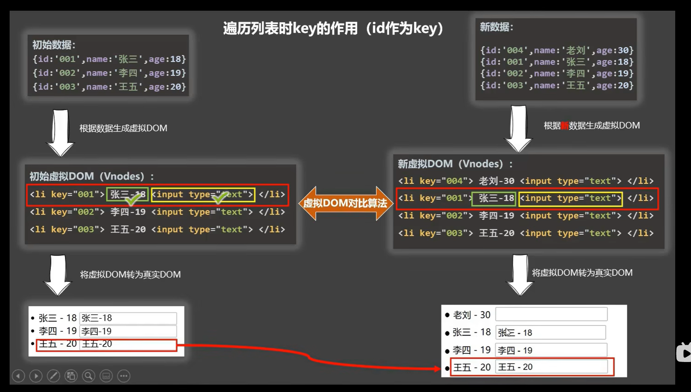
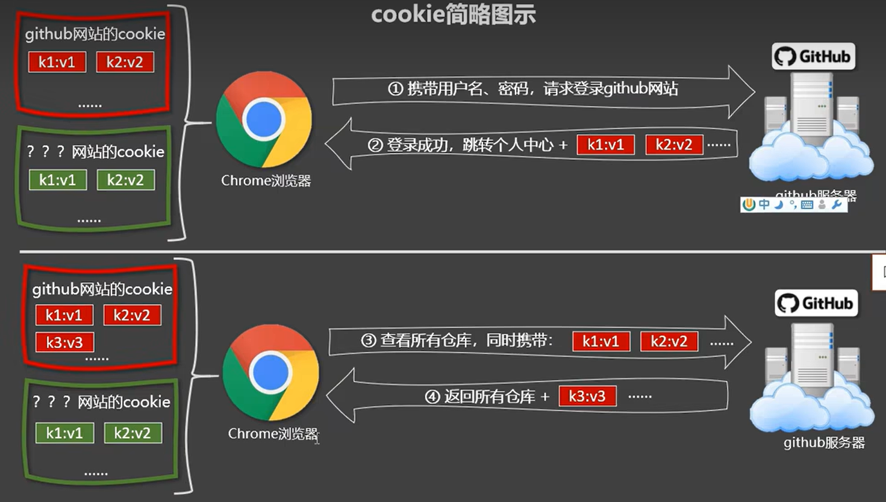

# Vue2

## Vue核心

### 简介

Vue是一套构建用户页面的渐进式框架，Vue可以是自底向上逐层的应用。简单的应用：只需要一个轻量小巧的核心库；复杂应用：可以引用各式各样的Vue插件

Vue特点

1.采用组件化，提高代码复用率，且让代码更好的维护

2.**声明式编码**，让编码人员无需操作DOM，提高开发效率

命令式编码，需要一步步操作

```js
let str = ''
Persons.forEach( p => {
    str +=`<li>${p.id}</li>`
})
let list = document.querySelector('.list')
list.innerHTML = str
```

声明式编码，只用告诉需要得到的结果

```html
<ul id = 'list'>
    <li for="p in Persons">
    {{p.id}}
    </li>
</ul>
```

tips:{{}}这是插值语法

3.使用虚拟DOM+优秀的Diff算法，尽量复用DOM节点。

将数据转化为虚拟DOM再将虚拟DOM变为真实的DOM，当更新时，使用Diff算法，没有差异的不做变化，只改变新的DOM 

导入vue库

1.引入cdn

<script src="https://cdn.jsdelivr.net/npm/vue/dist/vue.js"></script>

### 初始Vue

使用vue

```html
<!DOCTYPE html>
<html lang="en">
<head>
  <meta charset="UTF-8">
  <meta name="viewport" content="width=device-width, initial-scale=1.0">
  <title>Document</title>
  <script src="https://cdn.jsdelivr.net/npm/vue@2.6.14/dist/vue.js"></script>
</head>
<body>
  <div id="root">
    <h1>Hello {{ name }}</h1>
  </div>

  <script type="text/javascript">
    Vue.config.productionTip = false;
    new Vue({
      el: '#root',
      data: {
        name: '橙'
      }
    });
  </script>
</body>
</html>
```

这里el，是element，el用于指定当前Vue实例为哪个容器服务，值通常为css选择器字符串

data，里面存储数据，数据供el所指定容器去使用（插值语法使用），暂时写成一个对象

一个vue实例不能接管两个容器

比如

```html
<head>
    <script src="https://cdn.jsdelivr.net/npm/vue@2.6.14/dist/vue.js"></script>
</head>
<body>
    <div id="root">
        {{name}}
    </div>
    <div id="root">
        {{name}}
    </div>
    <script>

    </script>
</body>
```


注意区分JS表达式和JS代码语句

1.一个表达式会生成 一个值，可以放在任何一个需要值的地方

比如a，a+b，demo(1)，x==y?a:b

JS代码语句

if(){}，for(){}


初始VUe

1.想让Vue工作，就创建一个Vue实例，且要传入一个配置对象；

2.root容器里的代码依然符合html规范，只不过混入了一些特殊的Vue

3.root容器里的代码被称为【Vue模版】

4.Vue实例和容器是一一对应的；

5.真实开发中，只有一个Vue实例，并且会配合组件一起使用

6.{{xxx}}中的xxx要写js表达式，且xxx可以自动读取到data中的所有属性；

7.一旦data中的数据发生改变，那么模版中用到该数据的地方会自动更新


### Vue模版语法

插值语法：{{}}

{{xxx}}，xxx是js表达式，且可以直接读取到data中的所有属性

```html
<div>
    Hello,{{name}}
</div>
<script>
	new Vue({
        el:'div',
        data:{
            name:'Jack'
        }
    })
</script>
```


指令语法：v-???，比如v-bind，很多指令都是`v-`的形式

功能：用于解析标签（包括：标签属性、标签体内容、绑定事件……）

```html
<div id="root">
    <a v-bind:href="url">学习网站</a>
</div>
<script>
	new Vue({
        el:'#root',
        data:{
            name:'Jack'
            url:'http://cn.vue.org'
        }
    })
</script>
```

加了v-bind会让后面的url当作表达量 （引号里面的当做js表达式去执行），v-bind:可以简写成:


### 数据绑定

单向数据绑定：(使用v-bind进行单向绑定)

```html
<div>
    <input type="text" :value="name">
</div>

<script>
	new Vue({
        el:'input',
        data:{
            name:'橙'
        }
    })
</script>
```

双向绑定(使用v-model，只能使用在表单类元素上，也可以是输入类)

```html
<div>
    <input type="text" v-model:value="name">
</div>

<script>
	new Vue({
        el:'input',
        data:{
            name:'橙'
        }
    })
</script>
```

v-model应用在表单类，如input和select等等，v-model:value可以简写为v-model，因为v-model的默认值是value值


### el和data的两种写法

el的写法

```html
<script>
	new Vue({
        el:'#root',
        data:{
			name:'Jack'
        }
    })
    
    const v = new Vue({
        data:{
            name:'Jack'
        }
    })
    v.$mount('#root')
</script>
```

1.创建时配置el

2.先创建Vue实例，随后再通过v.$mount('#root')指定el的值

上下两种方法都可，下面的方法更加灵活。

上面必须是在声明的时候就要想好与哪个挂载在一起


data的写法

````html
<script>
	new Vue({
        el:'#root',
        /*对象式*/
        data:{
			name:'Jack'
        }
    })
    new Vue({
        el:'#root',
        /*函数式*/
        data(){
            console.log('@@@',this)//此处的this是Vue实例化对象
            return{
                name:'Jack'
            }
        }
    })
</script>
````

方式：对象式和函数式，学习组件的时候必须是函数式，不然会报错

切记：由Vue管理的函数，一定`不要写箭头函数`，一旦写了箭头函数，this就不是Vue实例了。


### MVVM模型

M：model模型，对应data中的数据

V：View视图，模版

VM：视图模型ViewModel，Vue的实例化对象。

data的所有属性，最后都出现在了vm身上

vm身上的所有属性及Vue原型上所有属性，在Vue模版中都可以直接使用


### 数据代理（Object.defineProperty）

回顾Object.defineProperty方法

Object.defineProperty(容器名,’加入的属性’,{value:18,…..})

```html
<script>
    let number = 18
	let person = {
        name:'三',
        sex:'男'
    }
    Object.defineProperty(person,'age',{
        value:number,
        enumerable:true,//控制属性是否可以枚举 ，默认值是false
        writable:true,//控制属性是否可以修改值，默认值是false
        configurable:true,//控制属性是否可以被删除，默认值是false
    })
    console.log(person)
</script>
```

但是这样的不会让value随着number的变化而变化.。

如果想完成value会随着number的变化而变化那么需要一个函数来解决

get()当有人读取age的属性时，get函数就会被调用，且返回值就是age的值

```html
<script>
    let number = 18
	let person = {
        name:'三',
        sex:'男'
    }
    Object.defineProperty(person,'age',{
        /*get:function(){
            console.log('使用函数了')
            return number
        }*/
        get(){
            console.log('使用函数了')
            return number
        }
        //set()当有人修改age的属性时，set函数就会被调用，且返回值就是age的值
        set(value){
        	//有人修改了age属性
        	number = value
    	}
    })
    console.log(person)
</script>
```


数据代理将值进行关联管控

```js
const obj = {x:100}
    const obj2 = {y:100}
    Object.defineProperty(obj2,'x',{
      get(){
        return obj.x
      },
      set(value){
        obj.x = value
      }
    })
```

将obj的x交给obj2进行代理，当使用到obj2里面的x时，会自动返回obj.x，然后修改obj2里面的x时，因为是代理的obj的x，所以obj的x会修改。


Vue中的数据代理就是Object.defineProperty实现的

假如有个**const vm = new Vue({el:’#root’,data:{name:’Zhang’,age:18}})**

这里的data时挂载在vm上的，为vm上的_data属性

`vm._data.name===vm.name   值为true`


Vue中的数据代理

1.通过vm对象来代理data对象中的属性操作（读/写）

好处：更加方便的操作data中的数据

3.基本原理：通过Object.defineProperty()把data对象中所有属性添加到vm上。

为每一个添加到vm上的属性，指定一个getter和setter。在getter和setter内部去操作（读/写）data中对应的属性


### 事件处理

事件的基本使用：

1.使用v-on:xxx或者@xxx绑定事件，xxx是事件名

2.事件的回调需要配置再methods对象中，最终会在vm上

3.methods中配置的函数，不能使用箭头函数，否则this就不是vm

4.methods中配置的函数，都是被Vue所管理的函数，this指向的vm或组件实例对象

5.@click=‘demo’和@click=‘demo($event)’效果一致，但是后者可以传入参数

使用v-on进行一个事件绑定

```html
<div id='root'>
    <h1>
        欢迎来到{{name}}
    </h1>
    <button v-on:click='showInfo'>点击</button>
</div>
<script>
	const vm = new Vue({
        el:'#root',
        data:{
            name:'祖安'
        },
        methods:{
            /*showInfo(){
                console.log(this)//打印的vm实例
            }*/
            showInfo:(event)=>{
				console.log(this)//this指向的window
            }
        }
    })
</script>
```

v-on:可以简写为@

1.prevent:阻止默认事件：@click.prevent=“showInfo”

2.stop:阻止冒泡事件：@click.stop=“showInfo”

3.once:事件只触发一次：@click.once = “showInfo”

4.capture:使用事件的捕获模式：@click.capture=“showInfo”

5.self:只有event.target是当前操作的元素时才触发事件

6.passive:事件的默认行为立即执行，无需等待事件回调执行完毕


```html
<div @click='showInfo'>
    <a href="www.baidu.com" @click.prevent.stop="showInfo">提示信息</a>
</div>
@click.prevent阻止默认事件，@click.stop阻止冒泡事件，连着写可以阻止冒泡和默认事件。
```


#### 键盘事件

Vue中常用的按键别名:回车=>enter		删除=>delete(捕获删除和退格键)		退出=>esc		空格=>space		换行=>tab（特殊需要配合keydown使用）			上=>up		下=>down		左=>left		右=>right

2.Vue中未提供别名的按键，可以使用按键原始的key值进行绑定，但是要注意转化为kebab-case(短横线命名)

3.系统修饰键（用法特殊）：ctrl、alt、shift、meta（windows键），可以配合keyup使用：按下修饰键的同时，再按下其他键，随后释放其他键，让事件触发。

4.可以使用keyCode去指定具体的按键（不推荐）

5.Vue.config.keyCodes.自定义键名 = 键码，可以去定制按键别名

```html
<input type="text" @keydown.tab='showInfo'>
```

keydown按下按键		.tab按下tab键就会触发showInfo事件

```html
<input type="text" @keydown.ctrl.x="showInfo">
```

按下ctrl+x触发showInfo事件


### 计算属性

将原来的属性加工计算得到全新的属性。

计算属性和属性时分开放的，属性时放在data里面，计算属性时在computed

```js
new Vue({
    el:'#root',
    data:{
		firstName:'张',
      	lastName:'三'
    },
    computed:{
		fullName:{
            //get有什么作用？当有人读取fullName时，get被调用，且返回值就作为fullName的值
            get(){
                return this.firstName + '-' + this.lastName
            }
        }
    }
})
```

computed会将里面的属性缓存，下次使用的时候会直接使用缓存的值，就不用再次调用fullName里面的get函数

所以get调用是在，初次读取fullName时，2.所依赖的数据发生变化时

data和methods的东西会直接挂载在vm上，而computed不会，他会首先调用get函数，得到它的返回值再给fullName


1.定义：要用的属性不存在，要通过`已有的属性 `计算得来

2.原理：底层借助了Object.defineProperty方法提供的getter和setter

3.get函数什么时候执行：初次读取fullName时，2.所依赖的数据发生变化时

4.优势：与methods实现相比，内部有缓存机制（复用），效率更高，调试更方便。

5.备注：1.计算的属性最终会出现再vm上，直接读取使用即可

​					2.如果计算的属性要被修改，那必须写set函数去响应修改，且set中要引起计算时依赖的数据发生变化

#### 计算属性简写方法

完整写法：

```js
fullName:{
    get(){
        return this.firstName+'-'+this.lastName
    },
    set(value){
        const arr = value.split('-')
        this.firstName = arr[0]
        this.lastName = arr[1]
    }
}
```


```js
fullName(){
	return this.firstName+'-'+this.lastName
}
```

这里的fullName的简写（`只包括get`）

当数据没有使用，且数据变化了的情况下，开发者工具里面的数据不会变化，但是实际上是变化了的，可以通过console调试来看


### 监视属性

watch属性（是一个对象），有两个值，new和old，new是监视后改变的值，old是改变之前的值

监视的data里面的属性，或者是computed的计算属性，如果都不是也不会报错的

```js
new Vue({
    el:'#root',
    data:{
        isHot:true
    },
    watch:{
        isHot:{
            immediate:true,//初始化时让handler调用一下
            handler(newValue,oldValue){
                console.log('isHot被修改了',newValue,oldValue)
            }
        }
    }
})
```

handler的调用，isHot发生了改变。

这里还有immediate属性，意思是初始化的时候让handler调用一下

如果给vue在外面添加监视属性，那么应该是

```js
new Vue({
    el:'#root',
    data:{
        isHot:true
    },
    /*watch:{
        isHot:{
            immediate:true,//初始化时让handler调用一下
            handler(newValue,oldValue){
                console.log('isHot被修改了',newValue,oldValue)
            }
        }
    }*/
})
vm.$watch('isHot',{
    immediate:true,//初始化时让handler调用一下
    handler(newValue,oldValue){
        console.log('isHot被修改了',newValue,oldValue)
    }
})
```

监视属性watch：

​			1.当被监视的属性变化时，回调函数自动调用，进行相关操作

​			2.监视属性必须存在，才能进行监视！！

​			3.监视的两种写法：

​			（1）new   Vue时传入watch配置

​			（2）通过vm.$watch监视

#### 深度监视：

只监视属性里面的成员需要.来访问成员，但是这样会报语法错误，因此还原为最本质的存在用引号包裹名称‘numbers.a’:{}来进行一个监视

```js
Vue.config.productionTip = false
    const vm = new Vue({
      el: '#root',
      data: {
        numbers:{
          a:1,
          b:1
        }
      },
      watch: {
        'numbers.a':{
            console.log('改变了')
        }
      }
    })
```

如果只是写了numbers，那么无论里面的值如何变化都不会有任何响应

```js
Vue.config.productionTip = false
    const vm = new Vue({
      el: '#root',
      data: {
        numbers:{
          a:1,
          b:1
        }
      },
      watch: {
        numbers:{
            deep:true,//检测多级结构中所有属性的变化
            handler:{
			console.log('numbers改变了')
            }
        }
      }
    })
```

像上面的例子无论，ab怎么改变，numbers不改变，因为numbers:{}检测的是numbers对应的地址，只有彻底替换掉numbers才会触发。所以可以通过添加`deep`属性来进行深度监视，添加deep之后无论a还是b变化都可以看作是numbers变化。Vue默认能够深度监测属性的，`但是`为程序员提供的watch是默认不能深度监测的，如果需要那么就需要添加属性deep:true，来实现。

深度监视的特点：（1）Vue中的watch默认不监视对象内部值的改变（只有一层监视），Vue能监测对象内部值的改变，但是其提供的watch默认不能（2）配置`deep:true`可以检测对象内部值改变（多层）。

使用时根据结构，选择是否需要深度监视


#### 监视属性的简写

如果没有immediate和deep等属性，只有handler函数那么可以写成

```js
//完整的写法
        // isHot:{
        //   // immediate:true,
        //   // deep:true,
        //   handler(newValue,oldValue){
        //     console.log('isHot被修改了',newValue,oldValue)
        //   }
        // }
	isHot(newValue,oldValue){
          console.log('isHot被修改',newValue,oldValue)
        }
```

这是在Vue中进行操作的

如果是在Vue外的话，那么也是如此

```js
vm.$watch('isHot',function(){
           console.log('isHot被修改了',newValue,oldValue)
     })
```


`切记`Vue挂载的函数一定是普通函数，使用箭头函数会指向window

可以用watch来实现全名的更新

例如：

```js
 watch: {
        firstName (newValue) {
          setTimeout(()=>{
              this.fullName = newValue+'-'+this.lastName
          },1000)
        },
        lastName (newValue) {
          this.fullName = this.firstName +'-'+newValue
        }
      }
```

但是computed更加方便，倘若需要延迟一秒才进行更改名字，那么只能用监视属性，而不能用computed，因为实现不了，因为computed就是靠的他的返回值，而不能等待再得到返回值。`计算属性里面`不能开启异步任务，去维护数据.

这个setTimeout的定时器的回调就是js指定的回调，而且在调用的时候，就已经指向window。

computed和watch之间的区别：

​	1.computed能完成的功能，watch都可以完成。

​	2.watch能完成的功能，computed不一定能完成，例如：watch可以进行异步操作。

两个重要的小原则：

​	1.所被Vue管理的函数，最好写成普通函数，这样this的指向才是vm或组件实例对象

​	2.所有不被Vue所管理的函数（定时器的回调函数、ajax的回调函数等），最好写成箭头函数，这样this的指向才是vm或组件实例对象


### class和style绑定

#### class绑定

有三种类型，字符串写法，数组写法，对象写法，各个写法的适用场景不同

```html
<!-- 绑定class样式————字符串写法 :是v-bind的简写，适用于样式的类名不确定的情况下，需要动态指定-->
    <div class="basic" :class="mood" id="demo"@click="changeMood">{{name}}</div><br><br>

    <!-- 绑定class样式————数组写法 要绑定的样式个数和名字都不确定-->
    <div class="basic" :class="classArr">{{name}}</div><br><br>
    
    <!-- 绑定class样式————对象写法：适用场景，要绑定的样式和名字不确定，而且动态决定是否使用 -->
    <div class="basic" :class="classobj">{{name}}</div><br><br>
<script>
    Vue.config.productionTip = false;
    new Vue({
      el:'#root',
      data:{
        name:'尚硅谷',
        mood:"normal",
        classArr:['at1','at2','at3'],
        classobj:{
          at1:true,
          at2:false,
          at3:true
        }
      },
      methods:{
        changeMood(){
          // document.querySelector('#demo').className = 'basic happy'  最好不要直接操作DOM
          const arr = ['happy', 'normal','sad']
          const i = Math.floor(Math.random()*3)
          this.mood = arr[i]
        }
      }
    })
  </script>
```


style常见的绑定也有三种，第二种比较常用（绑定数组类型），第三种少见

```html
<div class="basic" :style="{fontSize: fsize+'px'}">{{name}}</div><br><br>

    <div class="basic" :style="styleObj">{{name}}</div><br><br>

    <div class="basic" :style="[styleObj,styleObj2]">{{name}}</div><br><br>
<script>
    Vue.config.productionTip = false;
    new Vue({
      el:'#root',
      data:{
        name:'尚硅谷',
        fsize:40,
        styleObj:{
          fontSize:'40px',
          color:'red'
        },
        styleObj2:{
          background:'orange'
        }
      },
      }
    })
    
  </script>
```

总结：

​	class样式：

​		写法:class=“xxx”，xxx可以是字符串，数组和对象；字符串写法适用于：类名不确定，需要动态获得；数组写法适用于：要绑定多个样式，个数不确定，名字也不确定；`对象写法`：适用于要绑定多个样式，个数确定，名字也确定，但是不确定是否使用

​	style样式：

​			:style=“{fontSize:xxx+‘px’}”其中xxx是动态值

​			:style=“[a,b]”，其中a、b是样式对象


### 条件渲染

使用v-show和v-if（和v-if配套的还有v-else与v-else-if）

v-show，主要是与display相关，不会影响结构；

而v-if会影响结构，导致结构消失而不是不可见

```html
<div v-if="n == 1">Angular</div>
    <div v-else-if="n == 2">React</div>
    <div v-else-if="n == 3">Vue</div>
```

这样的三个不能散开

如果都是一个值类型那么可以使用<template>来包含三个内容，最终渲染的时候不会渲染template，相当于他是一个跳板而已

```html
<template v-if="n==1">
	<h2>1</h2>
    <h2>2</h2>
    <h2>3</h2>
</template>
```

template只能和v-if使用，不能和v-show一起使用

v-if

​	写法：

​		1.v-if=“表达式”               2.v-else=“表达式”				3.v-else-if=“表达式”

​		适用于切换频率低的场景。特点：不展示DOM元素`直接被移除`。注意：但要求结构不能被“打断”

​	v-show

​		写法：v-show=“表达式”

​		适用于切换频率高的场景。特点：不展示DOM元素`没有被移除`，只是display:none

使用v-if的时候，元素可能无法获取到，而使用v-show一定可以获取

### 列表渲染

#### v-for

```html
<li v-for="person in persons":key="person.id">{{person.name}}-{{person.age}}</li>
```

倘若:key固定那么会直接报错，而且react如果没有那个key的话，那么会报错。

```html
<li v-for="(p,index) in persons" :key="index">{{p.name}}------{{p.age}}</li>
```

第一个就是对象，第二个是索引值

遍历对象的时候，是先取得value再取得key值，数组可以使用in或者of，而对象只能是of取值，


同样v-for，可以用来遍历字符串（用的少）

故绑定类型类型：Array | Object | number | string | Iterable

指令值，必须使用特殊语法：alias in expression 为正在迭代的元素提供一个别名。

或者，你可以为索引指定别名（如果是对象，则是键值对的形式）

```html
<div v-for="(item,index) in items">
    {{item}}----{{index}}
</div>
<div v-for="(value,key) in object">
    {{item}}----{{key}}
</div>

<div v-for="(value,name,index) in object">
    {{value}}----{{name}}-----{{index}}
</div>
```

如果v-for要进行强制排序，那么使用特殊的attribute，`key`来做一个排序提示

```html
<div v-for="item in items" :key="item.id">
    {{item}}----{{index}}
</div>
```

可以用of替代in

还可以指定次数（用的少）

```html
<li v-for="(a,b) in 5"></li>
<!--第一个值时value，第二个时索引--!>
```


#### key的原理

```html
<li v-for="(p,index) in persons" :key="index">{{p.name}}------{{p.age}} <input type="text"></li>
```

这个会出现错乱的情况，输入框错位。但是`:key=‘p.id’是不会出现问题`


虚拟DOM算法进行一个对比，`对比的虚拟DOM`，标签一样，故会继承；不一致，那么名字替换。一行一行进行对比。

如果没有出现打乱数据顺序的操作是可以使用index作为key的标识，而出现了那么只能用`唯一确定且不会重复或更改的数据`作为标识（比如id）

如果key是index，向数组的头部插入一个元素得到新数组，由于使用index来当作key，所以他会和之前同index内容相同（如上图）。但是如果使用id作为key，每个元素的id皆不同，故他原有的input会跟原有的内容一样。




总结：


#### 列表过滤

使用filter函数

使用indexOf查看数据的名字中是否包含某某字符串。如果不包含值为-1（空字符串的indexOf值为0）

使用watch实现监视属性

```html
<!DOCTYPE html>
<html lang="en">
<head>
  <meta charset="UTF-8">
  <meta name="viewport" content="width=device-width, initial-scale=1.0">
  <script src="../JS/vue.js"></script>
  <title>列表渲染</title>
</head>
<body>
  <div id="root">
     <h2>人员列表</h2>
     <input type="text" placeholder="请输入姓名" v-model="keyWord">
     <ul>
      <li v-for="(p,index) in filterPersons" :key="index">
        {{p.name}}-{{p.age}}-{{p.sex}}
      </li> 
     </ul>
  </div>
</body>
<script>
  Vue.config.productionTip = false
  new Vue({
    el:'#root',
    data:{
      keyWord:'',
      persons:[
        {id:1,name:'马冬梅',age:18,sex:'female'},
        {id:2,name:'周冬雨',age:19,sex:'female'},
        {id:3,name:'周杰伦',age:20,sex:'male'},
        {id:4,name:'温兆伦',age:22,sex:'male'},
      ],
      filterPersons:[]
    },
    watch:{
      /*keyWord(val){//这里的val是新值
        this.filterPersons = this.persons.filter((p)=>{
          return p.name.indexOf(val)!==-1
        })
      }*/
      keyWord:{
        immediate:true,
        handler(val){
          this.filterPersons = this.persons.filter((p)=>{
            return p.name.indexOf(val)!==-1
          })
        }
      }
    }
  })
</script>
</html>
```

空字符串是可以查询到的，查询到的`值为0`，而非-1

也可以换做computed实现

```js
new Vue({
      el:'#root',
      data:{
        keyWord:'',
        persons:[
          {id:1,name:'马冬梅',age:18,sex:'female'},
          {id:2,name:'周冬雨',age:19,sex:'female'},
          {id:3,name:'周杰伦',age:20,sex:'male'},
          {id:4,name:'温兆伦',age:22,sex:'male'},
        ]
      },
      computed:{
        filterPersons(){
          return this.persons.filter((p)=>{
            return p.name.indexOf(this.keyWord)!==-1
          })
        }
      }
    })
```

计算属性需要直接返回值才能得到。上面依赖的是keyWord的变化


#### 列表排序

对于列表排序，可以使用一个数来判定到底是升序还是降序或者原封不动，那么就需要一个计算属性进行得到

```js
Vue.config.productionTip = false
  new Vue({
    el:'#root',
    data:{
      keyWord:'',
      sortType:0,//0代表原顺序，1代表降序，2升序
      persons:[
        {id:1,name:'马冬梅',age:30,sex:'female'},
        {id:2,name:'周冬雨',age:19,sex:'female'},
        {id:3,name:'周杰伦',age:31,sex:'male'},
        {id:4,name:'温兆伦',age:22,sex:'male'},
      ]
    },
    computed:{
      filterPersons(){
        const arr = this.persons.filter((p) => {
          return p.name.indexOf(this.keyWord)!==-1
        })
        if(this.sortType){
          arr.sort((a,b) =>{
            return this.sortType === 1? b.age - a.age : a.age - b.age
          })
        }
        return arr
      }
    }
  })
```


#### 更新时的一个问题

   如果直接将数据的地址进行替换，那么可能出现检测不到的情况

```js
const vm= new Vue({
    el:'#root',
    data:{
      persons:[
        {id:1,name:'马冬梅',age:30,sex:'female'},
        {id:2,name:'周冬雨',age:19,sex:'female'},
        {id:3,name:'周杰伦',age:25,sex:'male'},
        {id:4,name:'温兆伦',age:22,sex:'male'},
      ]
    },
    methods:{
      updateMei(){
        // this.persons[0].name = '罗冬梅'
        // this.persons[0].age = 18
        this.persons[0] = {name:'杨冬梅',age:18,sex:'male'} //数据是发生了改变的但是，没有vue没有监测到数据变化
      }
    }
  })
```

比如上文的更新方法，不能让vue检测到，故点击更新按钮后，数据页面仍然不会发生变化

先引入：

#### Vue检测数据改变的原理

data是与vm._data挂钩的（vm是vue的实例对象），data对象经过加工，赋值给vm. _data。

在vm._data里面存在setter和getter，当data数据改变时，其中的函数被调用，然后页面和vm. _data就改变

```js
let data={
	name:'abc'
}
Object.defineProperty(data,'name',{
    get(){
        return data.name
    },//这个get是错误的，因为无限递归导致内存超限了，因为读取data.name那么 
    set(val){
        data.name=val
    }
})
```

Vue检测始终是靠着set来监视属性的

```JS
function Observe(obj){
    //汇总对象中所有属性形成一个数组
    const keys = Object.keys(obj)
    keys.forEach(k =>{
      Object.defineProperty(this,k,{
        get(){
          return obj[k]
        },
        set(val){
          console.log(`${k}被更改，需解析模版生成虚拟DOM......`)
          obj[k] = val
        }
      })//this指的实例对象
    })
  }
```

这里只有一层监视，倘若有很多层那么需要递归去监视


#### Vue.set的使用

如果data里面存在a，而在a中不存在b,那么使用a.b是不会报错的会出现undefined，但是Vue里面的undefined不会显示出来。

但是如果data里面`第一层没有a`，那么肯定`会报错`。

Vue后天加的属性没有响应式，比如data里面有个student，student里面没有sex，在实例化之后再添加的sex，那么这个sex是`没有getter和setter`的。

可以借助API去给后天加的数据也有响应式，使用`Vue.set()`

比如

```js
Vue.set(vm._data.student,'sex','男')
```

Vue.set(父数据项，‘添加的属性名称’，属性值)或者使用vm.$set(target,key,val)（vm是Vue的实例化对象）

因为vm._data.student === vm.student.

注意：target不能是vm（Vue实例）或者vm.data（Vue实例的根数据对象）


#### Vue检测数据改变的原理_数组

如果里面是一个数组，是没有为每一项匹配getter和setter的。

```js
const vm = new Vue({
    el:'#root',
    data:{
      student:{
        hobby:['抽烟','喝酒','打架','烫头'],
    }
  })
```

比如这个hobby就没有单独的setter和getter 但是当hobby改动里面的每一项是没有响应式的

```js
const vm = new Vue({
    el:'#root',
    data:{
      student:{
        hobby:{
            h1:'抽烟',h2:'喝酒',h3:'打架',h4:'烫头',
        }
    }
  })
```


改变了但是没能监视到

但是当使用`push,pop,shift,unshift,splice,reverse,sort`等函数的时候可以被vue检测进行一个重新展示数据

因此如果需要更改数组中的元素使其奏效那么，应该使用splice(0,1,’更改的值’)

splice(起始索引，终止索引，需要填充的值)，如果第三个不写那么就是`删除[起始索引，终止索引)的值，不包括终止索引上的`

arr.push===Array.prototype.push        值是true

但是vm._data.student.hobby.push  ===Array.prototype.push  值是false

因为左边这个push是先使用的vue写出来的push，这个push，先调用Array.prototype.push，然后再重新解析模版生成图像。故左边push不等于右边push。

也可以使用Vue.set(vm.student.hobby,1,’打台球’)

数组中添加一个新的对象，这个对象是响应式的


#### 总结Vue监视数据

1.Vue会监视data所有层次的数据


2.如何检测对象中的数据？

​	通过setter实现监视，且要在new Vue时要传入要检测的数据

​	（1）对象中后追加的属性，Vue默认不做响应式处理

​	（2）如果需要追加响应式，要使用以下API

​				Vue.set(target,key/index,value)             或者vm.$set(target,key/index,value)

3.如何检测数组中的数据？

​			通过包裹数组更新元素的方法实现，本质上做了两件事，（1）调用原生的对应方法对数组更新（比如Array.prototype.push）（2）重新解析模版，进而更新页面


4.Vue修改数组中的某个元素一定要使用下面的方法：

​		（1）使用这些API：push() ,pop() ,shift() ,unshift() ,splice(), sort(), reverse()

​		（2）使用Vue.set()或者vm.$set()

特别注意：Vue.set()或者vm.$set()`不能`给vm或者vm的根数据对象（比如data）添加属性！！！！

监视所有属性的行为叫做数据劫持，比如修改student时，student的setter劫持到了变化，然后就重新解析模版，进而更新 


### 收集表单数据


示例代码：

```html
<!DOCTYPE html>
<html lang="en">
<head>
  <meta charset="UTF-8">
  <meta name="viewport" content="width=device-width, initial-scale=1.0">
  <script src="../JS/vue.js"></script>
  <title>收集表单数据1</title>
</head>
<body>
  <div id="root">
    <form @submit.prevent="demo">
      <label for="id">账号：</label> <input type="text" id="id" v-model.trim="userInfo.account"><br> <br> 
      <label for="password">密码：</label> <input type="password" id="password" v-model="userInfo.password"><br><br> 
      <label for="number">年龄</label> <input type="number" id="number" v-model.number="userInfo.age"><br><br> 
      性别： 
      <label for="male">男</label><input type="radio" id="male"name="sex" value="male" v-model="userInfo.sex"> 
      <label for="female">女</label><input type="radio" id="female" name="sex" value="female" v-model="userInfo.sex">  <br><br> 
      爱好：
      <label for="eating">吃饭</label><input type="checkbox" name="hobby" id="eating"v-model="userInfo.hobby" value="eat"> 
      <label for="sleep">睡觉</label><input type="checkbox" name="hobby" id="sleep"v-model="userInfo.hobby" value="sleep"> 
      <label for="play">打豆豆</label><input type="checkbox" name="hobby" id="play"v-model="userInfo.hobby" value="play">
      <br><br>
      <select v-model="userInfo.city">
        <option value="">请选择校区</option>
        <option value="beijing">北京</option>
        <option value="shanghai">上海</option>
        <option value="hangzhou">杭州</option>
      </select>
      <br><br>
      其他信息：
      <textarea name="" id="" cols="30" rows="10" v-model.lazy="userInfo.other"></textarea><br><br>
      <!-- 上面不需要实时收集，只需要输入完收集，故加个lazy修饰符 -->
      <input type="checkbox" v-model="userInfo.agree">阅读并且接受协议 <a href="www.atguigu.com">《用户协议》</a>
      <button>提交</button>
    </form>
  </div>
</body>
  <script>
    Vue.config.productionTip = false
    const vm = new Vue({
      el:'#root',
      data:{
        userInfo:{
          account:'',
          password:'',
          sex:'',
          hobby:[],
          city:'',
          other:'',
          agree:'',
          age:18
        }
      },
      methods:{
        demo(){
          console.log(JSON.stringify(this.userInfo))
        }
      }
    })
  </script>
</html>
```


### 过滤器

写法 

```html
    <h2>现在的时间是{{time | timeFormater}}</h2>
<script>
	new Vue({
        el:'#root',
        data:{
            time:1691594105209
        },
        filters:{
            timeFormater(val){
                return dayjs(val).format('YYYY年MM月DD日 HH:mm:ss')
            }
        }
    })
</script>
```

它会把前面的time这个数据作为参数传入到timeFormater()中，然后展示该函数的返回值

写在Vue里面的filters里面的过滤器是局部过滤器，而Vue.filter(name,callback)是`全局过滤器`

过滤器还可以写在标签里面使用v-bind:进行绑定

过滤器定义：对要显示的数据进行特殊格式化后再显示（适用于一些简单的逻辑）

语法：1.注册过滤器：Vue.filter(name,callback)或者new Vue({filters:{}})

2.使用过滤器： {{xxx | 过滤器名}}   或者   v-bind:属性 =  ‘xxx | 过滤器名’

1.过滤器也可以接收额外参数、多个过滤器也可以串联

2.原本数据不改变，是产生新的数据例如，数组中的filter方法


### 内置指令

学过的指令：v-bind：，单向绑定解析表达式，可简写为:xxx				v-model：双向绑定			v-for：遍历数组/对象/字符串				v-on：绑定监听事件			v-if：条件渲染（动态控制节点是否存在）	v-else：条件渲染

v-show：条件渲染（动态控制节点是否展示）

#### v-text

作用：向其所在节点中渲染文本内容


```html
<div>
    {{name}}
</div>
<div v-text="name">
</div>
```

两者的内容相同

后者是拿name的内容去替换掉`整个div里面的内容`

v-text也不会解析标签，v-text是把整个字符串当作文本解析掉

插值语法更灵活


#### v-html

也是向节点中渲染文本内容

v-html能解析标签



cookie

千万切记不能让别人拿到你的cookie不然，别人可以模范信息去做坏事


#### v-cloak

当Vue加载完成就去除掉v-cloak，可以使用v-cloak让未经过解析的模版在页面上展示


本质：特殊的属性，Vue实例创建完毕并接管容器后，会删除掉v-cloak属性

使用css配合v-cloak可以解决网速慢时页面展示出{{xxx}} 的问题

```html
<html>
    <head>
        <style>
            [v-cloak]{
                display:none;
            }
        </style>
    </head>
    <body>
        <div id="root">
            <h2 v-cloak>
                {{name}}
            </h2>
        </div>
    </body>
    <script>
    	new Vue({
            el:'#root',
            data:{
                name:'xxxx'
            }
        })
    </script>
</html>
```


#### v-once

保留数据初始化的值

```html
<html>
    <head>
    </head>
    <body>
        <div id="root">
            <h2 v-once>
                n的初始值为：{{n}}
            </h2>
            <h2>
                n的值为：{{n}}
            </h2>
            <button @click="n++">
                点击n++
            </button>
        </div>
    </body>
    <script>
    	new Vue({
            el:'#root',
            data:{
                n:1
            }
        })
    </script>
</html>
```

v-once所在节点在初始渲染了之后，就视为静态内容了

以后数据的改变不会引起v-once所在结构的更新，可以用于优化性能


#### v-pre

跳过其所在节点的编译过程。

可以用它跳过，没有使用指令语法，没有使用插值语法的节点，会加快编译。（让Vue不去解析这些东西）

```html
<h2 v-pre>
    Vue不难
</h2>
<button v-pre a='1' @click="n++">点我n+1</button>
```

查看源代码的时候就是上述的东西<h2 v-pre>Vue不难</h2>，<button v-pre a='1' @click="n++">点我n+1</button>	


### 自定义指令

使用全新的配置项：directives

```html
<body>
  <div id="root">
    <h2>当前的n值是<span v-text="n"></span></h2>
    <h2>放大十倍的n值是<span v-big="n"></span></h2>
    <button @click="n++">点我n+1</button>
  </div>
</body>
<script>
  Vue.config.productionTip = false
  new Vue({
    el:'#root',
    data:{
      n:1
    },
    directives:{
      // big:function(){
        // element.innerText = binding.value*10
      // }
      big(element,binding){
        element.innerText = binding.value*10
      }
    }
  })
</script>
```

big`函数`在指令与元素成功`绑定`时调用一次；指令所在模块被重新解析时再次调用 

```js
new Vue({
    el:'#root',
    data:{
      n:1
    },
    directives:{
      // big:function(){
        // element.innerText = binding.value*10
      // }
      big(element,binding){
        element.innerText = binding.value*10
      },
      fbind:{
        // 指令与元素成功绑定时
         bind(element,binding){
          // console.log('bind');
          element.value = binding.value
         },
         //指令所在元素被插入页面时
         inserted(element,binding){
          element.focus()
         },
        //  指令所在模块被重新解析时
        update(element,binding){
          element.value = binding.value
        }
      }
    }
  })
```

写成对象的形式，这样可以明确在不同时期，写不同的事件


如果对于多个单词组合陈 的自定义指令那么不能使用驼峰法命名，因为在标签里面写v-bigNumber会自动转化为bignumber，是无法查找到的，可以用‘’把key括起来。例如

```js
directives:{
    'big-number'(element,binding){
        element.innerText = binding.value*10
    }
}
```

然后标签写为：<span v-big-number="n"></span>

指令里面的this都是`window对象`

全局指令：Vue.directive(‘name’,配置项)

如果是函数形式：Vue.directive(‘name’,function(){})


总结：

定义语法：

局部指令：new Vue({directives:{指令名:配置对象}})         或者new Vue({directives:{指令名:回调函数}})

配置对象中常用的3个回调：(1)bind：指令与元素成功绑定时调用。（2）inserted:指令所在元素被插入页面时调用。（3）update：指令所在模块结构被重新解析时调用。

指令定义时，不加v-；但是使用时，要加。

指令命名倘若是多个单词，要使用kebab-case命名，不能用camelName命名


### 生命周期

引入：

```html
<!DOCTYPE html>
<html lang="en">
<head>
  <meta charset="UTF-8">
  <meta name="viewport" content="width=device-width, initial-scale=1.0">
  <title>Document</title>
  <script src="../JS/vue.js"></script>
</head>
<body>
  <div id="root">
    <h2 :style="{opacity}">欢迎学习Vue</h2>
    {{change()}}
  </div>
</body>
<script>
  Vue.config.productionTip = false
  new Vue({
    el:'#root',
    data:{
      opacity:1
    },
    methods:{
      change(){
        console.log('开启定时器')
        setInterval(()=>{
          this.opacity -=0.01
          if(this.opacity<=0) this.opacity = 1
        },16)
      }
    }
  })
</script>
</html>
```

上面代码会`无限开启定时器`，直至电脑内存溢出卡死。

因为上面setInterval函数里面在`修改opacity`，那么会重新解析模版（也就是root的所有内容），那么他的change()又会被重复调用

解析模版，先变成虚拟DOM，再变为真实DOM，再进行放入页面。我们需要是在放在页面后再去执行，而不是在渲染途中


为了解决上述的苦恼，需要使用一个挂载的东西，也叫mounted(){}，它在Vue完成模版解析并把真实的DOM放入页面后再去调用

上述代码可以改为

```js
Vue.config.productionTip = false
  new Vue({
    el:'#root',
    data:{
      opacity:1
    },
    methods:{
      
    },
    mounted(){       
        setInterval(()=>{
          this.opacity -=0.01
          if(this.opacity<=0) this.opacity = 1
        },16)
      }
  })
```

mounted(){}里面的this指向Vue


生命周期：又叫生命周期回调函数、声明周期函数、生命周期钩子

它是Vue在关键时刻帮我们调用一些特殊函数名称的函数

生命周期函数的名字不可更改，但函数的具体内容是程序员根据需求编写的

生命周期函数的this指向是vm，或者组件实例对象

流程：beforeCreate(){}，created(){}，beforeMount(){}，mounted(){}，beforeUpdate(){}（此时数据是更新好了但是页面还没有更新），updated(){}（在前面一个和这个之间存在虚拟DOM的更新使用了diff算法，只更新差异处），beforeDestroy(){}，destroyed(){}。最后两个是进行完全销毁Vue实例的，清理它与其他实例（组件实例）的连接，解绑它的全部指令及事件监听器(自定义事件销毁)，`数据会残留但是不会更新了`（销毁前是什么，销毁后仍然是什么，因为是转化为真实DOM插入到页面了的），而且在浏览器里面打开调试Vue是没有任何东西的


这里的template选项不存在的话那么，包裹那一层也是可以使用vue的语法的，比如<div id="root"></div>这个模版里面也可以使用v-bind等等指令

template里面的所有内容都是会，完全替换掉<div id="root"></div>所有的内容（包括他自己）

template里面只能有一个根元素所以需要这样写：

```js
new Vue({
    el:'#root',
    template:`<div>
    			<h2>当前的n值是{{n}}</h2>
    			<button @click="add">点我n+1</button>
    		</div>
    	`,
    data:{
        n:1
    },
    methods:{
        add(){
            this.n++
        }
    }
})
```

而且不能使用<template></template>作为组件根元素

存储el到vm中，是为了方便复用。

在beforeDestroy阶段的时候，Vue的数据还能用，且能更改，但是不会被监控到，也就不会更新页面


总结：

将要创建====>beforeCreate函数					创建完毕= == =>created函数					`将要挂载`= = = =>beforeMount函数(初始化)

挂载完毕= = = =>mounted函数			将要更新 = = = => beforeUpdate			更新完毕 = = = = > updated函数

`将要销毁` = = = =>beforeDestroy函数			销毁完毕 = = = => destroyed函数


## Vue组件化编程

### 模块与组件、模块化与组件化

组件：实现应用中局部功能代码和资源的集合。目的是为了复用编码，简化项目编码，提高运行效率

组件化：应用中的功能都是多组件的方式来编写的

模块：向外提供特定功能的js程序，一般是一个js文件。目的：复用js，简化js的编写，提高js的运行效率

模块化：应用中的js都以模块来编写。


### 非单文件组件

#### 基本使用

定义：一个文件包含n个组件

组件的data一定是写函数式

创建组件，注册组件，使用组件（编写组件标签，在components对象里面，前面是标签名，后面那个是组件名）

```html
<!DOCTYPE html>
<html lang="en">
<head>
  <title>Document</title>
  <script src="../JS/vue.js"></script>
</head>
<body>
  <div id="root">
    <shcool></shcool>
    <hr>
    <student></student>
  </div>
</body>
<script>
  Vue.config.productionTip = false
  //创建一个shcool组件
  const shcool = Vue.extend({
    template:`
        <div>
          <h2>学校名称{{schoolName}}</h2>
          <h2>学校地址{{address}}</h2>
        </div>
      `,
    //不要写el配置项，因为最终都会被vm管理
    data(){
      return{
        name:'大竹中学',
        address:'大竹'
      }
    }
  })

  const student = Vue.extend({
    template:`
      <div>
        <h2>学生名称{{studentName}}</h2>
        <h2>学生年龄{{age}}</h2>
      </div>
    `,
    data(){
      return{
        studentName:'张三',
        age:18
      }
  }
})
// 创建vm
  new Vue({
    el:"#root",
    //局部注册
    components:{
      shcool:shcool,//可以简写为shcool
      student:student//简写为student
    }
  })
</script>
</html>
```

全局注册

```js
const hello = Vue.extend({
    template:`
    	<div>
    		<h2>Hello World!!!</h2>
    	</div>
    `
})
//全局注册
Vue.component('hello',hello)
```


使用组件的三大步骤：1.定义组件			2.注册组件			3.使用组件（写组件标签）

定义组件：

​		使用Vue.extend(options)，其中options和new Vue(options)传入的options`几乎`一模一样，但是仍然有如下区别。

​				1.el不能写，因为最终的组件都要经过一个vm实例管理，由vm中的el决定服务于哪一个

​				2.data必须写成函数形式，避免组件复用时，数据相互污染（在使用多个相同组件时，a的数据，b也能用的现象）。

注册组件：

​		局部注册：靠new Vue()的时候传入components选项

​		全局注册：靠Vue.component(‘组件名’,组件)

编写组件标签：

<school></school>


注意点（组件名）：

​		对于一个单词组成：纯小写、首字母大写

​		对于多个单词组成：纯小写（用-分割单词，记住加引号），每个单词首字母大写（But需要在Vue脚手架环境写）

```js
new Vue({
    el:"#root",
    //局部注册
    components:{
      Shcool:shcool,
      Student:student,
      'my-school':'my-school'
    }
  })
```


尽可能避免HTML已有元素名称，比如，h2或者H2。

可以使用name配置项指定组件在开发者工具中呈现的名字

```js
const shcool = Vue.extend({
    template:`
        <div>
          <h2>学校名称：{{schoolName}}</h2>
          <h2>学校地址：{{address}}</h2>
        </div>
      `,
      name:'ChichengL',
    //不要写el配置项，因为最终都会被vm管理 
    data(){
      return{
        schoolName:'大竹中学',
        address:'大竹'
      }
    }
  })
```

在开发者工具里面的Vue里面可以看到标签名为ChichengL的组件


组件标签除了双标签还能写成单标签的形式。<school></school>   或者   <school/>。

但是如果不使用脚手架环境，后面那种标签名会导致后续组件不能渲染。

定义组件的时候，本来是 const s = Vue.extend(options)，但是可以简写：const s = options

虽然这里没有写Vue.extend但是实际上是调用了的


#### 组件嵌套

组件嵌套时，先声明内部的组件，即子组件

```js
//先声明子组件
  const student = Vue.extend({
    template:`
        <div>
          <h2>学生姓名：{{studentName}}</h2>
          <h2>学生年龄：{{age}}</h2>
        </div>
      `,
    data(){
      return{
        studentName:'张三',
        age:18
      }
    }
  })
  //创建一个shcool组件
  const school = Vue.extend({
    template:`
        <div>
          <h2>学校名称：{{schoolName}}</h2>
          <h2>学校地址：{{address}}</h2>
        <student></student>
        </div>
      `,
    //不要写el配置项，因为最终都会被vm管理 
    data(){
      return{
        schoolName:'大竹中学',
        address:'大竹'
      }
    },
    components:{
      student
    }
  })
// 创建vm
  new Vue({
    el:"#root",
    components:{
      school
    } 
  }) 
```


通常是vm管理一个app，然后app管理各类组件


#### VueComponent

组件的本质就是VueComponent的构造函数，且不是程序员定义的，是Vue.extend生成的

我们只需要写<school></school>或者<school/>，Vue解析时会帮我们创建`组件的实例对象`，即Vue 帮我们执行的：new VueComponent(options)，么哦吃创建都会调用该函数

每次调用Vue.extend，返回的是一个新的VueComponent！！  比如定义并且注册使用，school和hello组件，那么这两个分别是两个 new VueComponent

```js
//已经定义好组件这些了
school.a = 0
console.log('#',school.a)
console.log('@',hello.a)
```


关于this指向：

（1）组件配置中：data函数，methods中的函数、watch中的函数，computed中的函数，他们的this均是VueComponent实例化对象。

（2）new Vue(options)配置中：data函数，methods中的函数、watch中的函数，computed中的函数，他们的this均是Vue实例化对象

注册的组件对象是在vm的$children上的


#### 重要的内置关系

VueComponent简称vc，Vue的实例对象简称vm。

vm和vc的东西有99%的相似度，但是vc没有el配置项，而vm有，而且vc里面的data只能写成函数形式。

构造函数.prototype === 实例对象(或者就是对象)._ _proto _ _

实例对象的隐式链指向原型对象。`Vue让VueComponent的原型对象的隐式原型指向Vue的原型对象`

关系：VueComponent.prototype._ _proto _ _ === Vue.prototype


因此在Vue.prototype上面加一个属性，VueComponent的实例对象也能使用
