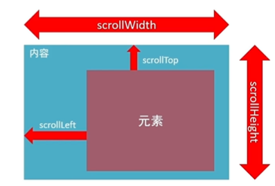
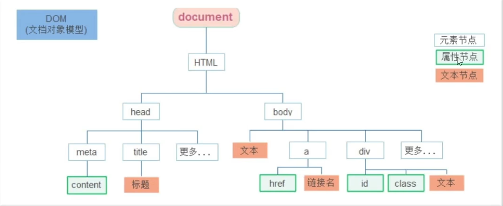
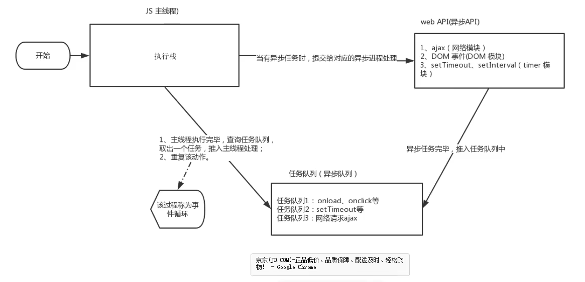
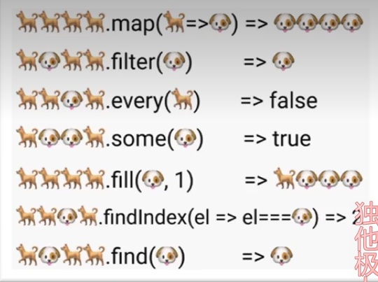
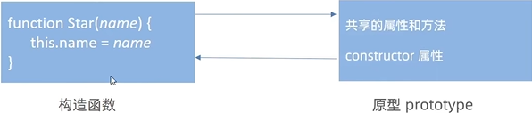
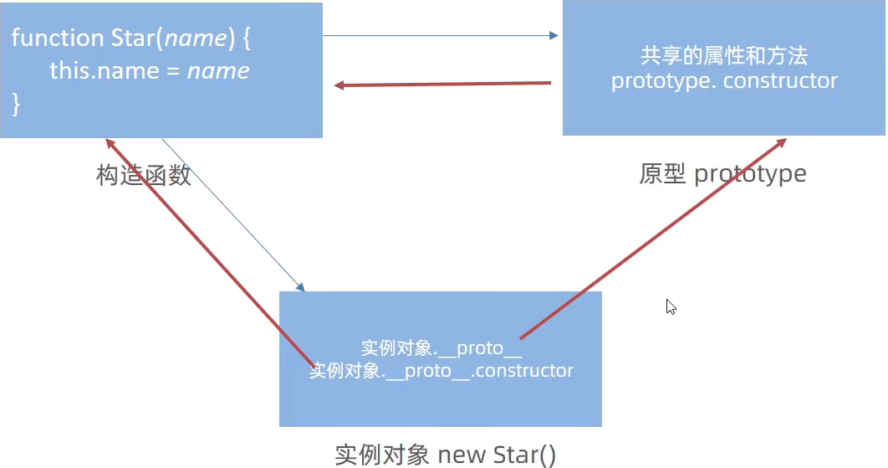
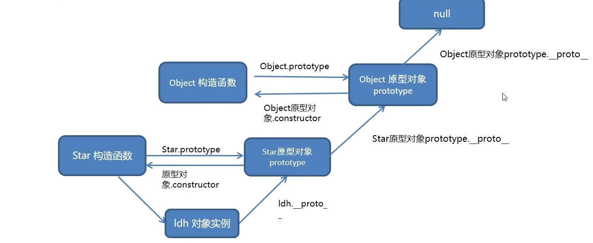
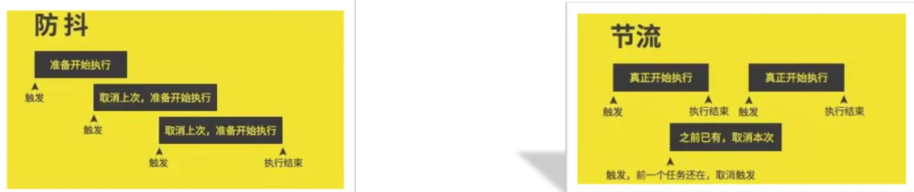

# JS基础

<hr>


## Day1

### JS简介

#### JS的书写位置

1.内联，例如<button onclick="alert(‘Hello’)">点击出现提示框</button>

2.内部，要用body标签包住

JS必须书写在代码之后，不然无法操作页面内文档元素

3.外部引用是 <script src=""></script>而且在标签中间**不能写代码**不然会被忽略

#### 注释

单行  //   		快捷键ctrl+/；

多行 /**/  		快捷键 shift + alt + a

js里面的分号可写可不写，如果要写那就都要写，不写就都不写统一风格

#### 输出语法

>语法1：**document.write(‘内容’)**
>
>里面也可以加标签
>
>document.write(‘<h1>一级标题</h1>’)				这行代码是指向body输出一个内容，内容为‘’包含的东西
>
>语法2：**alert(‘内容’)**
>
>弹出警示对话框
>
>其实弹出警示框还有 confirm(‘’)会有 **确定和取消**分别对于true 和false，还有prompt(‘’)可以**获取**用户输入的信息
>
>语法3：**console.log(‘内容’)**
>
>向控制台输出内容，为了方便调试

#### 输入语法

语法**prompt(‘’)**

提示用户输入内容，并且获取这个内容

<hr>

### 变量

和c类似，变量是用来储存数据的一个“容器”，比如let i = 35;声明了一个i变量，它的内容（“即赋值为”）35； 

#### 变量声明语法：**let 变量名**

语法：**let 变量名**

声明+赋值（声明要在赋值前）

不能重复声明变量   **let不允许重复声明，但是var允许**

变量名只能有字母，数字，下划线和$组成且数字不能在前

**let num = 100,name = ‘Jack’, flag = true**			BUT不提倡

可以同时声明多个不同类型的变量

变量声明只能由字母，数字，$，_构成，且数字不能放在首位

规范：起名有意义，第一个单词小写，后面每个单词首字母大写

#### var和let的区别

>​	1.var可以先使用后声明（不合理）
>
>​	2.var可以重复声明相同名字变量
>
>​	3.var 比如变量提升，全局变量，没有块作用域

#### 变量的本质

在内存中申请的一个空间，用来存放数据。每个数据都有一个不同的变量名，这样才能准确找到每个变量

#### 变量的拓展——数组

语法：**let 数组名 =[数据1,数据2,…..]**		数组可以存储不同类型的变量

### 常量

使用 **const**声明，常量不能重新赋值，且声明的时候必须初始化

<hr color="red">


### 数据类型

js是弱数据类型语言，需要赋值之后才能知道该变量的类型，而且声明后可以改变类型

比如let num= 1 			num = ‘abc’ 		console.log(num) 		//输出abc

#### 基本数据类型

**1.number数字类型**		**2.string字符串类型**		**3.boolean布尔类型**		**4.undefined未定义类型**	**5.null空类型**

##### 数字类型

语法 **let num = 10**

整数，小数，正数，负数都是数字类型

NaN是非数据类型，比如‘sbc’-2的类型是NaN，NaN进行任何运算都是NaN，且NaN≠NaN

##### 字符串类型

**let name = ‘Jack’**或者 **let name = “Jack” ** 或者 **let name = `Jack``**（只用一对就行）

用单引号，双引号，反引号（键盘上1左边那个）囊括的东西，推荐使用单引号

单双引号可以混合使用（外单内双，或者外双内单），需要使用引号的时候可以加**\\**来进行转义

**+**,数字相加，字符相连，只要**有一个是字符串**那么，＋就是拼接效果

##### 模版字符串

语法：**``(反引号)**，内容拼接常量的时候，用${}包住常量

比如 **document.write(‘我今年’+age+‘岁’)**== **document.write(\`我今年${age}岁了\`)** 

##### 布尔类型

true（真），false（假）

##### 未定义类型

只声明变量，不赋值的情况下，变量默认为undefined

console.log(undefined+1)	//NaN

##### 空类型

表示空，null是赋值了，但是内容为空，null作为为创建好的对象

console.log(null+1) 	//1

<hr> 

#### 引用数据类型

**object对象**

#### 判断数据类型

使用typeof

**typeof x**（常见的写法）  **typeof(x)**两种都可以

<hr>

### 类型转化

因为无论是表单还是prompt传入的数据都是string类型，需要我们进行强行转化

#### 隐式转化（自动执行）

规则：1.+号两边出现了字符串的话，都会将另一个的类型转化为字符串，除了+以外，-*/都会把数据转化为数字类型

技巧：+作为正号解析可以转化为数字型，任何数据与字符串相加都为字符串

比如

```js
let a = '7'
let b = 3
document.write(a+b)   //输出73，类型为字符串类型
document.write(+a+b)	//输出为10，类型为数字型
document.write(a-b)		//输出4
```

#### 显示转化

```js
let a = '123'
console.log(Number(a))		//输出123，数字类型
console.log(Number('pink'))	//输出NaN，字符串类型
```

Number(value)将value转化为数字型，String(value)将value转化为字符串类型

parseInt(a),parseFloat(a),分别是只保留a中的整数，和a中的小数

## Day2

### 运算符

赋值运算符=

一元 自增 a++，++a,a- -, - -a

比较 < , > , <= , >=  ,== ,= = =(左右两边是否值和类型都相等)，!=（左右两边不等），!= =(左右两边不全等)

2 == ‘2’    //结果是true，会将字符自动转化为数字类型，然后判断值（相当于只看值是否相等）	  2===‘2’ //false  ，类型不一样

===更加准确，NaN≠任何类型

此外小数有精度问题，尽可能不比较小数

逻辑运算符

与c相同

运算符优先级

() > ++, - -,! > 先*/%后+- > (>=  >  < <=) > (==    !=    ===   != =) >  先&& 后||  >    (=)  > (,)

<hr>

### 语句

分支语句

if-else   三元运算符   switch （是找的x的数据与case的值**全等**） 都和c一样

```js
switch (x){
	case 1:
		console.log(1)
		break
	case 2:
		console.log(2)
		break
	default:
		console.log('No')
		break
}
```

#### 断点调试

>   1.F12打卡开发者工具
>
>   2.点到source
>
>   3.选择代码文件

### 循环

循环基本和c差不多

有while  do-while   for

不过for有几种

for(let i = 0; i < 10; i ++) //循环一定次数

for(let i in person) //for-in遍历对象，此时的i是索引  let a =[‘a’, ‘b’ , ‘c’];  i 分别是 0 , 1 , 2

for(let i of person) //for-of此时 i是数组或者对象的值，比如let a =[‘a’, ‘b’ , ‘c’];  i 分别是 ‘a’, ‘b’ , ‘c’;

## Day3

### 数组

定义，一种顺序存储数据（可以是不同类型）的数据类型

语法 let 数组名 = [数据1,…..,数据n]或者  let array = new Array(1,2,3,4),索引从0开始，长度可以使用a.length

#### 数组添加新的元素，增

arr.push()，将一个或者多个元素添加到数组末尾，并且**返回**新的长度

语法：**arr.push(元素1,……,元素n)**

arr.unshift()，将一个或者多个元素添加到数组开头，并且**返回**新的长度

#### 数组删除元素，删

arr.pop(),arr.shift(),arr.splice(操作的下标，删除的个数);

语法： **arr.pop()**删除数组最后一个元素，并且返回该值

**arr.shift()**删除数组最前面一个元素，并且返回该值

**arr.splice(start,count)**start是起始位置（从0开始），count是删除的个数

如果只有一个数，那么说明是从该位置到数组末尾的元素**都得西内**

<hr>

## Day4

### 函数

基本和c没有太大的差别

**作用：**为了让代码简洁，不显得那么冗余（需要抽取重复的部分）

语法:  function 函数名(){代码块}					括号内可跟参数，或者不跟

```js
function sayHi(){
	console.log("hi~~~~")
}
```

函数不允许重名，否则后面声明的函数会覆盖前面的函数

函数传参可以设置默认值

比如

```js
function getSum(a=0,b=0)//这里的a，b是形参
{
	return a+b
}
let a = 10, b = 20
let c = getSum(a+b)//这里的a，b是实参（实际传入的参数）
```

如果只传入一个参数时也可以返回值，比如getSum()返回0，getSum

`BUT默认值只会在缺少实参参数传递时才会执行，所以有参数的会优先执行传递过来的参数，否则默认值（不设置的话）就为undefined`

#### 匿名函数

语法：let fn = function(){

​	//函数体

}

作用：避免全局变量之间的污染

自调用函数（立即执行）

(function(){})() 			或者 (function(){}())

多个立即执行函数需要用分号**;**隔开


#### 逻辑中断

如果&&两个值都为真，则返回后面那个的值，|| 如果两个都为真，则返回前面那个值

&&左边为false就短路，||右边为true就短路

#### Boolean

“”,0,undefined,null,false,NaN转化为布尔值都是false，其余都是true

转化Boolean(0)

<hr>

## Day5

### 对象

#### 对象是什么

一种数据类型，无序的数据集合，可以有成员和函数，可以用来更加详细的描述某个物品

属性包括属性名和值用**,**分割，属性名可以用‘’或者“”，一般可以省略

#### 对象的使用

增删改查

例如 let person={uname:’Jack’,gender:’man’,age:18}

**查：**语法:  对象名.属性

​	person.uname  

**改：**语法: 	对象名.属性 = 值

​	person.gender=‘woman’

**删：**（了解）语法：delete 对象名.属性

​	delete person.age

**增：**语法：对象名.新属性=新值

​	person.wage = 18000

如果需要使用中划线的话需要用引号包住属性名

​			比如 let person = {“good-name”:”无”  } 如果不使用可能就会报错

如果要使用的话就是  	person[‘good-name’]

#### 对象的方法

例如：let obj = {uname:’刘德华’ song:function(){

​	console.log(‘冰雨’)

}}

语法  方法名:function(){}

#### 遍历对象

语法：for-in

例子：

```js
for(let x in obj)
{
	console.log(obj[x]) //打印属性值
	console.log(x)	//打印属性名
}

```

如果for-in遍历数组得到的索引值是字符串类型

x存储的字符串变量，如果用对象名.x那么会返回undefined

还可以数组存储对象

#### 内置对象

Math

random：生成[0,1)之间的随机数，生成[a,b]的随机数的话，就 [a,Math.floor(a+Math.random()*(b-a+1))]

如果不加一只能取到[a,b)

ceil:向上取整

floor：向下取整

max：找最大值

min:找最小值

pow：幂运算

abs：绝对值

round：四舍五入

Pi:取π

随机点名（点名后要删除）

```js
let random = Math.floor(Math.random()*arr.length)//随机抽取[0,n)之间的索引，然后向下取整
document.write(arr[random])
arr.splice(random,1)//删除一个索引从random开始的元素
```

```js
//随机颜色
let str = '#'
let arr = ['0','1','2','3','4','5','6','7','8','9','a','b','c','d','e','f']
for(let i = 1; i <= 6; i ++)
{
	let random = Math.floor(Math.random()*arr.length)
	str+=arr[random]
}
return str
//返回十六进制
let r = Math.floor(Math.random()*256)
let g = Math.floor(Math.random()*256)
let b = Math.floor(Math.random()*256)
return `rgb(${r},${g},${b})`
```


<hr>

#### 数据类型

简单数据类型是存储在栈，复杂数据类型如对象，数组存储在堆，但是栈中也会存储，只不过存储的是地址

比如

```js
let num1 = 10
let num2 = num1
num2 = 20
console.log(num1) //输出10
let obj1 = {age:18}
let obj2 = obj1
obj2.age = 20
console.log(obj.age) //输出20
```


# WEB  APIs

<hr>

## Day1

#### const声明和let声明

数组和对象可以用const 声明，因为 声明后存储的是地址，地址不会改变，但是地址中的内容能改变

const 声明数组或对象，存储的是 **地址**

```js
const arr = ['red','green']
arr.push('blue')
console.log(arr) //不报错，输出red green blue
//但是
arr = [1,2,3]//会报错
```

`也就是说不能，让const 声明的数组或者对象，赋值为另一个数组或对象，但是可以对此进行修改`

```js
const arr=[]
arr = [1,2,3]
//上面操作错误
const arr = []
arr[0] = 1
arr[1] = 2
arr[2] =3
//这个操作正确
```

### DOM

#### API作用和分类

分类 DOM（文档对象模型）和BOM（浏览器对象模型）

DOM是浏览器提供的一套专门用来操作网页内容的功能

```html
<body>
    <div>
        123
    </div>
    <script>
    	const div = document.querySelector('div')//获取名为div的标签
        console.dir(div)//输出对象
    </script>
</body>
```

#### 获取DOM元素

根据CSS选择器获取

1.选择匹配的第一个元素

语法： document.querySelector(‘css选择器’)

```html
<body>
    <div class="box1">
        123
    </div>
    <div class="box2">
        abc
    </div>
    <p id='nav'>
        导航栏
    </p>
    <ul>
        <li>1</li>
        <li>2</li>
        <li>3</li>
    </ul>
    <script>
    	const box2 = document.querySelector('.box2')
        console.log(box2)
        const nav = document.querySelector('#nav')
        const li = document.querySelector('ul li:first-child')//获取第一个li
        const lis = document.querySelectorAll('ul li')//获取第一个ul 的所有li
    </script>
</body>
```


获取匹配的全部元素

**语法：**` document.querySelectorAll('ul li')`获取第一个ul 里面的所有li

返回的是一个伪数组（哪怕只有一个元素也是伪数组），有长度有索引，但是没有pop(),push()等方法

其他早期的写法

document.getElementById(‘’)			通过id获取第一个元素

document.getElementByTagName(‘’)		通过标签获取第一个元素

document.getElementByClassName(‘’)		通过类名获取第一个元素

#### 操作元素内容


类型：对象.innerText属性    对象.innerHTML属性

对象.innerText			获取对象的文本属性,再加 **=**可以进行修改

将文本内容添加或更新到任意标签位置，显示纯文本不能解释标签


对象.innerHTML   能解析标签，多标签建议使用模版字符 

#### 操作元素属性

语法：对象.属性 = 值

比如

```js
const pic = document.querySelector('img')
pic.src = './image/b02.jpg'
pic.title = '刘德华'
```

1.通过style属性操作css

修改比较少占优势，生成的行内样式表，权重较高

**对象.style.样式属性 = 值**

如果样式属性有-连接，那么需要转化为小驼峰命名法，赋值的时候不要忘了单位

2.通过类名操作css

//active是个类名

语法：**元素.className = ‘active’**

这个是新值`换`旧值，如果需要添加一个类，则需要保留之前的类名

3.`通过classList控制类名`

为了解决className覆盖以前的类名，我们可以通过classList方式追加和删除类名 

语法：**元素.classList.add(‘类名’)追加一个类** 		元素.classList.remove(‘类名’)删除一个类			元素.classList.toggle(‘类名’)切换一个类（有就删除，没有就加上，相应的类名）

<hr>

#### 操作表单属性

语法： 表单.value = ‘用户名’				表单.type = ‘password’

innerHTML得不到表单的内容

比如密码的显隐可以让type = ‘password’ 与 type = ‘text’互相交换


#### 自定义属性

HTML5推出的data-自定义属性

标签一律上以data-开头

在DOM 对象上一律以dataset对象方式获取 

```html
<body>
    <div class="box" data-id="10">
        盒子
    </div>
    <script>
    	const box = document.querySelector('.box')
        console.log(box.dataset.id)
    </script>
</body>
```


#### 定时器-间歇函数

作用：每隔一段时间自动执行一段代码，不需要手动触发

**开启定时器**： setInterval(函数，间隔时间)，间隔时间是毫秒

```js
setInterval(function(){
	console.log("1s")
},1000)
```

或者

```js
function fn()
{
 console.log('1s')
}
setInterval(fn,1000)
```

每个定时器都有独一无二的编号，他的返回值就是编号数字

如何关闭定时器，用 **clearInterval(编号)**

```js
function fn()
{
 console.log('1s')
}
let time = setInterval(fn,1000)
clearInterval(time)
```


轮播图大概

1.设置自增变量（等于数组长度就重新变为0）

2.获取img，p，和active，他后面的li

更换img的url，p的内容，消除active类选择器，li后追加active类选择器 


<hr>

## Day2

### 事件监听

事件监听：程序检测是否有事件发生，如果有就调用一个函数做出响应

事件监听语法：**元素对象.addEventListener(‘事件类型’,要执行的函数 )**

事件监听三要素：

事件源：那个dom元素被事件触发了，要获取dom元素

事件类型：用什么方式触发，比如鼠标点击click，鼠标经过mouseover等

事件调用函数：要做什么事

```html
<body>
    <button>
        点击
    </button>
    <script>
        function fn()
        {
            alter('点击了')
        }
    	const btn = document.querySelector('button')
        btn.addEventListener('click',fn)
    </script>
</body>
```

早期是会有  元素对象.on事件类型= function(){}

这个会有弊端，如事件覆盖

```js
const btn = document.querySelector('button')
btn.onclick = function(){
    alert(11)
}
btn.onclick = function(){
    alert(22)
}
//第二个onclick会覆盖第一个，导致只有一个事件生成,最终只会出现一个alert弹出22
btn.addEventListener('click',function(){
    alert(11)
})
btn.addEventListener('click',function(){
    alert(22)
})

//这段会弹出两个alert，按照声明的先后顺序生成alert
```


### 事件类型

**鼠标事件**

click鼠标点击					mouseenter鼠标经过			mouseleave鼠标离开

**焦点事件（表单获取光标）**就是移动到元素上再点击元素本身获得焦点

focus获得焦点					blur失去焦点

**键盘事件**

Keydown键盘按下触发				Keyup	键盘抬起触发

**文本事件**

input	用户输入事件


### 事件对象

#### 1.获取事件对象

定义：也是个对象，对象里有事件触发时的相关信息

使用：比如判断用户按下了哪个键，如果是回车就可以发表言论等

语法：如何获取

在事件绑定的回调元素第一个参数是事件对象，一般命名为event，ev，e

元素.addEventListener(‘click’,function(**e**){

})

这个e，就是事件对象

目标：能够使用常见对象属性

部分常用属性

​		type：当前事件的类型

​		clientX/clientY：获取光标相对于浏览器可见窗口的左上角

​		offsetX/offsetY：获取光标相对于当前DOM元素左上角 的位置

​		key：用户按下键盘的值（现在不提倡使用keyCode）

去除字符串两侧的空格 **str.trim()**返回的是**左右**没有空格的str，中间有空格不能去


### 环境对象

目标：分析判断函数this所指的对象

定义：指的是函数内部特殊的**变量this**，它代表着当前函数运行的环境

**谁调用，this指向谁**


### 回调函数

如果将函数A作为参数传给函数B时，那么函数A就是回调函数

如

```js
function fu(){
	console.log(1)
}
setInterval(fu,1000)
```

这fu就是一个回调函数

全选案例

```js
const checkAll = document.querySelector('#checkall')
const cks = document.querySelectorAll('.ck')
checkAll.addEventListener('cilck',function(){
	
    for(let i = 0; i < cks.length; i ++)
    {
        cks[i].checked = this.checked
    }
})

for(let i = 0; i < cks.length; i ++)
{
    cks[i].addEventListener('click',function(){
        checkAll.checked = document.querySelector('.ck:checked')===cks.length
    })
}
```

:checked可以选择被选择的复选框


## Day3

### 事件流

事件流是指：事件完整执行过程中的流动路径

触发事件会经历两个阶段一个是捕获阶段一个是冒泡阶段

捕获		是从大到小						冒泡 从小到大

#### 事件捕获

概念：从DOM的根元素开始去执行对应的事件（从外到内）

语法：DOM.addEventListener(事件类型，事件处理函数，是否使用捕获机制)

document.addEventListener(‘click’,function(){})

addEventListener第三个参数传入`true`代表是捕获阶段触发（很少使用）

如果传入的是`false`（默认值）代表冒泡阶段触发

如果使用的L0事件监听`也就是onclick`之类的就没有捕获只有冒泡阶段

```js
document.addEventListener('click',fn,true)//1
father.addEventListener('click',fn,true)//2
son.addEventListener('click',fn,true)//3
//然后出现的警示是从上到下  出现顺序123
//如果没有true那么就是321
```

#### 3.事件冒泡

概念：当一个元素的事件触发时，**同样的事件**将会在该元素的所有祖先元素中依次被触发

比如都是click


#### 4.阻止冒泡

目的：为了限制事件只发生在当前元素中。

前提：需要拿到事件对象

语法：`事件对象.stopPropagation()`

```js
document.addEventListener('click',fn)//1
father.addEventListener('click',fn)//2
son.addEventListener('click',fn(e){
                     console.log(3)
		e.stopPropagation()
                     })//3
                     
       //最终只出现3
```


#### 5.解绑事件

on事件方式，直接用null覆盖就行

比如

```js
btn.onclick = function(){
	alert(1)
}
btn.onclick = null 
```

对于`addEventListener`方式，**必须使用**

`removeEventListener(事件类型，事件处理函数，[获取捕获或冒泡阶段])`

最后一个参数可以不写

注意：匿名函数无法解绑


#### 鼠标经过事件的区分

mouseover和mouseout会有冒泡效果

mouseenter和mouseleave没有冒泡效果（推荐）

比如有一个盒子里面有子盒子，然后如果是对父盒子添加了mouseover和mouseout那么在鼠标从父盒子移动到子盒子的时候会再次出现mouseover 的函数

但是如果用mouseenter和mouseleave就不会出现


### 事件委托

利用事件流的特性解决一些开发需求的知识技巧

优点：减少注册次数，可以提高程序性能

原理：利用事件冒泡的特性 

​		`给父元素注册事件`，当我们触发子元素的时候，会冒泡到父元素身上，从而触发父元素的事件

然后反馈到子元素身上可以用`e.target`

```html
<body>
   <ul>
       <li>1</li>
       <li>2</li>
       <li>3</li>
       <li>4</li>
       <li>5</li>
       <p>
           2qwkndi
       </p>
    </ul> 
   <script>
    	const ul = document.querySelector('ul')
        ul.addEventListener('click',function(e){
            if(e.target.tagName==='LI')
            {
                e.target.style.color = 'red'//这个可以让点击的子元素字体颜色变红
            }
        })
    </script>
</body>
```

e.target里面有tagName，可以通过这个来选取需要给什么类型的子标签类型加点击函数

 


##### 自定义属性复习

```html
<body>
    <div data-id="0">
    </div>
    <script>
    	const div = document.querySelector('div')
        console.log(div.dataset.id)
    </script>
</body>
```

然后通过自定义属性，选取相应的序号，然后就可以更新内容（不使用循环来达到）


#### 阻止冒泡

语法：e.preventDefault()，作用阻止默认行为的发生

比如注册信息不正确那么就不让其跳转


### 其他事件

#### 页面加载事件

load事件

加载外部资源（图片，外联css和JavaScript等）加载完毕时（全部加载）触发的事件

比如一些老的代码喜欢script写在head中，这时dom就无法找到，需要等加载完成后执行才能找到

给window添加**load**

```js
window.addEventListener('load',function(){
	//操作
    const btn = document.querySelector('button')
    btn.addEventListener('click',function(){
        alert(11)
    })
})
```

这样js代码写在哪都行了


**DOMContentLoaded**事件

只用等HTML文档被完全加载和解析后就行，无需等待样式表，图像的加载

给document添加


#### 页面滚动事件

事件：scroll

监听整个页面的滚动给window或者document加都可以

```js
window.addEventListener('scroll',function(){
	//操作
})
```

监听某个元素的内部滚动直接给某个元素加

##### 2.获取位置

scrollLeft和scrollTop得到的分别是滚出的左边和上面（与盒子边缘相比）



这两个值是可读写的

如果是相对整个文档而言就是

**document.documentElement.scrollTop**得到的是`可读写`的不带单位的数字型 


元素.scrollTo(x,y)滚动到指定坐标


#### 3.页面尺寸事件

在窗口改变时触发事件

resize

```js


window.addEventListener(‘resize’,function(){
	console.log(1)
})
```

获取元素的宽和高（可见部分，不含边框、margin、滚动条）

clientWidth和clientHeight获得可见元素的宽和高。**只读**


#### 4.尺寸

获取宽高，自身的宽高，**包括设置的宽高，padding，border还有滚动条**

**offsetWidth**和**offsetHeight**			只读

获取的是数据

注意获得的是可视的宽高，如果盒子是隐藏的，获取的结果是0


获取位置

**offsetLeft和offsetTop**注意是`只读属性`

获取的是元素距离自己`定位父级`的左上距离


## Day4

### 日期对象

#### 1.实例化

日期对象用来表示时间的对象

用new操作就叫实例化

获得当前时间：`const date = new Date()`

返回指定时间：`const date = new Date('2022-5-1 08:30:00')`可以用于倒计时

#### 2.日期对象方法

方法：getFullYear()获得年份（四位）			getMonth()获得月份（`0~11`）

getDate()获得月份中的**每一天**（不同月份取值不同）		getDay()获得星期（`0~6`）0是周天

getHours(),getMinutes(),getSeconds()分别获取时间，分钟，秒


toLocaleString()得到年月日小时分钟秒的字符串比如2023/5/25 12:59:32

toLocaleDateString()得到年月日 2023/5/25

toLocaleTimeString()得到时间  13:04:23 

#### 3.时间戳

目标：获得当前的时间戳

使用场景：计算倒计时的效果，前面方法无法直接计算

算法：将来的时间戳-现在的时间戳 = 剩余的时间毫秒

时间戳的定义：从1970年一月一日00时00分00秒起至今的毫秒数 

获取时间戳的方法：

1.getTime()方法

```js
const date = new Date()
console.log(date.getTime())
```

2.**简写+new Date()**

```js
console.log(+new Date())
```

获得指定时间戳在（）里面加相应的时间字符串

比如+new Date(‘2023-10-1 10:00:00’)就可以得到该时间的时间戳

3.使用Date.now()

 ```js
 console.log(Date.now())
 ```

注意**第三种只能**得到当前时间戳，`而前面两种可以得到指定时间的时间戳`（也就能达到倒计时的效果）


得到倒计时

```js
const ne = document.querySelector('.next')
    // const date = new Date()
    ne.innerHTML = `今天是${new Date().toLocaleDateString()}`
    const h = document.querySelector('.hour')
    const m = document.querySelector('.minutes')
    const s = document.querySelector('.seconds')
    const traget = +new Date('2023/05/25 18:30:30')
    function fn(){
      const now = +new Date()
      let hh = parseInt((traget-now)/1000/60/60)
      let mm = parseInt((traget-now)/1000/60%60)
      let ss = parseInt((traget-now)/1000%60)
      hh = hh<10? '0'+hh:hh
      mm = mm<10?'0'+mm:mm
      ss = ss<10?'0'+ss:ss
      h.innerHTML = hh
      m.innerHTML = mm
      s.innerHTML = ss
    }
    fn()
    setInterval(fn,1000)
```


### 2.节点操作

#### DOM节点

DOM树里面的每个内容都能称之为节点

节点类型

​	`元素节点`：所有的标签body，div等，html是根节点

​	属性节点：所有的属性，比如href，src

​	文本节点：所有的文本

​	其他





#### 查找节点

能够根据节点关系来查找目标节点

`节点关系：针对的找亲戚返回的都是对象`

分别有父节点，子节点，兄弟节点

##### 父节点的查找

语法：子元素.parentNode属性			返回的是最近一级父节点，找不到就返回null

关闭广告就可以用这个，点击子盒子，然后让父盒子的样式隐藏

如果有多个相同的按钮，可以把他们的儿子都获取过来成为一个数组，然后给每个儿子添加点击事件，然后再

用this指代点击的哪个盒子，来控制关闭哪个父亲

##### 子节点查找

childNodes

​	获取的所有子节点，包括文本节点（空格，换行），注释节点等,**选择的是亲儿子**

`children属性`

​			仅获得所有元素节点

​			返回的是一个伪数组

语法：父元素.children


##### 兄弟关系的查找

1.下一个兄弟节点：nextElementSibling属性

2.上一个兄弟节点：previousElementSibling属性

#### 增加节点

比如，点击发布按钮，能新增一条消息

步骤：创建一个新节点，将新节点放入指定元素的内部

创建节点：document.createElement(‘标签名’)

追加节点：父元素.appendChild(要插入的元素)（插入到最后一个子元素）

```js
const ul = document.querySelector('ul')
const li = document.creatElement('li')
li.innerHTML = '最后一个li'
ul.appendChild(li)
```

父元素.insertBefore(要插入的元素，在哪个元素前面)（插入到父元素中某个子元素的前面 ）

```js
const ul = document.querySelector('ul')
const li = document.creatElement('li')
li.innerHTML = '第一个li'
ul.insertBefore(li,ul.children[0])//在ul孩子中的第一个前面再插入个li
```

克隆节点：元素.cloneNode(布尔值)

```js
const ul = document.querySelector('ul')
const li1 = ul.children[0].cloneNode(true)//赋值
```

如果值为true表示，克隆时会包含后代节点一起克隆

如果是false，则代表克隆时不包含后代节点

默认值为false（就是只有标签内容没有）


#### 删除节点

在js的原生DOM中，要删除元素必须通过父元素删除

语法：父元素.removeChild(要删除的元素)

如果没有存在父子关系那么删除不成功，删除和隐藏有区别，隐藏的节点还存在只不过看不见，删除的节点是在html里面清除了，结构也不存在了


### M端事件

移动端：有触屏事件touch,在Android和IOS里面都有

常见触屏事件有：touchstart手指触摸到一个DOM元素时触发

touchmove：手指在一个DOM元素上滑动时触发

touchend：手指在一个DOM元素上移开时触发


### JS插件

插件：别人写好的我们只需要复制对应的代码就能实现对应的效果

官网https://www.swiper.com.cn


当点击新增需要验证表单

1.获取所有需要填写的表单，他们的共同特点都有name属性

2.遍历这些表单，如果有一个值为空，则return 返回提示输入为空并且中断程序

3.注意书写的位置，应该放到新增数据的前面，阻止默认行为的后面 


## Day5

### Window对象

#### BOM

定义：浏览器对象模型

定时器-延时函数：setTimeout

语法：setTimeout(回调函数，等待的毫秒数)（相当于延迟执行，且只执行一次）


清除延时函数：

```js
let timer = setTimeout(回调函数，等待的毫秒数)
clearTimeout(timer)
```


#### JS的执行机制

JS特点`单线程`一次只能做一件事情

那么，可能造成页面渲染不连贯，导致页面渲染加载阻塞的感觉


因此JS出现了`同步和异步`

同步：前一个任务结束后再执行后一个任务，程序的执行顺序与任务顺序一样。

异步：在做一件事情的同时，利用这段时间可以去做其他的事情 （类似于多线程）

同步任务：在主线程上执行，形成一个执行栈

异步任务：	js的异步是通过回调函数实现的

一般而言异步任务有3种：

1.普通类型：如click，resize等

2.资源加载类型，如load，error等

3.定时器，包括setInterval，setTimeout等

异步任务相关添加到任务队列中 

执行顺序：1.先执行**执行栈中的同步任务**

2。异步任务放入任务队列中	

3.一旦执行栈中的所有同步任务执行完毕，系统就会按次序读取任务队列中的异步任务，于是被读取到的异步任务结束等待状态，进入执行栈，开始执行




浏览器可以多线程，浏览器给其排序安排进执行栈中

由于主线程不断的重复获得任务，执行任务，再获取任务，再执行任务，这种机制称为：`事件循环(event loop)`

#### location对象

location数据类型是对象,它拆分并保存了URL地址的各个组成部分

常用属性和方法：

1.href 利用js的方式跳转页面（比如注册之后自动跳转到首页）

```js
location.href = 'https://www.baidu.com'
```

2.search属性获取地址中携带的参数符号	?后面的部分

3.hash属性获取地址中的哈希值，符号#后面部分

4.reload方法重新加载页面，如果传入参数为true的时候表示强制刷新，类似ctrl+f5

#### navigator对象

通过userAgent检测浏览器的版本及平台

#### history对象

back()后退功能，forward()前进功能,go(参数)前进后退功能，参数是1则前进1个页面，如果是-1则后退一个页面


### 本地存储

介绍：数据存储在用户浏览器中，设置、读取方便、**甚至页面刷新不丢失数据**，容量较大，sessionStorage和localStorage约5M

#### localStorage

目标：本地存储分类localStorage把数据存储到浏览器中

作用：可以把数据永久的存储在本地，除非手动删除

特性：多窗口共享（同一浏览器），以键值对的形式存储使用

**语法：**

存储数据：localStorage.setIetm(‘key’,‘value’)

读取数据：localStorage.getItem(‘key’)返回的是值

删除数据：localStorage.removeItem(‘key’)

本地存储`只能存储字符串类型`

#### sessionStorage

特性：生命周期为关闭浏览器窗口，在同一窗口下数据可以共享，以键值对的形式存储数据，用法和localStorage基本相同


#### 存储复杂数据类型

本地只能存储字符串，无法存储复杂数据类型

```js
const obj = {
	uname:'Jack',
	age:18,
	gender:'man'
}
localStorage.setItem('obj',obj)
```

`这样是错误的`


**解决：**将复杂数据类型转化为Json类型，存储到本地

语法：JSON.stringify(复杂数据类型)（这个是转化为json字符串）

然后取的时候，先取出来然后再把json转化为对象使用，JSON.parse(localStroage.getItem(‘obj’))

```js
const obj = {
	uname:'Jack',
	age:18,
	gender:'man'
}
localStorage.setItem('obj',JSON.stringify(obj))
console.log(JSON.parse(localStroage.getItem(‘obj’)))
```

可以将数组转化为json字符串类型

`字符串拼接新思路`利用map()和join()数组方法实现字符串拼接

**map方法**

使用场景：遍历数组**处理数据**，并且**返回新的数组**

map是有返回值的，而foreach没有 

```js
const newarr = arr.map(function(ele,index){
	console.log(ele)//元素
	console.log(index)//索引
    return ele+'颜色'
})
console.log(newarr)
```

**join方法**

作用：把数组中的所有元素转化为一个字符串

语法：

```js
const arr = ['red','blue','green']
console.log(arr.join(''))//得到'redbluegreen'
```

元素是通过参数里面的指定分隔符进行分割的，空字符串(‘’),则所有元素之间没有任何字符

如果括号内为空，则用逗号分割


## Day6

### 正则表达式

介绍：用来匹配字符串中字符组合的模式，js中正则表达式也是对象

作用：表单验证，过敏词替换，字符串中提取我们想要的部分


定义规则，并且根据规则去查找

语法： const 变量 = /表达式/

用test()方法来查看正则表达式与指定字符串是否匹配

```js
const str = '前端'
const reg = /前端/
if(reg.test(str))
{
    console.log('匹配成功')
}
```

还有exec方法返回的是一个数组，可以得到查找字符出现的位置（首次）


#### 元字符

具有一些特殊含义的字符，可以极大提高灵活性和强大的匹配能力

比如只能输入，小写英文字母，换成元字符就是[a-z]

元字符的分类：边界符（表示位置，开头和结尾），量词（重复次数），字符类（比如\d表示0~9）

##### 边界符：

^表示匹配开始的文本，$表示匹配结束的文本 

如果^和$之间只有一个字符，代表只能出现这个字符一次，没出现或出现多次都是错误

`/^x$/.test(‘x’)这种才是正确`

```js
/^a$/.test('aa')//false
```

##### 量词：

设定某个模式出现的次数

*重复0次或者更多次（0次以上）   + 重复一次或者更多次（1次以上）		?	重复0次或者1次		{n}重复n次		{n,}	出现n次或者更多次

{n,m}重复n到m次

`/^哈*$/`表示只能出现哈，且要以哈开头以哈结尾（或者是空字符串）

```
/^哈*$/.test('')
```

##### 字符类

[]匹配字符集合：比如/[abc]/,后面的字符串只要包含括号中的**任意一个字符**，都返回true,`只能选择一个`如果是ab这样的话，那么就是false

但是如果是

```js
/^[abc]{2}$/.test('ab')//得到的是true
```

连字符[a-z]表示**a到z**26个字母的一个范围，[a-zA-Z]表示大小写都可以，[0-9]表示0到9的数字都可以

比如腾讯QQ号：

```js
/^[1-9][0-9]{4,}$/    //这个表示开头是1到9，后面四位都是0到9的数字，且至少在4个以上（除去开头的那个匹配）
```

要求只能输入英文字母加数字的话可以这样

```js
/^[a-zA-Z0-9]$/			//不能分开来写否则就是不是匹配的同一个字符了
```

在[]里面加^取反符号比如

```js
/[^a-z]/
```

表示匹配除了小写字母以外的字符 

日期格式：

```js
/^\d{4}-\d{1,2}-\d{1,2)/
```

预定义类：\d相当于[0-9]			\D相当于匹配除0-9外的所有字符		\w匹配任意的字母、数字、下划线

\W 和\w相反  		\s匹配空格（包括换行符。制表符、空格符等）相当于[\n\t\r\f\v]  		\S匹配非空格类字符

手机号验证：

```js
/^1(3\d|4[5-9]|5[0-35-9]|6[567]|7[0-8]|8\d|9[0-35-9])\d{8}$/
```

验证码验证

```js
/^\d{6}$/
```

密码验证：

```js
/^[a-zA-Z0-9-_]{6,20}$/
```


#### 修饰符

/表达式/修饰符

用于约束正则执行的某些细节，如是区分大小写，是否支持多行匹配等

i是单词ignore的缩写，表示正则匹配时，字母不区分大小写

g是单词global的缩写，匹配所有满足正则表达式的结果

**替换replace**

语法：字符串.replace(/正则表达式/,’替换的文本’)		返回的是一个新的字符串


change事件内容发生变化就执行


放大镜效果

得到鼠标相对盒子的坐标，可以用鼠标相对页面的坐标（e.pageX,e.pageY）减去，盒子相对页面的坐标（middle.getBoundingClientRect().left,middle.getBoundingClientRect()）;

```js
//坐标x，y分别为
let x = e.pageX-middle.getBoundingClientRect().left
let y = e.pageY-middle.getBoundingClientRect().top-document.documentElement.scrollTop

```

然后改变黑色遮罩层的时候是

```js
if(x<=100) mx = 0
else if(x>100&&x<=300)mx = x-100;
else mx = 200;

//这里mx是遮罩层的位置（相对于中盒子偏离），100是黑色遮罩层的宽度一半，中盒子为400px
//这些的前提是x在[0,400],y在[0,400]
```

然后大盒子（放大镜效果的盒子）的背景图x，y的移动位置为黑色遮罩层的两倍就行了（因为大盒子的宽高是黑色遮罩层的2倍）

```js
large.style.backgroundPositionX = -2 *mx +'px'
large.style.backgroundPositionY = -2 *my +'px'
```

<hr>


# JS进阶  

## Day1

### 作用域

#### 局部作用域

分类：函数作用域和块作用域

函数作用域：函数内部声明的变量只能在函数内部访问，外部无法直接访问

块作用域：{}包括的代码为代码块，代码块内部声明的变量外部将`有可能`无法访问（var声明的能被访问）

1.let声明的会产生块作用域，var不会产生块作用域

2.const声明的常量也会产生块作用域

3.不同代码之间的变量无法相互访问

4.建议使用let 或const

#### 全局作用域

​    <script>标签和.js文件的最外层就是全局作用域，全局作用域中的变量任何作用域都可以访问

window对象动态添加的属性也默认为全局的，不推荐！！！

函数中未使用任何关键字声明的变量都是全局变量，不推荐！！！

尽可能减少声明全局变量，防止全局变量被污染

#### 作用域链

本质：底层`变量查找机制`

函数被执行时，会`优先查找当前`函数作用域中查找变量（就近查找）

如果当前作用域查找不到则会依次`逐级查找父级作用域`直到全局作用域

```js
let a = 0;
function f(){
    let a = 1;
    function g(){
        a = 2;
        console.log(a);//输出2，如果g里面没有a=2，那么输入1；如果f和g都没有a变量的声明或者改变，那么输出0
    }
    g()
}
f()
```

1.嵌套关系的作用域串联起来形成了作用域链

2.相同的作用域中按照从小到大的关系查找变量

3.子作用域能访问父作用域，而父作用域不能访问子作用域（上面的例子，g能使用f的变量，而f不能使用g的变量）

#### 垃圾回收机制

简称GC。JS中内存的分配和回收都是自动完成的，内存不使用的时候会被垃圾回收器自动回收

1.内存分配：当我们声明变量，函数，对象的时候，系统会自动为他们分配内存

2.内存使用：即读写内存，也就是使用变量，函数等

3.内存回收：使用完毕，由`垃圾回收器`自动回收不在使用的内存


全局变量一般不回收（关闭页面回收）

一般情况下局部变量的值，不使用了，会被自动回收掉（比如函数结束后）

内存泄漏：程序中分配的内存由于某种原因程序`未释放`或者`无法释放`叫做内存泄漏


垃圾回收机制-**算法说明**

堆栈空间分配区别：

1.栈：由操作系统自动分配释放函数的参数值，局部变量等，基本数据类型放在栈中（比较小）

2.堆：一般由程序员分配释放，若程序员不释放，由`垃圾回收机制`回收。复杂数据类型放在堆中

常见的浏览器垃圾回收算法：`引数计数法和标记清除法`

引用计数法（了解，基本不再使用了）：定义“内存不再使用”，就是看对象是否有指向它的引用，没有引用了就回收对象

算法：

1.跟踪记录被`引用的次数`			2.如果被引用了一次，那么就记录次数1			3.如果减少一个引用就减1

4.如果引用为0，则释放内存 

简单有效的算法，但是缺点比较致命

比如`嵌套引用`(循环引用)，如果`两个对象相互引用`尽管他们已经不再使用，但是垃圾回收器不会回收，导致内存泄漏（因为他们的引用次数永远不会是0.这样的大量存在那么会导致大量的内存泄漏）

标记清除法：

核心：标记清除算法将‘不再使用的对象’定义为`无法到达的对象`

2.就是从`根部`（在js中的全局对象）出发定时扫描内存中的对象。凡是`能从根部到达的对象`，都是还需`要使用`的。

3.那些无法由根部出发触及的`对象被标记`为不再使用，稍后进行回收

现在浏览器垃圾回收机制一般是有标记清除法优化而来的


#### 闭包

概念：一个函数对周围的状态的引用捆绑在一起（有使用），内层函数中访问到其外层函数的作用域

简单理解：闭包=内层函数+外层函数的变量    例如：

```js
function outer(){
	const a = 1
    function f(){
        console.log(a)
    }
    f()
}
outer()
```

这就是最简单的闭包，内层函数用到了外层函数的变量才叫闭包（如果只有函数套函数，且内层函数没有使用外层变量，那么就不叫闭包）

闭包操作：**封闭数据，提供操作**，外部也可以访问函数内部的变量，使得函数内的局部变量始终保存在内存中，**不会**在外层函数被调用后清除

常见闭包形式  		外部可以访问使用函数内部的变量

```js
function outer(){
	let a = 10
    function fn(){
        console.log(a)
    }
    return fn()
}
//outer()  ===     fn   = ==  function fn(){} 
const fun = outer()
//const fun = function fn(){}
```

闭包的应用：实现数据的私有。（不受其他变量的影响）

```js
function outer(){
    let i = 0
    function fn(){
        i++;
        console.log(i)
    }
    return fn
}
const fun = outer()//全局变量不会被回收  i不会被回收,所有i不会重新赋值为0
fun()		//打印1
fun()		//打印2
```

他这里是相当于，有一个词法环境（由变量环境和外部环境）存储着这个变量，没有回收这个作用域，然后后面每次调用就是调用的作用域里面的值，然后该值会继续保存在作用域中。（一个函数返回了另一个函数，那么返回那个函数就会保持对原来函数的词法环境）

闭包因此可能会`有内存泄漏`的问题

例如上面那个 fun不会被销毁，那么会调用fn，fn中使用i，i就不会被销毁，因此可能有内存泄漏的风险


Tips:题外话AO与VO

>VO(环境对象)，AO（可以看作为一个临时的储存容器，包含了函数的作用域），GO全局对象。
>
>对于一个全局变量而言，它存储在堆中，栈中存储该内存的索引。
>
>当一个存储地址的变量，作为一个传入函数的参数时
>
>在AO中改变GO的值，GO中对象的值是可以改变的，但是在AO中，将该参数赋值为另一个对象的地址时，原有的对象不会改变，而会新生成一个内存空间，这里面存储着新的对象，且对这个参数操作，只会影响新的对象
>
>该处相当于是创建了一个临时变量，该变量的初值为传入参数变量的值，对该变量进行操作时，不会影响原有的变量。
>
>当执行函数的时候，在执行栈中GO被AO替换掉执行顺序（此时AO变为优先执行，然后梳理出作用域链（从AO到GO），再找出this指向（没明白这是什么鬼），当函数退出时由AO再变为GO）


#### 变量提升（了解）

在代码执行之前，先去检测var声明的变量，然后把所有var声明的变量提升到当前作用域的最前面（只提升声明，不提升赋值）

```js
console.log(num)//输出undefined
var num = 10

//相当于是这种操作
//var num
//console.log(num)
//num = 10
```

变量未声明会报语法错误

变量在var声明之前访问是undefined

let/const声明的变量没有变量提升

变量提升出现在相同作用域中

实际开发中更推荐先声明再访问变量

先变量提升，再函数提升，再赋值


### 函数进阶

#### 函数提升：

和变量提升类似，可以在声明前调用

会把所有函数声明 ，提升到当前作用域的最前面

```js
fun()

function fun()
{
	console.log(1)//不报错
}
```

```js
fun()
var fun = function(){
	console.log(1)
}
//所以会报错，说fun不是一个函数
//这个相当于是下面的先声明调用后再赋值，这个会报错
var fun
fun()
fun = function(){
	console.log(1)
}
```

提升的时候只提升赋值，不提升声明


#### 函数参数

（除形参，实参，默认参数外）动态参数，剩余参数

**动态参数**

每个函数里面都有一个`arguments`(也叫动态参数)是个伪数组，且只存在在函数中

比如

```js
function getSum()
{
    let sum = 0
    for(let i = 0; i < arguments.length; i ++)
        sum +=arguments[i]
    return sum
}
console.log(2,3)
console.log(2,3,4)
console.log(2,3,4,5,6)
```

**剩余参数**

得到的一个数组 （只存在函数中）

```js
function getSum(...arr)
{
    let sum = 0
    for(let i = 0; i < arr.length; i ++)
        sum +=arr[i]
    return sum
}
console.log(2,3)
console.log(2,3,4)
console.log(2,3,4,5,6)
```

…是语法符号，置于最末函数形参之前，用于获取**多余**的实参

借助…获取的剩余实参是一个`数组`

开发中，提倡使用剩余参数

```js
fuction getSum(a,b,...arr)
{
}
```

剩余参数**更加灵活**，伪数组不能使用push等操作

#### 展开运算符

```js
const arr = [1,2,3,4,5]
console.log(...arr)//1 2 3 4 5 
```

…来展开数组

不会修改原数组

**典型应用：**求数组最大小值，合并数组等

**求最大小值**

```js
const arr = [1,5,9,2,4]

console.log(Math.max(...arr))
```

**合并数组**

```js
const arr = [1,2,3]
const arr1 = [4,5,6]

const arr2 = [...arr,...arr1]
//arr2  1,2,3,4,5,6
```


#### 箭头函数（重要）

目的：更简洁的函数写法并且不绑定this

使用场景：箭头函数更适用于那些本来需要匿名函数的地方 

基础语法：

const 函数名 = (形参) =>{}

```js
const fn = () => {
	console.log(123)
}
fn()
//类似于 const fn = function(){}
```

当只有一个形参的时候可省略小括号（没有参数或者有两个及以上的参数是不能省略小括号的）

```js
const fn = x => {
	console.log(x)
}
fn(1)
```

只有一行代码的时候可以省略大括号，也可以省略return

```js
//const fn = x => console.log(x)
const fn = x => x + x//不仅相加而且还有返回值	
console.log(fn(1))
```

比如

```js
const form = document.querySelector('form')
form.addEventListener('click',ev => ev.preventDefault())
```

箭头函数可以直接返回一个对象

```js
const fn = (uname) => ({name:uname})
console.log(fn('CS'))
```

this指向：谁调用指向谁

```js
console.log(this)//此处为window
const sayHi = function(){
    console.log(this)//为window
}
btn.addEventListener('click',function(){
    console.log(this)//为btn
})
```

箭头函数不会创建自己的this，它只会从自己的作用域的上一层沿用this

```js
const fn = () => {
	console.log(this)//window
}

const obj = {
    uname:'Pink'
    sayHi:() => {
        console.log(this)// window
    }
}
//window.obj.sayHi() === obj.sayHi()
```

```js
const fn = () => {
	console.log(this)//window
}

const obj = {
    uname:'Pink'
    sayHi:function(){
        let i = 10
        const count = () => {
            console.log(this)//obj,本函数没有this，套用上一级的，上一级的指向obj
        }
        count()
    }
}
obj.sayHi()
```

DOM回调函数为了简便，不太推荐箭头函数


### 解构赋值

#### 数组解构

是快速批量赋值给一系列变量的语法

基本语法：

1.赋值运算符  = 左侧的[]用于批量声明变量，右侧数组单元值将赋值给左侧的变量

2.变量的顺序对应数组单元值的位置依次进行赋值操作

让代码更加简洁：

```js
const [max,min,avg] = [100,60,80]
console.log(max)
console.log(min)
console.log(avg)
```

经典应用：交换两值

```js
let a = 1
let b = 2;
[b,a] = [a,b]
console.log(a)//2
console.log(b)//1
```

**加分号的情况**

1.立即执行函数

```
(function t(){})();
//或者   ;(function t(){})()
```

2.数组解构的时候

```js
;[b,a] = [a,b]
//数组开头的，特别是前面有语句的一定注意加分号
```

​	前面有代码，或者有数组类型那么就要加分号隔开


1.变量多，单元值少  			2.变量少，单元值多 			3.剩余参数		变量少，单元值多

```js
const [a,b,c,d] = [1,2,3]
// a b c d  分别是 1, 2, 3 ,undefined

const [a,b,c] = [1,2,3,4]
//a b c 分别是 1 2 3

const [a,b,..c] = [1,2,3,4]
//a b c分别为  1,2, [3,4]
```

防止有undefined传递单元值的情况，可以设置默认值

```js
const [a = 0, b = 0] = [1,2]
//a b 分别是1 2
const [a = 0, b = 0] = []
//a b分别是 0 0
```

按需导入，忽略某些返回值

```js
const [a,,c,d] = [1,2,3,4]
//a c d分别是  1 3 4
```

支持多维数组解构

```js
const [a,b,c] = [1,2,[3,4]]
//abc分别是 1,2,[3,4]
const [a,b,[c,d]] = [1,2,[3,4]]
//a b c d 分别是  1,2,3,4
```


#### 对象解构

基本语法：

1.赋值运算符 = 左侧的{}用于批量声明变量，右侧对象的属性值将赋值给左侧的变量

2.对象属性的值将被赋值给与属性名`相同的`变量

3.注意解构的变量名不要和外面的变量名冲突否则报错

4.对象中找不到与变量名一致的属性时变量值为undefined（`意思是必须属性名和变量名一样`）

```js
//const obj = {
//	uname:'Jack',
  //  age:18
//}
const {uname,age} = {uname:'Jack',age:18}
//等价于 	const uname = obj.uname
```

对象解构的变量名可以重新改名 		`旧变量名:新变量名`：表示‘什么值:赋值给谁 ’

```js
const {uname:username,age} = {uname:'Jack',age:18}
console.log(username)//Jack
console.log(age) //18
```

解构数组对象    多级对象解析

```js
const obj = [
    {
        uname:'Jack',
        age:18
    }
]
const [{uname,age}] = obj


const pig={
    name:1,
    family:{
    	father:2
        mother:3
        sister:4
	},
    age:18
}
const {name,family:{father,mother,sister},age} = pig
```

实例：

```js
function render({data}){
	console.log(data)
}
render(msg)//msg里面有data成员data里面是一个对象数组存储着信息
```


**遍历数组的forEach方法**

forEach方法用于调用数组的每一个元素，并将元素传递给回调函数

主要使用场景：遍历数组中的每个元素

语法：被遍历的数组.forEach(function(当前数组元素，当前元素索引号)){函数体}

没有返回值（map有返回值），可以认为是加强版的for循环，`适合遍历数组对象`


##### filter筛选数组

语法：

被遍历的数组.filter(function(currentValue,index)){

​	return 筛选条件

}

做比较的，map方法是可以进行加减操作，forEach方法只是遍历

```js
const arr = [10,20,30]

const newArr = arr.filter(function(item,index){
	return item>=20
})
console.log(newArr)

//可以替换为
const newArr = arr.filter(item => item>=20)
```


## Day2

### 深入对象

#### 创建 对象的3种方法

1.字面量创建 let obj = {}

2.new实例化 let obj = new Object()

**3.构造函数创建**


#### 构造函数

一种特殊的函数，主要用来初始化对象

多个对象有相同的属性名，那么可以使用构造函数来简化对象的创建过程

场景：创建多个类似的对象

```js
function Pig(name,age,gender){
    this.name = name
    this.age = age
    this.gender = gender
}
const Peppa = new Pig('佩奇',6,'女')
const Mum = new Pig('猪妈妈',30,'女')
```

构造函数在技术上是常规函数

约定：1.他们的命名大写字母开头 			2.他们只能由‘new’来操作

构造函数里面不用写return

1.new 是为了创建对象    2.构造函数this指向新对象	 3.执行构造函数代码，修改this，添加新的属性		4.返回新的对象


**实例成员&&静态成员**

通过构造函数创建的对象为实例对象，**实例对象中**的属性和方法为**实例成员**（实例属性和实例成员）

为构造函数传入参数，创建结构相同但是值**不同的对象**（占用不同的堆内存）

构造函数创建的实例对象**彼此独立**互不影响

##### 静态成员

构造函数的属性和方法，被叫做**静态成员**

比如 Date.now()		Math.PI		Math.random()

静态成员只能构造函数来访问（也就是实例化出的对象不能再访问（被逐出家门））

静态方法中的this指向构造函数

```js
function Pig(name){
    this.name = name
}
Pig.age = 2//静态属性
Pig.sayHi = function(){//静态方法
    console.log(this)//打印的Pig(name){this.name = name}
}
```


### 内置构造函数

引用类型

Object，Array，RegExp，Date等

包装类型

String,Number,Boolean等

#### Object

Object是内置的构造函数，用于创建普通对象

推荐使用字面量形式创建

常用的3个静态方法（只有构造函数Object可以调用的）

1.Object.keys获取对象中的所有`属性名`返回的是一个数组

2.Object.values获取对象中的所有`属性值`返回的是一个数组

```js
const o = {name:'Jack',age:18}
const arr = Object.keys(o)
//arr ==['uname','age']
const arr1 = Object.values(o)
//arr1 == ['Jack',18]
```

3.Object.assign对对象进行拷贝,使用场景给对象添加属性

```js
const o = {name:'Jack',age:18}
const obj = {}
Object.assign(obj,o)
//obj === {name:'Jack',age:18}

Object.assign(o,{gender:'女'})
//o ==={naem:'Jack',age:18,gender:'女'}
```


#### Array

数组常见方法：

1.forEach		遍历数组，没有返回值

2.filter		过滤数组，返回新数组，返回的是满足筛选条件的

3.map		迭代数组，返回新数组，返回的是处理之后的数组

4.reduce		累计器，返回累计的效果，常用于求和

arr.reduce(function(){},起始值)，有起始值，那么就把起始值加入到里面

```js
const arr = [1,5,3,8]

//forEach
arr.forEach(function(elem,index){
    console.log(elem+' '+index)
})// 输出1 5 3 8
//filter
const arr1 = arr.filter(it= elem => elem>=4)// arr1  5 8
const arr2 = arr.map(elem => elem+2)
//arr2     3 7 5 10
const sum = arr.reduce((prev,cur) => prev+cur)//sum ===17  这是没有初始值的情况 
const sum1 = arr.reduce((prev,cur) => prev+cur, 10) //sum ===27
```

reduce 的原理  1、如果没有起始值，则上一次值是数组的第一个元素值（相当于从第二个元素遍历）

2.每一次循环，把`返回值`给做为下一次循环的上一次值

3.如果`有起始值`,则起始值作为上一次值（从起点遍历）

如果是对象数组那么可以用取值的方法,比如

对象数组记得要起始值为0

```js
const arr= [{
	name:'1',
    salary:10000
},{
    name:'2',
    salary:10000
},{
    name:'3',
    salary:10000 
}]
const total = arr.reduce((prev,cur)=> prev+cur.salary,0)// total ===30000
const total = arr.reduce((prev,cur)=> prev+cur.salary*1.3,0)// total ===39000
```


数组的其他方法

 1.join数组元素拼接为字符串，返回字符串（重要）

```js
array.join(separator)
const fruits = ["apple", "banana", "orange"];
const fruitString = fruits.join(); // "apple,banana,orange"
const fruitString2 = fruits.join(" - "); // "apple - banana - orange"
```

2.find查找元素，返回符合测试条件的**第一个元素**，如果没有满足条件的那么就返回undefined（查找数组对象）

```js
array.find(function(element, index, array) { ... })
const numbers = [1, 2, 3, 4, 5];
const evenNumber = numbers.find(function(number) {
  return number % 2 === 0; // return true if the number is even
}); // 2
const oddNumber = numbers.find(function(number) {
  return number % 2 !== 0; // return true if the number is odd
}); // 1
const noNumber = numbers.find(function(number) {
  return number > 10; // return true if the number is greater than 10
}); // undefined
```

3.every检测数组**所有元素**是否都符合条件，如果是那么返回true，不然返回false

```js
array.every(function(element, index, array) { ... })
const numbers = [1, 2, 3, 4, 5];
const allPositive = numbers.every(function(number) {
  return number > 0; // return true if the number is positive
}); // true
const allEven = numbers.every(function(number) {
  return number % 2 === 0; // return true if the number is even
}); // false
```

4.some检测数组是否有元素满足条件，如果是那么返回true否则false

```js
array.some(function(element, index, array) { ... })
const numbers = [1, 2, 3, 4, 5];
const anyNegative = numbers.some(function(number) {
  return number < 0; // return true if the number is negative
}); // false
const anyOdd = numbers.some(function(number) {
  return number % 2 !== 0; // return true if the number is odd
}); // true
```


5.concat合并两个数组，返回生成新数组。

```js
array.concat(array1, array2, ..., arrayN)
const fruits = ["apple", "banana", "orange"];
const vegetables = ["carrot", "potato", "onion"];
const food = fruits.concat(vegetables); // ["apple", "banana", "orange", "carrot", "potato", "onion"]
```

 6.sort对原数组进行排序

```js
array.sort([compareFunction])
const words = ["apple", "banana", "orange"];
words.sort(); // ["apple", "banana", "orange"]

const numbers = [1, 10, 2, 20];
numbers.sort(); // [1, 10, 2, 20] (wrong order)
numbers.sort(function(a, b) {
  return a - b; // compare function for ascending order of numbers
}); // [1, 2, 10, 20] (correct order)
```

7.splice删除或者替换原数组

```js
array.splice(start[, deleteCount[, item1[, item2[, ...]]]])
const fruits = ["apple", "banana", "orange"];
fruits.splice(1); // ["banana", "orange"] (deleted elements)
console.log(fruits); // ["apple"] (modified array)

const vegetables = ["carrot", "potato", "onion"];
vegetables.splice(1, 1); // ["potato"] (deleted elements)
console.log(vegetables); // ["carrot", "onion"] (modified array)

const food = ["apple", "banana", "orange"];
food.splice(1, 1, "carrot", "potato"); // ["banana"] (deleted elements)
console.log(food); // ["apple", "carrot", "potato", "orange"] (modified array)

```

8.reverse反转数组

```js
const fruits = ["apple", "banana", "orange"];
fruits.reverse(); // ["orange", "banana", "apple"]
```


9.findIndex查找元素的索引值

```js
array.findIndex(function(element, index, array) { ... })
const numbers = [1, 2, 3, 4, 5];
const evenIndex = numbers.findIndex(function(number) {
  return number % 2 === 0; // return true if the number is even
}); // 1
const oddIndex = numbers.findIndex(function(number) {
  return number % 2 !== 0; // return true if the number is odd
}); // 0
const noIndex = numbers.findIndex(function(number) {
  return number > 10; // return true if the number is greater than 10
}); // -1
```




Array.from()伪数组转化为真数组 

```js
const lis = document.querySelectorAll('ul li')//得到伪数组
const liss = Array.from(lis)
//liss是真数组，可以进行pop等操作
```


#### String

方法：

1.  实例属性length，值为字符串长度。例如：

```js
var str = "Hello World";
console.log(str.length); // 11
```

复制

2.实例方法split(‘分隔符’)用来拆分字符串成为数组（重点）。例如：

```js
var str = "Hello World";
console.log(str.split(" ")); // ["Hello", "World"]
console.log(str.split("")); // ["H", "e", "l", "l", "o", " ", "W", "o", "r", "l", "d"]
```

3.substring(indexstart[,indexend])（[]里是可选）字符串截取。它接受两个参数，分别是起始索引和结束索引（不包含），并返回一个新的字符串。例如：

```js
var str = "Hello World";
console.log(str.substring(0, 5)); // "Hello"
console.log(str.substring(6)); // "World"
```

4.startWith()检测是否以某字符开头。它接受一个参数，即要检测的字符串，并返回一个布尔值。例如：

```js
var str = "Hello World";
console.log(str.startsWith("Hello")); // true
console.log(str.startsWith("World")); // false
```

5.includes()判断一个字符串是否包含在另一个字符串中，根据情况返回true或者false。它接受两个参数，分别是要查找的字符串和可选的起始位置。例如：

```js
var str = "Hello World";
console.log(str.includes("World")); // true
console.log(str.includes("World",7));//fa
console.log(str.includes("world")); // false
console.log(str.includes("o", 5)); // true
```

6.toUpperCase()用于把所有字母转化为大写。它不接受任何参数，并返回一个新的字符串。例如：

```js
var str = "Hello World";
console.log(str.toUpperCase()); // "HELLO WORLD"
```

7.toLowerCase()用于把所有字母转化为小写。它不接受任何参数，并返回一个新的字符串。例如：

```js
var str = "Hello World";
console.log(str.toLowerCase()); // "hello world"
```

8.indexOf()检测是否包含某字符。它接受一个参数，即要查找的字符串，并返回该字符串在原字符串中第一次出现的位置，如果没有找到则返回-1。例如：

```js
var str = "Hello World";
console.log(str.indexOf("o")); // 4
console.log(str.indexOf("z")); // -1
```

9.endWith()检测是否以某字符结尾。它接受一个参数，即要检测的字符串，并返回一个布尔值。例如：

```js
var str = "Hello World";
console.log(str.endsWith("World")); // true
console.log(str.endsWith("world")); // false
```

10.replace()用于替换字符串，支持正则匹配。它接受两个参数，分别是要替换的字符串或正则表达式，和要替换成的新字符串或函数，并返回一个新的字符串。例如：

```js
var str = "Hello World";
console.log(str.replace("World", "Bing")); // "Hello Bing"
console.log(str.replace(/o/g, "*")); // "Hell* W*rld"
```

11.match()用于查找字符串，支持正则匹配。它接受一个参数，即要匹配的字符串或正则表达式，并返回一个数组，包含匹配的结果和相关信息，如果没有匹配则返回null。例如：

```js
var str = "Hello World";
console.log(str.match("World")); // ["World", index: 6, input: "Hello World", groups: undefined]
console.log(str.match(/o/g)); // ["o", "o"]
console.log(str.match(/z/)); // null
```


#### Number

toFixed()设置保留小数位的长度（四舍五入）

```js
const price = 12.3456,num = 9.44445
console.log(price.toFixed(2))//12.35
console.log(num.toFixed())//9
```

如果括号中没有数字那么相当于直接保留整数部分（小数部分四舍五入）


## Day3

深入面向对象

### 编程思想

**面向过程介绍**

分析出解决问题的步骤，然后再将步骤一步步封装，使用的时候再一个个调用就成功了

比如做一个菜，需要分几个步骤，逐步实现即可

性能比面向对象高，适合跟硬件联系很紧密的东西，但是，复用性低，且较难维护


**面向对象介绍（oop）**

将事物分解为一个个对象，然后再由对象之间分工合作，`以对象功能划分问题	，而并非步骤`

比如盖浇饭，把做好的菜和米饭混合就成了

面向对象的特性：封装，继承，多态

易维护，复用性高	，但是性能比面向过程低


### 构造函数

js面向对象可以通过构造函数实现的封装

构造函数体现了面向对象的封装性

但是，之前的构造函数存在着内存浪费的问题


### 原型

#### 原型对象

能解决浪费内存的问题

构造函数通过原型分配的函数是所有对象`共有的`

每个构造函数都有prototype属性，指向另一个对象，叫做原型对象

```js
function Star(uname,age){
    this.uname = uname
    this.age = age
}
console.dir(Star.prototype)//Object
```

这个原型对象可以挂在函数，实例化对象不会多次创建原型上函数，来节约内存

因此，`把不变的方法	直接定义在prototype上，这样所有对象的实例就可以共享这些方法`

构造函数和原型对象中的this都指向实例化对象，在原型函数中，this 指向调用该函数的对象，也就是原型链上的某个对象。如果有多个实例化对象，那么 this 指向哪个对象取决于哪个对象调用了该函数。

在构造函数中，this 指向新创建的实例对象。如果有多个实例化对象，那么每个对象都有自己的 this 指向。

所有`方法最好是写在原型上面，以节约内存`


比如给数组设定一个取最大值和求和函数

```js
//Array.prototype.max = () => Math.max(...this)错误的写法因为箭头函数不绑定this
Array.ptototype.max = function(){
    return Math.max(...this)
}
Array.prototype.sum = function(){
    return this.reduce((prev,cur) => prev+cur,0)
}
const arr = [1,2,3]
console.log(arr.max())//3
console.log(arr.sum())//6
```


#### constructor属性

每个`原型对象`都有constructor属性（constructor构造函数）

作用：该属性指向该原型对象的`构造函数`，指回指向原型对象的构造函数


如果是给ptototype直接赋值那么需要将constructor重新指回创造这个原型对象的构造函数

```js
function Star(uname,age){
    this.uname = uname
    this.age = age
}
Star.prototype = {
    constructor:Star,//这个一定不能缺少不然就没有constructor指回构造函数了
    sing:function(){
        console.log(1)
    },
    dance:function(){
        console.log(2)
    }
}
```


#### 对象原型

对象都会有一个属性`__proto__`（两个连在一起的下划线），`指向`构造函数的`prototype原型对象`，之所以我们对象可以使用构造函数prototype原型对象的属性和方法，就是因为对象有那个属性的存在

_ _proto _ _是js非标准属性，[[prototype]]和 _ _proto _ _ 意义相同（只读属性，不可修改）

它是用来表明当前实例对象指向哪个原型对象prototype

_ _ proto _ _对象原型里面也有一个constructor属性，指向创建该实例对象的构造函数

 


#### 原型继承

让公共部分抽取出来放在原型上

```js
const Person ={
	eyes:2,
    head:1
}
function Women(){}
Women.prototype = Person
Women.prototype.constructor = Women//因为直接赋值会丢失constructor，所有需要再次赋值
const red = new Women()
```

但是这个存在不足，比如我想单独给一个添加一个方法，但是其他的也会添加这个方法，比如man的prototype也是Person,因此man也会享有这个方法（但是这是他不该享有的）

so，可以用构造函数来解决这个问题（原理：使用不同的对象，但是这个对象有相同的属性和方法）

```js
function Person()
{
    this.eyes = 2
    this.head = 1
}
function Woman(){}
//因为每个实例化对象都不同，那么后面的prototype都不同，因此可以在每个构造函数上添加自己独特的方法
Woman.prototype = new Person()
```


#### 原型链

比如

```js
function Person(){}
const Cs = new Person()
Cs.__proto__ ===Person.prototype
//Person.constructor === Person   
Person.prototype.__proto__ === Object.prototype//Object的对象原型已经是顶端了
Object.prototype === null
```

由一个个对象原型（隐形原型）通过继承关系关联起来的一个链形结构，这种关系我们称之为原型链




原型链实际上，是一个查找规则，类似于作用域链

1.当访问一个对象的属性（包括方法）时，首先看这个`对象自己`有没有该属性

2.如果没有找到就查找他的原型	（也就是实例化对象的`__proto__`去找到原型对象prototype）

3.如果还没有找到，就查找原型对象的原型，依次一直找，直到找到或者找到null为止

4.`__proto__`对象原型的意义就在于为对象成员查找机制提供一个方向

5.可以用instanceof运算符用于检测构造函数的prototype属性是否出现在某个实例对象的原型链上

```js
console.log([1,2,3] instanceof Array) //true
console.log(Array instanceof Object) //true
```


<hr>


## Day4

### 深浅拷贝

只针对引用类型

复制一个对象，使用赋值的形式，那么两者是同一个对象，会随另一个的改变而改变

然后操作复制的对象原对象也会改变

```js
const obj1={age:18,name:'1'}
const obj2 = obj1//相当于是给地址给他
obj2.age = 20
//那么obj1.age===20
```

浅拷贝：拷贝地址

常见方法：拷贝对象：Object.assign()/展开运算符{…obj}拷贝对象（相当于把最外层的值给他，内层还是以地址形式赋予）

2.拷贝数组：Array.prototype.concat() 或者 […arr]

```js
const obj = {age:18,family:{baby:'小东西'}}
const o = {}
Object.assign(o,obj)
o.age = 20
o.family.baby = '老东西'
console.log(o)//o.age==20   o.family.baby=='老东西'
console.log(obj)//obj.age==18 		obj.family.baby ==='老东西'

```


深拷贝：拷贝对象，而非地址

常见方法：1.递归实现深拷贝

2.lodash/cloneDeep

3.通过JSON.stringify()实现 

递归setTimeout实现setInterval

```js
function getTime(){
    document.body.innerHTML = new Date().toLocaleString()
    setTimeout(getTime,1000)
}
```

深拷贝实现：（递归简易版）

```js
const obj ={
    uname:'pink',
    age:18
}
const o = {}
function deepCopy(newobj,oldobj){
    for(let k in oldobj)
    {
        //先处理数组问题，因为数组最终的原型仍然是Object，这样可能导致判断错误 
        if(oldobj[k] instanceof Array)
        {
            newobj[k] = []
            deepCopy(newobj[k],oldobj[k])
        }else if(oldobj[k] instanceof Object)｛
        	newobj[k] = {}
        	deepCopy(newobj[k],oldobj[k])
        ｝
        else{
        //k属性名，oldobj[k]属性值
        newobj[k] = oldobj[k]    
        }
        
    }
}
deepCopy(o,obj)
```

2.JS库lodash里面cloneDeep内部实现深拷贝（要自己下载库，晕啦）

语法：_.cloneDeep(要被克隆的对象) 

```js
const obj = {age:18,family:{baby:'小东西'}}
const o = _.cloneDeep(obj)//完成深拷贝
```


3.利用JSON.stringify()（把对象转化为JSON字符串）

```js
const obj = {age:18,family:{baby:'小东西'}}
const o = JSON.parse(JSON.stringify(obj))
```


### 异常处理

为了提升代码的健壮性

#### throw抛异常

异常处理，指预估可能出现的错误，尽最大程度避免错误的发生导致整个程序崩溃

```js
const counter = (x,y)=>{
    if(x==undefined || y==undefined)
        throw new Error('参数不能为空')
    return x+y
}
console.log(counter(1,0));
//如果是0,0，这个不会报错，但是如果是!x||!y那么就会出问题
```

throw抛出异常信息，程序也会终止执行

throw后面跟着的是错误提示信息

Error对象配合throw使用，能够设置更详细的错误信息


#### try/catch捕获异常

try尝试，catch拦住，finally最后

可能出现错误的代码写在try里面

```js
function fn(){
    try{
        const p = document.querySelector('.p')
        p.style.color = 'red'
    }catch(err){
        //拦截错误，提示浏览器提供的错误信息，但是不 
        console.log(err.message)//抛出错误信息
        throw new Error('选择器错误')
    }
    finally{
        alert('无论如何都要执行')
    }
}
```


#### debugger

相当于断点调试


### 处理this

#### this指向

普通函数的调用方式决定this的指向，即谁调用指向谁

普通函数**没有明确**调用者时this指向window，严格模式下，没有调用者this指向undefined

开启严格模式加一句‘use strict’

箭头函数的this指向就是最近作用域的this指向，它默认绑定外层的this，如果没有就一层层向外查找，直到找到有this定义那层


注意：事件回调函数使用箭头函数时，this为全局的window，因此DOM事件回调函数如果里面需要DOM对象的this，最好不使用箭头函数


#### 改变this

call()（了解）

语法：fun.call(thisArg,arg1,arg2,…)thisArg:在fun函数运行时指定的this值，arg1，arg2：传递的其他参数（函数的）

返回值就是函数的返回值，因为它就是调用函数

```js
const obj={uname:'1'}
function　fn(x,y){
    console.log(this)
}
fn.call(obj,1,2)//打印的obj的信息
```


apply()——理解

使用apply方法调用函数，同时指定被调用函数中的this值

语法：fun.apply(thisArg,[argsArray])

thisArg:在fun函数运行时指定的this值

argsArray：传递的值，必须包含在`数组`中.		返回值就是函数的返回值，因此apply主要是与数组有关，比如使用Math.max()求数组最大值

```js
const obj={age:18}
function fn(x){
    console.log(this)
    console.log(x)
}
fn.apply(obj,[1,2])//打印 obj信息和1 
```

求数组最大值

```js
const arr = [1,23,3,4,5,2,3,523,1]
const max = Mtah.max.apply(Math,arr)//Math可以替换为null
let max = 0
for(let x in arr)
    max = max<x?x:max
const max = Math.max(..arr)

```


**bind()——重点**

bind()`不会调用函数`，`但是能改变函数内部this指向`（与其他俩个最大的区别）

语法：fun.bind(thisArg,arg1,arg2,…)

thisArg:在fun函数运行时指定的this		arg1  arg2:传递的其他参数

**返回**由指定的this值和初始化参数改造的**原函数拷贝**（新函数）

因此当我们只是想改变this指向，并且不想调用这个函数的时候，可以使用bind，比如改变定时器内部的this指向

```js
const btn = document.querySelector('button')
btn.addEventListener('click',function(){
	this.disabled = true
    setTimeout(function(){
        this.disabled=false//如果没有bind改变指向，那么this是指向window的
    }.bind(btn),2000)
})
```

总结：

三者都可改变this指向

区别：call，apply都会调用函数，并且改变函数内部的this指向

call和apply传递的参数不同，call传递参数arg1,arg2,…形式，apply必须是数组形式

bind`不会调用函数`，可以改变函数内部this指向

主要应用：

call调用函数并且可以传递参数

apply经常和数组有关，比如借助数学对象实现数组快速求最大小值

bind不调用函数，但是还是想改变this指向

### 性能优化

#### 防抖（debounce）

单位时间内：频繁触发事件，**只执行最后一次**

比如：王者荣耀的回城效果，只要被打断就需要重新来	

使用场景：搜索框搜索输入。只需要用户最后一次输入完，再发送请求

手机号，邮箱输入验证

利用lodash库实现防抖

```js
<script src="lodash.min.js"></script>
  <script>
    let i = 1
    const box = document.querySelector('.box')
    const mouseMove =()=>{
      box.innerHTML = i++
    }
    box.addEventListener('mousemove',_.debounce(mouseMove,500))
  </script>
```

可以手写防抖函数

利用定时器来实现，1声明定时器变量，2.滑动先判断是否有定时器如果有那么就清除，如果没有就开始，然后存储到变量中，定时器在函数内部使用

```js
function debounce(fn,time){
	let timer
    //return 返回一个匿名函数
    return function(){
        if(timer) clearTimeout(timer)
        timer = setTimeout(function(){
            fn()
        },t)
    }
}
box.addEventListener('mousemove',debounce(mouseMove,500))
```

这里面return作用是将 debounce(mouseMove,500) = function(){}（需要执行的函数）


#### 节流——throttle

单位时间内，频繁触发事件，只执行一次

如果在上一个任务执行期间，那么取消本次任务，比如技能冷却

节流处理鼠标滑过显示文字，每隔500ms才+1

使用场景：高频事件：鼠标移动mousemove，页面尺寸缩放resize，滚动条滚动scroll

1.使用lodash提供的节流函数		语法：_.throttle(fun,时间)  在这个时间内只会执行一次这个fun函数

2.自己手写一个节流函数

```js
<script src="lodash.min.js"></script>
  <script>
    let i = 1
    const box = document.querySelector('.box')
    const mouseMove =()=>{
      box.innerHTML = i++
    }
    box.addEventListener('mousemove',_.throttle(mouseMove,500))
  </script>
```

利用定时器实现

```js
function throttle(fn,t){
    let timer = null
    return function(){
        if(!timer)	
        {
            timer = setTimeout(function(){
                fn()
                timer = null//因为在定时器里面无法开启定时器
        	},t)
       }
    }
}
box.addEventListener('mousemove',throttle(mouseMove,500))
```

性能优化总结

防抖：`只执行最后一次`  		场景：搜索框输入，手机号，邮箱验证

节流：`只执行一次`					场景：高频事件，鼠标移动mousemove，页面尺寸缩放resize，滚动条滚动：scroll等




综合案例

```js
const video = document.querySelector('video')
video.ontimeupdate = _.throttle(()=>{
    localStorage.setItem('currentTime',video.currentTime)
},1000)
video.onloaddata = ()=>{
    video.currentTime = localStorage.getItem('currentTime') || 0 
}
```


## JS的组成


1.JavaScript语法（ECMAScript）2.页面文档对象模型（DOM）3.浏览器模型（BOM）

在标签中填写 onclick 事件调用函数时，不是 **onclick=函数名**， 而是 **onclick=函数名+()**，

外部 javascript 文件不使用 **<script>** 标签，直接写 javascript 代码。

HTML 输出流中使用 document.write，相当于添加在原有html代码中添加一串html代码。而如果在文档加载后使用（如使用函数），会覆盖整个文档。

### JS输出

>-   使用 **alert()** 弹出警告框。
>-   使用 **document.write()** 方法将内容写到 HTML 文档中。
>-   使用 **innerHTML** 写入到 HTML 元素。
>-   使用 **console.log()** 写入到浏览器的控制台。

>如需从 JavaScript 访问某个 HTML 元素，您可以使用 document.getElementById(*id*) 方法。
>
>请使用 "id" 属性来标识 HTML 元素，并 innerHTML 来获取或插入元素内容：

### JS语法

字面量

>数字字面量，整数 3 ，小数  3.14		科学计数法  1e9+7都可
>
>字符串面量，可用单引号也可双引号，“John hhh”,  		‘John hhh’
>
>表达字面量还可以进行计算 比如
>
>```html
><!DOCTYPE html>
><html>
><head> 
><meta charset="utf-8"> 
><title>菜鸟教程(runoob.com)</title> 
></head>
><body>
>
><p id="demo"></p>
><script>
>document.getElementById("demo").innerHTML = 5 / 10;
></script>
>
></body>
></html>
>```
>
>同样也可以定义数组类型
>
>var fruit = [‘apple’, ‘banana’, ‘pear’];
>
>var arr = [];  // 方式一 
>
>var arr = new Array();  // 方式二，不传参数创建一个空数组 
>
>var arr = new Array(length);  // 方式三，创建指定长度的空数组
>
>声明变量的时候可以写个new来声明其类型
>
>或者把var变为let，var或者let是自动识别类型的
>
>定义数组的时候是允许 var s = [1,2,3,];//这样留逗号的
>
>而 var s ={a:1,b:2,c:3,};是错误的，定义对象的时候不能添加逗号
>
>
>
>也可以定义对象或者一个函数
>
>**var**	person = {firstname: “John”, lastname: “Doe”, age = 50}
>
>使用对象的时候可以有两种方式
>
>name = person.lastname;
>
>name = person[“lastname”];
>
>声明对象给他的属性赋值的时候每个值用**name:value;**来实现
>
>function定义函数
>
>var声明变量
>
>**注意** 
>
>```js
>return
>和
>return;
>//都是正确的语法
>//如果是
>{return
>true;}
>//这样间隔了换行的话，那么它会理解成return; true;
>```
>
>

#### 全局 JavaScript 变量

>在函数外声明的变量是*全局*变量，网页上的所有脚本和函数都能访问它。
>
>**注意**
>
>对于**删除**
>
>var 或let声明的对象可以用delete删除
>
>但是，delete这种方式只是删除了对象的属性，而没有释放掉相应的内存。
>
>比如 var a = 3;	 delete a;	再输出a的话是undefined
>
>let b = 2;		delete b;		如果再输出b那么就会报错
>
>#### 对于var和let
>
>##### 1.作用域
>
>var声明的变量存在于函数作用域或全局作用域中。
>
>let声明的变量只存在于块级作用域中
>
>>   ```javascript
>>   function foo() {
>>    var a = 1;
>>    let b = 2;
>>    if (true) {
>>      var c = 3;
>>      let d = 4;
>>    }
>>   ```
>
>console.log(a); // 输出 1
>console.log(b); // 输出 2
>console.log(c); // 输出 3
>console.log(d); // 报错，因为 d 不在作用域内
>}

##### 2.变量提升

>>   var 声明的变量会发生变量提升，也就是说，变量的声明会被提升到作用域的顶部，但是变量的赋值不会提升，因此在变量声明之前访问变量会得到一个 undefined。
>>
>>   而 `let` 声明的变量不存在变量提升，变量只能在声明后使用，否则会报错。
>>
>>   更加推荐用**let**进行声明想·
>
>如果您把值赋给尚未声明的变量，该变量将被自动作为 window 的一个属性。
>
>非严格模式下给未声明变量赋值创建的全局变量，是全局对象的可配置属性，可以删除。
>
>js初始化不会提升
>
>只有声明的变量才会
>
>```js
>var x = 5; // 初始化 x
>
>elem = document.getElementById("demo"); // 查找元素
>elem.innerHTML = x + " " + y;           // 显示 x 和 y
>
>var y = 7; // 初始化 y
>```
>
>和
>
>```js
>var x = 5; // 初始化 x
>var y;     // 声明 y
>
>elem = document.getElementById("demo"); // 查找元素
>elem.innerHTML = x + " " + y;           // 显示 x 和 y
>
>y = 7;    // 设置 y 为 7
>```
>
>

#### 严格模式

>   在**严格模式**下不可以使用未声明的变量
>
>   不能删除变量或者对象			不能删除函数		不允许变量重名		不允许用八进制		不允许用转义字符		不允许对只读属性赋值			不允许对一个使用getter方法读取的属性进行赋值		不允许删除一个不允许删除的属性：
>
>   好处
>
>   <ul>
>       <li>
>       消除代码运行的一些不安全之处，保证代码运行的安全；
>       </li>
>       <li>
>       提高编译器效率，增加运行速度；
>       </li>
>       <li>
>       为未来新版本的Javascript做好铺垫。</li>
>   </ul>
>
>   


>**注意：**如果是定义了两个类型一个**string** s和一个其他类型t，如果两者使用**+**，那么打印或者返回是string类型
>
>有点类似于java 
>
>JS对大小写区分严格，函数 **getElementById** 与 **getElementbyID** 是不同的。
>
>可以在文本字符串中使用反斜杠对代码行进行换行
>
>```javascript
>document.write("你好 \
>世界!");
>```
>
>#### **注释**
>
>用//注释单行，/**/注释里面的所有内容
>
>
>
>**值类型(基本类型)**：字符串（String）、数字(Number)、布尔(Boolean)、空（Null）、未定义（Undefined）、Symbol。
>
>**引用数据类型（对象类型）**：对象(Object)、数组(Array)、函数(Function)，还有两个特殊的对象：正则（RegExp）和日期（Date）。
>
>变量的数据类型可以使用 **typeof** 操作符来查看：
>
>#### Undefined 和 Null
>
>Undefined 这个值表示变量不含有值。
>
>可以通过将变量的值设置为 null 来清空变量。

#### 事件

>```html
><button onclick="getElementById('demo').innerHTML=Date()">现在的时间是?</button>
>```
>
>
>
>等同于
>
>```html
><button onclick="displayDate()">现在的时间是?</button>
>```
>
>常见的事件
>
>onchange		HTML元素改变		onclick		用户点击HTML			onmouseover		鼠标指针移动到指定的元素上时发生
>
>onmouseout			用户从一个 HTML 元素上移开鼠标时发生		onkeydown		 用户按下键盘按键
>
>onload		浏览器已完成页面的加载

#### 循环

>有四种
>
>1.for循环一定次数（和c语言的差不多）
>
>2.for/in 循环遍历对象的属性
>
>```js
><script>
>function myFunction(){
>	var x;
>	var txt="";
>	var person={fname:"Bill",lname:"Gates",age:56}; 
>	for (x in person){
>		txt=txt + person[x];
>	}
>	document.getElementById("demo").innerHTML=txt;
>}
></script>
>```
>
>如需标记 JavaScript 语句，请在语句之前加上冒号：		label: statements
>
>
>
>continue 语句（带有或不带标签引用）只能用在循环中。
>
>break 语句（不带标签引用），只能用在循环或 switch 中。
>
>通过标签引用，break 语句可用于跳出任何 JavaScript 代码块：
>
>```js
>cars=["BMW","Volvo","Saab","Ford"];
>list: 
>{
>    document.write(cars[0] + "<br>"); 
>    document.write(cars[1] + "<br>"); 
>    document.write(cars[2] + "<br>"); 
>    break list;
>    document.write(cars[3] + "<br>"); 
>    document.write(cars[4] + "<br>"); 
>    document.write(cars[5] + "<br>"); 
>}
>
>```
>
>有了标签，可以使用break和continue在多层循环的时候控制外层循环。
>
>```js
>outerloop:
>for (var i = 0; i < 10; i++)
>{
>    innerloop:
>    for (var j = 0; j < 10; j++)
>    {
>        if (j > 3)
>        {
>            break;
>        }
>        if (i == 2)
>        {
>            break innerloop;
>        }
>        if (i == 4)
>        {
>            break outerloop;
>        }
>        document.write("i=" + i + " j=" + j + "");
>    }
>}
>```

#### null和undefined的区别

>在 JavaScript 中 null 表示 "什么都没有"。
>
>null是一个只有一个值的特殊类型。表示一个空对象引用。
>
> 用 typeof 检测 null 返回是object。
>
>var person = null;      // 值为 null(空), 但类型为对象		可以用null清空对象
>
>
>
>在 JavaScript 中, **undefined** 是一个没有设置值的变量。
>
>**typeof** 一个没有值的变量会返回 **undefined**。
>
>例如	var person;         // 值为 undefined(空), 类型是undefined
>
>var person = undefined 	// 值为 undefined, 类型为 undefined		可以用undefined清空对象

#### constructor 属性

>**constructor** 属性返回所有 JavaScript 变量的构造函数。
>
>"John".constructor         // 返回函数 String() { [native code] }
>(3.14).constructor         // 返回函数 Number() { [native code] }
>false.constructor         // 返回函数 Boolean() { [native code] }
>[1,2,3,4].constructor       // 返回函数 Array()  { [native code] }
>{name:'John', age:34}.constructor // 返回函数 Object() { [native code] }
>new Date().constructor       // 返回函数 Date()  { [native code] }
>function () {}.constructor     // 返回函数 Function(){ [native code] }
>
>**你可以使用 constructor 属性来查看对象是否为数组 (包含字符串 "Array"):**
>
>```js
>function isArray(myArray) {
>    return myArray.constructor.toString().indexOf("Array") > -1;
>}
>```

###  JS类型转化

>数字转字符串的两种方法
>
>1.String(x)     // 将变量 x 转换为字符串并返回
>
>2.x.toString()
>
>字符串转数字
>
>var y = "5";   // y 是一个字符串
>var x = + y;   // x 是一个数字

#### 自动转化类型

>5 + null  // 返回 5     null 转换为 0
>"5" + null // 返回"5null"  null 转换为 "null"
>"5" + 1   // 返回 "51"   1 转换为 "1" 
>"5" - 1   // 返回 4     "5" 转换为 5

在常规的比较中，数据类型是被忽略的，以下 if 条件语句返回 true：

```js
var x = 10;
var y = "10";
if (x == y)
//if里面是true
```

在严格的比较运算中，=== 为恒等计算符，同时检查表达式的值与类型，以下 if 条件语句返回 false：

```js
var x = 10;
var y = "10";
if (x === y)
```

### for循环

>对于for-in和for-of循环的区别
>
>`for-in` 和 `for-of` 是两种常用的循环语句，但使用场景和迭代对象的方式不同。
>
>1.  `for-in`
>
>`for-in` 循环语句用于迭代对象属性。语法格式如下：
>
>```js
>for (variable in object) {
>    // code to be executed
>}
>```
>
>
>
>其中，`variable` 指代对象属性名，可以是任意名称；`object` 指代需要迭代属性的对象。
>
>使用 `for-in` 循环语句遍历对象属性时，会遍历对象本身继承的和可枚举的属性。所以在遍历时需要使用 `hasOwnProperty()` 方法来判断是否是对象本身的属性，例如：
>
>```js
>const obj = { a: 1, b: 2 };
>for (const prop in obj) {
>  if (obj.hasOwnProperty(prop)) {
>    console.log(`${prop}: ${obj[prop]}`);
>  }
>}
>// 输出：a: 1, b: 2
>```
>
>
>
>1.  `for-of`
>
>`for-of` 循环语句用于迭代可迭代对象的元素，例如数组、字符串、Set、Map 等。语法格式如下：
>
>```js
>for (variable of iterable) {
>    // code to be executed
>}
>```
>
>
>
>其中，`variable` 指代每个迭代元素的值，每次迭代时都是一个新的值；`iterable` 指代可迭代对象。
>
>使用 `for-of` 循环语句遍历数组中元素时，会遍历数组的值，而不是索引或者属性名称。例如：
>
>```js
>const arr = [1, 2, 3];
>for (const val of arr) {
>  console.log(val);
>}
>// 输出：1, 2, 3
>```
>
>
>
>需要注意的是，`for-of` 循环语句不能遍历对象属性，因为对象不是一个可迭代对象。如果需要遍历对象属性，应该使用 `for-in` 循环语句。

### 类

>如果是声明一个类就直接
>
>```js
>class Person{
>	constructor(height,age)
>    {
>        this.h = height;
>        this.a = age;
>    }
>};
>```
>
>上面的作用就是声明一个**Person**类，并且定义了构造函数，让Person里面的h，a 赋值为传进来的height 和 age
>
>如果要在类外添加一个函数那么可以prototype
>
>```js
>class Person{
>	constructor(height,age)
>    {
>        this.h = height;
>        this.a = age;
>    }
>};
>
>Person.prototype.say = function()
>{
>	return  "My age is" +  this.age;
>}
>```
>
>如果要构造这个类的派生类（也就是子类）
>
>那么要用**extends**声明其父类
>
>比如
>
>```js
>class Dog extends Animals{
>    
>}
>```
>
>还有比如
>
>```js
>class Rectangle {
>  constructor(w, h) {
>    this.w = w;
>    this.h = h;
>  }
>}
>
>// Prototype method to calculate area
>Rectangle.prototype.area = function() {
>  return this.w * this.h;
>}
>
>// Square class that extends Rectangle
>class Square extends Rectangle {
>  constructor(s) {
>    // Call parent constructor with sides s and s
>    super(s, s);
>      // 
>  }
>}
>```
>
> 
