# Vue2

## Vue核心

### 简介

Vue是一套构建用户页面的渐进式框架，Vue可以是自底向上逐层的应用。简单的应用：只需要一个轻量小巧的核心库；复杂应用：可以引用各式各样的Vue插件

Vue特点

1.采用组件化，提高代码复用率，且让代码更好的维护

2.**声明式编码**，让编码人员无需操作DOM，提高开发效率

命令式编码，需要一步步操作

```js
let str = ''
Persons.forEach( p => {
    str +=`<li>${p.id}</li>`
})
let list = document.querySelector('.list')
list.innerHTML = str
```

声明式编码，只用告诉需要得到的结果

```html
<ul id = 'list'>
    <li for="p in Persons">
    {{p.id}}
    </li>
</ul>
```

tips:{{}}这是插值语法

3.使用虚拟DOM+优秀的Diff算法，尽量复用DOM节点。

将数据转化为虚拟DOM再将虚拟DOM变为真实的DOM，当更新时，使用Diff算法，没有差异的不做变化，只改变新的DOM 

导入vue库

1.引入cdn

<script src="https://cdn.jsdelivr.net/npm/vue/dist/vue.js"></script>

### 初始Vue

使用vue

```html
<!DOCTYPE html>
<html lang="en">
<head>
  <meta charset="UTF-8">
  <meta name="viewport" content="width=device-width, initial-scale=1.0">
  <title>Document</title>
  <script src="https://cdn.jsdelivr.net/npm/vue@2.6.14/dist/vue.js"></script>
</head>
<body>
  <div id="root">
    <h1>Hello {{ name }}</h1>
  </div>

  <script type="text/javascript">
    Vue.config.productionTip = false;
    new Vue({
      el: '#root',
      data: {
        name: '橙'
      }
    });
  </script>
</body>
</html>
```

这里el，是element，el用于指定当前Vue实例为哪个容器服务，值通常为css选择器字符串

data，里面存储数据，数据供el所指定容器去使用（插值语法使用），暂时写成一个对象

一个vue实例不能接管两个容器

比如

```html
<head>
    <script src="https://cdn.jsdelivr.net/npm/vue@2.6.14/dist/vue.js"></script>
</head>
<body>
    <div id="root">
        {{name}}
    </div>
    <div id="root">
        {{name}}
    </div>
    <script>

    </script>
</body>
```


注意区分JS表达式和JS代码语句

1.一个表达式会生成 一个值，可以放在任何一个需要值的地方

比如a，a+b，demo(1)，x==y?a:b

JS代码语句

if(){}，for(){}


初始VUe

1.想让Vue工作，就创建一个Vue实例，且要传入一个配置对象；

2.root容器里的代码依然符合html规范，只不过混入了一些特殊的Vue

3.root容器里的代码被称为【Vue模版】

4.Vue实例和容器是一一对应的；

5.真实开发中，只有一个Vue实例，并且会配合组件一起使用

6.{{xxx}}中的xxx要写js表达式，且xxx可以自动读取到data中的所有属性；

7.一旦data中的数据发生改变，那么模版中用到该数据的地方会自动更新


### Vue模版语法

插值语法：{{}}

{{xxx}}，xxx是js表达式，且可以直接读取到data中的所有属性

```html
<div>
    Hello,{{name}}
</div>
<script>
	new Vue({
        el:'div',
        data:{
            name:'Jack'
        }
    })
</script>
```


指令语法：v-???，比如v-bind，很多指令都是`v-`的形式

功能：用于解析标签（包括：标签属性、标签体内容、绑定事件……）

```html
<div id="root">
    <a v-bind:href="url">学习网站</a>
</div>
<script>
	new Vue({
        el:'#root',
        data:{
            name:'Jack'
            url:'http://cn.vue.org'
        }
    })
</script>
```

加了v-bind会让后面的url当作表达量 （引号里面的当做js表达式去执行），v-bind:可以简写成:


### 数据绑定

单向数据绑定：(使用v-bind进行单向绑定)

```html
<div>
    <input type="text" :value="name">
</div>

<script>
	new Vue({
        el:'input',
        data:{
            name:'橙'
        }
    })
</script>
```

双向绑定(使用v-model，只能使用在表单类元素上，也可以是输入类)

```html
<div>
    <input type="text" v-model:value="name">
</div>

<script>
	new Vue({
        el:'input',
        data:{
            name:'橙'
        }
    })
</script>
```

v-model应用在表单类，如input和select等等，v-model:value可以简写为v-model，因为v-model的默认值是value值


### el和data的两种写法

el的写法

```html
<script>
	new Vue({
        el:'#root',
        data:{
			name:'Jack'
        }
    })
    
    const v = new Vue({
        data:{
            name:'Jack'
        }
    })
    v.$mount('#root')
</script>
```

1.创建时配置el

2.先创建Vue实例，随后再通过v.$mount('#root')指定el的值

上下两种方法都可，下面的方法更加灵活。

上面必须是在声明的时候就要想好与哪个挂载在一起


data的写法

````html
<script>
	new Vue({
        el:'#root',
        /*对象式*/
        data:{
			name:'Jack'
        }
    })
    new Vue({
        el:'#root',
        /*函数式*/
        data(){
            console.log('@@@',this)//此处的this是Vue实例化对象
            return{
                name:'Jack'
            }
        }
    })
</script>
````

方式：对象式和函数式，学习组件的时候必须是函数式，不然会报错

切记：由Vue管理的函数，一定`不要写箭头函数`，一旦写了箭头函数，this就不是Vue实例了。


### MVVM模型

M：model模型，对应data中的数据

V：View视图，模版

VM：视图模型ViewModel，Vue的实例化对象。

data的所有属性，最后都出现在了vm身上

vm身上的所有属性及Vue原型上所有属性，在Vue模版中都可以直接使用


### 数据代理（Object.defineProperty）

回顾Object.defineProperty方法

Object.defineProperty(容器名,’加入的属性’,{value:18,…..})

```html
<script>
    let number = 18
	let person = {
        name:'三',
        sex:'男'
    }
    Object.defineProperty(person,'age',{
        value:number,
        enumerable:true,//控制属性是否可以枚举 ，默认值是false
        writable:true,//控制属性是否可以修改值，默认值是false
        configurable:true,//控制属性是否可以被删除，默认值是false
    })
    console.log(person)
</script>
```

但是这样的不会让value随着number的变化而变化.。

如果想完成value会随着number的变化而变化那么需要一个函数来解决

get()当有人读取age的属性时，get函数就会被调用，且返回值就是age的值

```html
<script>
    let number = 18
	let person = {
        name:'三',
        sex:'男'
    }
    Object.defineProperty(person,'age',{
        /*get:function(){
            console.log('使用函数了')
            return number
        }*/
        get(){
            console.log('使用函数了')
            return number
        }
        //set()当有人修改age的属性时，set函数就会被调用，且返回值就是age的值
        set(value){
        	//有人修改了age属性
        	number = value
    	}
    })
    console.log(person)
</script>
```


数据代理将值进行关联管控

```js
const obj = {x:100}
    const obj2 = {y:100}
    Object.defineProperty(obj2,'x',{
      get(){
        return obj.x
      },
      set(value){
        obj.x = value
      }
    })
```

将obj的x交给obj2进行代理，当使用到obj2里面的x时，会自动返回obj.x，然后修改obj2里面的x时，因为是代理的obj的x，所以obj的x会修改。


Vue中的数据代理就是Object.defineProperty实现的

假如有个**const vm = new Vue({el:’#root’,data:{name:’Zhang’,age:18}})**

这里的data时挂载在vm上的，为vm上的_data属性

`vm._data.name===vm.name   值为true`

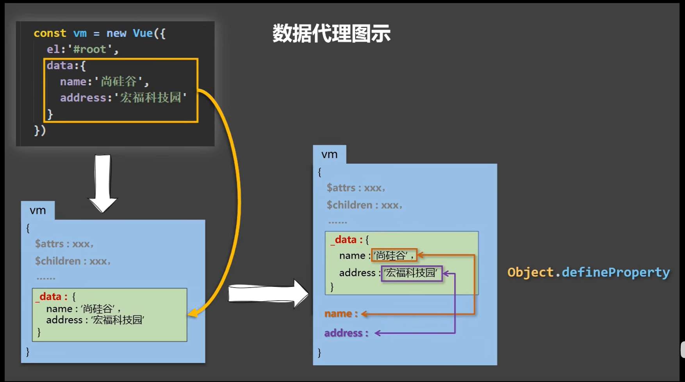

Vue中的数据代理

1.通过vm对象来代理data对象中的属性操作（读/写）

好处：更加方便的操作data中的数据

3.基本原理：通过Object.defineProperty()把data对象中所有属性添加到vm上。

为每一个添加到vm上的属性，指定一个getter和setter。在getter和setter内部去操作（读/写）data中对应的属性


### 事件处理

事件的基本使用：

1.使用v-on:xxx或者@xxx绑定事件，xxx是事件名

2.事件的回调需要配置再methods对象中，最终会在vm上

3.methods中配置的函数，不能使用箭头函数，否则this就不是vm

4.methods中配置的函数，都是被Vue所管理的函数，this指向的vm或组件实例对象

5.@click=‘demo’和@click=‘demo($event)’效果一致，但是后者可以传入参数

使用v-on进行一个事件绑定

```html
<div id='root'>
    <h1>
        欢迎来到{{name}}
    </h1>
    <button v-on:click='showInfo'>点击</button>
</div>
<script>
	const vm = new Vue({
        el:'#root',
        data:{
            name:'祖安'
        },
        methods:{
            /*showInfo(){
                console.log(this)//打印的vm实例
            }*/
            showInfo:(event)=>{
				console.log(this)//this指向的window
            }
        }
    })
</script>
```

v-on:可以简写为@

1.prevent:阻止默认事件：@click.prevent=“showInfo”

2.stop:阻止冒泡事件：@click.stop=“showInfo”

3.once:事件只触发一次：@click.once = “showInfo”

4.capture:使用事件的捕获模式：@click.capture=“showInfo”

5.self:只有event.target是当前操作的元素时才触发事件

6.passive:事件的默认行为立即执行，无需等待事件回调执行完毕


```html
<div @click='showInfo'>
    <a href="www.baidu.com" @click.prevent.stop="showInfo">提示信息</a>
</div>
@click.prevent阻止默认事件，@click.stop阻止冒泡事件，连着写可以阻止冒泡和默认事件。
```


#### 键盘事件

Vue中常用的按键别名:回车=>enter		删除=>delete(捕获删除和退格键)		退出=>esc		空格=>space		换行=>tab（特殊需要配合keydown使用）			上=>up		下=>down		左=>left		右=>right

2.Vue中未提供别名的按键，可以使用按键原始的key值进行绑定，但是要注意转化为kebab-case(短横线命名)

3.系统修饰键（用法特殊）：ctrl、alt、shift、meta（windows键），可以配合keyup使用：按下修饰键的同时，再按下其他键，随后释放其他键，让事件触发。

4.可以使用keyCode去指定具体的按键（不推荐）

5.Vue.config.keyCodes.自定义键名 = 键码，可以去定制按键别名

```html
<input type="text" @keydown.tab='showInfo'>
```

keydown按下按键		.tab按下tab键就会触发showInfo事件

```html
<input type="text" @keydown.ctrl.x="showInfo">
```

按下ctrl+x触发showInfo事件


### 计算属性

将原来的属性加工计算得到全新的属性。

计算属性和属性时分开放的，属性时放在data里面，计算属性时在computed

```js
new Vue({
    el:'#root',
    data:{
		firstName:'张',
      	lastName:'三'
    },
    computed:{
		fullName:{
            //get有什么作用？当有人读取fullName时，get被调用，且返回值就作为fullName的值
            get(){
                return this.firstName + '-' + this.lastName
            }
        }
    }
})
```

computed会将里面的属性缓存，下次使用的时候会直接使用缓存的值，就不用再次调用fullName里面的get函数

所以get调用是在，初次读取fullName时，2.所依赖的数据发生变化时

data和methods的东西会直接挂载在vm上，而computed不会，他会首先调用get函数，得到它的返回值再给fullName


1.定义：要用的属性不存在，要通过`已有的属性 `计算得来

2.原理：底层借助了Object.defineProperty方法提供的getter和setter

3.get函数什么时候执行：初次读取fullName时，2.所依赖的数据发生变化时

4.优势：与methods实现相比，内部有缓存机制（复用），效率更高，调试更方便。

5.备注：1.计算的属性最终会出现再vm上，直接读取使用即可

​					2.如果计算的属性要被修改，那必须写set函数去响应修改，且set中要引起计算时依赖的数据发生变化

#### 计算属性简写方法

完整写法：

```js
fullName:{
    get(){
        return this.firstName+'-'+this.lastName
    },
    set(value){
        const arr = value.split('-')
        this.firstName = arr[0]
        this.lastName = arr[1]
    }
}
```


```js
fullName(){
	return this.firstName+'-'+this.lastName
}
```

这里的fullName的简写（`只包括get`）

当数据没有使用，且数据变化了的情况下，开发者工具里面的数据不会变化，但是实际上是变化了的，可以通过console调试来看


### 监视属性

watch属性（是一个对象），有两个值，new和old，new是监视后改变的值，old是改变之前的值

监视的data里面的属性，或者是computed的计算属性，如果都不是也不会报错的

```js
new Vue({
    el:'#root',
    data:{
        isHot:true
    },
    watch:{
        isHot:{
            immediate:true,//初始化时让handler调用一下
            handler(newValue,oldValue){
                console.log('isHot被修改了',newValue,oldValue)
            }
        }
    }
})
```

handler的调用，isHot发生了改变。

这里还有immediate属性，意思是初始化的时候让handler调用一下

如果给vue在外面添加监视属性，那么应该是

```js
new Vue({
    el:'#root',
    data:{
        isHot:true
    },
    /*watch:{
        isHot:{
            immediate:true,//初始化时让handler调用一下
            handler(newValue,oldValue){
                console.log('isHot被修改了',newValue,oldValue)
            }
        }
    }*/
})
vm.$watch('isHot',{
    immediate:true,//初始化时让handler调用一下
    handler(newValue,oldValue){
        console.log('isHot被修改了',newValue,oldValue)
    }
})
```

监视属性watch：

​			1.当被监视的属性变化时，回调函数自动调用，进行相关操作

​			2.监视属性必须存在，才能进行监视！！

​			3.监视的两种写法：

​			（1）new   Vue时传入watch配置

​			（2）通过vm.$watch监视

#### 深度监视：

只监视属性里面的成员需要.来访问成员，但是这样会报语法错误，因此还原为最本质的存在用引号包裹名称‘numbers.a’:{}来进行一个监视

```js
Vue.config.productionTip = false
    const vm = new Vue({
      el: '#root',
      data: {
        numbers:{
          a:1,
          b:1
        }
      },
      watch: {
        'numbers.a':{
            console.log('改变了')
        }
      }
    })
```

如果只是写了numbers，那么无论里面的值如何变化都不会有任何响应

```js
Vue.config.productionTip = false
    const vm = new Vue({
      el: '#root',
      data: {
        numbers:{
          a:1,
          b:1
        }
      },
      watch: {
        numbers:{
            deep:true,//检测多级结构中所有属性的变化
            handler:{
			console.log('numbers改变了')
            }
        }
      }
    })
```

像上面的例子无论，ab怎么改变，numbers不改变，因为numbers:{}检测的是numbers对应的地址，只有彻底替换掉numbers才会触发。所以可以通过添加`deep`属性来进行深度监视，添加deep之后无论a还是b变化都可以看作是numbers变化。Vue默认能够深度监测属性的，`但是`为程序员提供的watch是默认不能深度监测的，如果需要那么就需要添加属性deep:true，来实现。

深度监视的特点：（1）Vue中的watch默认不监视对象内部值的改变（只有一层监视），Vue能监测对象内部值的改变，但是其提供的watch默认不能（2）配置`deep:true`可以检测对象内部值改变（多层）。

使用时根据结构，选择是否需要深度监视


#### 监视属性的简写

如果没有immediate和deep等属性，只有handler函数那么可以写成

```js
//完整的写法
        // isHot:{
        //   // immediate:true,
        //   // deep:true,
        //   handler(newValue,oldValue){
        //     console.log('isHot被修改了',newValue,oldValue)
        //   }
        // }
	isHot(newValue,oldValue){
          console.log('isHot被修改',newValue,oldValue)
        }
```

这是在Vue中进行操作的

如果是在Vue外的话，那么也是如此

```js
vm.$watch('isHot',function(){
           console.log('isHot被修改了',newValue,oldValue)
     })
```


`切记`Vue挂载的函数一定是普通函数，使用箭头函数会指向window

可以用watch来实现全名的更新

例如：

```js
 watch: {
        firstName (newValue) {
          setTimeout(()=>{
              this.fullName = newValue+'-'+this.lastName
          },1000)
        },
        lastName (newValue) {
          this.fullName = this.firstName +'-'+newValue
        }
      }
```

但是computed更加方便，倘若需要延迟一秒才进行更改名字，那么只能用监视属性，而不能用computed，因为实现不了，因为computed就是靠的他的返回值，而不能等待再得到返回值。`计算属性里面`不能开启异步任务，去维护数据.

这个setTimeout的定时器的回调就是js指定的回调，而且在调用的时候，就已经指向window。

computed和watch之间的区别：

​	1.computed能完成的功能，watch都可以完成。

​	2.watch能完成的功能，computed不一定能完成，例如：watch可以进行异步操作。

两个重要的小原则：

​	1.所被Vue管理的函数，最好写成普通函数，这样this的指向才是vm或组件实例对象

​	2.所有不被Vue所管理的函数（定时器的回调函数、ajax的回调函数等），最好写成箭头函数，这样this的指向才是vm或组件实例对象


### class和style绑定

#### class绑定

有三种类型，字符串写法，数组写法，对象写法，各个写法的适用场景不同

```html
<!-- 绑定class样式————字符串写法 :是v-bind的简写，适用于样式的类名不确定的情况下，需要动态指定-->
    <div class="basic" :class="mood" id="demo"@click="changeMood">{{name}}</div><br><br>

    <!-- 绑定class样式————数组写法 要绑定的样式个数和名字都不确定-->
    <div class="basic" :class="classArr">{{name}}</div><br><br>
    
    <!-- 绑定class样式————对象写法：适用场景，要绑定的样式和名字不确定，而且动态决定是否使用 -->
    <div class="basic" :class="classobj">{{name}}</div><br><br>
<script>
    Vue.config.productionTip = false;
    new Vue({
      el:'#root',
      data:{
        name:'尚硅谷',
        mood:"normal",
        classArr:['at1','at2','at3'],
        classobj:{
          at1:true,
          at2:false,
          at3:true
        }
      },
      methods:{
        changeMood(){
          // document.querySelector('#demo').className = 'basic happy'  最好不要直接操作DOM
          const arr = ['happy', 'normal','sad']
          const i = Math.floor(Math.random()*3)
          this.mood = arr[i]
        }
      }
    })
  </script>
```


style常见的绑定也有三种，第二种比较常用（绑定数组类型），第三种少见

```html
<div class="basic" :style="{fontSize: fsize+'px'}">{{name}}</div><br><br>

    <div class="basic" :style="styleObj">{{name}}</div><br><br>

    <div class="basic" :style="[styleObj,styleObj2]">{{name}}</div><br><br>
<script>
    Vue.config.productionTip = false;
    new Vue({
      el:'#root',
      data:{
        name:'尚硅谷',
        fsize:40,
        styleObj:{
          fontSize:'40px',
          color:'red'
        },
        styleObj2:{
          background:'orange'
        }
      },
      }
    })
    
  </script>
```

总结：

​	class样式：

​		写法:class=“xxx”，xxx可以是字符串，数组和对象；字符串写法适用于：类名不确定，需要动态获得；数组写法适用于：要绑定多个样式，个数不确定，名字也不确定；`对象写法`：适用于要绑定多个样式，个数确定，名字也确定，但是不确定是否使用

​	style样式：

​			:style=“{fontSize:xxx+‘px’}”其中xxx是动态值

​			:style=“[a,b]”，其中a、b是样式对象


### 条件渲染

使用v-show和v-if（和v-if配套的还有v-else与v-else-if）

v-show，主要是与display相关，不会影响结构；

而v-if会影响结构，导致结构消失而不是不可见

```html
<div v-if="n == 1">Angular</div>
    <div v-else-if="n == 2">React</div>
    <div v-else-if="n == 3">Vue</div>
```

这样的三个不能散开

如果都是一个值类型那么可以使用<template>来包含三个内容，最终渲染的时候不会渲染template，相当于他是一个跳板而已

```html
<template v-if="n==1">
	<h2>1</h2>
    <h2>2</h2>
    <h2>3</h2>
</template>
```

template只能和v-if使用，不能和v-show一起使用

v-if

​	写法：

​		1.v-if=“表达式”               2.v-else=“表达式”				3.v-else-if=“表达式”

​		适用于切换频率低的场景。特点：不展示DOM元素`直接被移除`。注意：但要求结构不能被“打断”

​	v-show

​		写法：v-show=“表达式”

​		适用于切换频率高的场景。特点：不展示DOM元素`没有被移除`，只是display:none

使用v-if的时候，元素可能无法获取到，而使用v-show一定可以获取

### 列表渲染

#### v-for

```html
<li v-for="person in persons":key="person.id">{{person.name}}-{{person.age}}</li>
```

倘若:key固定那么会直接报错，而且react如果没有那个key的话，那么会报错。

```html
<li v-for="(p,index) in persons" :key="index">{{p.name}}------{{p.age}}</li>
```

第一个就是对象，第二个是索引值

遍历对象的时候，是先取得value再取得key值，数组可以使用in或者of，而对象只能是of取值，


同样v-for，可以用来遍历字符串（用的少）

故绑定类型类型：Array | Object | number | string | Iterable

指令值，必须使用特殊语法：alias in expression 为正在迭代的元素提供一个别名。

或者，你可以为索引指定别名（如果是对象，则是键值对的形式）

```html
<div v-for="(item,index) in items">
    {{item}}----{{index}}
</div>
<div v-for="(value,key) in object">
    {{item}}----{{key}}
</div>

<div v-for="(value,name,index) in object">
    {{value}}----{{name}}-----{{index}}
</div>
```

如果v-for要进行强制排序，那么使用特殊的attribute，`key`来做一个排序提示

```html
<div v-for="item in items" :key="item.id">
    {{item}}----{{index}}
</div>
```

可以用of替代in

还可以指定次数（用的少）

```html
<li v-for="(a,b) in 5"></li>
<!--第一个值时value，第二个时索引--!>
```


#### key的原理

```html
<li v-for="(p,index) in persons" :key="index">{{p.name}}------{{p.age}} <input type="text"></li>
```

这个会出现错乱的情况，输入框错位。但是`:key=‘p.id’是不会出现问题`

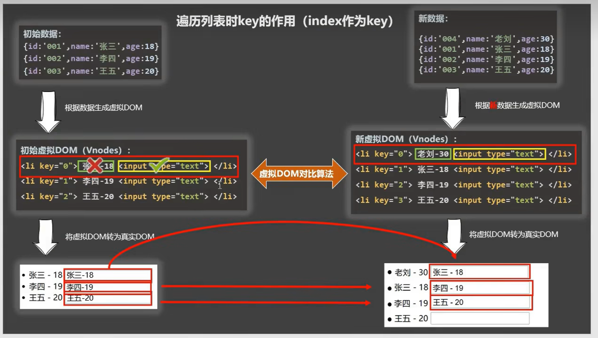

虚拟DOM算法进行一个对比，`对比的虚拟DOM`，标签一样，故会继承；不一致，那么名字替换。一行一行进行对比。

如果没有出现打乱数据顺序的操作是可以使用index作为key的标识，而出现了那么只能用`唯一确定且不会重复或更改的数据`作为标识（比如id）

如果key是index，向数组的头部插入一个元素得到新数组，由于使用index来当作key，所以他会和之前同index内容相同（如上图）。但是如果使用id作为key，每个元素的id皆不同，故他原有的input会跟原有的内容一样。


总结：

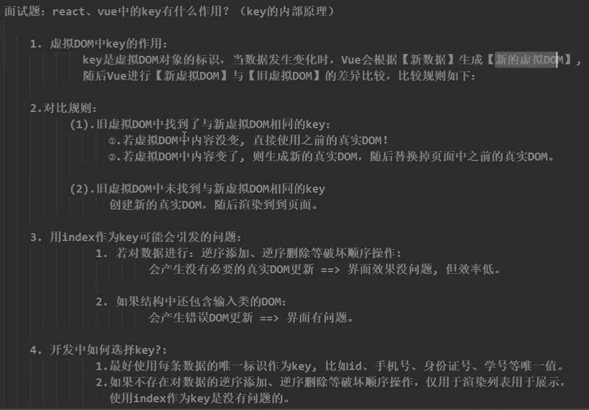


#### 列表过滤

使用filter函数

使用indexOf查看数据的名字中是否包含某某字符串。如果不包含值为-1（空字符串的indexOf值为0）

使用watch实现监视属性

```html
<!DOCTYPE html>
<html lang="en">
<head>
  <meta charset="UTF-8">
  <meta name="viewport" content="width=device-width, initial-scale=1.0">
  <script src="../JS/vue.js"></script>
  <title>列表渲染</title>
</head>
<body>
  <div id="root">
     <h2>人员列表</h2>
     <input type="text" placeholder="请输入姓名" v-model="keyWord">
     <ul>
      <li v-for="(p,index) in filterPersons" :key="index">
        {{p.name}}-{{p.age}}-{{p.sex}}
      </li> 
     </ul>
  </div>
</body>
<script>
  Vue.config.productionTip = false
  new Vue({
    el:'#root',
    data:{
      keyWord:'',
      persons:[
        {id:1,name:'马冬梅',age:18,sex:'female'},
        {id:2,name:'周冬雨',age:19,sex:'female'},
        {id:3,name:'周杰伦',age:20,sex:'male'},
        {id:4,name:'温兆伦',age:22,sex:'male'},
      ],
      filterPersons:[]
    },
    watch:{
      /*keyWord(val){//这里的val是新值
        this.filterPersons = this.persons.filter((p)=>{
          return p.name.indexOf(val)!==-1
        })
      }*/
      keyWord:{
        immediate:true,
        handler(val){
          this.filterPersons = this.persons.filter((p)=>{
            return p.name.indexOf(val)!==-1
          })
        }
      }
    }
  })
</script>
</html>
```

空字符串是可以查询到的，查询到的`值为0`，而非-1

也可以换做computed实现

```js
new Vue({
      el:'#root',
      data:{
        keyWord:'',
        persons:[
          {id:1,name:'马冬梅',age:18,sex:'female'},
          {id:2,name:'周冬雨',age:19,sex:'female'},
          {id:3,name:'周杰伦',age:20,sex:'male'},
          {id:4,name:'温兆伦',age:22,sex:'male'},
        ]
      },
      computed:{
        filterPersons(){
          return this.persons.filter((p)=>{
            return p.name.indexOf(this.keyWord)!==-1
          })
        }
      }
    })
```

计算属性需要直接返回值才能得到。上面依赖的是keyWord的变化


#### 列表排序

对于列表排序，可以使用一个数来判定到底是升序还是降序或者原封不动，那么就需要一个计算属性进行得到

```js
Vue.config.productionTip = false
  new Vue({
    el:'#root',
    data:{
      keyWord:'',
      sortType:0,//0代表原顺序，1代表降序，2升序
      persons:[
        {id:1,name:'马冬梅',age:30,sex:'female'},
        {id:2,name:'周冬雨',age:19,sex:'female'},
        {id:3,name:'周杰伦',age:31,sex:'male'},
        {id:4,name:'温兆伦',age:22,sex:'male'},
      ]
    },
    computed:{
      filterPersons(){
        const arr = this.persons.filter((p) => {
          return p.name.indexOf(this.keyWord)!==-1
        })
        if(this.sortType){
          arr.sort((a,b) =>{
            return this.sortType === 1? b.age - a.age : a.age - b.age
          })
        }
        return arr
      }
    }
  })
```


#### 更新时的一个问题

   如果直接将数据的地址进行替换，那么可能出现检测不到的情况

```js
const vm= new Vue({
    el:'#root',
    data:{
      persons:[
        {id:1,name:'马冬梅',age:30,sex:'female'},
        {id:2,name:'周冬雨',age:19,sex:'female'},
        {id:3,name:'周杰伦',age:25,sex:'male'},
        {id:4,name:'温兆伦',age:22,sex:'male'},
      ]
    },
    methods:{
      updateMei(){
        // this.persons[0].name = '罗冬梅'
        // this.persons[0].age = 18
        this.persons[0] = {name:'杨冬梅',age:18,sex:'male'} //数据是发生了改变的但是，没有vue没有监测到数据变化
      }
    }
  })
```

比如上文的更新方法，不能让vue检测到，故点击更新按钮后，数据页面仍然不会发生变化

先引入：

#### Vue检测数据改变的原理

data是与vm._data挂钩的（vm是vue的实例对象），data对象经过加工，赋值给vm. _data。

在vm._data里面存在setter和getter，当data数据改变时，其中的函数被调用，然后页面和vm. _data就改变

```js
let data={
	name:'abc'
}
Object.defineProperty(data,'name',{
    get(){
        return data.name
    },//这个get是错误的，因为无限递归导致内存超限了，因为读取data.name那么 
    set(val){
        data.name=val
    }
})
```

Vue检测始终是靠着set来监视属性的

```JS
function Observe(obj){
    //汇总对象中所有属性形成一个数组
    const keys = Object.keys(obj)
    keys.forEach(k =>{
      Object.defineProperty(this,k,{
        get(){
          return obj[k]
        },
        set(val){
          console.log(`${k}被更改，需解析模版生成虚拟DOM......`)
          obj[k] = val
        }
      })//this指的实例对象
    })
  }
```

这里只有一层监视，倘若有很多层那么需要递归去监视


#### Vue.set的使用

如果data里面存在a，而在a中不存在b,那么使用a.b是不会报错的会出现undefined，但是Vue里面的undefined不会显示出来。

但是如果data里面`第一层没有a`，那么肯定`会报错`。

Vue后天加的属性没有响应式，比如data里面有个student，student里面没有sex，在实例化之后再添加的sex，那么这个sex是`没有getter和setter`的。

可以借助API去给后天加的数据也有响应式，使用`Vue.set()`

比如

```js
Vue.set(vm._data.student,'sex','男')
```

Vue.set(父数据项，‘添加的属性名称’，属性值)或者使用vm.$set(target,key,val)（vm是Vue的实例化对象）

因为vm._data.student === vm.student.

注意：target不能是vm（Vue实例）或者vm.data（Vue实例的根数据对象）


#### Vue检测数据改变的原理_数组

如果里面是一个数组，是没有为每一项匹配getter和setter的。

```js
const vm = new Vue({
    el:'#root',
    data:{
      student:{
        hobby:['抽烟','喝酒','打架','烫头'],
    }
  })
```

比如这个hobby就没有单独的setter和getter 但是当hobby改动里面的每一项是没有响应式的

```js
const vm = new Vue({
    el:'#root',
    data:{
      student:{
        hobby:{
            h1:'抽烟',h2:'喝酒',h3:'打架',h4:'烫头',
        }
    }
  })
```

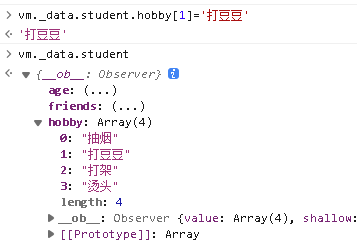

改变了但是没能监视到

但是当使用`push,pop,shift,unshift,splice,reverse,sort`等函数的时候可以被vue检测进行一个重新展示数据

因此如果需要更改数组中的元素使其奏效那么，应该使用splice(0,1,’更改的值’)

splice(起始索引，终止索引，需要填充的值)，如果第三个不写那么就是`删除[起始索引，终止索引)的值，不包括终止索引上的`

arr.push===Array.prototype.push        值是true

但是vm._data.student.hobby.push  ===Array.prototype.push  值是false

因为左边这个push是先使用的vue写出来的push，这个push，先调用Array.prototype.push，然后再重新解析模版生成图像。故左边push不等于右边push。

也可以使用Vue.set(vm.student.hobby,1,’打台球’)

数组中添加一个新的对象，这个对象是响应式的


#### 总结Vue监视数据

1.Vue会监视data所有层次的数据


2.如何检测对象中的数据？

​	通过setter实现监视，且要在new Vue时要传入要检测的数据

​	（1）对象中后追加的属性，Vue默认不做响应式处理

​	（2）如果需要追加响应式，要使用以下API

​				Vue.set(target,key/index,value)             或者vm.$set(target,key/index,value)

3.如何检测数组中的数据？

​			通过包裹数组更新元素的方法实现，本质上做了两件事，（1）调用原生的对应方法对数组更新（比如Array.prototype.push）（2）重新解析模版，进而更新页面


4.Vue修改数组中的某个元素一定要使用下面的方法：

​		（1）使用这些API：push() ,pop() ,shift() ,unshift() ,splice(), sort(), reverse()

​		（2）使用Vue.set()或者vm.$set()

特别注意：Vue.set()或者vm.$set()`不能`给vm或者vm的根数据对象（比如data）添加属性！！！！

监视所有属性的行为叫做数据劫持，比如修改student时，student的setter劫持到了变化，然后就重新解析模版，进而更新 


### 收集表单数据


示例代码：

```html
<!DOCTYPE html>
<html lang="en">
<head>
  <meta charset="UTF-8">
  <meta name="viewport" content="width=device-width, initial-scale=1.0">
  <script src="../JS/vue.js"></script>
  <title>收集表单数据1</title>
</head>
<body>
  <div id="root">
    <form @submit.prevent="demo">
      <label for="id">账号：</label> <input type="text" id="id" v-model.trim="userInfo.account"><br> <br> 
      <label for="password">密码：</label> <input type="password" id="password" v-model="userInfo.password"><br><br> 
      <label for="number">年龄</label> <input type="number" id="number" v-model.number="userInfo.age"><br><br> 
      性别： 
      <label for="male">男</label><input type="radio" id="male"name="sex" value="male" v-model="userInfo.sex"> 
      <label for="female">女</label><input type="radio" id="female" name="sex" value="female" v-model="userInfo.sex">  <br><br> 
      爱好：
      <label for="eating">吃饭</label><input type="checkbox" name="hobby" id="eating"v-model="userInfo.hobby" value="eat"> 
      <label for="sleep">睡觉</label><input type="checkbox" name="hobby" id="sleep"v-model="userInfo.hobby" value="sleep"> 
      <label for="play">打豆豆</label><input type="checkbox" name="hobby" id="play"v-model="userInfo.hobby" value="play">
      <br><br>
      <select v-model="userInfo.city">
        <option value="">请选择校区</option>
        <option value="beijing">北京</option>
        <option value="shanghai">上海</option>
        <option value="hangzhou">杭州</option>
      </select>
      <br><br>
      其他信息：
      <textarea name="" id="" cols="30" rows="10" v-model.lazy="userInfo.other"></textarea><br><br>
      <!-- 上面不需要实时收集，只需要输入完收集，故加个lazy修饰符 -->
      <input type="checkbox" v-model="userInfo.agree">阅读并且接受协议 <a href="www.atguigu.com">《用户协议》</a>
      <button>提交</button>
    </form>
  </div>
</body>
  <script>
    Vue.config.productionTip = false
    const vm = new Vue({
      el:'#root',
      data:{
        userInfo:{
          account:'',
          password:'',
          sex:'',
          hobby:[],
          city:'',
          other:'',
          agree:'',
          age:18
        }
      },
      methods:{
        demo(){
          console.log(JSON.stringify(this.userInfo))
        }
      }
    })
  </script>
</html>
```


### 过滤器

写法 

```html
    <h2>现在的时间是{{time | timeFormater}}</h2>
<script>
	new Vue({
        el:'#root',
        data:{
            time:1691594105209
        },
        filters:{
            timeFormater(val){
                return dayjs(val).format('YYYY年MM月DD日 HH:mm:ss')
            }
        }
    })
</script>
```

它会把前面的time这个数据作为参数传入到timeFormater()中，然后展示该函数的返回值

写在Vue里面的filters里面的过滤器是局部过滤器，而Vue.filter(name,callback)是`全局过滤器`

过滤器还可以写在标签里面使用v-bind:进行绑定

过滤器定义：对要显示的数据进行特殊格式化后再显示（适用于一些简单的逻辑）

语法：1.注册过滤器：Vue.filter(name,callback)或者new Vue({filters:{}})

2.使用过滤器： {{xxx | 过滤器名}}   或者   v-bind:属性 =  ‘xxx | 过滤器名’

1.过滤器也可以接收额外参数、多个过滤器也可以串联

2.原本数据不改变，是产生新的数据例如，数组中的filter方法


### 内置指令

学过的指令：v-bind：，单向绑定解析表达式，可简写为:xxx				v-model：双向绑定			v-for：遍历数组/对象/字符串				v-on：绑定监听事件			v-if：条件渲染（动态控制节点是否存在）	v-else：条件渲染

v-show：条件渲染（动态控制节点是否展示）

#### v-text

作用：向其所在节点中渲染文本内容


```html
<div>
    {{name}}
</div>
<div v-text="name">
</div>
```

两者的内容相同

后者是拿name的内容去替换掉`整个div里面的内容`

v-text也不会解析标签，v-text是把整个字符串当作文本解析掉

插值语法更灵活


#### v-html

也是向节点中渲染文本内容

v-html能解析标签


cookie

千万切记不能让别人拿到你的cookie不然，别人可以模范信息去做坏事


#### v-cloak

当Vue加载完成就去除掉v-cloak，可以使用v-cloak让未经过解析的模版在页面上展示


本质：特殊的属性，Vue实例创建完毕并接管容器后，会删除掉v-cloak属性

使用css配合v-cloak可以解决网速慢时页面展示出{{xxx}} 的问题

```html
<html>
    <head>
        <style>
            [v-cloak]{
                display:none;
            }
        </style>
    </head>
    <body>
        <div id="root">
            <h2 v-cloak>
                {{name}}
            </h2>
        </div>
    </body>
    <script>
    	new Vue({
            el:'#root',
            data:{
                name:'xxxx'
            }
        })
    </script>
</html>
```


#### v-once

保留数据初始化的值

```html
<html>
    <head>
    </head>
    <body>
        <div id="root">
            <h2 v-once>
                n的初始值为：{{n}}
            </h2>
            <h2>
                n的值为：{{n}}
            </h2>
            <button @click="n++">
                点击n++
            </button>
        </div>
    </body>
    <script>
    	new Vue({
            el:'#root',
            data:{
                n:1
            }
        })
    </script>
</html>
```

v-once所在节点在初始渲染了之后，就视为静态内容了

以后数据的改变不会引起v-once所在结构的更新，可以用于优化性能


#### v-pre

跳过其所在节点的编译过程。

可以用它跳过，没有使用指令语法，没有使用插值语法的节点，会加快编译。（让Vue不去解析这些东西）

```html
<h2 v-pre>
    Vue不难
</h2>
<button v-pre a='1' @click="n++">点我n+1</button>
```

查看源代码的时候就是上述的东西<h2 v-pre>Vue不难</h2>，<button v-pre a='1' @click="n++">点我n+1</button>	


### 自定义指令

使用全新的配置项：directives

```html
<body>
  <div id="root">
    <h2>当前的n值是<span v-text="n"></span></h2>
    <h2>放大十倍的n值是<span v-big="n"></span></h2>
    <button @click="n++">点我n+1</button>
  </div>
</body>
<script>
  Vue.config.productionTip = false
  new Vue({
    el:'#root',
    data:{
      n:1
    },
    directives:{
      // big:function(){
        // element.innerText = binding.value*10
      // }
      big(element,binding){
        element.innerText = binding.value*10
      }
    }
  })
</script>
```

big`函数`在指令与元素成功`绑定`时调用一次；指令所在模块被重新解析时再次调用 

```js
new Vue({
    el:'#root',
    data:{
      n:1
    },
    directives:{
      // big:function(){
        // element.innerText = binding.value*10
      // }
      big(element,binding){
        element.innerText = binding.value*10
      },
      fbind:{
        // 指令与元素成功绑定时
         bind(element,binding){
          // console.log('bind');
          element.value = binding.value
         },
         //指令所在元素被插入页面时
         inserted(element,binding){
          element.focus()
         },
        //  指令所在模块被重新解析时
        update(element,binding){
          element.value = binding.value
        }
      }
    }
  })
```

写成对象的形式，这样可以明确在不同时期，写不同的事件


如果对于多个单词组合陈 的自定义指令那么不能使用驼峰法命名，因为在标签里面写v-bigNumber会自动转化为bignumber，是无法查找到的，可以用‘’把key括起来。例如

```js
directives:{
    'big-number'(element,binding){
        element.innerText = binding.value*10
    }
}
```

然后标签写为：<span v-big-number="n"></span>

指令里面的this都是`window对象`

全局指令：Vue.directive(‘name’,配置项)

如果是函数形式：Vue.directive(‘name’,function(){})


总结：

定义语法：

局部指令：new Vue({directives:{指令名:配置对象}})         或者new Vue({directives:{指令名:回调函数}})

配置对象中常用的3个回调：(1)bind：指令与元素成功绑定时调用。（2）inserted:指令所在元素被插入页面时调用。（3）update：指令所在模块结构被重新解析时调用。

指令定义时，不加v-；但是使用时，要加。

指令命名倘若是多个单词，要使用kebab-case命名，不能用camelName命名


### 生命周期

引入：

```html
<!DOCTYPE html>
<html lang="en">
<head>
  <meta charset="UTF-8">
  <meta name="viewport" content="width=device-width, initial-scale=1.0">
  <title>Document</title>
  <script src="../JS/vue.js"></script>
</head>
<body>
  <div id="root">
    <h2 :style="{opacity}">欢迎学习Vue</h2>
    {{change()}}
  </div>
</body>
<script>
  Vue.config.productionTip = false
  new Vue({
    el:'#root',
    data:{
      opacity:1
    },
    methods:{
      change(){
        console.log('开启定时器')
        setInterval(()=>{
          this.opacity -=0.01
          if(this.opacity<=0) this.opacity = 1
        },16)
      }
    }
  })
</script>
</html>
```

上面代码会`无限开启定时器`，直至电脑内存溢出卡死。

因为上面setInterval函数里面在`修改opacity`，那么会重新解析模版（也就是root的所有内容），那么他的change()又会被重复调用

解析模版，先变成虚拟DOM，再变为真实DOM，再进行放入页面。我们需要是在放在页面后再去执行，而不是在渲染途中


为了解决上述的苦恼，需要使用一个挂载的东西，也叫mounted(){}，它在Vue完成模版解析并把真实的DOM放入页面后再去调用

上述代码可以改为

```js
Vue.config.productionTip = false
  new Vue({
    el:'#root',
    data:{
      opacity:1
    },
    methods:{
      
    },
    mounted(){       
        setInterval(()=>{
          this.opacity -=0.01
          if(this.opacity<=0) this.opacity = 1
        },16)
      }
  })
```

mounted(){}里面的this指向Vue


生命周期：又叫生命周期回调函数、声明周期函数、生命周期钩子

它是Vue在关键时刻帮我们调用一些特殊函数名称的函数

生命周期函数的名字不可更改，但函数的具体内容是程序员根据需求编写的

生命周期函数的this指向是vm，或者组件实例对象

流程：beforeCreate(){}，created(){}，beforeMount(){}，mounted(){}，beforeUpdate(){}（此时数据是更新好了但是页面还没有更新），updated(){}（在前面一个和这个之间存在虚拟DOM的更新使用了diff算法，只更新差异处），beforeDestroy(){}，destroyed(){}。最后两个是进行完全销毁Vue实例的，清理它与其他实例（组件实例）的连接，解绑它的全部指令及事件监听器(自定义事件销毁)，`数据会残留但是不会更新了`（销毁前是什么，销毁后仍然是什么，因为是转化为真实DOM插入到页面了的），而且在浏览器里面打开调试Vue是没有任何东西的


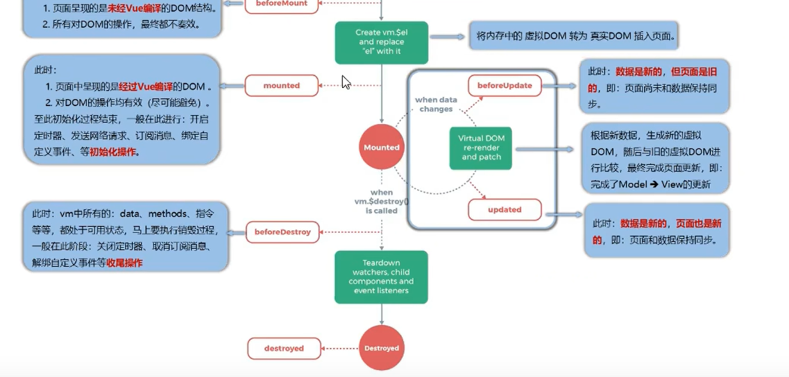


这里的template选项不存在的话那么，包裹那一层也是可以使用vue的语法的，比如<div id="root"></div>这个模版里面也可以使用v-bind等等指令

template里面的所有内容都是会，完全替换掉<div id="root"></div>所有的内容（包括他自己）

template里面只能有一个根元素所以需要这样写：

```js
new Vue({
    el:'#root',
    template:`<div>
    			<h2>当前的n值是{{n}}</h2>
    			<button @click="add">点我n+1</button>
    		</div>
    	`,
    data:{
        n:1
    },
    methods:{
        add(){
            this.n++
        }
    }
})
```

而且不能使用<template></template>作为组件根元素

存储el到vm中，是为了方便复用。

在beforeDestroy阶段的时候，Vue的数据还能用，且能更改，但是不会被监控到，也就不会更新页面


总结：

将要创建====>beforeCreate函数					创建完毕= == =>created函数					`将要挂载`= = = =>beforeMount函数(初始化)

挂载完毕= = = =>mounted函数			将要更新 = = = => beforeUpdate			更新完毕 = = = = > updated函数

`将要销毁` = = = =>beforeDestroy函数			销毁完毕 = = = => destroyed函数

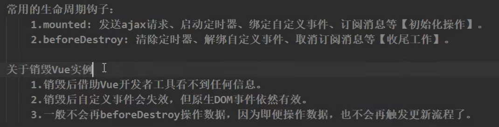


## Vue组件化编程

### 模块与组件、模块化与组件化

组件：实现应用中局部功能代码和资源的集合。目的是为了复用编码，简化项目编码，提高运行效率

组件化：应用中的功能都是多组件的方式来编写的

模块：向外提供特定功能的js程序，一般是一个js文件。目的：复用js，简化js的编写，提高js的运行效率

模块化：应用中的js都以模块来编写。


### 非单文件组件

#### 基本使用

定义：一个文件包含n个组件

组件的data一定是写函数式

创建组件，注册组件，使用组件（编写组件标签，在components对象里面，前面是标签名，后面那个是组件名）

```html
<!DOCTYPE html>
<html lang="en">
<head>
  <title>Document</title>
  <script src="../JS/vue.js"></script>
</head>
<body>
  <div id="root">
    <shcool></shcool>
    <hr>
    <student></student>
  </div>
</body>
<script>
  Vue.config.productionTip = false
  //创建一个shcool组件
  const shcool = Vue.extend({
    template:`
        <div>
          <h2>学校名称{{schoolName}}</h2>
          <h2>学校地址{{address}}</h2>
        </div>
      `,
    //不要写el配置项，因为最终都会被vm管理
    data(){
      return{
        name:'大竹中学',
        address:'大竹'
      }
    }
  })

  const student = Vue.extend({
    template:`
      <div>
        <h2>学生名称{{studentName}}</h2>
        <h2>学生年龄{{age}}</h2>
      </div>
    `,
    data(){
      return{
        studentName:'张三',
        age:18
      }
  }
})
// 创建vm
  new Vue({
    el:"#root",
    //局部注册
    components:{
      shcool:shcool,//可以简写为shcool
      student:student//简写为student
    }
  })
</script>
</html>
```

全局注册

```js
const hello = Vue.extend({
    template:`
    	<div>
    		<h2>Hello World!!!</h2>
    	</div>
    `
})
//全局注册
Vue.component('hello',hello)
```


使用组件的三大步骤：1.定义组件			2.注册组件			3.使用组件（写组件标签）

定义组件：

​		使用Vue.extend(options)，其中options和new Vue(options)传入的options`几乎`一模一样，但是仍然有如下区别。

​				1.el不能写，因为最终的组件都要经过一个vm实例管理，由vm中的el决定服务于哪一个

​				2.data必须写成函数形式，避免组件复用时，数据相互污染（在使用多个相同组件时，a的数据，b也能用的现象）。

注册组件：

​		局部注册：靠new Vue()的时候传入components选项

​		全局注册：靠Vue.component(‘组件名’,组件)

编写组件标签：

<school></school>


注意点（组件名）：

​		对于一个单词组成：纯小写、首字母大写

​		对于多个单词组成：纯小写（用-分割单词，记住加引号），每个单词首字母大写（But需要在Vue脚手架环境写）

```js
new Vue({
    el:"#root",
    //局部注册
    components:{
      Shcool:shcool,
      Student:student,
      'my-school':'my-school'
    }
  })
```


尽可能避免HTML已有元素名称，比如，h2或者H2。

可以使用name配置项指定组件在开发者工具中呈现的名字

```js
const shcool = Vue.extend({
    template:`
        <div>
          <h2>学校名称：{{schoolName}}</h2>
          <h2>学校地址：{{address}}</h2>
        </div>
      `,
      name:'ChichengL',
    //不要写el配置项，因为最终都会被vm管理 
    data(){
      return{
        schoolName:'大竹中学',
        address:'大竹'
      }
    }
  })
```

在开发者工具里面的Vue里面可以看到标签名为ChichengL的组件


组件标签除了双标签还能写成单标签的形式。<school></school>   或者   <school/>。

但是如果不使用脚手架环境，后面那种标签名会导致后续组件不能渲染。

定义组件的时候，本来是 const s = Vue.extend(options)，但是可以简写：const s = options

虽然这里没有写Vue.extend但是实际上是调用了的


#### 组件嵌套

组件嵌套时，先声明内部的组件，即子组件

```js
//先声明子组件
  const student = Vue.extend({
    template:`
        <div>
          <h2>学生姓名：{{studentName}}</h2>
          <h2>学生年龄：{{age}}</h2>
        </div>
      `,
    data(){
      return{
        studentName:'张三',
        age:18
      }
    }
  })
  //创建一个shcool组件
  const school = Vue.extend({
    template:`
        <div>
          <h2>学校名称：{{schoolName}}</h2>
          <h2>学校地址：{{address}}</h2>
        <student></student>
        </div>
      `,
    //不要写el配置项，因为最终都会被vm管理 
    data(){
      return{
        schoolName:'大竹中学',
        address:'大竹'
      }
    },
    components:{
      student
    }
  })
// 创建vm
  new Vue({
    el:"#root",
    components:{
      school
    } 
  }) 
```


通常是vm管理一个app，然后app管理各类组件


#### VueComponent

组件的本质就是VueComponent的构造函数，且不是程序员定义的，是Vue.extend生成的

我们只需要写<school></school>或者<school/>，Vue解析时会帮我们创建`组件的实例对象`，即Vue 帮我们执行的：new VueComponent(options)，么哦吃创建都会调用该函数

每次调用Vue.extend，返回的是一个新的VueComponent！！  比如定义并且注册使用，school和hello组件，那么这两个分别是两个 new VueComponent

```js
//已经定义好组件这些了
school.a = 0
console.log('#',school.a)
console.log('@',hello.a)
```


关于this指向：

（1）组件配置中：data函数，methods中的函数、watch中的函数，computed中的函数，他们的this均是VueComponent实例化对象。

（2）new Vue(options)配置中：data函数，methods中的函数、watch中的函数，computed中的函数，他们的this均是Vue实例化对象

注册的组件对象是在vm的$children上的


#### 重要的内置关系

VueComponent简称vc，Vue的实例对象简称vm。

vm和vc的东西有99%的相似度，但是vc没有el配置项，而vm有，而且vc里面的data只能写成函数形式。

构造函数.prototype === 实例对象(或者就是对象)._ _proto _ _

实例对象的隐式链指向原型对象。`Vue让VueComponent的原型对象的隐式原型指向Vue的原型对象`

关系：VueComponent.prototype._ _proto _ _ === Vue.prototype

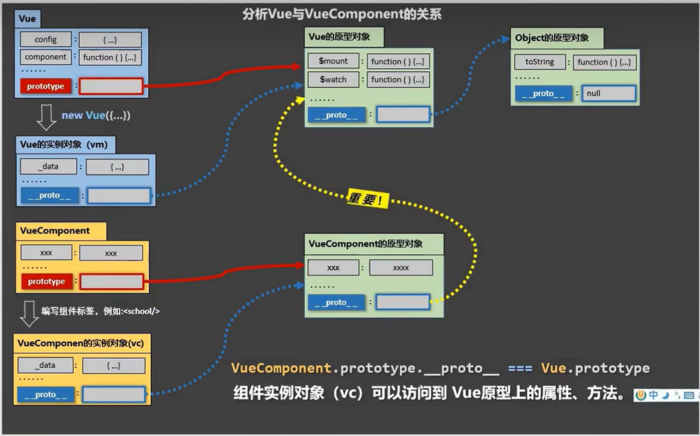

因此在Vue.prototype上面加一个属性，VueComponent的实例对象也能使用


### 单文件组件（重要）

比如单独的xxx.vue的文件，然后用脚手架或者webpack打包才能使用。

对于单文件组件需要暴露才可被引用

暴露方式：（1）分别暴露 

```js
export const school = Vue.extend(options)
```

(2)统一暴露

```js
const school = Vue.extend(options)
export {school}
```

(3)默认暴露

```js
const school = Vue.extend(options)
export default {school}
```

默认暴露最常用，因为使用的时候直接 import ??? from ???

前面两个，分别暴露和统一暴露需要 import {???} from ???

可以简化

```js
export default Vue.extend(options)
//或者
export default {
    name:'School',
    data(){
        return{
            schoolName:'111',
            address:'222'
        }
    },
    methods:{
        showName(){
			alert(this.schoolName)
        }
    }
}
```


```vue
<template>
  
</template>

<script>
export default {

}
</script>

<style>

</style>
```


安装了vetur插件之后直接打<v + Enter就可以快速出现模版

模版里面必须要有一个根元素包裹	


创建School组件

```vue
<template>
<!-- 组件的结构   -->
  <div class="demo">
    <h2>学校名称{{ schoolName }}</h2>
    <h2>学校地址{{ address }}</h2>
    <button @click="showName">点我提示学校名</button>
  </div>
</template>

<script>
//
//组件交互相关的代码（数据方法）
//下面这个叫分别暴露
  export const School = Vue.extend({
    name:'School',
    data(){
      return {
        schoolName: '北京尚硅谷',
        address: '北京昌平区'
      }
    },
    methods:{
      showName(){
        alert(this.schoolName)
      }
    }
  })
  //export {school}统一暴露
  // export default {school}默认暴露
</script>

<style>
  /*  组件的样式 */
  .demo{
    background-color: orange;
  }
</style>
```

创建Student

```vue
<template>
<!-- 组件的结构   -->
  <div>
    <h2>学生姓名{{ studentName }}</h2>
    <h2>学生年龄{{ age }}</h2>
    <button @click="showName">点我提示学校名</button>
  </div>
</template>

<script>
//
//组件交互相关的代码（数据方法）
//下面这个叫分别暴露
  export default {
    name:'Student',
    data(){
      return {
        studentName: '北京尚硅谷',
        age: '北京昌平区'
      }
    }
  }
  //export {school}统一暴露
  // export default {school}默认暴露
</script>
```

创建一个汇总的组件App

```vue
<template>
  <div>
    <School></School>
    <!-- 上面可以写成<School/> -->
    <Student></Student>
  </div>
</template>

<script>
  import { School } from './School.vue';
  import { Student } from './Student.vue';
  export default {
    name:'App',
    components:{
      School,
      Student
    }
  } 
</script>
```

引入组件

```js
import App from './App.vue'

new Vue({
  el:'#root',
  template:'<App></App>',
  components:{
    App 
  },
})
```

使用组件

```html
<!DOCTYPE html>
<html lang="en">
<head>
  <meta charset="UTF-8">
  <meta name="viewport" content="width=device-width, initial-scale=1.0">
  <title>练习单文件组件语法</title>
</head>
<body>
  <!-- 准备一个容器 -->
  <div id="root">
  </div>
</body>
<script src="../../JS/vue.js"></script>
<script src="./main.js"></script>
</html>
```


### 安装脚手架

安装脚手架

npm install -g @vue/cli

先使用命令符去进入到需要创建项目的文件夹中然后 vue create xxx创建项目

在项目文件夹中执行npm run serve可以执行项目

```js
import Vue from 'vue'
new Vue({
    el:'#root',
    render:h =>h(App)
})
```

对于不同版本的Vue：

​	vue.js和vue.runtime.xxx.js的区别

（1）vue.js是完整版的Vue，包含：核心功能+模版解析器

（2）vue.runtime.xxx.js是运行版的vue，只包含核心功能，没有模版解析器

因为vue.runtime.xxx.js没有模版解析器，所以不能使用template配置项，需要使用render函数收到的createElement函数去指定具体内容。render: h=>h(‘h1’,’Hello World’)


### 修改默认配置

在官网上查找文档，观察哪些配置项可以改变，比如vue.config.js

在上述文件中添加pages项

```js
const { defineConfig } = require('@vue/cli-service')
module.exports = defineConfig({
  transpileDependencies: true
})
module.exports ={
  pages:{
    index:{
      //入口
      entry: 'src/main.js'
    }
  },
  lintOnSave:false//关闭语法检查
}

```

选择需要使用的js文件


当项目结束再开启语法检查，不然在书写代码的时候，代码持续报错相当麻烦


### ref属性

1.被用来给元素或者子组件注册引用信息代替掉id（避免使用原生js操作）

2.应用在html标签上获取的是真实的DOM元素，应用在组件标签上是组件实例对象

使用方式   打标识：<h1 ref='xxx'></h1>或者<School ref='xxx'></School>

获取：this.$refs.xxx。

这里的this指向使用的组件


### props配置

往标签里面传递数据，使用<Student name='张三' :age="18" sex='男'></Student>

这里打`:`是为了让传入的数据变为数字类型，这里的:是v-bind，v-bind绑定后表达式会运算

```js
 export default {
    name: 'mySchool',
    data(){
      return {
        msg:'俺是耕田的',
        // name: '张三',
        // age: 18,
        // sex: '男'
      }
    },
    props:['name','age','sex']
  }
```

props相当于接受这几个东东，因此在data()里面不需要有这个	

(1)props:[]数组形式，只有名字，没有类型限制                简单声明接受	

(2)props:{}对象形式就不同了，对象形式能限定传入的类型		接受的时候对数据进行类型限制

```js
export default{
	name:'MySchool',
    data(){
        return{
            msg:'七中学子'
        }
    },
    props:{
        name:String,
        age:Number,
        sex:String
    }
}
```

(3)props:{}对象形式就不同了，对象形式能限定传入的类型		接受的时候对数据进行类型限制+默认值的指定+必要性的限制

```js
export default{
	name:'MySchool',
    data(){
        return{
            msg:'七中学子'
        }
    },
    props:{
        name:{
            type:String,//类型：字符串
            required:true//必要的
        },
        age:{
            type:Number,
            default:99//默认值99
        },
        sex:{
            type:String,//类型：字符串
            required:true//必要的
        }
    }
}
```

尽可能要避免更改prop配置项里面的属性，不然会产生奇奇怪怪的问题。

如果要修改，可以利用props配置项里面的优先级高于data里面属性。

```js
export default{
    data(){
        return{
		myAge:this.age,
   		msg:'Hello'
        }
    },
    props:['name','age','sex'],
    methods:{
		updataAge(){
            this.myAge = 23
        }
    }
}
```

props优先被接受并且放在VueComponent上

总结：

功能让组件接收外部传过来的数据

（1）传递数据：<Demo name="xxx"/>

（2）接收数据：

​		第一种只接收：props:[‘name’],

​		第二种限制类型：props:{name:String}

​		第三种（限制类型、限制必要性、指定默认值）：

​			props:{name:{type:String,required:true,default:‘老王’}}

props是只读的，Vue底层会监测你对props的修改，如果进行修改，就会出现警告


### mixin混入

将两个组件共有的东西提取出来变为一个新的，使用时直接调用即可

比如School和Student组件共有showName方法，将其提取出来，放入mixin.js文件中，然后再引入混合即可

```js
import {mixin,mixin2} from '../mixin'
export default {
    name: 'myStudent',
    data(){
      return{
        name:'张三',
        sex:'男',
      }
    },
    mixins:[mixin,mixin2],
}
```

mixin.js

```js
export const mixin =  {
  methods:{
    showName(){
      alert(this.name)
    }
  }
}
export const mixin2 = {
  data() {
    return {
      x:100,
      y:200
    }
  },
}
```

得到的数据回追加到后面。为混合（你我的都可以使用）。

原则是：data的优先级更高。即没有的追加上，有的以data中的为主。

但是对于生命周期钩子（HOOK）是都要，每个写出的钩子都会调用，不存在替换。但是顺序是混合里面的在前，自身的在后。

当然除了在组件上引用也可以在main.js中引用

```js
//引入vue
import {createApp} from 'vue'
//引入app
import App from './App.vue'

import {mixin,mixin2} from './mixin'
const app=createApp(App)
app.mixin(mixin)
app.mixin(mixin2)
app.mount('#app')
```

这样可以使得每一个VueComponent都挂载上mixin的数据。

故全局混入：Vue.mixin(xxx)或者 app.mixin(xxx)

局部混入：mixins:[‘xxx’]


### 插件

其本质就是包含在install方法的一个对象，install的第一个参数是Vue，第二个参数时插件使用者传递的参数，用于增强Vue

可以先导入插件，然后使用Vue.use(xxx)去使用

定义plugins.js

```js
export default {
    install(Vue){
        Vue.prototype.hello = ()=> alert('你好')
        Vue.filter('mySlice',function(value){
            return value.slice(0,4)
        })
    }
}
```

插件的使用

import plugins from ../plugins

Vue.use(plugins)或者app.use(plugins)


### scoped

当写了样式之后，如果名字相同那么就会冲突，这时候就是后引入哪一个，哪一个的冲突样式就作为最终样式

当然在样式上加上scoped那么就可以锁定其作用域，只服务它自己，不再贡献。

比如<style scoped></style>这个样式只服务于当前组件。一般不在app.vue里面去使用这个

样式里面还有lang         <style lang="less"></style>这个东西就是样式编译的语言为less，不写默认为css


### Todo-list案例

#### 静态页面

​	先分析，拆分为多个组件，通过组件复用来完成页面


#### 展示动态数据：

​	数据类型，名称？数据保存何处（哪个组件）？

对于数据的独立id可以使用uuid，可以使用他的简洁版nanoid

数据存储，可以将数据放在app组件中，以保证header和list两个组件能够共用一个数据

如何将儿子的数据传入父亲中？

将父亲的方法传入其中即可，函数是在父亲那，儿子可以使用来传入东西

其父亲

```js
export default {
  name:'App',
  components: {
    myHeader,myList,myFooter
  },
  data(){
      return{
        todos:[
          {id:'0001',title:'吃饭',done:true},
          {id:'0002',title:'睡觉',done:false},
          {id:'0003',title:'打游戏',done:true},
        ]
      }
    },
    methods:{
      receive(rec){
        this.todos.unshift(rec)
      }
    }
}
```

其儿子Header

```js
import {nanoid} from 'nanoid'
  export default {
    name:'myHeader',
    methods:{
      add(e){
        //将用户的输入包装弄成输入对象
        e.target.value = e.target.value.trim()
        const todoObj={
          id:nanoid(),
          title:e.target.value.trim(),
          done:false
        }
        this.receive(todoObj)//儿子使用父亲的方法，父亲可以得到todoObj数据
      }
    },
    props:['receive']
  }
```


data,props,methods,computed这些都是挂载在vc（每一个组件）上面的，即各个名字不能重名

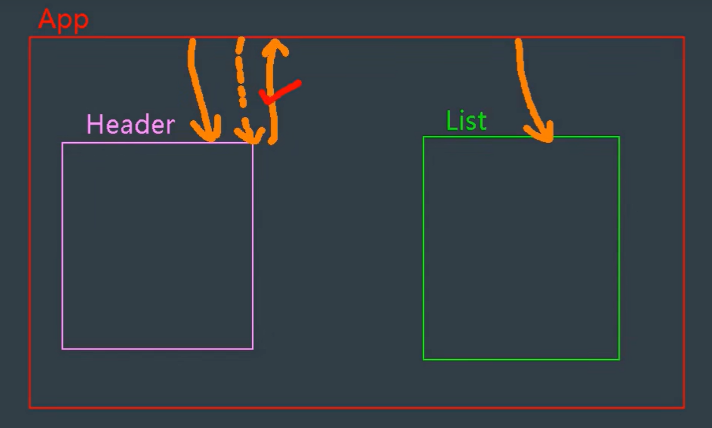


当input输入框类型是checkbox，且v-model绑定了一个布尔值类型。

那么这个布尔值就能决定是否勾选

修改隐藏在对象里面的属性值（使用props），不会报错。


#### 添加todos

在App组件里面添加addTodo方法，再将方法传递给Header组件，让Header组件调用并且传参数。那么就可加入其中

```vue
<template>
	<div id="root">
        <myHeader :addTodo="addTodo"/>
    </div>
</template>

<script>
export default {
    methods:{
        addTodo(todo){
            this.todos.unshift(todo)
        }
    }
}
</script>
```

使用addTodo

```js
import {nanoid} from 'nanoid'
  export default {
    name:'myHeader',
    methods:{
      add(e){
        //判断用户是否输入了内容
        if(!e.target.value.trim()) return
        //将用户的输入包装弄成输入对象
        const todoObj={id:nanoid(),title:e.target.value.trim(),done:false}
        //将输入对象传给父组件
        this.addTodo(todoObj)
        e.target.value = ''
      }
    },
    props:['addTodo']
  }
```


#### 删除一个todo和检查todo的勾选

因为删除涉及到item，那么其方法要 App ——>myList——>myItem

其核心

app.vue

```vue
<template>
	<div id="root">
        <myList :todos="todos" :checkTodo="checkTodo" :delTodo="delTodo"/>
    </div>
</template>

<script>
export default {
    methods:{
        delTodo(id){
        	this.todos = this.todos.filter(item =>{
          	return item.id !== id
        })
      },
        checkTodo(id){
        	this.todos.forEach(item=>{
          	if(item.id===id){
            	item.done=!item.done
          }
        })
      },
    }
}
</script>
```

myList.vue

```vue
<template>
  <ul class="todo-main">
    <myItem 
    v-for="todoObj in todos" 
    :key="todoObj.id"  
    :todo="todoObj" 
    :checkTodo="checkTodo"
    :delTodo="delTodo"
    ></myItem>
  </ul>
</template>

<script>
import myItem from './myItem.vue'
  export default {
    name:'myList',
    components:{myItem},
    props:['todos','checkTodo','delTodo']
  }
</script>
```

myItem.vue

```vue
<template>
    <li>
      <label>
        <input type="checkbox" :checked="todo.done" @change="handleCheck(todo.id)"/>
        <span>{{todo.title}}</span>
      </label>
      <button class="btn btn-danger" @click="Delete(todo.id)">删除</button>
    </li>
</template>
 
<script>
  export default {
    name:'myItem',
    //声明接收todo对象
    props:['todo','checkTodo','delTodo'],
    methods:{
      handleCheck(id){
        //通知app组件将对应的todo对象的done属性取反
        this.checkTodo(id)
      },
      Delete(id){
        //通知app组件删除对应的todo对象
        if(confirm('确定删除吗')) this.delTodo(id)
      }
    }
  }
</script>
```


统计todo个数

app.vue

```vue
<template>
<myFooter :todos="todos" ></myFooter>
</template>
```

myFooter.vue

```vue
<template>
  <div class="todo-footer">
      <label>
        <input type="checkbox"/>
      </label>
      <span>
        <span>已完成{{ todos.filter(item =>{return item.done}).length  }}</span> / 全部{{ todos.length }}
      </span>
      <button class="btn btn-danger">清除已完成任务</button>
    </div>
</template>

<script>
  export default {
    name:'myFooter',
    props:['todos']
  }
</script>
```

除了filter统计个数还能使用forEach函数。

此外还可以是reduce函数，reduce((pre,current)=>{},起始个数)

起初的pre是起始个数，后面每个pre都是上一个循环的返回值。

最后一次函数返回值作为reduce得到的数。

current是每一个当前的数值项

```js
export default{
    props:['todos'],
    methods:{
        doneTotal(){
            return this.todos.reduce((pre,cur)=>{
                return pre + (cur.done?1:0)
            },0)
        }
    }
}
```

这样也可以统计完成的个数

#### 统计个数

```vue
<template>
  <div class="todo-footer" v-show="total>0">
      <label>
        <input type="checkbox" :checked="isAllTodos" @change="checkAll"/>
      </label>
      <span>
        <span>已完成{{ doneTotal  }}</span> / 全部{{ total }}
      </span>
      <button class="btn btn-danger" @click="delAllTodos">清除已完成任务</button>
    </div>
</template>

<script>
  export default {
    name:'myFooter',
    props:['todos','delAllTodos'],
    computed:{
      total(){
        return this.todos.length
      },
      doneTotal(){
        return this.todos.filter(item =>{return item.done}).length
      },
      isAllTodos(){
        return this.total === this.doneTotal && this.total > 0
      }
    },
    methods:{
      checkAll(e){
        this.todos.forEach(item => item.done = e.target.checked)
      }
    }
  }
</script>
```


除了像上方一样使用doneTotal和total等这些计算属性。

还可以使用v-model进行绑定。

```vue
<template>
  <div class="todo-footer" v-show="total>0">
      <label>
        <input type="checkbox" v-model="isAll"/>
      </label>
      <span>
        <span>已完成{{ doneTotal  }}</span> / 全部{{ total }}
      </span>
      <button class="btn btn-danger" @click="delAllTodos">清除已完成任务</button>
    </div>
</template>

<script>
  export default {
    name:'myFooter',
    props:['todos','delAllTodos'],
    computed:{
      total(){
        return this.todos.length
      },
      doneTotal(){
        return this.todos.filter(item =>{return item.done}).length
      },
      isAll:{
        get(){
            return this.doneTotal === this.total && this.total > 0
        },
        set(value){
         	this.todos.forEach(item => item.done = value)    
         }
      }
    }
  }
</script>
```


#### 编辑（更改）

添加编辑按钮

```html
<button class="btn btn-edit" @click="Edit(todo)" v-show="!todo.isEdit">编辑</button>
```

然后触发事件

```js
Edit(todo){
        if(todo.hasOwnProperty.call('isEdit')){
          todo.isEdit = true
        }else{
          console.log("@")
          this.$set(todo,'isEdit',true)
        }
         setTimeout(()=>{
          this.$refs.inputTitle.focus()
        },100)
      },
      //编辑后失去焦点
      handBlur(todo,e){
        todo.isEdit = false
        if(e.target.value.trim()=='') return alert('编辑不能为空')
        this.$bus.$emit('updataTodo',todo.id,e.target.value)
      }
    }
```

这里如果直接使用hasOwnProperty会报错，因为不允许直接调用原型上面的方法。

为了点击编辑后获取焦点，为什么需要setTimeout，因为该函数全部执行之后才会更新input，但是`全部执行完之前是display:none`，那么修改得到焦点就不奏效。

当然还有其它方法，比如一个`新的钩子`，this.$nextTick(()=>{this.$refs.inputTitle.focus()})。

```js
this.$nextTick(function(){
    this.$refs.inputTitle.focus()
})
```


这个API是在下一次DOM节点更新后再执行的一个回调函数

使用场景：改变数据，要基于改变后的新的DOM进行操作，那么要在nextTick所指定的回调函数中执行


#### TodoList总结

##### 编码流程

（1）拆分静态组件：组件要按照功能点拆分，命名不能与html冲突

（2）实现动态组件：要考虑数据的存储位置，数据是一个组件用，还是一群组件使用。一个组件使用放在自身即可，一群组件在用需要放在他们的公共父组件上

（3）实现交互，从绑定事件开始


##### props适用于：

（1）父组件==>子组件通信

（2）子组件==>父组件通信（需要父组件给子组件传递一个函数）

使用v-model切记不要绑定props传过来的值，因为props传过来的值不可修改只能使用

props传过来的若是对象类型的值，修改对象中的属性时Vue不会报错，但是不推荐这样做


### 本地存储

#### localStorage

关闭浏览器也能存在

存储

使用localStorage.setItem('key',value)储存。

如果存储的值是对象形式，直接存储，值会出现[object  Object],因为对象.toString()，值就是这个。

故需要JSON.stringify(对象)，得到的是，对象转化为JSON字符串


读取

localStorage.setItem('key')返回值。

如果是JSON字符串，那么需要JSON.parse(JSON字符串)


删除

localStorage.removeItem('key')


清空

localStorage.clear()


#### sessionStorage

浏览器关闭就消失。（每次会话结束即消失，即浏览器的关闭）

其他API的调用和localStorage一样


localStorage存储的东西需要手动关闭才会消失。

xxxxStorage.getItem()如果xxx对应的value获取不到，那么得到的值是null，JSON.parse(null)的结果仍然是null


本地存储TodoList的数据，那么可以使用监视属性。

但是如果是监视对象，那么需要深度监视，那么需要deep:true，然后再handler函数里面写自己需要的东西


### 组件自定义事件

以前是，通过props然后父组件给子组件方法和数据，才能让数据，子——————>父

比如  在App组件中给student 组件绑定一个点击事件

<Student v-on:demo="getStudentName" />

demo是事件名，getStudentName是回调函数的名字。

然后再student组件中，在按钮中绑定点击事件，使用this.$emit('demo')，这样就能触发student上面的demo事件，this.$emit('demo',数据).这样在App组件中的demo方法就可以得到传递过来的数据了

```js
this.$emit('demo',数据)
```

这里相当于触发事件

除了绑定事件，还可以使用ref属性

这样可以使用this.$refs.xxx拿到该组件的子组件的实例化对象，然后再使用mounted进行挂载之后的处理

<Student ref="student"/>

```js
this.$refs.student.$on('demo',this.getStudentName)
```

这样写略显复杂，但是更加灵活


如果需要解绑，那么需要绑定一个回调函数，比如

```html
<button @click="sendStudentName">
    把学生名给App
</button>
<button @click="unbind">
    点击解除绑定
</button>
```

```js
export default{
    methods:{
        sendStudentName(){
            //触发Student组件实例对象身上的demo事件
            this.$emit('demo',this.name,666,888,999,001)
        },
        unbind(){
            //解除单个绑定
            this.$off('demo')
            // this.$off(['demo','at'])解绑多个
        }
    }
}
```

如果是this.$off()那么就是全部事件都解绑


销毁后也就是destoryed钩子被触发了之后，那么所有的自定义事件都不会奏效了，但是原生的js事件仍然不受影响


当前属性要被使用要在data，props，computed其中一个才行。


如果是使用ref绑定的事件，那么使用的时候是，this.$refs.组件名.$on('事件名',回调函数)，如果这个回调函数是普通函数的形式，即function(){函数体}，那么this指向触发事件的组件实例对象，二如果是写成箭头函数，那么就指向当前这个组件实例对象，因为函数里面没有this，那么向外寻找

但是这个回调函数中的this是指向绑定事件（触发事件）的组件的实例对象

如果是写在methods里面的方法，那么这个函数的this指向就是当前组件实例对象

`在组件标签中绑定原生的js事件`

如果在组件中绑定原生事件也是可以的，但是，如果是这样<Student @click="show" />

那么就会认为这个click是自定义事件从而不去触发（除非在Student组件中写this.$emit('click')）。那么想实现需要`<Student @click.native="show"/>`，使用native修饰符。


总结：

组件自定义事件是组件间通信的一种方式，适用于`子=====>父`。

使用场景：A是父组件，B是子组件，B想给A传递数据，那么就要在A中给B绑定自定义事件（事件的回调在A中）

```js
<template>
  <div>
    <student @atguigu="getStudentName"></student>
    <student ref="student"/>
  </div>
</template>

<script>
import Student from './components/Student.vue'
export default {
  components: {
    Student
  },
  methods:{
    getStudentName(name,...a){
      // console.log(name)
      this.StudentName = name
      console.log(a)
      }
    }
}
</script>
```

比如这个就是A，回调函数是getStudentName，事件名是atguigu。

那么在子组件，即B中，需要写this.$emit('atguigu',this.name)

绑定：

​		（1）在父组件中`<Student @atguigu="test"/>或者<Student v-on:atguigu="test" />`

​		（2）在父组件中

```js
<Student ref='demo'>
    ....
mounted(){
    this.$refs.demo.$on('atguigu',this.test)
}
```

如果想事件只触发一次，可以使用once修饰符，或者$once方法。

触发：`this.$emit('atguigu',数据)`

解除绑定：`this.$off('atguigu')`

组件也可以绑定原生的DOM事件，需要使用native修饰符进行修饰。

如果通过`this.$refs.xxx.$on('atguigu',回调)`绑定事件时，回调要么配置在methods中，要么使用箭头函数，否则this指向会出问题


### 全局事件总线

实现`任意组件间的通信 `

需要一个全局的x，使得所有的组件实例对象都可访问。

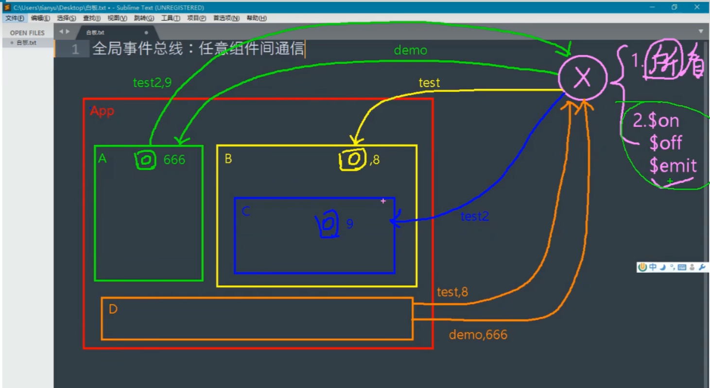

那么可以通过Vue.prototype实现，因为VueComponent.prototype.__proto = Vue.prototype

因此每一个组件实例对象都能访问到Vue的原型上面的东西

Vue.prototype.x = {a:1,b:2}只是一个普普通通的对象，是没有$emit,$on,$off等这些东西的，这些存在于`Vue.prototype`上

要使用那么只能是VC或者Vm


先看vc

main.js

```js
const Demo = Vue.extend({})
const d = new Demo()
//Demo是构造组件的函数，d是Demo的实例化对象
Vue.prototype.x = d
```

School.vue

```js
mounted(){
        //给x绑定一个hello事件，该事件的回调函数在School里面
        this.x.$on('hello',(data =>{
            console.log('我是School组件,收到了数据',data)
        }))
    }
```

Student.vue

```js
 methods:{
        sendStudentName(){
            this.x.$emit('hello',666)
            //调用hello事件
        }
    }
```

实现在Student和School组件的兄弟通信。


`使用Vm`（更加标准）

```js
const vm = new Vue({
    el:'#app',
    render:h => h(App),
    beforeCreate(){
		Vue.prototype.x = this
    }
})
```

一般情况下是将x替换为`$bus`（意为总线）

因为这个是公共的那么，挂载的函数名不能重复。


接收数据

```js
methods:{
    demo(data){....}
},
....
mounted(){
    this.$bus.$on('xxx',this.demo)
}
```

提供数据

```js
this.$bus.$emit('xxx',数据)
```

最好在beforeDestroy钩子中，用$off去解绑当前组件所用到的事件


### 消息订阅与发布

可以使用pubsub.js库来实现消息订阅（接收）与发布（传出）

npm i pubsub-js下载pubsub插件

比如像上面那个一样，School接受，Student发布。

那么需要School和Student都导入pubsub   

```js
import pubsub from 'pubsub-js'
```

然后在Student组件里面

```js
...
methods:{
	sendStudentName(){
        pubsub.publish('hello',this.name)
    }
}
```

在School里面接受消息

```js
...
mounted(){
    this.pubId = pubsub.subscribe('hello',(msg,data)=>{
        console.log('School组件接收到了消息',data)
    })
},
beforeDestroy(){
	pubsub.unsubscribe(this.pubId)//取消订阅
}
```

在回调函数中后面那个才是需要拿到的数据

`在mounted()`钩子里面，如果pubsub.subscribe里面的回调函数写成正常函数，那么他的this指向是undefined，因此要写成`箭头函数`，或者是在methods里面配置函数，然后在回调函数那里变为this.xxx来进行调用

当有的传入的参数不需要的时候可以使用_去占位比如  

```js
pubsub.subscribe('hello',(_,data)=>{
    console.log('School组件接收到了消息',data)
})
```

调用原型上面的方法，在vue中会引起错误，因此

```js
item.hasOwnProperty('xxx')//错误的
item.hanOwnProperty.call('xxx')//是正确的
```

在调用方法的时候参数里面传入$event，就可以收到一个事件对象


#### nextTick()

当然还有其它方法，比如一个API，this.$nextTick(()=>{this.$refs.inputTitle.focus()})。

这个API是在下一次DOM节点更新后再执行的一个回调函数

使用场景：改变数据，要基于改变后的新的DOM进行操作，那么要在nextTick所指定的回调函数中执行


### 过度与动画

#### 动画

在vue中使用动画先将动画样式写好

```css
.v-enter-active{
    animation: demo 1s
}
.v-leave-active{
    animation:demo 1s reverse
}
@keyframes demo {
    from{
        transform:translateX(-100%)
    }to{
        transform: translateX(0);
    }
}
```

然后再用<transition></transition>标签包裹需要添加动画的标签。

这样就可以执行动画了。

transition标签里面可以写名字，那么如果写了，可以区分不同的动画

```html
<transition name='ChiChengL'></transition>
```

那么在css的动画那里就要改变

```css
.ChiChengL-enter-active{
    animation: demo 1s
}
.ChiChengL-leave-active{
    animation:demo 1s reverse
}
```

如果不写名字默认为v。

如果出场就需要动画那么可以加个appear，让其值为真

```html
<transition :appear="true"></transition>
<transition appear></transition>
```

这两种都行。

这个transition在DOM树上不会呈现，类似于template标签


#### 过度

h1是添加的标签

 ```css
h1{
      background-color: orange;
      transition:0.5s linear;
  }
  /* 进入的起点 */
  .hello-enter{
    transform: translateX(-100%);
  }
  /* 进入的终点 */
  .hello-enter-to{
    transform: translateX(0);
  }/* 离开的起点 */
  .hello-leave{
    transform: translateX(0);
  }
  /* 离开的终点 */
  .hello-leave-to{
    transform: translateX(-100%);
  }
 ```

因为有重复，那么可以简写，外加优化（不破坏原来的样式）

```css
h1{
      background-color: orange;
  }
  /* 进入的起点 *//* 离开的终点 */
  .hello-enter,.hello-leave-to{
    transform: translateX(-100%);
  }
  .hello-enter-active,.hello-leave-active{
    transition:0.5s linear
  }
  /* 进入的终点 *//* 离开的起点 */
  .hello-enter-to,.hello-leave{
    transform: translateX(0);
  }
```


如果在给两个标签加相同的过度效果，那么可以使用transition-group标签，然后给里面的每个子元素都确定一个唯一的key值，比如

```html
<transition-group>
	<h1 key='1' v-show="!isShow">
        111111
    </h1>
    <h2 key='2' v-show="isShow">
        222222
    </h2>
</transition-group>
```

如果同出现，同消失，那么可以使用一个div盒子进行嵌套，然后用transition标签包裹就行

如果是两个互斥的，那么必须像上面那个写的一样，使用transition-group标签


引入样式，在<script></script>中直接写import '文件名'

比如 impor 'animate.css'

其基础使用，在原生标签class='需要的样式'，例如 

```html
<h1 class="animate__animated animate__bounce">An animated element</h1>
```

如果是transition标签那么是他的name="animate_ _animated animate__bounce"

如果使用的animate库

```html
<transition 
        name="animate__animated animate__bounce" 
        enter-active-class="animate__swing"
        leave-active-class="animate__backOutUp"
        appear
      >
          <h1 v-show="isShow" >你好啊！</h1>
      </transition>
```

name相当于要选择的类名，然后enter...和leave...分别是进入和离开的样式，就无需自己再写


总结：

作用：在插入，更新或移除DOM元素时，在合适的时候给元素添加样式类名

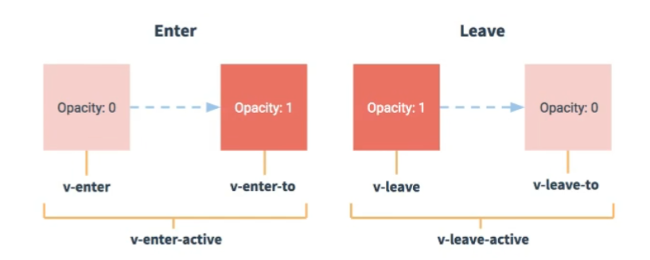


写法：1.样式准备（如果有第三方动画库，那么就不需要）

- 元素进入时样式
    1. v-enter:进入的起点
    2. v-enter-active：进入过程中
    3. v-enter-to：进入的终点
- 元素离开时的样式
    1. v-leave：离开的起点
    2. v-leave-active：离开过程中
    3. v-leave-to：离开的终点

2.使用`<transition>`包裹要过度的元素，并且配置name属性

```html
<transition name='ChiChengL'>
	<h1 v-show="isShow">
        你好
    </h1>
</transition>
```

如果有多个元素需要过度，则要使用`<transition-group>`，且每个元素都要指定key值.

`谁想要动画，谁想要过度就给谁加`


## Vue上的Ajax

### 配置代理（解决跨域问题）

请求方式：1.xhr   new XMLHttpRequest()            xhr.open()        xhr.send()

2.jQuery          $get       $post

3.axios（最多）

4.fetch


axios处理跨域问题

1.cors解决跨域，让后端配置特定响应头。

2.jsonp，利用script的src请求数据不受同源限制（很少，因为只能解决get，且前后端都要配合）

3.代理服务器，类似于中介。同源策略管不到两个服务器之间的交流

​	借助1.nginx或者`vue-cli`开启代理服务器

#### 一

在vue.config.js文件里面添加一个

```js
devServer:{
    proxy:'http://localhost:5000'
}
```

开启代理服务器，服务器的端口为8080，和服务器5000通信。

这样配置简单，但是缺点也明显，只能配置一个服务器

然后通过axios实现

```js
axios.get('http://localhost:8080/students').then(
    res =>{
        console.log(res.data)
    },
    err =>{
        console.log(err.message)
    }
)
```

axios存在两个回调，response是成功后的回调，error是失败后的回调。

如果请求的代理服务器上面有student就可以不用再去访问5000服务器，而直接使用自身的，如果没有再去请求其他的

在public文件夹下面的内容相当于代理服务器的根路径，它里面有什么资源服务器就有什么


#### 二

在vue.config.js里面写

```js
devServer: {
    proxy:{
      '/api':{
        target:'http://localhost:5000',
        pathRewrite:{'^/api':''}
        ws:true,
        changeOrigin:true,
      }
    }
  },
```

'/api'叫做请求前缀。如果想请求代理那么在前面加一个'/api'，如果不想就不加

target是指，满足请求前缀是api那么就向http://localhost:5000 发送请求

请求前缀是放在端口号后面的。那么在axios.get请求的地址应该这样子写`http://localhost:8080/api/students`

这样当我们本地的8080向代理服务器8080发送请求，然后再由该服务器向5050发送请求，其后缀地址`都是/api/students`，但是5050服务器没有前面这个，只有/students

因此要`pathRewrite配置`，pathRewrite:{'^/atguigu':''}匹配正则，匹配以每个/atguigu开头都换做''（空字符串）

这里ws是用于支持websocket

changeOrigin：false，用于控制请求头中的host值，也就是来之哪，是指在目标服务器，向代理服务器询问时，询问其来源，如果值为false，那么就告诉他真实的来源也就是来自8080代理服务器；如果为true，那么就是一个捏造的地址（就和目标服务器一样的地址）

在vue中，ws和changeOrigin默认为true ，React里面changeOrigin是默认为false


方法一：

优点：配置简单，请求资源时直接发给前端（8080）即可。

缺点：不能多项配置，不能灵活的控制请求是否走代理

当请求了前端不存在的资源时，那么该请求会转发给服务器


方法二：

```js
module.exports ={
    devServer:{
		proxy:{
			'/api':{//匹配所有以'/api'开头的请求代理路劲
            	target:'http://localhost:5000',//代理目标的基础路劲
                pathRewrite:{'^/api':''},
                changeOrigin:true
        	}
        }
    }
}
```

changeOrigin设置为true，服务器收到的请求头中的host时，localhost:5000（它本身）

changeOrigin设置为false，服务器收到的请求头中的host时，localhost:8080（发起请求的地址）

其值默认为true


### github用户搜索案例

如果引入的某个库，引用了其他地方的（且本地不存在的）资源，那么这个不推荐放入assets里面，因为会报错。比如导入bootstrap.css这个弹窗，不能将其放在assets中

那么可以放在public文件夹中，然后让index引入，这样就不会报错。

可以使用全局事件总线或者消息订阅与发布


### 常用两个库

#### 一、axios

```
npm i axios
```

引用

```js
import axios from 'axios'

axios.get('url').then(
	res =>{
        
    },
    err =>{
        
    }
)
```


#### 二、vue-resource（不推荐，有更优秀的axios）

安装

```
npm i vue-resource
```

使用：

先引用

```js
import vueResource from 'vue-resource'

Vue.use(vueResource)
```

使用Vue.use全局使用vue-resource该插件

再使用： this.$http.get('url')


### 插槽

将内容传递给子组件展示，因此普通插槽只能使用父组件的内容

<slot></slot>这个标签，放在组件里面，然后就可以在app使用组件的时候包裹其他东西了

比如：<Category></Category>

在Category组件里面的某个位置加上<slot>sda</slot>，那么就能将这个img插入进去了，如果在这个标签中间出现一些值，那么当没有使用插槽时，那么就会出现这些值，sda。使用了的话那么就不会出现

#### 默认插槽

app.vue

```html
<Category title="美食" >
      
 </Category>
```

category.vue

```html
<slot></slot>
```


#### 具名插槽（具有名字的插槽）

适用于出现多个插槽的场景

比如

然后再category.vue里面写 <slot name="center"></slot>

可以让多个元素追加到一个插槽中，比如

```html
<a slot='footer' src='111'>单机游戏</a>
<a slot='footer' src='111'>网络游戏</a>
```

<template slot="footer"></template>          可以写成         <template v-slot:footer></template>


#### 作用域插槽

数据不变，但是使用数据生成的结构要改变。

数据在组件里面，但是需要在组件使用者上使用数据。

<slot :game="game">默认内容</slot>

这样会向使用插槽的组件传递game数据，需要将使用这些接收数据的外侧包裹<template scope></template>标签

比如在app里面使用category组件

```html
<Category title="游戏">
	<template scope="game">
    	<ul>
            <li v-for="(g,index) in game" :key="index">{{g}}</li>
        </ul>
    </template>
</Category>
<Category title="游戏">
	<template scope="game">
    	<ol>
            <li v-for="(g,index) in game" :key="index" style="color:red">{{g}}</li>
        </ol>
    </template>
</Category>
```

然后在category组件里面

```vue
<template>
	<div>
        <h3>{{title}}分类</h3>
        <slot :games="games">默认内容</slot>
    </div>
</template>
<script>
	export default{
        props:['title'],
        data(){
            return {
                games:['LOL','CF','CS:GO']
            }
        }
    }
</script>
```

可以根据使用者的喜好更改结构，数据存储在被使用的组件里面的


总结：

作用：让父组件向子组件指定位置插入html结构

作用域插槽，数据在组件本身，但其结构需要组件的使用者来决定


## vuex

### 简介

是什么：专门在Vue中实现集中式状态（数据）管理的一个Vue插件，对Vue中多个组件的共享状态进行集中式的管理（读/写），也是一种组件间通信的方式，且适用于任意组件间的通信

github地址：https://github.com/vuejs/vuex

其实多组件共享数据全局总线事件也能实现

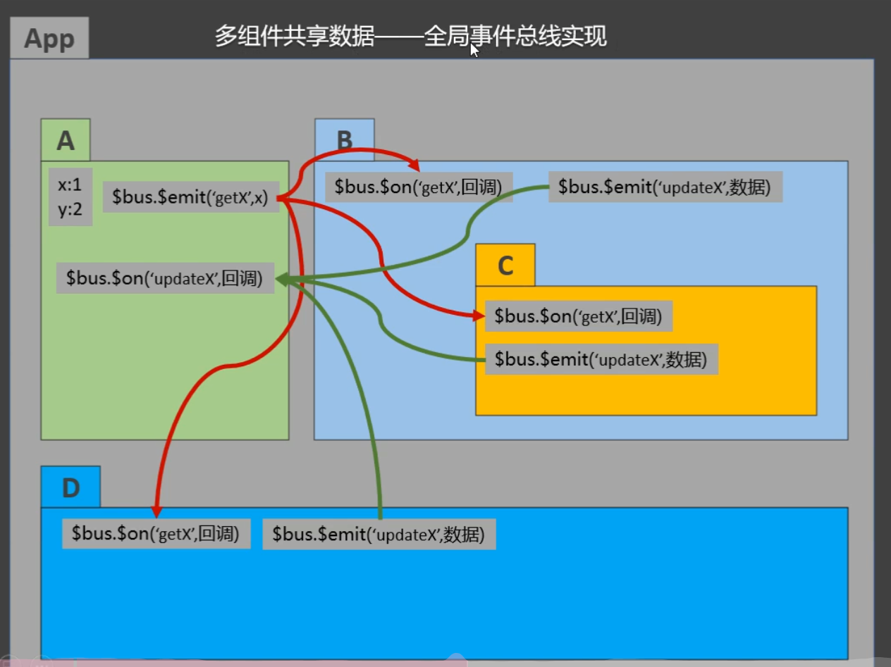

只不过稍微复杂。

使用vuex，相当于一个超级源点，共享且能更改的数据放在vuex上

使用场景：1.多个组件依赖同一状态				2.来自不同组件的行为需要变更同一状态

工作原理

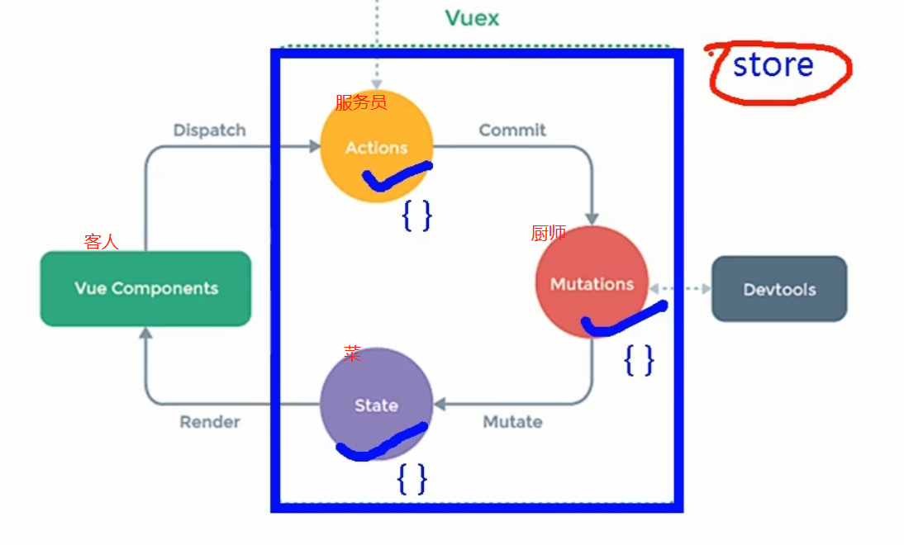


#### 使用

操作：

1.npm i vuex（默认安装最新版）								2.Vue.use(Vuex)					3.store （管理Actions，Mutations，State）					4.vc能看见store

在Vue2中只能使用vuex的3版本；在Vue3中用的vuex的4版本

要安装3版vuex，需要 npm i vuex@3

然后引用并且使用，在main.js里面

```js
import Vue from 'vue'
import App from './App'
import Vuex from 'vuex'
Vue.use(Vuex)

new Vue({
    el:'#app',
    name:'App',
    store:{}
})
```

真正的使用是在src里面创建store文件夹，然后在其中创建一个index.js

不管import写在哪都是优先执行的，然后安装各个import的顺序来执行 

切记，要在创建store实例之前使用Vue.use(Vuex)

搭建vuex环境

创建：src/store/index.js

```js
 //该文件用于创建Vuex中最为核心的store
// 引入Vuex
import Vuex from 'vuex'
// 引入Vue
import Vue from 'vue'
// 应用Vuex插件
Vue.use(Vuex)
//actions用于响应组件中的动作
const actions = {}
//mutations用于操作state中的数据
const mutations = {}
//state用于保存数据
const state = {}

//创建并且暴露store
export default new Vuex.Store({
    actions,
    mutations,
    state
})
```

在main.js创建vm时，传入store

```js
import Vue from 'vue'
import App from './App.vue'
//引入vue-resource插件
import vueResource from 'vue-resource'
// 引入store
import store from './store'//因为默认路劲就是./store/index.js
Vue.config.productionTip = false
//使用插件
Vue.use(vueResource)

new Vue({
  render: h => h(App),
  store,
  beforeCreate() {
    Vue.prototype.$bus = this
  }
}).$mount('#app')
```

其使用，比如在myCount组件里面调用就是

```js
methods:{
	increment(){
        this.$store.dispatch('jia',this.n)
    }
}
```

然后在index.js里面直接调用

```js
const actions ={
    jia(context,value){
        context.commit('JIA',value)//这里context是指的上下文
    }
}
const mutations ={
    JIA(state,value){
        state.sum +=value
    }
}
const state = {
    sum:0
}
```

这里需要经过四个阶段，Dispatch（发起动作的申请），Commit（提交要执行的函数），Mutate（修改），Render（渲染）

如果在actions里面的逻辑非常简单，那么可以不经过dispatch，直接去commit

比如上文的jia

```js
increment(){
    this.$store.commit('JIA',this.n)
}
......
//然后在actions里面就不用写jia这个函数了
```

在浏览器开发者工具Vue里面的第二栏，如果清楚一个mutation是可以回到调用这个之前的数据的，如果该次是在中间被删去，那么`后面依赖它产生的数据就无法呈现`，也就是会随着他的离开而离开

如果点击合并，那么会将其本身及之前的mutation一同消失，然后化为base state里面的数据

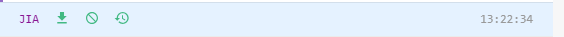

左边是合并，中间是消去，右边是回到这个动作之后

上下文context里面有commit，dispatch还有state

如果在actions里面直接修改会导致不进入mutations，因此开发者工具无法检测到

如果逻辑比较复杂那么就需要预先处理在actions里面，然后再执行之后的代码 


getters

在store.js中追加getters配置,getters是为了响应式的得到state里面的经过加工的属性的

```js
......
const getters = {
    bigSum(state){
        return state.sum*10
    }
}

//创建并且暴露store
export default new Vue.Store({
    getters
})
```

如果感觉频繁的写$store.state.sum这样的东西很麻烦，可以在计算属性里面直接写sum(){return this.$store.state.sum}

倘若是getter里面的东西也是直接写就行bigSum(){return this.$store.getter.bigSum}

### Map

#### mapState和mapGetters

`map得到的是一个对象`

重复的写this.$store.state，其实可以用东西简化，也就是mapState

``` js
import {mapState} from 'vuex'
```

 比如你在计算属性里面写

```js
computed(){
	sum(){
        return this.$store.state.sum
    },
    subject(){
        return this.$store.state.subject
    },
    school(){
        return this.$store.state.school
    }
}
```

重复部分相当多那么此时就可以使用mapState了

```js
computed(){
    ...mapState({sum:'sum',school:'school',subject:'subject'})
},
```

这样等同于上面的东西，它这是借助mapState生成计算属性，从state中读取数据（对象写法）。这里能简写吗？`大咩`，因为简写比如{sum}得到的是，{sum:sum}，前面那个可以自动转化为字符串形式，但是后面的那个相当于一个变量，去查找sum，没有找到因此会报错。故还是只能写成{sum:'sum'}这种形式（对象写法）

还可以是数组写法

```js
computed(){
    ...mapState(['sum','school','subject'])
}
```

比如这个sum，它是计算属性的名字，也是this.$store.state.`xxx`中后面跟的xxx


还有mapGetters用法和mapState一样，只不过对应的东西不一样 

mapState是帮助我们映射state里面的数据为计算属性

mapGetters是帮助我们映射getters里面的数据为计算属性


#### mapActions和mapMutations

如果事件不写括号默认为传入的是事件作为参数

利用mapMutations生成的函数有参数且只有一个

```js
computed(){
    ...mapMtations({increment:'JIA'})
}

......//相当于下面
increment(value){
    this.$store.commit('JIA',value)
}
```

如果不传参，那么默认传入的value就是事件函数，因此若要正常使用那么，在调用时要用value  

借助mapMutations生成对应的方法，方法中会调用commit去联系mutations

同样他也有数组写法：当它的方法名和commit里面的名字都相同的时候就可以使用这个，比如

```js
...mapMutations(['sum'])
```

相当于生成了sum(){this.$store.commit('sum',value)}，这个value是调用函数时传入进来的

mapActions和上面相类似，它生成的方法会调用dispatch，去联系Actions，有对象写法和数组写法。


这四个mapState，mapGetters，mapMutations，mapActions都需要传入值的参数来进行，就是在调用那里

```html
<button @click="incrementOdd(n)">
    当前和为奇数才加
</button>
```

`传入n值`，不然也会出错。


### vuex的模块化和namespace

模块化，将服务每个不同功能的进行包装

之前的store分布是混乱无序的，通过模块化来进行处理，即 modules:{}

比如

```js
const countOptions={
    actions:{},
    mutations:{},
    state:{},
    getters:{}
}

const personOptions={
    actions:{},
    mutations:{},
    state:{},
    getters:{}
}

//然后在创建的时候又有些不同了

export default new Vuex.Store({
    modules:{
        count:countOptions,
        person:personOptions
    }
})
```

当然这样子也可以简写 


如果模块化之后，那么之前直接用mapState的内容应该改变，因为里面只有count和person了，...mapState(['count','person'])

那么之前使用也要更改

```html
<h1>
    当前求和为:{{count.sum}}
</h1>
```

应该改为这样子。但是这个count.xxx很麻烦而且之前的内容还要修改

如果不想改动template里面的内容可以使用namespaced，来声明

比如在count配置项里面写这个

```js
const count ={
    namespaced:true,
    .....
}
```

namespaced默认为false，这样写了之后，就还可以像之前那样操作了

```js
computed:{
	...mapState('count',['sum','school','subject'])
}
```

加个名字就方便很多，而且不用更改html里面的元素。

其他mapGetters,mapMutations,mapActions里面也是这样子操作，加个`操作/属性`所在的配置项里面的名字即可

如果模块化了需要拿里面的东西应该是这样子，this.$store.state.count.sum

因为配置了两个的话，他有两个选项，一个是count，一个是person里面都有东西

如果要使用mutations里面的方法那么需要稍微做出调整

```js
methods:{
    add(){
        const personObj = {id:nanoid(),name:this.name}
        this.$store.commit('person/ADD_PERSON',personObj)
    }
}
```

这里/前面是分类名，后面才是函数名

在使用Getters的时候，也要写成上面那种路劲形式`this.$store.getters[person/firstPersonName]`

如果使用mapGetters就不用这样子写直接写成  ...mapGetters('person',['firstPersonName  '])

dispatch也要这样 `this.$store.dispatch('person/addPersonWang',personObj)`


总结：

目的：让代码更好维护，让多种数据分类更加明确

修改store.js

模块化后记得开启命名空间，这样比较方便取出数据和方法

 ```js
export default new Vuex.Store({
    modules:{
        xxx1:xxx1,
        xxx2:xxx2
    }
})
 ```

3.开启命名空间后从组件中读取state数据

```js
//一，自行读取
this.$store.state.person.personlist
//二：借助mapState读取
...mapState('count',['sum','school','subject'])
```

4.开启命名空间后，组件中读取getters数据：

```js
//自行读取
this.$store.getter['person/firstPersonName']
//借助map读取
...mapGetters('count',['bigSum'])
```

5.开启命名空间后，组件中调用dispatch

```js
//自行调用
this.$store.dispatch('person/addPersonWang',person)
//借助mapActions
...mapActions('count',{incrementOdd:'incrementOdd',incrementWait:'incrementWait'})
```

6.开启命名空间，组件调用commit

```js
//自行调用
this.$store.commit('person/ADD_PERSON',person)
//借助mapMutations
...mapMutations('count',{increment:'increment',decrement:'decrement'})
```

这里不能简写，因为简写后成了increment:increment，前面会自动转换为字符串，都是后面是个变量，但是我们又没有定义该变量故不可以。


## Vue上的路由

### 简介（相关理解）

路由：`一组key-value对应关系`，比如key1+value1 ==>路由，route

路由器：多个路由，需要经过路由器的管理，router

路由是为了SPA（single page web application）应用

单页面路由，部分区域随着点击的应用不同来展示不同的内容  

vue-router时时刻刻都在监视着链接的变化，通过route规则：/class =>展示班级组件

vue-router是vue的一个插件库，专门用来实现SPA应用，使用先下载npm i vue-router

对SPA的理解：

​	单页web应用，一个页面就能完成许许多多内容

​	整个应用只有一个完整的页面

​	3.点击页面中的导航链接不会刷新页面，只会做页面的`局部更新` 

​	4.数据需要通过ajax请求获取

一个路由就是一组映射关系（key-value）

key为路径，value是function或component

路由分类：

​	1.后端路由：

​		1）理解：value就是function，用于处理客户端提交的请求

​		2）工作过程：服务器接收到一个请求时，根据请求路劲找到匹配的函数来处理请求，返回响应数据

​	2.前端路由

​		1）理解：value就是component，用于展示页面内容

​		2）工作过程：当浏览器的路径改变时，对应的组件就会显示

### 基本路由

#### 基础

vue-router默认是最新版本，vue-router3才能在vue2中使用，而vue-router4只能在vue3中使用

```
npm i vue-router@3
```

安装指定的3版本

```js
import VueRouter from 'vue-router'

Vue.use(VueRouter)

new Vue({
    render:h =>h(App),
    router:{}
})
```

使用完插件可以在vue里面配置一个router项

一般会在src里面配置一个router文件夹，在其内容存在一个专门用于创建整个应用的路由器index.js

如果想实现跳转路径，那么就不能是a标签而是，VueRouter提供的router-link

<router-link to="/地址"></router-link>

```vue
<router-link class="list-group-item" to="/about" active-class="active">About</router-link>
<router-link class="list-group-item" to="/Home" active-class="active">Home</router-link>
```

不能写相对路径那种样式，即./xxx这样

如果想要点击哪个，哪个就激活active样式的话还可以加上active-class="active"

最后在展示位置，放一个<router-view></router-view>标签，就可以切换不同内容了


编写router配置项：

```js
// 专门用于创建整个应用的路由器
import VueRouter from 'vue-router'
//创建一个路由器
import About from '../components/myAbout.vue'
import Home from '../components/myHome.vue'
const router = new VueRouter({
    routes: [
        {
            path: '/about',
            component: About
        },
        {
            path: '/home',
            component: Home
        }
    ]
})
export default router
```

实现切换（active-class可配置高亮样式）

```html
<router-link active-class='active' to="/about"></router-link>
```

指定展示位置：（类似于插槽占位）

```html
<router-view></router-view>
```

#### 注意点： 

如果引用并注册一个组件，并且亲自写了组件标签的那么就是一般组件，而路由组件，是在路由器里面引用的，且没有写组件标签

一般在pages文件夹里面放置路由组件，在components里面放一般组件

切换走的组件其实是`被销毁了`，而非隐藏（路由组件）

路由组件的实例对象里面多了两个东西，$route和$router，每个路由组件的route不一样但是router是一样的，因为只有一个路由器进行管理。$route存储着自己的路由信息，整个应用只有一个router，可以通过组件的$router属性获取到


### 嵌套（多级）路由

在一级路由里面多一个children配置项（数组），其里面就是二级路由

```js
export default new VueRouter({
    routes:[
        {
            path:'/about',
            component:About,
            children:[
                {
                    path:'information',
                    component:Information
                }
            ]
        }
    ]
})
```

像这样的information组件就是二级路由。

注意：某个路由下的子路由的path`不需要`再写/，底层遍历时会自动加上，/因此不用自己再加

配置规则：

```js
// 专门用于创建整个应用的路由器
import VueRouter from 'vue-router'
//创建一个路由器
import About from '../pages/myAbout.vue'
import Home from '../pages/myHome.vue'
const router = new VueRouter({
    routes: [
        { 
            path: '/about',
            component: About
        },
        {
            path: '/home',
            component: Home,
            children: [
                {
                path: 'news',
                component:() => import('@/pages/myNews.vue')
                },
                {
                path: 'message',
                component:() => import('@/pages/myMessage.vue')
                },
            ]
        }
    ]
})
export default router
```

跳转要注意，写完整路径：

```html
<router-link to="/home/news">News</router-link>
```


### 路由传参

<router-link to="/home/message/detail?id=666&title=你好啊"></router-link>

前面就是目标地址，即目标哪个组件。后面是携带的query参数。

然后在detail组件里面可以使用$route来接收参数

通过$route.query.id来实现

实际传参需要，绑定数据，而且要先用模板字符串再用""包裹，例如

跳转路由并且携带query参数，to的字符串写法

```html
<router-link :to="`/home/message/detail?$id={m.id}&title=${m.title}`">{{m.title}}</router-link>&nbsp;&nbsp;
```

跳转路由并且携带query参数，to的对象写法

 ```html
<router-link :to="{
                  path:'/home/message/detail',
                  query:{
                  	id:m.id,
                  	title:m.title
                  }
                  }">{{m.title}}</router-link>
 ```

to可以写成对象形式

接收参数：

```js
$route.query.id
$route.query.title
```

一般需要收到参数的时候才写成对象形式

#### 命名路由

可以简化跳转

路由可以配置名字，添加一个name属性就行，给谁起名字就把name写在配置项里面，

如果知道路由的名字那么就可以简化编码。

比如跳转路由时，必须写全路径例如上面那个router-link标签，像三级路由必须带着一二级的路由的路径。

但是使用name就会方便很多，比如明明是 

```html
<router-link :to="{path:'/home/message/detail'}"></router-link>
<!-- 可以替换成下面的形式 -->
<router-link :to="{name:'detail'v }"></router-link>
```

但是不好的点就在于它需要写成对象的形式

#### params参数

跳转路由并携带params参数，to的字符串写法

```html
<router-link :to="`/home/message/detail/${m.id}/${m.title}`"></router-link>
```

这里需要明确一下，如果不给detail路由配置一些东西的话，它默认向四五级路由跳转

配置的东西是

```js
{
    name:'detail',
    path:'detail/:id/:title',
   	...
}
```

主要是在path里面配置占位符，以明确传入的参数是什么，不让其当作低一级的路由进行跳转。

如果是跳转路由并且携带params参数的对象写法，那么`只能用name配置项`，而不能用path配置项

```html
<router-link :to="{
                  name:'detail',
                  params:{
                  	id:m.id,
                  	title:m.title
                  	}
                  }">
</router-link>
```

配置路由时，需要使用占位的形式去接收params参数

接收参数：$route.params.id 


#### 路由的props配置

谁接收给谁配置，比如detail路由接收

```js
{
    name:'detail',
   	//props的第一种写法，值为对象，该对象中的所有key-value都会以props的形式传给Detail组件 
    props:{a:1,b:'hello'}
}
```

这种写法传递的是死数据不能更改

接收,在detail.vue组件里面

```js
export default {
    props:['a','b']
}
```


第二种写法：值为布尔值，若布尔值为真，就会把该路由组件收到的所有params参数，以props的形式传给Detail组件。

```js
{
    props:true
}
```

如果是query那么根本就接收不到，因此这种写法只能接收params


第三种写法：值为函数，能接收到$route，返回对象中每一组key-value都会通过props传给detail组件

```js
{
    name:'detail',
    /*props($route){
        return {
            id:$route.query.id,
            title:$route.query.title
        }
    }*/
    props({query:{id,title}}){
        return{id,title}
    }//结构赋值的连续写法
}
```

接收和上面相类似

```js
export default {
    props:['id','title']
}
```

#### `<router-link>的replace属性`

给组件标签添加一个:replace="true",可以让点击路由组件的时候，替换掉前进后退栈的栈顶

浏览器的李四记录有两种写入方式，分别是push和replace，push是追加历史记录，replace是替换当前记录。路由跳转的时候默认为push。

开启replace模式，`<router-link :replace="true"></router-link>`，也可以写成 replace就行，因为replace默认值就是true，意思是点击这个组件，然后跳转之后这个页面是替代了之前历史的栈顶的


### 编程式路由导航

不借助<router-link></router-link>的导航。 

比如，点击之后经过几秒钟才跳转。

那么此时就能用到编程式路由了，这里需要一个东西`$router`借助它上面的原型对象的方法，可以轻松跳转

push()和replace()，push是跳转的时候将当前页面压入栈顶，replace是替换当前的栈顶。

比如

```js
methods:{
    pushShow(m) {
      this.$router.push({
        name: 'detail',
          query: {
            id: m.id, 
            title: m.title
          }
       })
    }
}
```

而且可以使用定时器进行包裹，使其想什么时候跳转就什么时候跳转

然后前进后退可以用$router原型对象上面的bakc()和forward()

还有一个特殊的api，go(n)当n为`正数`，浏览器是前进n步；n为负数，浏览器是后退n步


每次切换组件到兄弟组件时，之前的组件总是被销毁。

倘若不想销毁那么可以将展示路由组件的标签放在<keep-alive></keep-alive>里面，使其跳转到其他路由组件时不被销毁，但是如果不加一个配置项那么就会全部保存下来，使用include="组件名"，就意味着`只是`这个组件名的实例对象的内容不会消失

```html
<keep-alive include="News">
	<router-view></router-view>
</keep-alive>
```

如果缓存多个，  那么应该写成  :include="['News','Message']"


如果在挂载周期mounted上开启了一个定时器，且缓存了该组件，那么

相当于beforeDestroy钩子不起作用，也就关闭不了这个定时器了


因此专属路由组件的两个生命周期钩子出现了，activated()和deactivated()，分别对应着组件的激活与失活


### 路由守卫

作用：对路由进行权限控制

#### 全局前置路由

```js
const router = new VuexRouter({})

router.beforeEach((to,from,next)=>{
    console.log(to)
    console.log(from)
    if(to.path==='/home'){
        next()//执行了之后就可以进行跳转
    }
})

export default router
```

在每一次切换`之前`/初始化时，执行这个beforeEach函数，这是全局前置路由守卫 ，他会接收三个参数，to，from和next

to是指去哪，from是来自哪，next是"放行"，让其跳转

如果想在路由里面添加一些自己的配置，需要在路由的meta里面放

比如放一个isAuth，然后让前置路由进行校验，是否需要判断这些，从而控制跳转

```js
const router = new VueRouter({
    routes:[
        {
            path:'/about',
            meta:{
                isAuth:false
            },
            component:()=> import('@/pages/about.vue'),
            children:[
            {
            	path:'news',
            	component:()=>import('@/pages/News.vue'),
    			meta:{
    				isAuth:true
				}
        	}
            ]
        }
    ]
})

router.beforeEach((to,from,next)=>{
	if(to.meta.isAuth){//需要进入判断条件
        if(localStorage.getItem('school')==='atguigu'){
            next()//放行
        }else{
            alert('无权限查看')
        }
    }else{
        next()
    }
})
```

#### 全局后置路由守卫

初始化的时候被调用，每次路由切换`之后`被调用

```js
router.afterEach((to,from)=>{
    console.log('后置路由守卫',to,from)
})
```

切换完成后调用 。（PS：很少用）

比如，需要在切换路由后，更改页面的title，那么就可以放在后置路由守卫里面，这样只用写一次就行 


#### 独享路由守卫

`只有独享（前置）路由守卫`，且独享前置路由守卫能与全局后置路由守卫配合

只限制某一个路由，在路由里面添加beforeEnter配置项

```js
const router = new VueRouter({
    routes:[
        {
            name:'Home',
            path:'/home',
            component:()=> import('@/pages/Home.vue')
            children:[
            	{
    				name:'News',
            		path:'new',
            		component:() => import('@/pages/Home.vue'),
    				meta:{isAuth:true},
    				beforeEnter:(to,from,next)=>{
    					console.log('独属于News的守卫')
    					if(to.meta.isAuth){
                            next()
                        }
					}
        		}
            ]
        }
    ]
})
```

像上面这个就配置了一个独属于News的路由守卫


#### 组件内路由守卫

比如在About.vue里面的配置项，beforeRouteEnter(to,from,next),和beforeRouteLeave(to,from,next)，分别是进入组件时调用，和离开组件时调用。（都是在`通过路由规则`的前提下）

比如像一般的组件引入，注册进入一个组件，就不算通过路由规则进入 

比如在about组件里面：

```js
export default {
    name:'About',
    beforeRouteEnter(to,from,next){
        
    },
    beforeRouteLeave(to,from,next){
        
    }
}
```


#### hash模式和history模式

地址那里#后面都算作hash值，其特点：不会作为路径的一部分发送给服务器

路由器有两种工作模式，默认就是hash模式，可以在路由器的配置项里面进行更改，配置项为mode

```js
const router = new VueRouter({
    mode:'history',
    routes:[]
})
```

默认为hash，当该为history时，就不会出现#

我们写好的项目需要打包之后浏览器才能直接识别使用。

在package.json里面的scripts项中，有serve和build项。

运行项目产生的微型服务器就是通过 npm run serve获取的

如果想要打包，那么需要 npm run build，最终生成一个dist文件夹，里面就是所需要的html，css，js文件 

打包后的文件需要放在服务器上部署才能看见

搭建一个服务器

```
npm init
```

然后输入小写的项目名字

```
npm i express
```

再创建server.js文件 

```js
 const express = require('express');

 const app = express();
 app.use(express.static(__dirname+'/static'))//这样就可以访问static下的一些文件了
 app.get('/person',(request,response)=>{
  response.send({
    name:'Tom',
    age:18
  })
 })

 app.listen(5005,(err)=>{
  if(!err) console.log('服务器启动成功')
 })
```

如果有个index.html那么访问5005服务器的时候就直接是访问的这个index.html

当在服务器下，刷新页面如果以前的是hash模式就不会出现问题，而history模式不行，因为，刷新的时候history模式是将后面的路径当作资源去重新请求，而hash的后面是当作一个hash值去看，刷新的时候不会再去请求服务器

使用nodejs的中间间，使用connect-history-api-fallback 解决history模式下的404，

这个是服务器的中间件   npm i connect-history-api-fallback

然后再server.js里面引入，const history = require('connect-history-api-fallback');

然后再使用history函数（要再使用express.static(__dirname+'/static')）

```js
 const express = require('express');
 const history = require('connect-history-api-fallback');
 const app = express();
 app.use(history());
 app.use(express.static(__dirname+'/static'))
 app.get('/person',(request,response)=>{
  response.send({
    name:'Tom',
    age:18
  })
 })

 app.listen(5005,(err)=>{
  if(!err) console.log('服务器启动成功')
 })
```

这样就可以解决history模式的404问题 


hash模式：

​	地址中永远带着#号，不美观

​	2.若以后将地址通过第三方手机app分享，若app校验严格，则地址会被标记为不合法

​	3.兼容性较好

history模式：

​	1.地址干净，美观

​	2.兼容性和hash模式相比略差

​	3.应用部署上线时需要后端人员支持，解决刷新页面服务端404的问题


## Vue UI组件库

移动端常用UI组件库

1.Vant                              2.Cube UI 															3.Mint UI             					4.NUT UI

PC端常用UI组件库

1.Element UI（基于Vue） 												IView UI

主要是Element UI


在组件里看怎么安装


安装

```
npm install element-plus --save
```

引入

```js
import { createApp } from 'vue'
import ElementPlus from 'element-plus'
import 'element-plus/dist/index.css'
import App from './App.vue'

const app = createApp(App)

app.use(ElementPlus)
app.mount('#app')
```

这是全部引入体积非常庞大。

倘若只使用其中几个组件，那么`按需引入`即可


按需引入（自动）

```
npm install -D unplugin-vue-components unplugin-auto-import
```


在vue.config.js里面

```js

const AutoImport = require('unplugin-auto-import/webpack')
const Components = require('unplugin-vue-components/webpack')
const { ElementPlusResolver } = require('unplugin-vue-components/resolvers')
module.exports = {
  outputDir: './build',
  // 和webpapck属性完全一致，最后会进行合并
  configureWebpack: {
    resolve: {
      alias: {
        components: '@/components'
      }
    },
    //配置webpack自动按需引入element-plus，
      plugins: [
        AutoImport({
          resolvers: [ElementPlusResolver()]
        }),
        Components({
          resolvers: [ElementPlusResolver()]
        })
      ]
  }

```


然后直接使用即可，不用需要啥就引入啥了


# Vue3

### Vue的提升

1.打包大小减少41%					2.初次渲染快55%，更新渲染快133%			3.内存减少54%

源码的升级：使用Proxy代替了defineProperty实现响应式					重写虚拟DOM的实现和Tree-Shaking（术语表）

proxy相比defineProperty相比，proxy更优，proxy能监视到对象上新增的属性，而defineProperty需要再去重新声明。

​	且proxy默认监视内层，例如数组新增修改，proxy可以监视到，而defineProperty不能。

​	若对象内部属性要全部递归代理，Proxy可以只在调用的时候递归，而Object.definePropery需要一次完成所有递归，性能比Proxy差。

Vue3更好的支持TypeScript

新的特性：composition API（组合式API）

​		setup配置；			ref和reactive				watch和watchEffect

新的内置属性：Fragment							Teleport							Suspense

其他改变：新的生命周期钩子					data选项应始终被声明为一个函数				移除keyCode支持作为v-on的修饰符


## 创建vue3.0

### 1.使用vue-cli创建

```
##查看@vue/cli版本，确保@vue-cli版本在4.5.0以上
vue --version

##安装或者升级@vue-cli
npm install -g @vue/cli
##创建
vue create vue_test

##启动
cd vue_test
npm run serve
```


### 2.使用vite创建

vite————新一代前端构建工具

优势：开发环境中，`无需打包`，`可快速的冷启动`				轻量快速的热重载

真正的按需编译，不用等待整个应用的编译


```
##创建工程
npm init vite-app <project-name>
##进入工程目录
cd <project-name>
##安装依赖
npm install
##运行
npm run dev
```


```js
import {createApp} from 'vue'
引入一个名为createApp的工厂函数，不再是构造函数了
import App from './App.vue'

createApp(App).mount('#app')//类似于之前Vue2中的vm，但是更加轻巧，减少了很多不必要的方法
```

不兼容之前的写法（创建一个根实例）

切记：Vue3组件模板结构中`可以没有根标签`


## 常用composition API

### setup

vue3.0中的一个新的配置项，值为一个函数

setup是所有Composition API “表演的舞台”

组件中所用的：数据、方法等等，要配置在setup中两种返回值。

1.返回一个对象，则对象中的属性，方法，在模板中均可以直接使用（重点关注）

2.若返回一个渲染函数：则可以自定义渲染内容 需要先引入  import {h} from ‘vue’

```js
export default {
  name: 'App',
  setup() {
    let name = "张三"
    let age = 18
    function say() {
      alert(`我叫${name}现如今${age}岁`)
    }
    return {name,age,say}
  }
}
```

上面是返回一个对象，上面的数据不是响应式


 Vue2和Vue3最好不要混用，Vue3不能读取Vue2写法中的数据、方法；但Vue2能读取Vue3组合式的写法中的数据和方法

如果Vue3和Vue2的数据冲突了，以Vue3为主

setup不能是一个async函数，因为返回值不再是return的对象，而是promise，模板就看不到return对象中的属性了


### ref函数

```vue
<template>
	<h1>
    	学生名字是{{name}}
    </h1>
</template>

<script>
export default {
    setup(){
        let name=ref("张三")
 		function changeInfo(){
            name.value = '李四'
        }
        return {name,changeInfo}
    }
}
</script>
```

这个张三是一个RefImpl的实例对象。Ref指reference（引用）		impl是Implement（实现），这样是可以完成响应式的，创建的一个包含响应式数据的引用对象（reference对象，简称ref对象）

而直接  `let name="张三"` 这个不是响应式的。

在模板中使用不需要.value（因为会自动调用），但是在数据调用的时候需要


ref函数传入参数为基本数据类型的时候，是响应式

如果传入复杂数据类型比如`对象、数组`那么生成的是proxy类型的（也就是使用reactive实现的）

```js
export default {
    setup(){
        let job ={
			type:'前端',
            salary:'18k'
        }
        function changeInfo(){
            job.value.type = 'Java工程师'
            job.value.salary = '30k'
        }
        return {job,changeInfo}
    }
}
```

这个生成的是Proxy代理对象，实际上是由reactive生成的，这样也可以满足响应式

#### Vue2和Vue3响应式实现的区别

Vue2是用defineProperty实现响应式的，defineProperty本身是不能给数组和对象内的属性进行响应式监视的，但是Vue2在这方面做了改进，首先会判断数据类型，如果是对象或者数组类型，会进行遍历，然后直至遍历到基础数据类型（字符串，布尔值，数据类型等）然后给每个属性添加响应式（都设置一个getter和setter），注意这样是给每个属性添加了响应式，因此速度稍微慢一点。

而且defineProperty实现的监视`只能`监视原始属性，新加属性时不能直接.xxx  比如 `job.position = "成都" 初始创建的时候是没有position这个属性的，这样可以添加上属性，但是不能自动生成响应式，因此如果后面这个数据经常要改变且视图随之变化，那么肯定可以说是废掉了。因此Vue2中设置了一个$set()来添加新增的属性，vm.$set(target,key,val)   比如刚才那个就是 vm.$set(vm._data.job,'position','成都')`

但是Proxy生成的对象在新添加时会自动生成getter和setter来进行监视，就肥肠nice。它一开始时惰性监听最外层的，因此性能比defineProperty实现的全部嵌套set和get更加快速.判断当前`Reflect.get`的返回值是否为`Object`，如果是则再通过reactive方法做代理， 这样就实现了深度观测。


### reactive函数

作用：定义一个`对象类型`的响应式数据（基本数据类型不要使用它，要用ref函数）

语法：`const 代理对象 = reactive(源对象)`接收一个对象或者数组，返回一个代理对象（Proxy）

reactive定义的响应式数据是“深层次的”，基于ES6的Proxy实现，通过代理对象操作源对象内部数据进行操作

```js
const job = reactive({type:'前端',salary:'18k'})
function changeInfo(){
    job.type = 'JAVA工程师',
    job.salary = '30k'
}
```

不用.value非常方便，而且想添加就添加新属性，因为这样生成的也是响应式


### Vue3.0中的响应式

#### Vue2.x的响应式原理

实现原理：

​		对象类型：通过Object.defineProperty()对属性的读取，修改进行劫持（数据劫持）

​		数组类型：通过重写更新数组的一系列方法来实现劫持（对数组变更方法进行包裹）

```js
Object.defineProperty(data,'count',{
    get(){},//有人读取时调用
    set(){}//有人修改时调用
})
```

存在问题：新增，删除属性，界面不会更新。直接通过下标更新数组，界面不会自动更新。

添加通过$set来添加。那么相应的删除是 ￥delete，这样添加/删除的属性可以得到响应式

如果是想要更新数组并且得到响应式，那么可以使用$set(this.person.hobby,0,’吃饭’)这样就可以把hobby中的第一个数据修改并且得到响应式

或者使用`splice`方法，this.person.hobby.splice(0,1,’吃饭’)


#### Vue3响应式原理

不存在Vue2.x响应式中存在的一些问题，因为使用了一个新的对象reactive来实现

原理：

​	通过Proxy（代理）：拦截对象中任意属性的变化，包括：属性值的读写，添加，删除等。

​	通过Reflect（反射）：对源对象的属性进行操作 


Vue3中的响应式通过window.Proxy

模拟

```js
let person = {name:'张三',age:19}
//const p = new Proxy(person,{})//至少存在两个参数，然后让p代理person，当p发生任何操作都会相同的在person上面实现。但是如果其中是空对象的话，只是代理，数据变化了，页面没有变化,p是代理对象

//因此正确应该是这样子
const p = new Proxy(person,{
    get(target,propName){//target是传入的数据，比如现在是person,propName是读取的key
        return terget[propName]
    },
    set(target,propName,value){
        target[propName] = value//这样person上的数据就被修改了，修改或者追加都是这个
    },
    deleteProperty(target,PropName){//这样可以捕获到删除进而更新页面
     	return delete target[propName]   
    }
})
```


window.Reflect

通过Reflect可以修改和读取数据

通过Object.defineProperty来添加一个重复属性，如果重复定义直接报错；而Reflect.defineProperty添加一个重复属性，后面的重复定义操作不会报错，都会有一个返回值，然后添加成功那么就是`true`否则就是`false`

真实是通过Reflect和Proxy进行操作

```js
let person = {name:'张三',age:19}
//const p = new Proxy(person,{})//至少存在两个参数，然后让p代理person，当p发生任何操作都会相同的在person上面实现。但是如果其中是空对象的话，只是代理，数据变化了，页面没有变化,p是代理对象

//因此正确应该是这样子
const p = new Proxy(person,{
    get(target,propName){//target是传入的数据，比如现在是person,propName是读取的key
        return Reflect.get(target,propName)
    },
    set(target,propName,value){
        Reflect.set(target,propName,value)//这样person上的数据就被修改了，修改或者追加都是这个
    },
    deleteProperty(target,PropName){//这样可以捕获到删除进而更新页面
     	return Reflect.deleteProperty(target,propName)  
    }
})
```


### reactive和ref的区别

定义数据角度：

​	reactive定义`对象（或数组）类型数据`

​	ref定义`基本类型数据`，ref也可以定义`对象类型数据`，因为它检测到对象后会自动生成reactive转为代理对象

原理角度：

​	ref通过Object.defineProperty()的get和set来实现响应式（数据劫持）

​	reactive通过使用Proxy来实现响应式（数据劫持），并通过Reflect操作`源对象`内部的数据

使用角度：

​	ref定义的数据：操作数据需要`.value`，读取数据时，在模板中直接读取`不需要`

​	reactive定义的数据：操作和读取均不需要`.value`


$attrs：当父组件给子组件传递数据/方法时，当子组件没有接收那么，得到的数据就会暂存在这个中

当父组件向子组件标签里面写入东西，但是没写插槽占位时，数据存储在slots中的default中，当是具名插槽时，直接在slots中


### setup的注意点

setup执行时机：在beforeCreate之前执行一次，this是undefined

setup存在两个接收值，props和context，props值为对象，包含组件外部传递过来，且组件内部声明接收了的属性

```js
export default{
    props:['msg','school'],
    setup(props,context){
        ````//会把props的东西变为一个代理对象
        
    }
}
```

context中有attrs，emit和slots

attrs，是组件外部传递过来，但没有在props配置中声明的属性，相当于this.$attrs

emit使用的时候需要一个新的配置项emits:[]，相当于this.$emit

```js
export default {
    emits:['hello'],
    setup(props,context){
        function test(){
            context.emit('hello',666)
        }
    }
}
```

在Vue3更加推荐具名插槽使用 v-slot:qwe，slot=“qwe”可能是默认插槽

```html
<template v-slot:qwe>
	<span>come</span>
</template>
```


### 计算属性与监视

#### computed

Vue3使用计算属性，需要引用

```js
import {reactive,computed} from 'vue'
export default{
    setup(){
        let person = reactive({
            firstName:'张',
            lastName:'三'
        })
        //简写形式
        let fullName = computed(()=>{
            return person.firstName+'-'+person.lastName
        })
        return{person,fullName}
        //完整写法：
        person.fullName = computed({
            get(){
                return person.firstName+'-'+person.lastName
            },
            set(value){
                const nameArr = value.split('-')
                person.firName = nameArr[0]
                person.lastName = nameArr[1]
            }
        })
    }
}
```

#### watch

Vue3里面的watch，只能监视ref对象，数组，或者reactive的代理对象

```js
import {watch,ref} from 'vue'
export default{
    setup(){
        let sum = ref(0)
        let msg = ref('GHOST')
        //监视ref定义的一个响应式数据
        //watch(sum,(newValue,oldValue)=>{
          //  console.log(newValue,oldValue)
        //},{immediate:true})
        
        //监视多个
        watch([sum,msg],(newValue,oldValue)=>{
            console(newValue,oldValue)
        })
        //这样得到的newValue和oldValue都是数组，第一个值是sum的变化值
        return {sum}
    },
    
    //
}
```

监视reactive

```js
import {reactive,watch} form 'vue'
export default{
    setup(){
        let person = reactive({
            name:'张三',
            age:'27'
        })
        watch(person,(newValue,oldValue)=>{
           	console.log(newValue,oldValue)//得到的值一样，无法获取正确的oldValue，值都是newValue 
        })
    }
}
```

会强制开启deep:true（deep配置无效）


监视reactive里面一个属性

```js
watch(()=>person.name,(newValue,oldValue)=>{
    console.log(newValue,oldValue)
})
```


监视reactive里面的某些属性，按数组来看

```js
watch([()=>person.name,()=>person.age],(newValue,oldValue)=>{
    console.log(newValue,oldValue)
})
```


监视reactive里面的定义的对象中的某个属性（该属性是对象），那么就能使用deep配置项

```js
watch(()=>person.job,(newValue,oldValue)=>{
    console.log(newValue,oldValue)
},{deep:true})
```

如果使用ref来定义一个对象，然后需要监视时，是需要使用value 的

```js
export default{
    setup(){
        let person = ref({
            name:'张三',
            age:18
        })
        watch(person.value,(newValue,oldValue)=>{
            console.log(newValue,oldValue)
        })//这样才能监视到person的数值变化
        //或者这样子
        watch(person,(newValue,oldValue)=>{
            console.log(newValue,oldValue)
        },{deep:true})
    }
}
```


#### watchEffect函数

watch的套路：既要指明监视的属性，也要指明回调的函数

watchEffect的套路：`不用指明监视的属性`，监视的回调中调用哪个属性，就监视哪个属性

watchEffect有点像computed：

​		但是computed注重的计算出来的值，因此必须写返回值 

​		而watchEffect更注重的是过程（回调函数的函数体），所以不用写返回值

```js
watchEffect(()=>{
    const x1 = sum.value
    const x2 = person.age
    console.log("watchEffect配置的回调执行了")
})
```

当sum变化，或者person.age发生变化，那么回调就会执行


### Vue3生命周期

变化了beforeDestroy，destroyed。变成了beforeUnmount和unmounted

通过配置项模式使用生命周期钩子，可以通过组合api模式放入setup中 

·beforeCreate相当于setup()            ·created相当于setup()								beforeMount变为onBeforeMount			mounted变为onMounted

beforeUpdate变为onBeforeUpdate			updated变为onUpdated		beforeUnmount变为onBeforeUnmount		unmounted变为onUnmounted

通过配置项写的生命周期钩子，那么setup是在beforeCreate之前执行的，但是在setup里面可以配置生命周期钩子 

beforeCreate钩子不为配置项时，相当于setup

```js
import {onBeforeMount}
export default {
    setup(){
        onBeforMount(()=>{
            //函数体
        })
    }
}
```

作用和写配置项的一样，都是在特殊时期触发的回调函数 


### 自定义hook函数

hook本身是一个函数，将setup函数中使用的Composition API进行了封装，以便以后的复用。

类似于vue2.x中的mixin

自定义hool的优势，复用代码，让 setup中的逻辑更清楚易懂


  当获取点击的鼠标坐标，可以通过setup里面的onMounted来挂载一个函数，然后为了保证在销毁组件时，函数也随之销毁要使用onBeforeUnmount钩子

```js
export default{
	setup(){
        
    }
}
```

这里为什么不能直接使用箭头函数，如果使用相当于这里是两个不同的函数，虽然内容相同但是地址不同

对于可以复用的代码 ，可以放在hooks文件夹下面的文件，然后再引用

比如上面鼠标打点这个可以复用的代码，可以包装为一个文件usePoint.js 


usePoint.js

```js
import {reactive,onMounted,onBeforeUnmount}
export default function(){
    let point = reactive({
            x:0,
            y:0
        })
        function savePoint(event){
            point.x = event.pageX
            point.y = event.pageY
        }
        onMounted(()=>{
			window.addEventListener('click',savePoint)
        })
        onBeforeUnmount(()=>{
			window.removeEventListener('click',savePoint)
        })
        return point
}
```

然后在app.vue里面直接引入使用就行

```js
import usePoint from '../hooks/usePoint.js'
export default{
    setup(){
        const point = usePoint()
    }
}
```


### toRef

作用：创建一个ref对象，其值value只想另一个对象中的某一个属性

语法：`const name = toRef(person,'name')`

比如在模版里需要person.xxx.yyy，那么可以使用toRef去完成指定某个值

```js
let yyy = toRef(person.xxx,‘yyy’ )
```

或者当要使用person.name时，`const name = toRef(person,'name')`

通过toRef那么可以让修改的数据和源数据进行挂钩，而ref不行，ref相当于生成了一个新的对象，然后源值不会改变。


使用toRefs和toRef类似，不过toRefs能处理多个属性,语法`toRefs(person)`

```js
import {toRefs} from 'vue'
export default {
    setup(){
        let person = reactive({
            name:'张三',
            age:18,
            job:{
                j1:{
                    salary:'20k'
                }
            }
        })
        return{...toRefs(person)}
    }
}
```

这样使用person数据时，可以忽略使用person那一层，比如原来是person.name===>name，person.job.j1.salary = ==>job.j1.salary


## 其他Composition API

### shallowReactive与shallowRef

shallowReactive:只处理对象最外层属性的响应式（浅响应式）。

shallowRef只处理基本数据类型的响应式，不进行对象的响应式处理（直接变成对象类型放入其中，而非Proxy）

使用时机：

​	如果有一个对象数据，结构较深，但变化时，只是外层属性变化，就使用shallowReactive

​	如果有一个对象数据，后续功能不会修改该对象中的属性，而是生新的对象 来替换（就是使用新的对象来替换原有的对象 ），就使用shallowRef

传入基本类型ref和shallowRef是相同的，但是传入对象类型不同，对于shallowRef，传入对象类型，不会生成响应式

```js
let person = shalloReactive({
    name:'张三'，
    job:{
    	salary:'20k'
	}
})
return {person}
```

当我使用person时，如果修改salary是不能更新页面的；但是修改name会更新页面


### readonly和shallowReadonly

readonly：让一个响应式数据变为只读（深度只读，最内层的数据也是只读的）

shallowReadonly:让一个响应式数据变为浅层的只读（深入一点的数据是可以修改的）

```js
let person = reactive({
    name:'张三',
    age:19,
    job:{
		salary:'20k'
    }
})
person = readonly(person)
```

让person变为 只读


###  toRaw

通过toRaw从响应式数据得到最原始的数据（只能处理reactive处理的响应式对象），将响应式对象转为普通对象

```js
let person = reactive({
    name:'张三',
    age:19,
    job:{
		salary:'20k'
    }
})
function showRaw(){
    const p = toRaw(person)
    console.log(p)//得到一个object的数据，如果输出person得到的是Proxy的数据
}
```


如果想让响应式对象中的某个数据不是响应式需要使用markRaw,使其`永远不会成为响应式`

应用：

​	1.有些值不应被设置为响应式的，例如复杂的第三方类库等。

​	2.当渲染具有不可变数据源的大列表时，跳过响应式转化可以提高性能 

```js
let car = {
    name:'兰博基尼',
    price:30000
}
let person = reactive({
    //......
})
person.car = markRaw(car)//这样得到的person中的car不是响应式
//如果直接添加：person.car = car那么得到的是响应式，因为是Proxy代理的。
```


### customRef

作用：创建一个自定义的ref，并对其依赖项跟踪和更新触发进行显示控制。

```js
import {customRef} from 'vue'
export default {
    setup(){
        function myRef(value){
            let timer
            return customeRef((track,trigger)=>{
                
				return {
                    get(){
                        track()//通知vue追钟value的变化（提前和get商量，让他认为i这个value是有用的）
                        return value 
                    },
                    set(newValue){
                        clearTimeout(timer)//实现防抖 
                       timer = setTimeout(()=>{
							 value = newValue
                        trigger()//通知vue去重写解析模板  
                       },500)
                    }
                }
            })
        }
    }
}
```


### provide与inject

作用：实现`祖孙组件间`通信

套路：父组件有一个provide选项来提供数据，子组件有一个inject选项来开始使用这些数据、

具体写法：

​	1.祖组件中：

```js
setup(){
	......
    let car = reactive({name:'123',price:300000})
    provide('car',car)
    ......
}
```

2.孙（后代）组件中

```js
setup(props,context){
    ...
    const car = inject('car')
    return {car}
    ... 
}
```

在其后代中都能inject，一般要跨越一代以上（只有一代的话直接用props）


### 响应式数据的判定

isRef：判断一个值是否为一个ref对象

isReactive：检查一个对象是否由`reactive`创建的响应式代理

isReadonly：检查一个对象是否由`readonly`创建的只读代理

isProxy：检查一个对象是否是由`reactive`或者`readonly`方法创建的代理

## Composition API的优势

### Option API存在的问题

使用 传统OptionAPI中，新增或者修改一个需求，就需要分别在data，methods，computed进行修改，太过麻烦


像该图，相关的数据，函数，计算属性都太过散漫


### Composition API的优势。


可以更加优雅的组织代码函数，让相关的代码有序的组织在一起（把一个整体放在一堆更好观察） 

比如把相关的 功能进行打包进入到xxx.js中，然后后面需要使用的时候再引用，更改就在相关文件进行修改即可


## 新的组件

#### Fragment

Vue2组件中必须有一个跟标签

但是在Vue3中：组件可以没有根标签，内容不会将多个标签包含在一个Fragment虚拟元素中

好处：减少标签层级，减少内存占用


### Teleport

`Teleport`是一种能够将我们的<strong style="color:#DD5145">组件html结构</strong>易懂到指定位置的技术

比如说一个手写的弹窗，弹窗窗口会撑大组件，使得整个组件的样式改变。通过Teleport移到最外面就不会出现类似的效果 

```html
<div>
    <button @click="isShow = true">
        点击弹窗
    </button>
    <!--只会更新这个里面的div，而其他组件不会重新渲染--!>
    <teleport to="body">
        <div v-if="isShow" class="dialog">
            <h2> 
                弹窗的内容
            </h2>
          	<button @click="isShow = false">
                关闭弹窗 
            </button>
        </div>
    </teleport>
</div>
```

to后面的值除了html结构还可以是css选择器是传送到有这个选择器盒子的内部


### Suspense

等待异步组件时渲染一些额外内容，让应用有更好的用户体验

使用：

异步引入组件（动态引入）

```js
import {defineAsyncComponent} from 'vue'
const Child = defineAsyncComponent(()=>import('./components/Child.vue'))
```

使用`Suspense`包裹组件，并且配置好`default`与`fallback`

```html
<template>
	<div class="app">
        <h3>
            APP组件
        </h3>
        <Suspense>
        	<template v-slot:default>
            	<Child/>
            </template>
            <template v-slot:fallback>
            	<h3>
                    加载中.....
                </h3>
            </template>
        </Suspense>
    </div>
</template>
```

配置了`default`是最终展示的内容，而`fallback`的内容是在加载中展示的内容


同步引入（静态引入）只有当组件成功引入之后才会加载出来（类似于木桶装水取决于最短板）

使用了Suspense就可以在setup()里面返回一个Promise对象


## 其他改变

### 全局API的转移

·Vue2.x有许多全局API和配置

例如：注册全局组件、组测全局指令等

```js
Vue.component('MyButton',{
    data:()=>({
        count:0
    }),
    template:'<button @click="count++">点击{{count}}次数 </button>'
})


//注册全局指令
Vue.directive('focus',{
    inserted:el => el.focus()
})
```

·Vue3.0中对这些API做出了调整

```js
import {createApp} from 'vue'
import App from './App.vue'
const app = createApp(App)
app.mount('#app')
```

··将全局的API，即`Vue.xxx`调整到应用实例(`app`)上


### 其他改变

data选项应该始终被声明为一个函数

过度（过度与动画）类名的更改

​	·Vue2.x的写法

```css
.v-enter,
.v-leave-to{
    opacity:0;
}
.v-leave,
.v-enter-to{
    opacity:1;
}
```

​	Vue3.x的写法

```css
.v-enter-from,
.v-leave-to{
    opacity:0;
}
/*上面分别是进来前，离开后*/
.v-leave-from,
.v-enter-to{
    opacity:1;
}
```


`移除`keyCode座位v-on的修饰符，同时也不再支持`config.keyCodes`

<strong>移除</strong>`v-on.native`修饰符

·父组件中绑定事件

```html
<my-component v-on:close="handleComponentEvent" v-on:click="handleNativeClickEvent"></my-component>
```

·子组件中声明自定义事件

```html
<script>
	export default{
        emits:['close']
    }
</script>
```

移除了过滤器，推荐使用计算属性替换过滤器


## Pinia

### 基础

Pinia是Vue最新状态管理工具，是Vuex的替代品

优势提供了更加简单的API（去掉了mutation），提供符合组合式的API，去掉了modules的概念，每一个store都是一个独立的模块，配合TypeScript更加友好

安装

>npm install pinia

使用

```js
import { createApp } from 'vue'
import { createPinia } from 'pinia'
import App from './App.vue'

const pinia = createPinia()
const app = createApp(App)

app.use(pinia)
app.mount('#app')
```

创建counter.js模块

```js
import { ref, computed } from 'vue'
import { defineStore } from 'pinia'

export const useCounterStore = defineStore('counter', () => {
  const count = ref(0)
  const doubleCount = computed(() => count.value * 2)
  function increment() {
    count.value++
  }

  return { count, doubleCount, increment }
})
```

使用counter的模块

```vue
<template>
  <div>
    count:{{ counterStore.count }}
    <button @click="counterStore.count+=5">+5</button>
    <button @click="counterStore.count-=8">-8</button>
  </div>
</template>

<script setup>
import {useCounterStore} from '@/stores/counter.js'
const counterStore = useCounterStore()
</script>
```


异步实现：

```js
import { ref, computed } from 'vue'
import { defineStore } from 'pinia'

export const useCounterStore = defineStore('counter', () => {
  const count = ref(0)
  const doubleCount = computed(() => count.value * 2)
  function increment() {
    count.value++
  }

  return { count, doubleCount, increment }
})
```


对于得到的store里面的数据不能直接解构，否则会丢失响应式

```js
const {count,increment} = counterStore
```

 如果想要解构的仍然是响应式那么需要storeToRefs()

```js
const {count,increment} = storeToRefs(counterStore)
```

### pinia持久化插件

安装插件

```
npm i pinia-plugin-oersistedstate
```

在main.js里面

```js
import persist from 'pinia-plugin-persistedstate'
app.use(createPinia().use(persist))
```

在store仓库中，persist:true开启

```js
export const useCounterStore = defineStore('x',()=>{},{persist:true})
```

需要给谁加持久化，就给谁加

使用localStorage进行存储，并且使用store.$id 作为storage默认的key，使用JSON.stringify/JSON.parse进行序列化/饭序列化

```js
export const useCounterStore = defineStore('x',()=>{},{persist:{key:'hhhhhhhh',storage:sessionStorage,paths:['count']}})
```

paths是选择需要持续化的数据，storage是选择本地存储的方式


# 大事件管理系统

使用pnpm

```  
#安装
npm install -g pnpm
#使用
pnmp create vue
```


router pinia ESLint Prettier都需要

创建项目时


EsLint配置代码风格

配置文件:   .eslintrc.cjs

1.prettier风格配置：  https://prettier.io			2.vue组件名称多单词组成（忽略index.vue）

3.props解构（关闭）

```cjs
rules: {
    // prettier专注于代码的美观度 (格式化工具)
    // 前置：
    // 1. 禁用格式化插件 prettier  format on save 关闭
    // 2. 安装Eslint插件, 并配置保存时自动修复
    'prettier/prettier': [
      'warn',
      {
        singleQuote: true, // 单引号
        semi: false, // 无分号
        printWidth: 80, // 每行宽度至多80字符
        trailingComma: 'none', // 不加对象|数组最后逗号
        endOfLine: 'auto' // 换行符号不限制（win mac 不一致）
      }
    ],
    // ESLint关注于规范, 如果不符合规范，报错
    'vue/multi-word-component-names': [
      'warn',
      {
        ignores: ['index'] // vue组件名称多单词组成（忽略index.vue）
      }
    ],
    'vue/no-setup-props-destructure': ['off'], // 关闭 props 解构的校验 (props解构丢失响应式)
    // 添加未定义变量错误提示，create-vue@3.6.3 关闭，这里加上是为了支持下一个章节演示。
    'no-undef': 'error'
  },
```

#### 提交前做代码检查

 初始化工具

在gitbash里面进行

```
pnpm dlx husky-init && pnpm install
```

修改.husky/pre-commit文件

```
#将npm test换为下面的
pnpm lint
```


使用husky做代码检查

 

暂存区eslint校验

安装lint-staged包   

```
pnpm i lint-staged -D
```

2.package,json配置lint-staged命令.

3  .husky/pre-commit文件修改


使用pnpm安装sass    `pnpm add sass -D`


创建路由实例由`createRouter`

路由模式：history模式使用createWebHistory()						hash模式使用createWebHashHistory()		括号内的内容是一个变量参数

```js
import {createRouter, createWebHistory} from 'vue-router'

const router = createRouter({
    history:createWebHistory(import.meta.env.BASE_URL),
    routes:[]
})
```

在Vue3 Composition API中，获取路由对象router不能用this，用useRouter`const router = useRouter()`

获取路由参数：route  `constroute = useRoute()` 

这个BASE_URL是vecode里面的默认路径，在vite.config.js中能配置,添加一个base:”/”


pinia需要独立

各个仓库入口统一，在index.js里面暴露


进行表单校验时需要指定规则，并且给每个输入框双向绑定一个指定的属性。

指定规则之后

```js
const rules = {
  username: [
    { required: true, message: '请输入用户名', trigger: 'blur' },
    { min: 5, max: 10, message: '用户名必须是 5-10位 的字符', trigger: 'blur' }
  ],
  password: [
    { required: true, message: '请输入密码', trigger: 'blur' },
    {
      pattern: /^\S{6,15}$/,
      message: '密码必须是 6-15位 的非空字符',
      trigger: 'blur'
    }
  ],
  repassword: [
    { required: true, message: '请输入密码', trigger: 'blur' },
    {
      pattern: /^\S{6,15}$/,
      message: '密码必须是 6-15位 的非空字符',
      trigger: 'blur'
    },
    {
      validator: (rule, value, callback) => {
        // 判断 value 和 当前 form 中收集的 password 是否一致
        if (value !== formModel.value.password) {
          callback(new Error('两次输入密码不一致'))
        } else {
          callback() // 就算校验成功，也需要callback
        }
      },
      trigger: 'blur'
    }
  ]
}
```

比如这个

非空校验：required:true			不满足校验提示符：message:””		何时校验：trigger:          ‘blur’失去焦点，  ‘change’字段改变

长度校验：min:xxx  ,max:xxx

正则校验：pattern:正则规则			\S非空字符

然后我在表单校验，账号时需要

```html
<el-form-item prop="username">
	<el-form
      :model="formModel"       
      :rule="rules" 
      ref='form'
      >
    	<el-input
           v-model="formModel.username"
           placeholder="请输入用户名"
         >
        </el-input>
    </el-form>
    <el-form-item prop="password">
        <el-input
          v-model="formModel.password"
          :prefix-icon="Lock"
          type="password"
          placeholder="请输入密码"
        ></el-input>
    </el-form-item>
</el-form-item>
```

这里的prop是绑定规则中的username规则

自定义校验：validator:自定义配置的函数

```js
const form = ref()
const rules={
    password:[
        {validator:(rule:any, value:any,callback:any) =>{
            if(value===''){
                callback(new Error('请输入密码'))
            }else{
                if(value !==formModel.value.password){
                    callback(new Error('两次密码输入不一致'))
                }else{
                    callback()
                }
            }
        },trigger:'blur'}
    ]
}
```


这里rule		当前校验规则相关的信息			value所校验的表单`元素`目前的表单值

callback()无论成功或者失败都需要callback回调			callback()校验成功				callback(new Error(错误信息))   校验失败


注册那里的表单就可以绑定一个注册事件，登陆也可以绑定一个登陆事件然后调用validate

```js
const register = async()=>{
    await form.value.validate();//预校验
    //开始注册请求
    await userRegisterService(formModel.value)
}
```

这里的`userRegisterService`是自己封装的校验函数，此外进行预校验之前，需要表单使用ref绑定，`ref=‘form’`,这里form是提前声明的

```js
import request from '@utils/request'
export const userRegisterService = ({ username, password, repassword }) => {
  return request.post('/api/reg', { username, password, repassword })
}

```


在eslintrc.cjs里面就可以声明全局变量名，防止ElMessage报错

```js
module.export ={
    ...
    globals:{
        ElMessage:'readonly',
        ElMessageBox:'readonly',
        ElLoading:'readonly'
    }
}
```


在element里面使用布局容器，里面有个菜单标签

```html
<el-menu
 :default-active="$route.path"
 >
    <el-menu-item index='/article/channel'>
    <el-icon><Management/></el-icon>
    <span>文章分类</span>
    </el-menu-item>
</el-menu>
```

这里route.path是拿到URL地址里面的route.path,比如这里$route.path 与  /article/channel相等时，那么这个表单组件就`高亮`


登陆拦截可以用路由守卫来实现

```js
router.beforeEach((to) => {
  const useStore = useUserStore();
  if(!useStore.token && to.path !== '/login'){
    return '/login'
  }
})
```

在进入到其他路由之前，如果没有token同时还不是进的登录页，那么会直接回弹到登录页的路由