## 搭建一个服务器(尝试)

index

```js
const serve = require('http').createServer((request,response)=>{//回调函数
  console.log(request.url);
  response.end('Hello World');
});
const index = require('./index2.js');//得到暴露数据
console.log(index); 
serve.listen('8080',()=>{
  console.log('启动');
})
```

index2

```js
module.exports = {
  a:1,
};
```


简介：

**Node.js之 REPL**

Node.js REPL(Read Eval Print Loop:交互式解释器) 表示一个电脑的环境，类似 Window 系统的终端或 Unix/Linux shell，我们可以在终端中输入命令，并接收系统的响应。

REPL 的交互式的编程环境可以实时的验证你所编写的代码，非常适合于验证 Node.js 和 JavaScript 的相关 API。

Node 自带了交互式解释器，可以执行以下任务：

读取 - 读取用户输入，解析输入了Javascript 数据结构并存储在内存中。

执行 - 执行输入的数据结构

打印 - 输出结果

循环 - 循环操作以上步骤直到用户两次按下 ctrl-c 按钮退出。

Node 的交互式解释器可以很好的调试 Javascript 代码。


可以输入以下命令来启动 Node 的终端：

node


# Node

## 入门

Node.js是什么?

Node.js实际上是一个JavaScript的运行环境。

作用：开发服务器应用，工具类应用，开发桌面端应用

### cmd常用命令

`dir`可以查看该目录下的资源

`cd`切换目录

执行文件：`node xxx.js`

### nodejs注意事项

Node.js里面存在顶级对象global（类似于javascript里面的window）

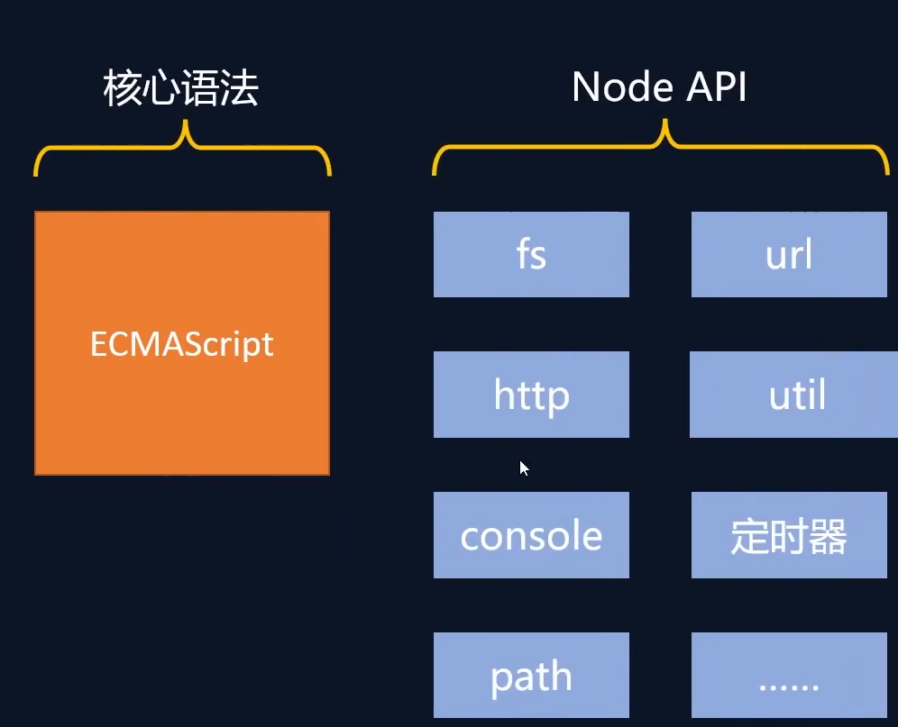

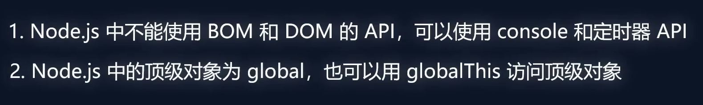


### Buffer

类似于Array的对象，用于表示固定长度的字节序列，用于处理二进制数据

特点：Buffer大小固定且无法调整			Buffer性能较好，可以对计算机内存直接操作			每个元素的大小占1字节

创建buffer的方式：alloc				allocUnsafe			from（主要是字符串和数组 ）

使用allocUnsafe创建的buffer可能包含残留的数据（空间复用问题）

```js
let buf = Buffer.alloc(10);

let buf2 = Buffer.allocUnsafe(10, 1);
console.log(buf2);

let buf3 = Buffer.from([1, 2, 3]);

let buf4 = Buffer.from('tést');
```

buffer数组可以转为字符串使用toString()方法

buffer的读写：`类似于数组`的，那么可以通过索引获得

```js
let buf_1 = Buffer.from([101, 102, 103, 104, 105])
console.log(buf_1.toString())

let buf_2 = Buffer.from('hello')
console.log(buf_2[0].toString(2));
buf_2[0] = 100;
console.log(buf_2.toString());
```

buffer最大能存储的数字为255（2^8-1）

如果存储的数字溢出，比如`buf[0] = 361`的情况，会`舍弃高位`。比如361转化为2进制为：`0001 0110 1001`那么0001就会被舍弃，那么实际上存储的是`0110 1001`即105

如果buffer存储中文，一个中文占3个字节。

## fs模块

### 写入文件

fs模块可以实现与硬盘的交互

例如：文件的创建、删除、重命名、移动。还有文件内容的写入和读取以及文件夹的相关操作

#### writeFile异步写入

语法:`fs.writeFile(file,data[,options],callback)`;

file文件名			data待写入的数据			options选项设置			callback写入回调

其返回值undefined

同步写入使用`writeFileSync`，语法：`fs.writeFileSync(path,data)`

```js
/**
 * 新建一个文件，写入内容，你好
 */

const fs = require('fs');

fs.writeFile('./座右铭.txt','三人行,必有我师焉',err=>{
    //如果失败err就是错误对象,写入成功null
    if(err){
        console.log('写入失败');
        return;
    }
    console.log('写入成功');
})
```

#### appendFile/appendFileSync追加写入

使用`appendFile或者appendFileSync(同步)`

```js
const fs = require('fs')

fs.appendFile('./座右铭.txt', '\nhello world',err=>{
    if(err){
        console.log(err)
        return
    }
})
```

这样可以换行追加

还有wrieFile也可以追加写入

就需要用到配置对象了

```js
fs.writeFile('./座右铭.txt', '\rWTF!!',{flag:'a'},err=>{
    if(err){
        console.log(err)
        return;
    }
})
```

配置项里面的flag值:

>r： 读取文件,文件不存在则报错
>r+：读取并写入文件，如果文件不存在则报错
>rs：以同步的方式读取文件并通知操作系忽略本地文件系统缓存。（一般不用）
>w：写入文件。如果文件不存在则创建该文件，如果文件存在则覆盖
>wx：作用和w类似，如果路径已存在则失败。
>w+：读取并写入文件。如果文件不存在则创建该文件，如果文件存在则覆盖
>wx+：和w+类型，如果路径已存在则失败。
>a：追加写入文件，如果文件不存在则创建文件
>ax：作用和a类型，如果路径已存在则失败。
>a+: 读取并追加写入文件，如果文件不存在则创建文件
>ax+：作用和a+类似，如果路径已存在则失败。


#### createWriteStream流式写入

先导入fs,然后再创建写入流对象

使用`fs.createWriteStream('文件路径')`，再使用write就可以写入，适用于`大文件或使用频率较高的`场景,writeFile适用于写入频率较低的场景

作用:可以持续向一个文件中写入内容

```js
const fs = require('fs');

// 创建写入流对象
const ws = fs.createWriteStream('./1.txt');

ws.write('hello');
ws.write(' world');
ws.close();
```

ws.close是可选的,当操作完毕,会关闭通道


### 文件写入的使用场景

1.下载软件		2.安装软件			3.保存程序日志,如git			4.编辑器保存文件			5.视频录制

当需要持久化保存数据的时候,应该想到文件写入

### 文件读取

方法:readFile	异步读取				readFileSync		同步读取			createReadStream		流式读取

#### 1.readFile异步读取

语法:`fs.readFile(path[,options],callback)`

```js
const fs = require('fs');

fs.readFile('./1.txt',(err,data)=>{
    if(err){
        console.log(err);
        return;
    }
    console.log(data.toString());
})
```

回调函数有两个参数第一个是错误,第二个是读取的数据

#### 2.readFileSync同步读取

语法:`let data = fs.readFileSync('./1.txt')`

```js
const fs = require('fs');
let data = fs.readFileSync('./1.txt');
console.log(data.toString());
```

得到的数据都是buffer对象,因此需要toString进行转化

读取文件的应用场景:1.电脑开机		2.程序运行		3.编辑器打开文件		4.查看图片		5.播放视频		6.播放音乐		7.Git查看日志		8.上传文件		9.查看聊天记录

#### 3.流式读取

引入fs模块			创建读取对象		绑定data事件

```js
const fs = require('fs');

const rs = fs.createReadStream('./座右铭.txt');

//chunk 块
rs.on('data',(chunk)=>{
    console.log(chunk.toString());
})

rs.on('end',()=>{
    console.log('读取完毕');
})

rs.on('error',(err)=>{
    console.log(err);
})

rs.on('close',()=>{
    console.log('文件关闭');
})

rs.on('open',()=>{
    console.log('文件打开');
})
```

如果只想使用数据,那么就直接 `rs.on('data',(chunk)=>{})`其他都是可选的

复制某文件,方法一文件操作

```js
const fs = require('fs');
let data = fs.readFileSync('./xxx.txt');
fs.writeFileSync('./xxx2.txt');
```

方法二：流式操作

```js
const fs = require('fs');
const rs = fs.createReadStream('./xxx.txt');
const ws = fs.createWriteStream('./xxx3.txt');
rs.on('data',chunk=>{
	ws.write(chunk);
})
```

流式操作，理想是占据64kb的空间，因为每次取出来数据都是64kb即以下的，但是在写入之前可能存在多份，那么占用的内存还是比整个文件小；而文件操作，文件有多大，占的空间就有多大，就不太好（占用内存过多）

上面流式操作代码还可以优化，使用`rs.pipe(ws)`就可以不用写on事件。


### 文件移动与重命名

使用`rename`或者`renameSync`来移动或重命名文件或文件夹

语法：`rename(oldPath,newPath,callback)`和`renameSync(oldPath,newPath)`

比如

```js
fs.rename('./1.txt','../2.txt',(err)=>{
    if(err) throw err;
    console.log('移动并且重命名完成');
})
```

这个就是移动+重命名操作


### 文件删除

使用`unlink`或者`rm`（还有对应的同步方法，unlinkSync和rmSync）

语法:`unlink('./xxx.txt',(err)=>{})`  还有 `rm('./xxx.txt',err=>{})`实现删除当前目录下的xxx.txt文件

```js
fs.unlink('./xxx.txt',err=>{
    if(err) throw err
    console.log('删除成功')
})
```


### 文件夹操作

可以对文件夹进行创建，读取，删除等操作

mkdir/mkdirSync	创建文件夹														readdir/readdirSync	读取文件夹			rmdir/rmdirSync		删除文件夹

#### 创建文件夹

语法：`fs.mkdir(path[,options],callback)`		和 `fs.mkdirSync(path[,options])`

```js
fs.mkdir('./html',err=>{
    if(err){
        console.log('创建失败')
        return;
    }
    console.log('创建成功')
})
```

如果需要递归创建那么需要加上配置项

```js
fs.mkdir('./a/b/c',{recursive:true},err=>{
    if(err){
        console.log('创建失败')
        return;
    }
    console.log('创建成功')
})
```


#### 文件夹读取

语法:`fs.readdir(path,callback)`

```js
fs.readdir('../x',(err,data)=>{
    if(err){
        console.log('读取失败')
        return;
    }
    console.log(data);
})
```

data数据是得到目标文件夹中的资源名称


#### 删除文件夹

语法:`fs.rmdir(path,callback)`

```js
fs.rmdir('./html',(err)=>{
    if(err){
        console.log('删除失败')
        return
    }
    console.log('删除成功')
})
```

当文件夹不空的时候就会删除失败,此时如果需要删除类似于`a/b/c`的文件夹,那么需要使用配置项

```js
fs.rmdir('./html',{recursive:true},(err)=>{
    if(err){
        console.log('删除失败')
        return
    }
    console.log('删除成功')
})
```


#### 查看资源信息

语法:`fs.stat(path,callback)`

```js
fs.stat('./html',(err,data)=>{
    if(err){
        console.log('操作失败')
        return
    }
    console.log(data)
})
```

data还可以有isFile和isDirectory的方法


路径写法:如果是在当前目录下,有无`./`都可以

相对路径的bug:`相对参照物是当前命令行的相对路径`,并非执行代码所在路径


使用绝对路径很好,但是太过繁琐,可以使用`__dirname`,这个是全局变量,是所在文件的绝对路径


#### path模块

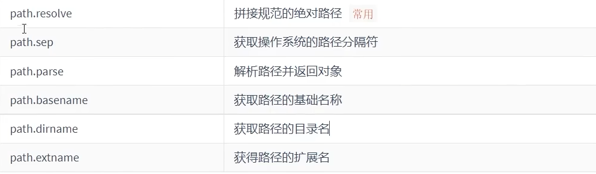


`path.resolve`用来拼接绝对路径（第一个参数绝对路径，第二个参数相对路径）

```js
fs.writeFileSync(__dirname+'/index.html','love')
```

上面的写法不规范

```js
const fs = require('fs');
const path = require('path')
fs.writeFileSync(path.resolve(__dirname,'./index.html'));
```

path.sep

```js
console.log(path.sep)//在window下是	\	在Linux下是/
```

path.parse(path)得到的是一个对象


## HTTP协议

### 概念

Http是Hypertext	Transfer	Protocol的缩写（超文本传输协议）`互联网应用最为广泛的协议之一`

双方必须共同遵从的一个约定


使用fildder查看报文

### 请求报文结构

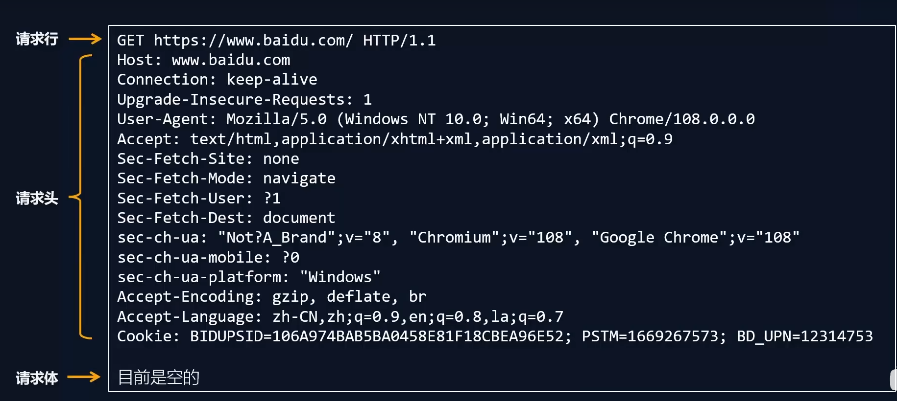

请求头和请求体之间是有一个空行的

#### 请求行

包括请求方法，URL，HTTP版本号

常见请求方法由GET（获取数据），POST（新增数据），PUT/PATCH（更新数据），DELETE（删除数据）

URL实际上是Uniform Resource Locator	统一资源定位符的缩写`本身就是字符串`

URL分为：协议名，主机名（可以是域名可以是ip地址），端口号（可选），路径，查询字符串（可选）


#### 请求头

请求头是由一系列键值对构成，由键名和键值一起构成

可以看到各种信息


#### 请求体

请求体的内容非常灵活，可以是任意内容


### HTTP响应报文

分为响应行，响应头，响应体。响应行和响应体之间还是有一行空行

#### 响应行

包括HTTP版本号，响应状态码，响应状态的描述

状态码：200		请求成功				403	禁止请求			404	找不到资源		500服务器内部错误

#### 响应头

也是由键值对构成

Date对应的响应时间，Server对应服务器使用的技术等等，还有`Content-Type`：响应内容格式和Content-Length：响应内容长度（Byte）

#### 响应体

非常灵活格式由多种，HTML，CSS，JavaScript，图片，视频，JSON等等


### IP

本质上 是一个32Bit的数字，每8Bit一组（即一个字节）。

IP用来标识网络中的设备，实现设备间通信

因为IP只有32个字节，最多表示大概只能是人类的一半

IP的分类

共享IP：区域共享，家庭共享

家庭共享：比如手机，电脑，笔记本通过一个路由器连接，然后由路由器分配IP（形成了网络即局域网，也叫私网），局域网IP是可以复用的，那么就在一定程度上解决了IP不够用的问题

本地回环IP：127.0.0.1~127.255.255.254始终指向自己

端口：应用程序的数字标识一台现代计算机有65536个端口（0~65535），一个应用程序可以使用一个或多个端口。

端口作用：实现不同主机应用程序之间的通信


### HTTP模块

#### 创建http服务

先导入模块`const http = require('http')`再创建服务对象`const server = http.createServer((request,response)=>{});`

request，是对请求报文的封装对象，可以通过这个获取相关内容。

response，是对响应报文的封装对象

这个函数是在接收到http请求的时候就执行

```js
const http = require('http');

const server = http.createServer((req, res) => {
    res.end('Hello Server')//设置响应体的
})

// 3：监听端口，响应服务
server.listen(9000,()=>{
    console.log('服务器启动成功')
})
```

然后访问直接是`127.0.0.1:9000`

#### HTTP服务注意事项

1.使用`ctrl+c`停止服务

2.当服务启动后，更新代码，必须重启服务器才会呈现最新效果

3.响应内容中文乱码的解决方法

```js
response.setHeader('content-type','text/html:charset=utf-8');
```

4.端口号被占用

```js
Error:listen EADDRINUSE:address alreadly in use :::9000
```

1）关闭当前正在运行监听端口的服务（使用较多）

2）修改其他端口号

5.HTTP协议默认端口是80。HTTP服务开发常用端口有3000，8080，9000等

> 如果端口被其他程序占用，可以使用`资源监视器`找到占用端口的程序，然后使用任务管理器关闭对应的程序

https协议默认端口是443


#### 提取HTTP请求报文


request.url只包含url中的路径和查询字符串，不包含协议域名还有端口 

```js
const { log } = require('console');
const http = require('http');

const server = http.createServer((req, res) => {
    res.end('Hello Server')//设置响应体的
    console.log(req.url)
    console.log(req.method);
})

// 3：监听端口，响应服务
server.listen(9000,()=>{
    console.log('服务器启动成功')
})
```

#### 提取请求体

```js
const { log } = require('console');
const http = require('http');

const server = http.createServer((req, res) => {
    let body = '';
    req.on('data',chunk=>{
        body+=chunk;//chunk本身是一个buffer，会自动转会成字符串
    })
    req.on('end',()=>{
        console.log(body)
        res.end('Hello HTTP')
    })
})

// 3：监听端口，响应服务
server.listen(9000,()=>{
    console.log('服务器启动成功')
})
```


#### 提取请求路径与查询字符串

可以导入url模块

```js
const { log } = require('console');
const http = require('http');
const url = require('url');
const server = http.createServer((request, response) => {
    let res = url.parse(request.url);
    // console.log(res);
    //路径
    let pathname = res.pathname;

    //查询字符串
    let query = res.query;
    response.end('hello world');
})

// 3：监听端口，响应服务
server.listen(9000,()=>{
    console.log('服务器启动成功')
})
```


#### 设置响应状态

设置响应状态码（默认为200）

`response.statusCode = 200`

响应状态的描述（基本用不到，和状态码基本绑定的）

`response.statusMessage = 'xxxx'`

 设置响应头

`response.setHeader('content-type','text/html;charset=utf-8)`;

或者是`response.setHeader('myHeader','test')`，设置多个同名的响应头`response.setHeader('test',['a','b','c'])`

响应体设置

`response.write('xxx')`然后再使用response.end(‘response’)，那么就相当于响应体是  xxxresponse


如果需要返回一个html文本，那么需要

```js
const http = require('http');
const fs = require('fs')
const server = http.createServer(function(request, response) {
    const text = fs.readFileSync('./练习2-table.html')
    response.end(text.toString())
})

server.listen(9000,()=>{
    console.log('服务器启动成功')
})
```


#### 网页资源加载基本过程

不是一次加载完成，往往是第一次先加载html资源，如果有css就加载css资源

有图片，就加载图片资源，有js就加载js资源 。

如果css和js是单独的文件直接使用`相对或者绝对`路径是有问题的，是需要更改服务端里面的内容

```js
const http = require('http');
const fs = require('fs')
const server = http.createServer(function(request, response) {
    const text = fs.readFileSync(__dirname+'/练习2-table.html')
    response.end(text)
})

server.listen(9000,()=>{
    console.log('服务器启动成功')
})
```

但是这样子是错误的

因为这样子把css和js都当作html进行加载,自然不能出现相应的交互与响应。

因此，我们可以根据文件的后缀名去区分，进行不同的操作

```js
const http = require('http');
const fs = require('fs')
const server = http.createServer(function(request, response) {
    // 获取url的路径
    let {pathname} = new URL(request.url,'http://127.0.0.1');
    if(pathname=='/'){
        const html = fs.readFileSync(__dirname+'/练习2-table.html')
        response.end(html)
    }else if(pathname=='/index.css'){
        const css = fs.readFileSync(__dirname+'/index.css')
        response.end(css)
    }else if(pathname=='/index.js'){
        const js = fs.readFileSync(__dirname+'/index.js')
        response.end(js)
    }else{
        response.statusCode = 404;
        response.end('<h1>404 Not Found</h1>')
    }
})

server.listen(9000,()=>{
    console.log('服务器启动成功')
})
```


#### 静态资源与动态资源

静态资源是指`内容长时间不发生变化的资源`，例如图片、视频、css文件、js文件、html文件、字体等

动态资源是指`内容经常更新的资源`，例如百度首页，网易首页，京东搜索列表页面等


#### 搭建静态资源服务

把重复的路径进行提取，然后进行拼接，就不用写多个if进行判断了

```js
const http = require('http');
const fs = require('fs')
const server = http.createServer(function(request, response) {
    // 获取url的路径
    let {pathname} = new URL(request.url,'http://127.0.0.1');
    // 拼接文件路径
    let filePath = __dirname+'/page' + pathname;
    // 读取文件
    fs.readFile(filePath,(err,data)=>{
        if(err){
            response.statusCode = 500
            response.end('文件读取失败')
            return;
        }
        response.end(data)
    })
})

server.listen(9000,()=>{
    console.log('服务器启动成功')
})
```


#### 静态资源目录与网站根目录

HTTP服务在哪个文件夹中寻找静态资源，那个文件夹就是`静态资源目录`，也称之为网站根目录

vscode中使用live-server访问HTML时，他启动的服务网站根目录是谁？`是vscode打开文件夹的目录就作为的根目录`


### 网页中的URL——绝对路径

网页中的URL分为两类：相对路径和绝对路径

绝对路径：可靠性强，而且相对容易理解，在项目中运用较多

<table>
    <tr background="#ccc">
    	<td>形式</td>
    	<td>特点</td>
    </tr>
    <tr>
    	<td>http://atguigu.com/web</td>
    	<td>直接向目标资源发送请求，容易理解。网站外链会用到此形式</td>
    </tr>
    <tr>
    	<td>//atguigu.com/web</td>
    	<td>与当前页面URL的协议拼接成完整的URL再发送请求。大型网站运用多</td>
    </tr>
    <tr>
    	<td>/web</td>
    	<td>与当前页面URL的协议，主机名，端口拼接为完整的URL再发送请求。中小型网站</td>
    </tr>
</table>

#### 相对路径

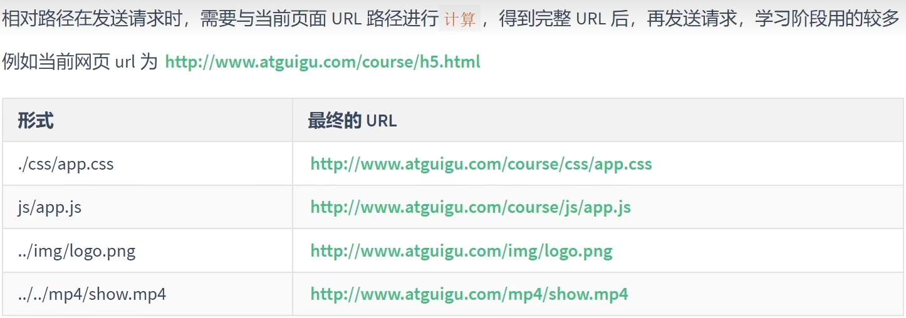


#### 设置MIME类型

媒体类型（通常称为Multipurpose Internet Main Extension或MIME类型）是一种标准，用来表示文档、文件或字节流的性质和格式

> mime类型结构：[type]/[subType]
>
> 例如：text/html	text/css	image/jpeg	image/png	application/json

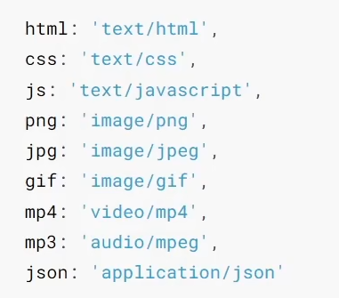

对于未知类型的资源类型，可以选择`application/octet-stream`类型，浏览器在遇到该类型的响应时，会对响应体内容进行独立存储，也就是常见的`下载`

HTTP服务可以设置响应头Content-Type来表明响应体的MIME类型，浏览器会根据该类型决定如何处理资源


setHeader里面`response.setHeader('content-type','text/html;charset=utf-8')`的优先级是高于html中meta标签的


#### GET和POST请求


## 模块化

### 介绍

模块化：将一个复杂的程序文件依据一定规则（规范）拆分成多个文件的过程

其中拆分出的`每一个文件就是一个模块`，模块内部数据是私有的，不过模块之间可以暴露内部数据以便其他模块使用

模块化项目：编码时，按照模块一个个编码，整个项目就是一个模块化的项目

好处：1.防止命名冲突			2.复用性高			3.高维护性

暴露数据方法：`module.exports = xxx`这里xxx就是需要暴露的数据。还有`exports.name = value`

> 使用注意事项
>
> ·module.exports	可以暴露任何数据
>
> ·不能使用`exports = value`的形式进行暴露数据，模块内部module与exports的隐式关系`exports = module.exports = {}`
>
> 那么直接使用exports = value暴露东西，拿不到任何东西，`实际上拿的是module.exports`

导入模块`const xxx = require('./xxx.js')`xxx.js里面写了上面一行内容


如果需要多项数据需要暴露，那么可以

在xxx.js里面写

```js
function hello(){
    console.log('hello')
}
function world(){
    console.log('world')
}
module.exports = {
    hello,
    world
}
```

在index.js里面用

```js
const xxx = require('./xxx.js')
xxx.hello()

xxx.world()
```


#### 导入模块

require的注意事项

1.对于自己创建的模块，导入路径建议写`相对路径`，且不能省略`./和../`

2.`js`和`json`文件导入时可以不用写后缀，c/c++编译的node拓展文件也可以不写后缀，但是一般用不到

3.如果导入其他类型的文件，会以`js`文件进行处理

4.如果导入的路径是个文件夹，则会首先检测该文件夹下`package.json`文件中`main`属性对应的文件，如果存在则导入，不存在则报错 ；如果main属性不存在，或者package.json不存在，则会检查文件夹下的`index.js`和`index.json`，如果仍然不存在那么就会报错

5.导入node.js内置模块时，直接require模块的名字即可

> require还有使用场景在`包管理工具`章节讲解
>
> 2.`module.exports`、`exports`以及`require`这些都是`CommonJS`模块化规范中的内容，而Node.js实现了CommonJS模块化规范


### 导入模块的基本流程

导入自定义模块

1.将相对路径转化为绝对路径，定位目标文件

2.缓存检测

3.读取目标文件代码

4.包裹为一个自执行函数，通过`arguments.callee.toString()`查看自执行函数

5.缓存模块的值

6.返回`module.exports`的值

伪代码如下

```js
function require(file){
    // 将相对路径转化为绝对路径
    let absolutePath = path.resolve(__dirname,file);
    // 缓存检测
    if(caches[absolutePath]){
        return caches[absolutePath]
    }
    // 读取文件代码 
    let code = fs.readFileSync(absolutePath).toString()
    let module = {}
    let exports = module.exports = {}
    (function (exports, require,module, __filename, __dirname){
        const test = {
            name:'text'
        }
        module.exports = test

        console.log(arguments.callee.toString())
    })(exports,require,module,__filename,__dirname)
    // 缓存结果
    caches[absolutePath] = module.exports
    return module.exports
}
```


### CommonJS规范

`module.exports`、`exports`以及`require`这些都是`CommonJS`模块化规范中的内容

而Node.js是实现了CommonJS模块化规范，二者关系有点像JavaScript与ECMAScript


## 包管理工具

### 概念介绍

包：`package`，代表了一组特定功能源码集合

包管理工具：对包进行管理，包括，下载安装，更新，删除，上传等操作

掌握包管理工具可以提高开发效率

常见的包管理工具有`npm,yarn,cnpm,pnpm`


### npm（重要）

简介：Node Package Manager，是node.js内置的包管理工具，必须掌握住的工具

#### npm的安装

在安装Node.js时，会自动安装npm，可以使用`npm -v`查看版本号

#### npm初始化包

创建一个空目录，以此目录作为工作目录启动命令行工具，执行`npm init`

npm init 命令的作用是将文件夹初始化为一个包，`交互式创建package.json文件`

package.json是包的配置文件，每个包都需要有`package.json`

> 初始化注意事项
>
> 1.package name不能使用中文、大写，默认值是文件夹的名称，所以文件夹名称也不能使用中文和大写
>
> 2.version要求`x.x.x`的形式定义，x必须是数字，默认值是1.0.0
>
> 3.ISC证书与MIT证书功能上是相同的
>
> 4.`package.json`可以手动创建与修改
>
> 5.使用`npm init -y`或者`npm init --yes` 极速创建package.json

#### npm搜索包

1.在命令行 【npm s/search 关键字】(很少使用)

2.`网站搜索`网址是`https://www.npmjs.com`

下载安装包

可以通过`npm install` 或者 `npm i`

格式 `npm install <包名>`

下载完成后

·`node_module 文件夹`存放下载的包

·`package-lock.json 包的锁文件`，用来锁定包的版本

比如下载了uniq`npm install uniq`

```js
const uniq = require('uniq')
let arr = [1,2,3,4,4,3,2,1]
console.log(uniq(arr))
```

假如创建了一个包A，A中安装了包B，那么`B是A的一个依赖包`，也可以是`A依赖B`


#### require导入包基本流程

1.在当前文件夹下node_modules中寻找同名的文件夹

2.在上级目录中下的node_modules中寻找同名的文件夹，直至找到磁盘根目录

#### 开发依赖和生产依赖

开发环境：程序员专门写代码的环境，只能程序员自己访问

生产环境：项目代码正式运行的环境，每个客户都可以访问

可以在安装是设置选项区分`依赖的类型`

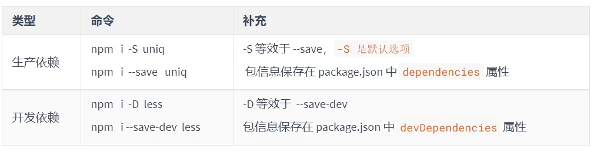

开发依赖是只在开发阶段使用的依赖包，而`生产依赖`是开发阶段和最终上线运行阶段都用到的依赖包


可以使用命令进行全局安装

`npm i -g nodemon`这样子在任何位置都可以运行nodemon（该命令是`自动重启node应用程序`）

使用 `nodemon xxx`替代掉 `node xxx`这样就行了


使用`npm root -g`可以查看全局安装包的位置，`不是所有包都适合全局安装，只有全局类的工具才适合`

Windows默认不允许npm 全局命令执行脚本文件，所以需要修改执行策略

1.以`管理员身份`打开powershell命令行

2.输入`set-ExecutionPolicy remoteSigned`

3.选择A就行

PS：上面方法如果还是不行，可以在nodemon前面加一个npx，形成这样`npx nodemon xxx`就可以了


#### 环境变量Path

一般当输入某个命令，打开文件，但是当前文件夹没有，就会按着环境变量的路径去查找，如果都没有就会报错，有的话就会进入配置的环境变量路径去挨个查找


npm安装包的所有依赖

使用`npm i`会根据`package.json和package-lock.json`的依赖声明安装项目依赖

node_modules大多数不会进入版本库，因为比较大


#### npm安装指定版本包和删除包

`npm i <包名@版本号>`

删除依赖：`npm remove uniq `或者 `npm r uniq`局部删除

`npm remove -g nodemon`全局删除


#### npm 配置别名

配置package.json中的`scripts`属性

```json
{
    .
    .
    .
    "scripts":{
    	"server":"node server.js",
    	"start":"node index.js"
	}
}
```

配置完成后，可以使用别名执行命令

```
npm run server
npm run start(或者改成 npm start)
```

`npm start`是项目中常用的一个命令，一般用来启动项目

`npm run `有自动想上级目录查找的特性，跟`require`函数一样

对于陌生的项目，可以通过查看`scripts`属性来参考项目的一些操作


### cnpm

#### 介绍

是淘宝构建的`npmjs.com`的完整镜像，也称为淘宝镜像 ，网址：`https://npmmirror.com`

cnpm服务部署在国内`阿里云服务器上`，可以提高包的下载速度

官方也提供了一个全局工具包`cnpm`，操作命令和npm大体相同

#### 安装

```
npm install -g cnpm --rehistry=https://npmmirror.com
```

#### 命令


#### npm 配置淘宝镜像

##### 直接配置

```
npm config set registry https://registry.npmmirror.com/
```

##### 使用工具配置

使用nrm配置npm的镜像地址`npm registry manager`

1.安装nrm

```
npm i -g nrm
```

2.修改镜像

```
nrm use taobao
```

3.检查是否配置成功

```
npm config list
```

建议使用第二种方式进行镜像配置，因为后续修改起来会比较方便

2.虽然cnpm可以提高速度，但是npm也可以通过淘宝镜像加速，所以npm的使用率高于cnpm


### yarn

官方网址：`https://yarnpkg.com/`

特点:速度超快：yarn缓存了每个下载过的包,所以再次使用时,无需重复下载。同时利用并行下载以最大化资源利用率，因此安装速度快

·超级安全：yarn在执行代码之前，yarn会通过算法校验，每个安装包的完整性

·超级可靠：使用详细，简洁的锁文件格式和明确的安装算法，yarn能够保证在不同系统上无差异的工作

#### 安装

```
npm i -g yarn
```

#### 常用操作

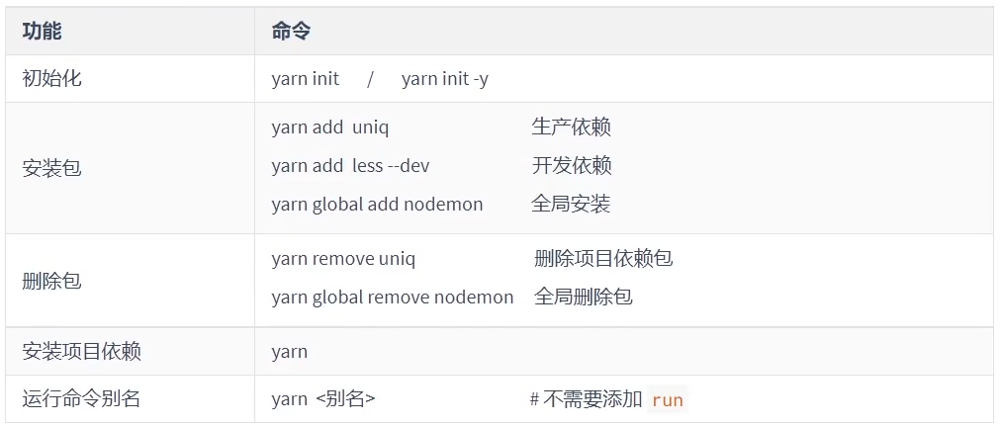


包不能混用，npm的锁文件是`package-lock.json`,yarn的锁文件是`yarn.json`


### 管理发布包

#### 创建与发布

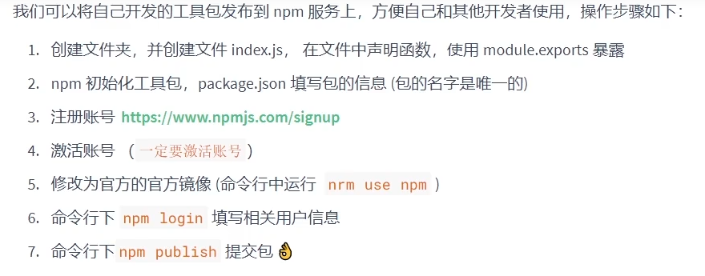


#### 更新包

1.更新包的代码			2.测试代码是否可用			3.修改`package.json`中的版本号			4.发布更新`npm publish`


#### 删除包

```
npm unpublish
```


### NVM	

node version manager管理node版本的工具，方便切换不同版本的node.js

在github上找到setup安装包即可

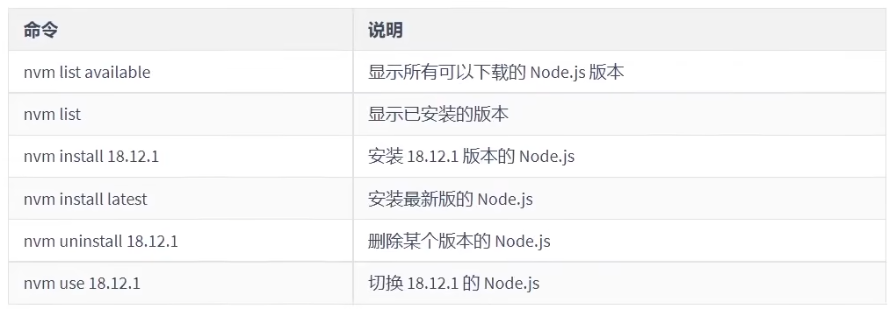


## express框架

### 简介

express是基于node.js平台的一个极简、灵活的web应用开发框架。

express是一个封装好的工具包，封装了很多功能，便于我们开发WEB应用（HTTP服务）

### express使用

express是npm的包，可以使用`npm i express`进行安装

先进行初始化项目`npm init`再使用`npm i express`进行包的安装

```js
// 导入express
const express = require('express')

// 创建应用对象
const app = express()

// 创建路由
app.get('/home',(req,res)=>{
    res.end('hello express')
})
// 如果请求方法是get,并且请求的路径是home,那么就会发送响应报文
app.listen(3000,()=>{
    console.log('server is running')
})
```

写好之后使用，`npx nodemon 01_初体验.js`这样对js文件进行监听，发生变化就重新启动服务

### express路由

路由确定了应用程序如何响应客户端对特定端点的请求

组成：请求方法、路径、回调函数构成

```
app.<method>(path,callback)
```

代码示例：

```js
const express = require('express')
const app = express();

app.get('/home',(req,res)=>{
    res.end('假首页')
})
app.get('/',(req,res)=>{
	res.end('真首页')
})
app.post('/login',(req,res)=>{
    res.end('login')
})
app.all('/test',(req,res)=>{
    res.end('test')
})

app.all('*',(req,res)=>{
    res.end('404 Not Found')
})
//这个是只要请求路径正确就会返回这个
```

这是*是为了如果上述都没有那么，就会返回404响应（这里的 *类似通配匹配符）


### 获取请求参数

封装了API，并且兼容原生HTTP模块的获取方式

```js
const express = require('express')
const app = express()

app.get('/request',(req,res)=>{
    console.log(req.method)
    console.log(req.url)
    console.log(req.httpVersion)
    console.log(req.headers)
    //这里是原生的方法
    //下面是特有的方法
    console.log(req.query)//获得查询字符串
    console.log(req.path)
    console.log(req.ip)//获取ip
    console.log(req.get('host'))//获得指定的请求头
    res.send('请求报文的获取')
})
app.listen(3000,()=>{
    console.log("服务已经启动")
})
```

`app.get(‘/:id.html’,(req,res)=>{})`这个id就可以匹配任意数字，如果是这样的方法，那么获取路由参数是`req.params.id`


#### 获取路由参数

路由参数指的是`URL路径中的参数`

```js
app.get('/:id.html',(req,res)=>{
    console.log(res.params.id)
})
```

  

#### express设置响应

express里面兼容http的写法,比如

```js
res.end()
res.statusCode 
res.setHeader()
res.write()
```

等等这些都可以


express还有自己的做法:

```js
res.status(404)//设置响应状态码
res.set('xxx','yyy')//设置响应头
res.send('中文不乱码')//设置响应体
res.redirect('https://baidu.com/')//重定向
res.download('./package.json')//下载响应
res.json({
    name:'张三',
    hobby:'吃饭'
})//响应json
res.sendFile(__dirname + '/home.html')//响应文件内容
```


### express中间件

中间件的本质是`回调函数`

作用:`使用函数封装公共操作,简化代码`

类型:全局中间件		·路由中间件

#### 定义全局中间件

`每一个`请求到达服务器之后，`都会执行的中间件函数`

```js
let recordMiddleware = function(request,response,next){
    //实现代码功能
    
    //执行next函数（如果希望执行完中间件函数后，仍然执行路由中的回调函数，那么就必须执行next）
    next()
}
```

中间件拦截未携带对应参数的操作,可以使用`req.query`进行获得携带的参数


#### 静态资源中间件

使用`app.use(express.static(path))`

就可以访问到path路径中的静态资源了`path  == __dirname + '/public'`静态资源文件夹的路径

```js
const express = require('express')
const fs = require('fs')
const path = require('path')
const app = express()

app.use(express.static(__dirname + '/public'))

app.get('/home',(req,res)=>{
    res.send('hello World!')
})

app.get('/admin',(req,res)=>{
    res.send('后台首页')
})
app.listen(3000,()=>{
    console.log('服务器启动成功')
})

```

这样子访问之后返回的文件,也是相应的类型,比如访问app.css,得到的报文,是`text/css`

> 注意事项
>
> 1.index.html文件是默认打开的资源
>
> 2.如果静态资源与路由规则同时匹配,谁先匹配谁就响应
>
> 3.路由响应动态资源,静态资源中间件响应静态资源

比如静态资源目录下存在index.html,同时url是`‘/’`

```js
app.use(express.static(__dirname + '/public'))

app.get('/',(req,res)=>{
    res.send('顶真首页')
})
```

这个响应的就是静态资源里面的内容


如果想让在同一局域网下,访问到相应的资源,可以使用静态资源中间件去实现

#### 获取请求体数据

```js
const bodyParser = require('body-parser')
const express = require('express')

const app = express()

// 解析json格式的请求体中间件
const jsonParser = bodyParser.json()

// 解析queryString格式的请求体中间件
const urlencodedParser = bodyParser.urlencoded({extended:false})

app.get('/login',(req,res)=>{
    res.sendFile(__dirname + '/05_index.html')
})

app.post('/login',urlencodedParser,(req,res)=>{
    res.send('获取用户的数据')
    //添加了这个urlencodedParser,之后会往请求体上添加一个body属性
    console.log(req.body.name)
})

app.listen(3000,()=>{
    console.log('3000服务器启动成功')
})
```

使用了body-parser内置模块,然后使用相应的中间件,最后就可以在req上添加body属性,body对象就存有相应的信息了


#### 防盗链

实现防盗链的主要,就是请求头`referer`,使用中间件进行拦截

```js
app.use((req,res,next)=>{
    let referer = req.get('referer')
    if(referer){
        //实例化
        let url = new URL(referer)
        //获取hostname
        let hostname = url.hostname
        if(hostname !== '127.0.0.1'){
            res.status(404).send('<h1>404　Not Found</h1>')
        }
    }
    next()
})
```

这样就可以拦截其他域名的访问了。比如localhost就不能访问到


#### 路由模块化 

比如把前台相关的路由，放在一个文件中

```js
const express = require('express')
//创建路由对象
const router = express.Router()

// 创建路由规则

router.get('/home',(req,res)=>{
    res.send('前台首页')
})

router.get('/search',(req,res)=>{
    res.send('搜索首页')
})

module.exports = router
```

把后台相关的放在一个文件中

```js
const express = require('express')
const router = express.Router()


router.get('/admin',(req,res)=>{
    res.send('后台首页')
})

router.get('/setting',(req,res)=>{
    res.send('设置首页')
})

module.exports = router
```

然后在主文件中引入即可

```js
const express = require('express')
const app = express()
const homeRouter = require('./routes/homeRouter')
const adminRouter = require('./routes/adminRouter')
app.use(homeRouter)

app.use(adminRouter)

app.get('*',(req,res)=>{
    res.send('<h1>404 Not Found</h1>')
})

app.listen(3000,()=>{
    console.log('服务器启动成功')
})

```


### EJS模板引擎

简介：分离`用户页面和业务数据`的一种技术

EJS是一个高效的javaScript的模板引擎，官网：`https://ejs.co/`，中文站：`https:/ejs.bootcss.com/`


下载安装EJS

```
npm i ejs --sava
```

 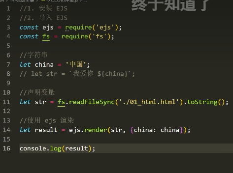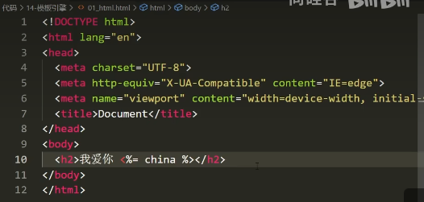!

有点类似与vue里面的，使内容更加灵活，


在express里面使用ejs

```js
const express = require('express')
const path = require('path')
const app = express()

app.set('view engine', 'ejs')//设置模版引擎
//设置模版文件存放位置  模版文件:具有模版语法内容的文件
app.set('views',path.resolve(__dirname,'./views'))

app.get('/home',(req,res)=>{
    // res.render('模版的文件名','数据')
    let str = 'Hello World'
    res.render('home',{str})
})

app.listen(3000,()=>{
	
})
```

`views/home.ejs`

```ejs
<!DOCTYPE html>
<html lang="en">
<head>
    <meta charset="UTF-8">
    <meta name="viewport" content="width=device-width, initial-scale=1.0">
    <title>Document</title>
</head>
<body>
    <h2><%= str %></h2>
</body>
</html>
```

这样就可以完成express里面使用ejs，ejs文件需要ejs后缀如果是 html的后缀很可能报错


#### express-generator

可以快速创建一个应用的骨架

全局安装

```
npm install -g express-generator
```

或者

```
npx express-generator 
```

然后使用express-generator

那么是`npx express-generator -e 15_generator`，在nodejs下创建带有ejs模板的文件夹，文件夹名字是`15_generator`

使用`npx express-generator -h`查看命令

然后安装依赖`npm i`和启动项目`npm start`

可以设置路由前缀

比如app.js中

```js
app.use('/users', usersRouter);
var usersRouter = require('./routes/users');
```

然后在`routes/users.js`里面

```js
var express = require('express');
var router = express.Router();

/* GET users listing. */
router.get('/', function(req, res, next) {
  res.send('respond with a resource');
});

router.get('/test',function(req,res,next){
    res.send('测试')
})

module.exports = router;

```

当地址为  `/users/test`时，就会响应这个测试


#### 查看文件报文

文件上传也是在发送http请求报文

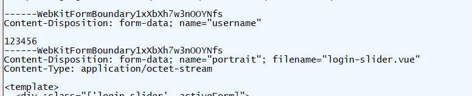

使用表单完成文件上传，必须添加enctype属性，例如`enctype="multipart/form-data"`


#### 处理文件上传

需要插件`formidable`·安装，npm i formidable

然后如果是使用express框架创建的文件，那么使用

`/15_generator/routes/index.js`

```js
var express = require('express');
var router = express.Router();
const {formidable} = require('formidable');
/* GET home page. */
router.get('/', function(req, res, next) {
  res.render('index', { title: 'Express' });
});

// 显示网页的
router.get('/portrait', function(req,res){
    res.render('portrait');
})
// 处理文件上传
router.post('/portrait', function(req,res){
    // 创建表单对象
    const form = formidable({
        multiples:true,
        // 设置上传文件的保存目录
        uploadDir:__dirname + '/../public/images',
        // 保持文件后缀
        keepExtensions:true
    });
    // 解析请求报文
    // fields是一般字段（文件之外的,例如text,radio,checkbox,select），files是文件
    form.parse(req,(err,fields,files)=>{
        if(err){
            next(err);
            return;
        }
        res.json({fields,files});
    });
});


module.exports = router;

```


## MongoDB

一个基于分布式文件存储的数据库

主要是`管理数据`进行增删改查等操作

数据库管理的特点：速度快，拓展性强，安全性强

MongoDB的有点：语法上和JavaScript相类似

对于6.0及以上的版本需要额外下载shell，并且将将其启动

比如对于7.0.2版本的，先使用`mongod`启动服务器，再使用`mongosh`启动客户端

> 注意如果需要在命令提示符中的任意位置使用mongo的命令，需要添加Path配置

### 核心概念

·数据库：一个数据仓库，数据库服务下可以创建很多数据库，数据库可以存放很多集合

·集合：集合类似于JS中的数组，在集合内可以存放很多文档

·文档：数据库的最小单位类似于，JS中的对象

一般情况下一个项目使用一个数据库，一个集合会存储同一种类型的数据

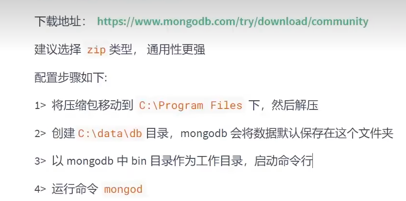

最后看到waiting for connection就完成了


#### 数据库命令

 显示所有的数据库

```
show dbs
```

切换到指定的数据库，如果数据库不存在会自动创建数据库

```
use 数据库名
```

显示当前所在的数据库

```
db
```

删除当前数据库

```
use 库名
db.dropDatabase()
```

#### 集合命令

1.创建集合（即存放数据）

```
db.createCollection('集合名称')
```

2.显示当前数据库中的所有集合

```
show collections
```

3.删除某个集合

```
db.集合名.drop()
```

4.重命名集合

```
db.集合名.renameCollection('newName')
```


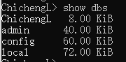

这个就是各个数据库，数据库下可以有多个集合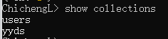比如在`ChichengL数据库里面存在两个集合users集合和yyds集合`


#### 文档命令

1.插入文档

```
db.集合名.insert(文档对象);
```

2.查询对象

```
db.集合名.find(查询条件)
```

3.更新文档

```
db.集合名.update(查询条件,新的文档)
db.集合名.update({name:'张三'},{$set:{age:19}})
```

4.删除文档

```
db.集合名,remove(查询条件)
```

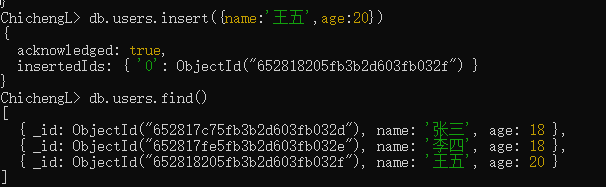如果,`db.users.find()`内容为空,那么就是找出users里面的所有文档

如果想查找满足某个条件的: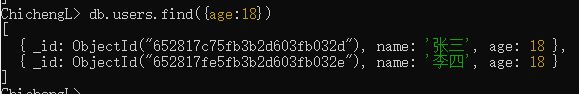


切记:修改操作需要`原子操作`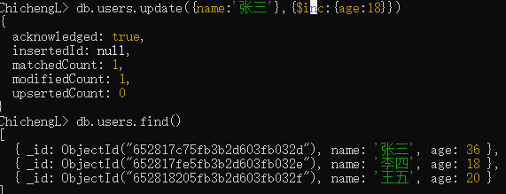

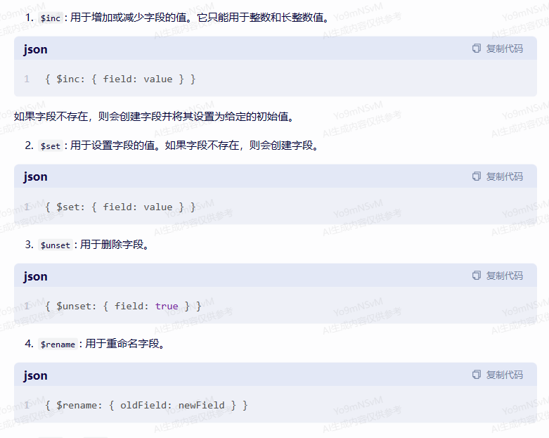

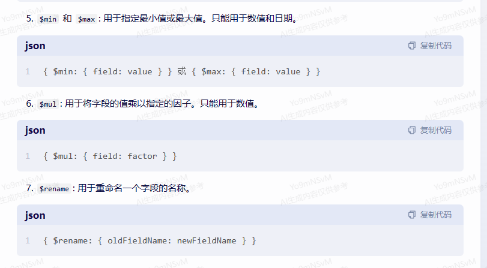

### Mongoose介绍

是一个对象模型库

作用:方便使用代码操作mongodb数据库


安装`npm i mongoose`

```js
const mongoose = require('mongoose')

// 连接mongodb服务
mongoose.connect('mongodb://127.0.0.1:27017/ChichengL')
//最后的users,是要操作的数据库名称

// 设置回调
mongoose.connection.on('open', ()=> {
    console.log('数据库连接成功')
})//连接成功的回调

mongoose.connection.on('error',()=>{
    console.log('数据库连接失败')
})//连接失败的回调

mongoose.connection.on('close',()=>{
    console.log('数据库连接关闭')
})//连接关闭的回调
//关闭连接数据库
setTimeout(()=>{
    mongoose.disconnect()
},2000)
```

#### Mongoose插入文档

 先需要创建文档结构对象,类似于TS中的接口.

然后创建模型对象,这样才能对文档进行操作

插入操作是在，开启连接后的回调函数中执行

后面插入，如果是在6.9.2及以下的版本，那么create里面存在回调`BookModel.create(文档,callback)`

但是如果是6.9.2以上的版本，那么使用的是`BookModel.create(文档).then(callback)`，callback中有两个参数，err和data，

因为内部是调用的Promise对象进行返回的

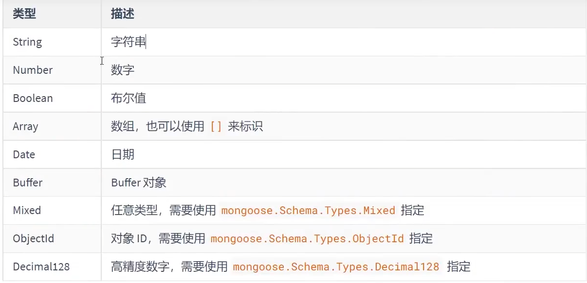

```js
const mongoose = require('mongoose')

// 连接mongodb服务
mongoose.connect('mongodb://127.0.0.1:27017/ChichengL')
//最后的users,是要操作的数据库名称

// 设置回调
mongoose.connection.once('open', ()=> {
    // 创建文档的结构对象,设置文档属性及其属性值的类型
    let BookSchema = new mongoose.Schema({
        name: String,
        price: Number,
        author:String
    })
    // 创建模型对象,是对文档操作的封装对象
    let BookModel = mongoose.model('Book', BookSchema)
    BookModel.create({
        name:'JavaScript权威指南',
        price:123,
        author:'zhangsan'
    }).then(data=>{ 
        console.log(data)
    }).catch(err=>{
        console.log(err);
    })
    
})//连接成功的回调

mongoose.connection.on('error',()=>{
    console.log('数据库连接失败')
})//连接失败的回调

mongoose.connection.on('close',()=>{
    console.log('数据库连接关闭')
})//连接关闭的回调
//关闭连接数据库

```

字段值校验：

必填项

```
title:{
	type:String,
	required:true
}
```

默认值

```
author:{
	type:String,
	default:'佚名'
}
```

枚举值

```
gender:{
	type:String,
	enum:['男','女']//设置的值必须是这个枚举值中其中的一种
}
```

唯一值

```
 usernames:{
	type:String,
	unique:true//设置时，这个值在文档中时独一无二的
}
```

unique需要`重建集合`才能有效果，让其为唯一索引


#### 删除文档 

删除一条数据`模型对象.deleteOne(条件,callback)`，callback中存在err和data

同样高版本(现在)使用`模型对象.deleteOne(条件).then(callbcak).catch(err=>{})`下面那个也是如此

批量删除`模型对象.deleteMany(条件,callback)`


#### 更新文档

 更新一条数据`模型对象.updateOne(条件,新的文本内容, callback)`

高版本使用`模型对象.updateOne(条件,新的文本内容).then(callback).catch(err=>{})`

更新多条`模型对象.updateMany(条件,新的文档).then().catch()`

#### 读取文档

读取一条`模型对象.findOne(条件).then(新的内容).catch()`

读取多条`模型对象.find(条件)`

读取所有即条件为空


### 条件控制

运算符:不能使用>,<, >=, <=, !==等运算符需要进行替代

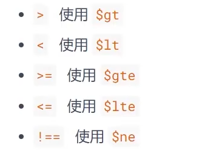比如`db.students.find({id:{$gt:3}})`找id号大于3的所有记录

在js中`模型对象.find({id:{$ge:3}})`类似,下面那个相类似

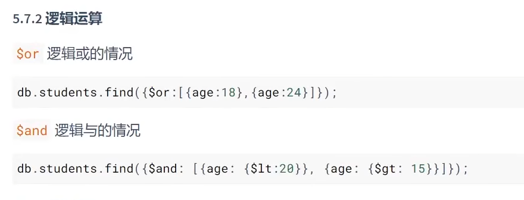

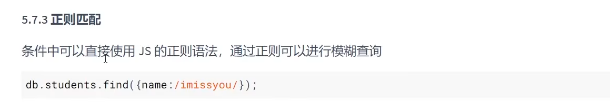

/imissyou/可以换为new Regex(‘imissyou’)


### 个性化读取

#### 字段筛选

`BookModel.find().select({name:1,price:1}).then(data=>{console.log(data)}).catch(err=>{console.log(err)})`

select里面属性值为1的即所保留的字段,其他默认值为0

#### 数据排序

`  BookModel.find().sort({price:1}).then(data=>{console.log(data)}).catch(err=>{console.log(err)})`

作为进行排序的字段放入其中，值为1则是升序，-1则为降序

#### 数据截取

`BookModel.find().skip(10).limit(10).then().catch()`

这个效果就是，全部数据，先跳过前十条，再最多取跳过后的十条。

合在一起可以做分页的效果，比如每页最多显示n条数据，假设在第m页`BookModel.find().skip((m-1)*n).limit(n).then().catch()`

 

### Mongoose模块化

类似于其他的模块化,进剖离


### 图形化管理工具

使用Robo 3T 免费  在github上能找到 

Navicat收费（中文而且非常好用）

